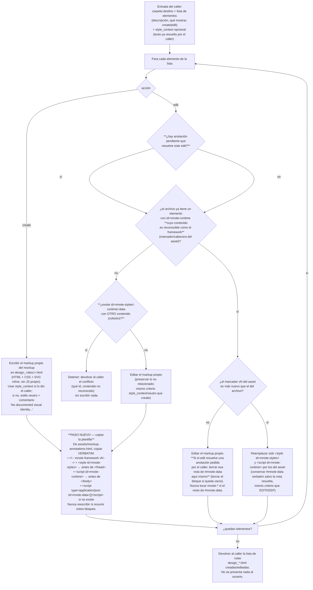
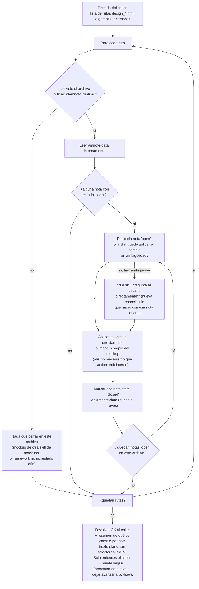
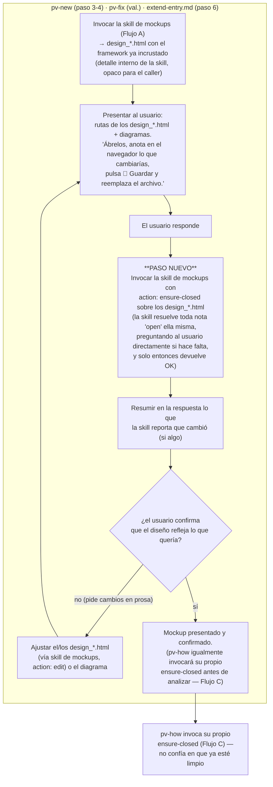
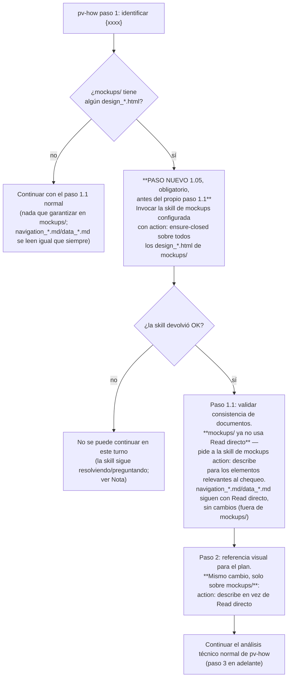

# Annotation framework embedded into every HTML mockup

## Index

- [Objective](#objective)
- [Mockups del propio plan (en esta carpeta)](#mockups-del-propio-plan-en-esta-carpeta)
- [Context](#context)
- [Flujos](#flujos)
  - [A · Generación de un mockup en `pv-internal-mockups-html` (con el paso nuevo)](#a--generación-de-un-mockup-en-pv-internal-mockups-html-con-el-paso-nuevo)
  - [A' · Nuevo modo `action: ensure-closed`](#a--nuevo-modo-action-ensure-closed-garantiza-cierre-puede-escribir-y-puede-preguntar)
  - [B · Cómo cambia el flujo de `pv-new` / `pv-fix`](#b--cómo-cambia-el-flujo-de-pv-new--pv-fix)
  - [C · Gate de entrada de `pv-how`](#c--gate-de-entrada-de-pv-how)
- [Approach](#approach)
  - [1. New asset: `pv-internal-mockups-html/assets/mockup-annotations.html`](#1-new-asset-pv-internal-mockups-htmlassetsmockup-annotationshtml)
  - [2. Rewrite `pv-internal-mockups-html/SKILL.md`](#2-rewrite-pv-internal-mockups-htmlskillmd)
  - [3. Close the cycle in `pv-new`, `pv-fix`, `extend-entry.md`](#3-close-the-cycle-in-pv-new-pv-fix-extend-entrymd)
  - [3.1 Gate `pv-how`'s entry on `ensure-closed`](#31-gate-pv-hows-entry-on-ensure-closed)
  - [4. Distribution to existing projects](#4-distribution-to-existing-projects)
  - [5. Framework changelog / version](#5-framework-changelog--version)
- [Critical files](#critical-files)
- [Verification](#verification)
- [Implementation plan](TASKS.md)
- [Reviews](#reviews)

## Objective

Today the only way to review a `design_*.html` mockup is chat prose, which costs tokens to
re-open, re-read, and edit for a change as small as "make this button bigger". This plan ships
a small, self-contained **annotation framework** (HTML + CSS + JS) as a `pv-internal-mockups-html`
skill asset: the skill splices it verbatim into every mockup it generates or edits, letting the
reviewer pin notes to any element (or add a general note) directly in the browser, then closes
the loop by having the skill itself resolve and clear those notes when re-invoked — no caller
ever parses the annotation data directly. See [Context](#context) below for the full detail and
the confirmed design decisions.

## Mockups del propio plan (en esta carpeta)

- **`mockup_catalog.html`** — catálogo de los 3 componentes del framework de notas (barra
  flotante que se mueve al cursor, tarjeta de nota única, panel-lista de notas generales),
  con selección por clic simple, mini-menú del `➕`, contador ámbar en la esquina, contorno
  compartido nota↔elemento y diseño limpio.
- **`mockup_examples.html`** — cuatro escenas de revisión sobre un mockup real (lanzador
  "Bloc de notas"): clic → barra al cursor → mini-menú, varias notas + una general, ocultar
  anotaciones, y el guardado con el cierre de ciclo en `pv-new` / `pv-fix`.

> **Nota de estado.** No existe un borrador `asset_mockup-annotations.html` en esta carpeta.
> El asset `assets/mockup-annotations.html` se escribe **desde cero** (Approach § 1), usando
> `mockup_catalog.html` y `mockup_examples.html` como única referencia de diseño (definen ya
> los 3 componentes, los 2 colores `#f5a623` / `#2c7dd8`, el namespace `.mnote-*`, el
> mini-menú del `➕`, el contador ámbar, el panel de generales y el estado "desvinculada").

## Context

Today, `pv-internal-mockups-html` produces `design_*.html` files that are pure static
visuals — layout, styling, no logic. When the user reviews a mockup (step 4 of `pv-new`, step
of `pv-fix`, or the `extend-entry.md` validate loop), the only feedback channel is chat
prose, which then costs tokens for Claude to re-open the file, re-read all of it, and edit.
There is no structured, visual way to say "this button should be bigger" pinned to the actual
element.

The idea: ship a small **annotation framework** (HTML + CSS + JS, self-contained) as a
**skill asset** of `pv-internal-mockups-html`. When the skill generates or edits a mockup it
copies the asset's two blocks in **verbatim** (no tokens spent re-authoring it) and only
writes the mockup's own markup. The embedded framework then lets the reviewer, in the
browser:

- see design-time annotations that are visually distinct from the design;
- toggle all annotations on/off to see the clean design;
- attach a note to **any** element of the mockup, or add a **general** (unattached) note;
- edit or delete any note;
- **Save** — re-download the `design_*.html` with the annotations embedded so they round-trip
  and can be read back by the framework skills.

Annotations are review feedback layered on top of the mockup, never part of the design being
proposed.

**Confirmed decisions (from plan Q&A):**
1. **Embedding mechanism**: inline splice — copy the asset's `` right before
    `</head>` and `` right before `</body>`.
  - **Copy verbatim — never re-type, summarize or "improve" the framework blocks.** Mirror
    `pv-init/SKILL.md`'s wording for `assets/pv.py`: *"copied as-is without modifying a single
    line of it."* This verbatim copy is the whole point — it keeps the framework out of the
    model's output budget.
  - Stays self-contained: the asset is embedded inline, never linked.
- **`edit` action behavior** (today `SKILL.md` step 1 only says "preserve the rest of the
  file unrelated to the requested change" — spell out the three sub-cases from Flujo A):
  - If it has no framework blocks (older mockup): add them, same as `create`.
  - If the target `design_*.html` already contains a recognizable framework and the asset's
    `vN` marker is **not newer** than the file's: edit the mockup's own markup, leaving the
    framework blocks **and `#mnote-data` untouched** — a plain `action: edit` from a caller
    never changes any note's state or content; only `ensure-closed` does that (see below).
  - If the asset's `vN` marker **is newer** than the file's: replace only the two framework
    blocks (`<style id="mnote-styles">` + `<script id="mnote-runtime">`) while keeping
    `#mnote-data` verbatim.
- **New action: `ensure-closed`.** Input: a list of `design_*.html` paths (the ones the caller
  is about to (re-)present, or — for `pv-how` — every `design_*.html` in the entry). For each
  path with a recognizable framework, parse `#mnote-data` internally:
  - if every note is already `closed` (or there are none), that path is done — nothing to do;
  - for each note with `state: "open"`: apply the requested change to that mockup's own markup
    (same mechanism as an internal `action: edit`, decided by the skill itself — no round-trip
    to the caller for this), then set that note's `state` to `"closed"` in `#mnote-data`. A note
    whose stored selector no longer resolves ("desvinculada") is treated as a general note for
    this purpose — same resolve-then-close handling.
  - if a note is ambiguous enough that the skill can't confidently decide what change to apply,
    it **asks the user directly** (`AskUserQuestion`-equivalent — this skill is not mute for
    this one interaction) before applying anything for that note; the user's answer determines
    the change, then the skill applies it and closes the note as usual.
  - a path with no framework embedded at all (not yet generated with it, or generated by a
    different `framework.skills.mockups` implementation) is skipped — never an error, and never
    blocks the other paths in the same call.
  - Returns **OK** plus a plain-text summary of what was changed per resolved note (no
    selectors, no JSON) once every given path has zero `open` notes left. **This is the only
    way any caller learns about or resolves annotations** — no other skill ever opens
    `#mnote-data`, and no caller ever sees an individual note or its `open`/`closed` state
    directly.
- **New action: `describe`.** Input: a list of `design_*.html` paths and, optionally, which
  elements/areas to focus on. For each path, read its own markup (something only this skill
  ever does directly) and return a plain-text description of the requested elements' layout,
  styling, and iconography — enough for a caller like `pv-how` (or `pv-do`, when drafting the
  style-bible update for an entry that has mockups — see Approach §3's "Other callers" note)
  to use as visual reference, without exposing the raw HTML/CSS/SVG or the `mnote-*` framework blocks (which are irrelevant
  to that purpose anyway). Read-only; never touches `#mnote-data` or note state. This is the
  only way any caller accesses a mockup's visual content — no caller ever `Read`s a
  `design_*.html` file itself.
- The asset's `vN` marker is independent of `metadata.version`; framework-release version
  bumps are handled by `/dev-generate-version`, not here.
- **ID collision guard.** The "does the file already have `id="mnote-runtime"`?" check (Flujo A)
  must verify the element's **content shape**, not just its presence — a `<script>` tag whose
  body starts with the framework's own recognizable header (e.g. the IIFE's opening comment/
  marker), not just any element carrying that id. If a `design_*.html` predating this framework
  happens to already use `id="mnote-styles"`/`"mnote-runtime"`/`"mnote-data"` for something
  unrelated, the content check fails to match: treat it exactly like "no framework blocks
  present" is **not** safe here (it would silently duplicate/shadow an id), so instead **stop
  and report the conflict to the caller** (which id, and that it holds unrecognized content)
  without writing anything — same "return the error, generate nothing" pattern already used for
  a `resolve-path.py` failure (pre-rewrite) or a style-bible resolution issue. This is a rare
  edge case (the `mnote-*` namespace wasn't reserved before this plan) but cheap to guard given
  the check already exists.

### 3. Close the cycle in `pv-new`, `pv-fix`, `extend-entry.md`

**Encapsulation rule.** No caller ever reads, parses, or writes `#mnote-data`, nor references
`mnote-*`, selectors, note state (`open`/`closed`), or the JSON shape in its own prose or
logic — that's `pv-internal-mockups-html`'s internal concern alone (see the plan's "Confirmed
decisions" §3-4). The caller's only verb for annotations is invoking `action: ensure-closed`
and waiting for its OK/summary.

**Callers must now pass `style_context`.** Since `pv-internal-mockups-html` no longer resolves
the style bible itself (§2's plugin-isolation rewrite), every existing call site that invokes
it for `create`/`edit` (`pv-new` step 3, `pv-fix` step 4, `extend-entry.md` step 4) must extract
`style_context` from the `pv-internal-tech-analysis` context it already gathered earlier in its
own flow (steps 1/2, which already run before mockups are generated) and pass it through. If
that context has no style-relevant excerpts, pass nothing — the mockups skill already handles
"no `style_context` given" by defaulting to neutral styling; the caller doesn't invent a
fallback of its own.

At each **visual-validation** step, before (re-)presenting the mockups, add: *"Invoke the
configured mockups skill's `ensure-closed` action on the `design_*.html` files about to be
presented. The skill resolves any pending (`open`) annotation itself — applying the requested
change directly and asking the reviewer for clarification on its own if a note is ambiguous —
and returns once every annotation on those files is `closed`. Summarize in your reply what it
reports having changed, if anything. Then present the updated mockups for confirmation as
usual."*

Concrete edit sites:

- `pv-new/SKILL.md` — **step 4** ("Validate the visual representation with the user", line
  112): prepend the `ensure-closed` paragraph before the existing "present them to the user"
  text.
- `pv-fix/SKILL.md` — the visual-validation step (line 106, "If step 3 included a Mermaid
  diagram, step 4 generated a `design_*.html`…"): same prepend.
- `pv-new/extend-entry.md` — **step 6** ("Validate with the user whatever changed visually",
  line 10): prepend the same paragraph, verbatim, with the `design_*.html` files it's run
  against explicitly scoped: *"Invoke the configured mockups skill's `ensure-closed` action on
  the `design_*.html` files touched by this extension, plus any other `design_*.html` already
  in the entry's folder (not just the ones this extension changed — a pending annotation on an
  untouched file from a previous round must still be resolved). [...same ensure-closed →
  summarize → present as above]"*.
- Also update the trailing "who writes what" note in `pv-new/SKILL.md` (line 125) and
  `pv-fix/SKILL.md` (line 114): note that resolving pending annotations is done exclusively via
  the mockups skill's `ensure-closed` action, consistent with "`design_*.html` files are
  generated by the configured mockups skill — don't write them yourself".
- **A note whose stored selector no longer resolves** ("desvinculada") is handled internally by
  `ensure-closed` as a general note before it's ever surfaced in the skill's summary — the
  caller never sees this distinction.

**Other callers — `pv-do`.** Found during review (2026-09-24): `pv-do/SKILL.md` line 121, when
updating `docs.tech.styleBibleDocDir` after implementation, passes "any `design_*` mockups this
entry has" as plain context to `pv-internal-doc-style` — a direct mention of `design_*.html`
outside `pv-new`/`pv-fix`/`pv-how`, which the earlier design of this plan missed entirely.
`pv-do` needs no visual validation loop (it never presents mockups to the user or resolves
annotations) — its only need is a visual reference for drafting the style-bible entry, exactly
`describe`'s use case. Fix: replace that context mention with an `action: describe` call to the
configured mockups skill, scoped to the elements relevant to the style area being documented.
`pv-do` never invokes `ensure-closed`.

### 3.1 Gate `pv-how`'s entry on `ensure-closed`

See Flujo C above for the full diagram. Concrete edit site: `pv-how/SKILL.md` gains a new
**step 1.05** between step 1 ("Identify the change/fix", which resolves `{xxxx}`) and step 1.1
("Validate the change's documents before analyzing"): *"If `{changesDir}/inProgress/{xxxx}/mockups/`
has any `design_*.html`, invoke the configured mockups skill's `ensure-closed` action on all of
them. Wait for its OK before continuing — do not read, describe, or otherwise use any
`design_*.html` from this entry (including step 1.1's own document-consistency check) until it
returns."* This placement matters: **step 1.1 today already does a direct `Read` on everything
under `mockups/` and on `navigation_*.md`/`data_*.md`** (to cross-check consistency against
`description.md`) before step 2 ever does, so the gate must precede 1.1, not just 2. The gate
only covers `mockups/`: `navigation_*.md`/`data_*.md` live outside it, aren't owned by any
mockups skill, and keep being read with a plain `Read` — this plan doesn't change that.

Rewrite both existing direct-access points so neither opens a `design_*.html` under `mockups/`
itself once the gate exists (its `Read` of `navigation_*.md`/`data_*.md` is untouched, since
those aren't a mockups-skill responsibility):
- **Step 1.1** ("read... everything under its `mockups/` subfolder... and `navigation_*.md`/
  `data_*.md`...") — replace only the `mockups/` part with invoking the mockups skill's new
  `action: describe` for the elements/areas relevant to the consistency check (layout, what's
  shown), same as step 2 below; the check's logic (comparing against `description.md` and
  `navigation_*.md`/`data_*.md`, still read directly) is unchanged, only the source of the
  `mockups/` visual facts changes.
- **Step 2** (today: *"open them, but treat them only as visual reference"*, over
  `mockups/design_*.html`) — invoke the mockups skill's `action: describe` (see Approach §2) for
  the elements it needs a visual reference for, and build its understanding from that plain-text
  description instead of ever opening the file itself.

**Workflow diagrams.** `pv-new/SKILL.md`, `pv-fix/SKILL.md`, and `pv-how/SKILL.md` all declare
that their `workflow.*.md` is the source of truth for the flow and that "if the two disagree,
the diagram wins and the prose gets corrected". The `ensure-closed` round-trip is a new branch
inside `pv-new`'s/`pv-fix`'s visual-validation loop, and a new mandatory node at the start of
`pv-how`'s flow — so **check all three `workflow.*.md` files** (`workflow.new.md`,
`workflow.fix.md`, `workflow.how.md`) and add the branch/node to each diagram if the change is
not fine enough to leave as prose-only, worded in terms of the skill's actions
(`ensure-closed`, `describe`), never `#mnote-data` or note state directly.

### 4. Distribution to existing projects

No extra work. `install.sh` / `install.ps1` copy each `pv-*` skill directory wholesale
(`install.ps1` line ~50: `Copy-Item -Recurse` per `pv-*` dir; `install.sh` the `cp -r`
equivalent), so `assets/mockup-annotations.html` ships on the next framework update.
`pv-update` needs **no** new check — the asset is read at mockup-generation time, never
scaffolded into the consuming project. Confirm in verification (step 6) that the recursive
copy actually carries the new `assets/` subfolder.

### 5. Framework changelog / version

Rides the normal `/dev-generate-version` flow (`tools/set-skill-versions.py` bumps every
`SKILL.md`; `dev-changelog` regenerates `.claude/pv-changelog.*.md` from the git diff).
Nothing manual here beyond writing the asset + the `pv-internal-mockups-html/SKILL.md`
rewrite + the cycle edits (`pv-new/SKILL.md` step 4 and its trailing note, `pv-fix/SKILL.md`
step 5 and its trailing note, `pv-new/extend-entry.md` step 6) + the `workflow.new.md` /
`workflow.fix.md` consistency check.

## Critical files

- **new** `d:\repos\previo-sdd\.claude\skills\pv-internal-mockups-html\assets\mockup-annotations.html`
  — the whole embedded framework (marker comment + `#mnote-styles` + `#mnote-runtime` + a
  standalone demo body with an empty `#mnote-data`).
- `d:\repos\previo-sdd\.claude\skills\pv-internal-mockups-html\SKILL.md` — file inventory, the
  "Embed the annotation framework" rule, the amended "no JavaScript" rule, the new
  `ensure-closed` action (note `open`/`closed` state, own-judgment resolution, asking the user
  directly when ambiguous) and the new `describe` action, `vN` marker behavior, **and the
  plugin-isolation rewrite of the style bible rule** (drops `pv-init/scripts/resolve-path.py`,
  gains the `style_context` input). **All `#mnote-data` and note-state knowledge lives only
  here** — no other file in this list should end up mentioning `#mnote-data`, `mnote-*`,
  `open`/`closed`, or a CSS selector. Likewise, no path-resolution logic (`resolve-path.py`,
  `pv-context.json` fields) should remain in this file after the rewrite. **This is also the
  only `pv-internal-*` skill in the framework that talks to the user directly** — call that out
  explicitly as an intentional, scoped exception.
- `d:\repos\previo-sdd\.claude\skills\pv-new\SKILL.md` — step 3: pass `style_context` (from its
  own step 1's `pv-internal-tech-analysis` context) when invoking mockups; step 4: invoke
  `ensure-closed`, summarize what it reports; trailing note tweak.
- `d:\repos\previo-sdd\.claude\skills\pv-fix\SKILL.md` — step 4: pass `style_context` when
  invoking mockups; visual-validation step: same `ensure-closed` round-trip; trailing note
  tweak.
- `d:\repos\previo-sdd\.claude\skills\pv-new\extend-entry.md` — step 4: pass `style_context`
  when invoking mockups; step 6: same `ensure-closed` round-trip.
- `d:\repos\previo-sdd\.claude\skills\pv-how\SKILL.md` — **new step 1.05** (gate: invoke
  `ensure-closed`, wait for OK, before step 1.1); step 1.1 and step 2 rewritten to use
  `action: describe` instead of `Read` on `design_*.html` under `mockups/` (two separate
  direct-access points, both found during this review — see Flujo C's notes). The `Read` on
  `navigation_*.md`/`data_*.md` (outside `mockups/`, no owning skill) is untouched.
- `d:\repos\previo-sdd\.claude\skills\pv-new\workflow.new.md` /
  `d:\repos\previo-sdd\.claude\skills\pv-fix\workflow.fix.md` /
  `d:\repos\previo-sdd\.claude\skills\pv-how\workflow.how.md` — check the visual-validation loop
  (new/fix) and the new entry gate (how) against Flujos B/C; add the `ensure-closed`/`describe`
  branches to each diagram (worded in terms of the skill's actions, never `#mnote-data` or note
  state) if prose-only would leave them inconsistent with the diagram (all three SKILL.md files
  say the diagram wins).
- `d:\repos\previo-sdd\.claude\skills\pv-do\SKILL.md` line 121 (the `docs.tech.styleBibleDocDir`
  update step) — **third caller found during this review, not part of the original design**:
  it currently passes "any `design_*` mockups this entry has" as plain context to
  `pv-internal-doc-style`, a direct reference to `design_*.html` files outside `pv-new`/
  `pv-fix`/`pv-how`. Replace that mention with an `action: describe` call to the configured
  mockups skill for the elements relevant to the style area being documented. `pv-do` never
  invokes `ensure-closed` (it doesn't visually validate with the user or present mockups) —
  only the read-only `describe`.
- (reference, no change) `install.sh` / `install.ps1` — already copy each `pv-*` dir
  recursively (`install.ps1` ~line 50); confirm the `assets/` subfolder rides along in
  verification.
- (reference) `pv-init/SKILL.md` line 142 — precedent wording for an embedded `assets/`
  file ("copied as-is without modifying a single line of it"); mirror it.

## Verification

1. **Asset standalone**: open `assets/mockup-annotations.html` in a browser. Toolbar shows;
   "General note" adds a note; edit/delete work; Save downloads a file; reopen the downloaded
   file → the note is still there (round-trip via `#mnote-data`).
2. **Embedded in a real mockup**: splice the two framework blocks into
   `sandbox-test1\previo-sdd\changes\inProgress\00196\design_bloc_notas_vista.html` and open
   it:
   - Clic simple en `.launcher__new-btn` → contorno azul + la barra salta a su lado; `➕`
     despliega el mini-menú "Nota en `<selector>`" / "Nota general".
   - `➕` sin nada seleccionado → crea una nota general directamente (panel-lista).
   - Elemento con nota → contador ámbar en la esquina; al pulsarlo se abre su tarjeta
     compartiendo el contorno ámbar; `‹ ›` recorre si hay varias.
   - `👁` togglea a diseño limpio y vuelve; recargar mantiene el último estado
     (localStorage). Con anotaciones ocultas el CSS del mockup queda intacto (sin fugas
     `.mnote-*`, sin contadores).
   - Añadir una nota general + una vinculada, `💾` Guardar, reabrir el archivo guardado →
     ambas rehidratan (panel + contador) desde el selector almacenado, ambas con `state: "open"`
     en `#mnote-data` (el framework del navegador nunca escribe `"closed"`).
   - Clic sobre la propia barra / tarjeta / panel **no** selecciona nada del mockup ni
     entra en la ruta `nth-of-type` de una nota vinculada creada después.
   - Confirmar que la tarjeta/panel **no ofrece ningún control para cerrar una nota** — solo
     Editar/Guardar/Eliminar; cerrar es un juicio exclusivo de `pv-internal-mockups-html`.
3. **Skill dry-run**: invoke `pv-internal-mockups-html` via `pv-new` on a throwaway visual
   change in a sandbox project; confirm the generated `design_*.html` contains
   `id="mnote-styles"`, `id="mnote-runtime"` and the `<!-- mnote-framework v1 -->` marker,
   byte-identical to the asset's blocks (Flujo A, paso "copiar la plantilla").
3.1 **Plugin isolation**: grep `pv-internal-mockups-html/SKILL.md` for `resolve-path.py` and
   `pv-context.json` — neither should appear after the rewrite. Invoke the skill directly with
   `action: create` and **no** `style_context`; confirm it produces neutral placeholder styling
   with the documented comment, without attempting to read anything from disk beyond its own
   `assets/` folder and the destination path it was given. Then invoke it again with a
   `style_context` string and confirm it reuses those values instead of the neutral fallback.
4. **Edit round-trip**: add a fake `#mnote-data` with two `open` notes to that file, re-invoke
   the skill with a plain `action: edit` (not `ensure-closed`); confirm `#mnote-data` and every
   note's `state` survive completely untouched, and the framework blocks are untouched.
4.1 **`ensure-closed` contract — resolution**: with that same fake `#mnote-data` (two `open`
   notes, both resolvable without ambiguity), invoke `action: ensure-closed` on the file;
   confirm it applies both changes to the mockup's own markup, sets both notes' `state` to
   `"closed"` in `#mnote-data` (nothing else in the block changes), and returns OK with a
   plain-text summary containing no selector or raw JSON. Re-invoke `ensure-closed` again on the
   now-closed file; confirm it's a no-op (OK immediately, nothing re-applied). Also confirm a
   path with no framework embedded is skipped without error.
4.2 **`ensure-closed` contract — ambiguity**: add a fake `open` note whose text is genuinely
   ambiguous (e.g. "fix this"); invoke `ensure-closed` and confirm the skill asks the user
   directly (not the caller) before applying anything for that note, then closes it once
   answered.
4.3 **`describe` contract**: invoke `action: describe` on a `design_*.html` with real markup,
   asking about a couple of elements; confirm the response is plain text describing
   layout/style/iconography, contains no raw HTML/CSS/SVG and no `mnote-*` framework
   internals, and that the action never touches `#mnote-data` or note state.
5. **Cycle closure — encapsulation check (`pv-new`)**: with a `design_*.html` carrying
   `#mnote-data` (one linked `open` note "make this wider", one general `open` note), run
   `pv-new`'s extend/validate path; confirm Claude only calls `ensure-closed` — grep the turn's
   tool calls and its own prose for `#mnote-data`/`mnote-`/`open`/`closed` to confirm `pv-new`
   itself never references them — and that both notes end up `closed` internally (Flujo B).
5.1 **`pv-how` gate check**: on that same now-closed entry, invoke `pv-how`; confirm it calls
   `ensure-closed` again as its own new step 1.05 before step 1.1 (it doesn't assume `pv-new`'s
   earlier call is still valid), gets an immediate OK (nothing left `open`), and that neither
   step 1.1 nor step 2 issues a `Read` on any `design_*.html` — both go through `describe`
   instead. Then add a fresh `open` note directly to `#mnote-data` (simulating the user having
   re-annotated after `pv-new` finished but before `pv-how` ran) and re-invoke `pv-how`; confirm
   it blocks at 1.05 until `ensure-closed` resolves that note, and never reaches step 1.1/2/3
   before it does.
6. **Install propagation**: run `install.sh` / `install.ps1` into a scratch dir from the
   local tree (or inspect the copy loop) and confirm
   `.claude/skills/pv-internal-mockups-html/assets/mockup-annotations.html` lands in the
   destination.
7. **Workflow-diagram consistency**: after editing `pv-new`/`pv-fix`/`extend-entry.md`/`pv-how`,
   diff their prose against `workflow.new.md` / `workflow.fix.md` / `workflow.how.md`; the
   `ensure-closed`/`describe` branches must be present in each diagram (worded in terms of the
   skill's actions, never `#mnote-data` or note state) or explicitly deemed too fine to diagram —
   no silent disagreement (all three SKILL.md files mandate the diagram wins).
8. **`pv-do` no longer references `design_*` directly**: grep `pv-do/SKILL.md` for `design_*` —
   the only remaining match should be the `action: describe` call itself, not a raw file
   mention passed as context to `pv-internal-doc-style`. Run `pv-do`'s style-bible update step
   on an entry that has mockups and confirm its turn's tool calls and prose never mention
   `design_*`/`mnote-`/`#mnote-data` directly.

## Implementation plan

See [TASKS.md](TASKS.md) for the ordered, checkable task breakdown.

## Reviews

- **2026-09-22**: primera revisión completa (contrato `style_context`, alcance incompleto del `Read` en `pv-how` step 1.1, versión `vN` del asset, referencias de línea desalineadas, mecanismo de guardado del asset, ID collision guard, caso `pv-do`, asimetría `extend-entry.md`, ampliación de alcance a plugin autocontenido). Todos los hallazgos se resolvieron directamente en el cuerpo del plan durante esa misma pasada, salvo el del alcance de `pv-how` step 1.1, que quedó marcado como dependiente de un cambio transversal de convención de subcarpetas a implementar antes que este plan.
- **2026-09-24**: segunda revisión — actualización de conocimiento del estado del framework, ya que el cambio de convención de subcarpetas (`mockups/`) se implementó directamente en el código, sin el plan hermano que la revisión anterior esperaba. Hallazgos: estructura del documento incompleta (faltaban Índice, Objective, Implementation plan y Reviews en el formato exigido, y las revisiones no eran la última sección); la dependencia declarada hacia `mockups-subfolder/PLAN.md` era obsoleta; `navigation_*.md`/`data_*.md` quedaron fuera de `mockups/` de forma explícita, con nombre distinto al asumido antes; ninguna pieza propia de este plan (`style_context`, `ensure-closed`, `describe`, el asset) estaba todavía implementada en `pv-internal-mockups-html/SKILL.md`, y sus referencias a línea habían vuelto a desalinearse por la reescritura de subcarpetas; los tres `workflow.*.md` ya reflejaban la convención de subcarpetas sin rama de anotaciones (esperado, aún no implementada). Resuelto en un walkthrough punto por punto en la misma fecha: se eliminó el bloque de dependencia obsoleto, se fusionó `TASKS.md` como sección `## Implementation plan` de este documento (fichero borrado), se añadió `## Objective`, se corrigieron todas las rutas y referencias a línea del cuerpo normativo (`mockups/design_*.html` vs. `navigation_*.md`/`data_*.md` sueltos en la raíz; regla de estilo del `SKILL.md` de `pv-internal-mockups-html` en líneas 35-56, "no JavaScript" en línea 65), y se recortaron ambas secciones de revisión a este historial.

## Análisis crítico — 2026-09-24 (dev-analysis)

Verificado contra el estado real del repo (no contra lo que el plan afirma). Todas las referencias a línea de `SKILL.md`/`workflow.*.md` citadas por el plan se confirmaron exactas al leer los ficheros reales; ninguna pieza propia de este plan (`style_context`, `ensure-closed`, `describe`, `assets/mockup-annotations.html`, plugin-isolation) existe todavía en `pv-internal-mockups-html/SKILL.md` (72 líneas, sin carpeta `assets/`), y los tres `workflow.*.md` no tienen ninguna rama de anotaciones — consistente con lo que el plan ya declara.

### Flujos / Approach — contenido técnico

| Finding | Explanation | Proposed improvement |
|---|---|---|
| Flujo A contradice la regla de encapsulación de `ensure-closed` | El diagrama del Flujo A (nodo `EDITKEEP`, líneas 138-147) especifica que un `action: edit` normal, si "resuelve una anotación pedida por el caller", **borra esa nota de `#mnote-data` directamente** ahí mismo. Esto contradice: (1) Approach §2 "`edit` action behavior" (líneas 400-409), que dice explícitamente "a plain `action: edit` from a caller never changes any note's state or content; only `ensure-closed` does that"; (2) Confirmed decisions §3, que dice "Only `pv-internal-mockups-html` **may set a note to `closed`**" (vía `ensure-closed`, nunca vía `edit`); (3) Approach §1 "Estado de la nota" (línea 311-312), que dice que una nota cerrada "sigue en `#mnote-data` como registro (no se borra) hasta que el reviewer la elimine explícitamente con 🗑" — el nodo `EDITKEEP` ni siquiera la cierra, la **borra**, saltándose también esa regla. El plan declara en varios `SKILL.md` que "si el diagrama y la prosa difieren, el diagrama manda" — seguido literalmente aquí, produciría el comportamiento equivocado (un `edit` plano resolviendo y borrando anotaciones por su cuenta, sin pasar por `ensure-closed`, ni preguntar al usuario en casos ambiguos). El nodo `REFRESH` (línea 147) hereda el mismo problema ("conservar `#mnote-data` verbatim salvo la nota resuelta, mismo criterio que `EDITKEEP`"). | — |
| Referencia residual a `action: read-annotations` en Flujo A | Línea 126: "El modo `action: read-annotations` (Flujo A') es completamente nuevo" — pero la sección A' (línea 155) se titula "Nuevo modo `action: ensure-closed`", no `read-annotations`. `read-annotations` es el nombre del diseño **anterior**, ya retirado (Confirmed decisions §3 lo menciona explícitamente en pasado: "This replaces the earlier `read-annotations` + `edit`-per-note dance"). Es un residuo textual de una reescritura previa que no se actualizó junto con el resto del Flujo A. | — |

### Estructura

| Finding | Explanation | Proposed improvement |
|---|---|---|
| No hay `TASKS.md` hermano | El skill `dev-analysis` exige que la carpeta del plan tenga `PLAN.md` + `TASKS.md` como fichero hermano; aquí `TASKS.md` fue fusionado dentro de `PLAN.md` como sección `## Implementation plan` y borrado (confirmado en git status: `D .claude/plans/interactive-mockups/TASKS.md`), decisión tomada y documentada explícitamente en la review 2026-09-24 de este mismo documento. Estructuralmente sigue siendo el caso "fichero plano en vez de la forma de carpeta exigida", que el propio skill pide reportar como hallazgo incluso cuando la fusión fue deliberada. | **Resuelto** (2026-09-24): se recreó `TASKS.md` como fichero hermano con el mismo desglose de tareas, y `PLAN.md`'s `## Implementation plan` quedó como puntero a él (`See [TASKS.md](TASKS.md)`), tanto en el índice como en el cuerpo — vuelve a seguir la convención carpeta+`TASKS.md` estándar. |

### Approach / Critical files — cobertura de callers

| Finding | Explanation | Proposed improvement |
|---|---|---|
| `pv-do` es un caller de `design_*` no contemplado por el plan | `pv-do/SKILL.md` línea 121 (paso de actualización de `docs.tech.styleBibleDocDir`) pasa explícitamente "any `design_*` mockups this entry has" como parte del contexto que entrega a `pv-internal-doc-style`. Es un tercer acceso a los mockups de una entrada, fuera de `pv-new`/`pv-fix`/`pv-how`, que el plan no menciona en ningún punto: no está en el Approach §2 (`ensure-closed`/`describe`), no está en "Critical files", no está en los Flujos B/C, y `pv-do/SKILL.md` no aparece en la lista de ficheros a tocar. Si el plan se implementa tal cual, `pv-do` seguiría teniendo esta referencia a `design_*` sin pasar por `describe`, violando la propia regla de encapsulación que el plan declara como su objetivo central ("no caller ever `Read`s a `design_*.html` file itself" / "no caller ever opens `#mnote-data`"). | **Resuelto**: `pv-do/SKILL.md` añadido a "Critical files" (línea 121, sustituir la mención de `design_*` por `action: describe`); nueva nota "Other callers — `pv-do`" al final de Approach §3; Approach §2's descripción de `describe` ahora cita a `pv-do` junto a `pv-how` como consumidor. `pv-do` nunca invoca `ensure-closed` (no valida visualmente ni presenta mockups). Tarea T14.5 añadida a `TASKS.md`. |

### Verificación

| Finding | Explanation | Proposed improvement |
|---|---|---|
| Ningún punto de verificación cubre `pv-do` | Como consecuencia del hallazgo anterior, ni la sección Verification (§1-§7) ni el Implementation plan (Fase 4, T15-T20) incluyen ningún paso que confirme que `pv-do` no abre `design_*.html` directamente ni que — si el plan decide que `pv-do` debe invocar `describe`/`ensure-closed` — lo haga correctamente. | **Resuelto**: nuevo punto **§8** en `## Verification` (grep de `pv-do/SKILL.md` por `design_*`, más una ejecución real del paso de estilo sobre una entrada con mockups). Tarea de verificación **T18.2** añadida a `TASKS.md` (Fase 4). |

Ningún otro hallazgo adicional surgió en el resto de secciones (Objective, Context, Flujos A/A'/B/C, Approach §1/§3/§3.1/§4/§5) — las referencias a fichero/línea, los callers listados y las afirmaciones sobre el estado actual del código se verificaron exactas contra el repo real.
