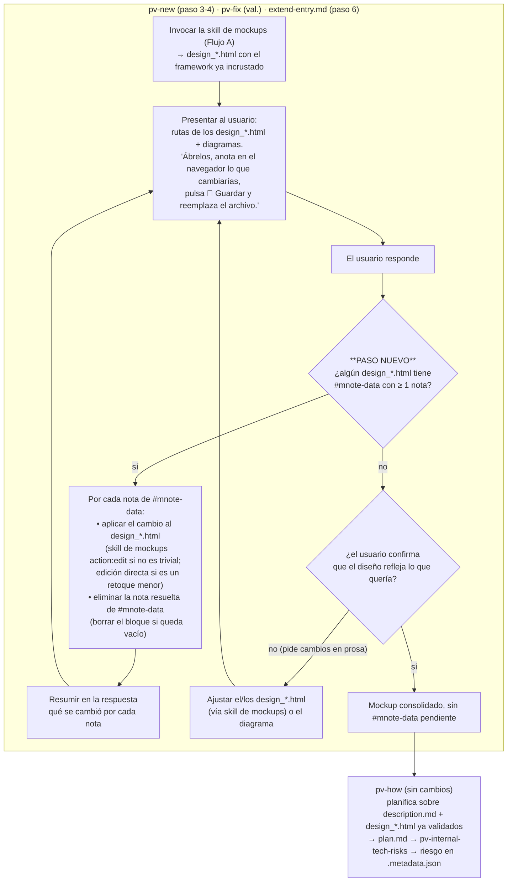

# Annotation framework embedded into every HTML mockup

## Mockups del propio plan (en esta carpeta)

- **`mockup_catalog.html`** — catálogo de los 3 componentes del framework de notas (barra
  flotante que se mueve al cursor, tarjeta de nota única, panel-lista de notas generales),
  con selección por clic simple, mini-menú del `➕`, contador ámbar en la esquina, contorno
  compartido nota↔elemento y diseño limpio.
- **`mockup_examples.html`** — cuatro escenas de revisión sobre un mockup real (lanzador
  "Bloc de notas"): clic → barra al cursor → mini-menú, varias notas + una general, ocultar
  anotaciones, y el guardado con el cierre de ciclo en `pv-new` / `pv-fix`.

> **Nota de estado.** No existe un borrador `asset_mockup-annotations.html` en esta carpeta.
> El asset `assets/mockup-annotations.html` se escribe **desde cero** (Approach § 1), usando
> `mockup_catalog.html` y `mockup_examples.html` como única referencia de diseño (definen ya
> los 3 componentes, los 2 colores `#f5a623` / `#2c7dd8`, el namespace `.mnote-*`, el
> mini-menú del `➕`, el contador ámbar, el panel de generales y el estado "desvinculada").

## Context

Today, `pv-internal-mockups-html` produces `design_*.html` files that are pure static
visuals — layout, styling, no logic. When the user reviews a mockup (step 4 of `pv-new`, step
of `pv-fix`, or the `extend-entry.md` validate loop), the only feedback channel is chat
prose, which then costs tokens for Claude to re-open the file, re-read all of it, and edit.
There is no structured, visual way to say "this button should be bigger" pinned to the actual
element.

The idea: ship a small **annotation framework** (HTML + CSS + JS, self-contained) as a
**skill asset** of `pv-internal-mockups-html`. When the skill generates or edits a mockup it
copies the asset's two blocks in **verbatim** (no tokens spent re-authoring it) and only
writes the mockup's own markup. The embedded framework then lets the reviewer, in the
browser:

- see design-time annotations that are visually distinct from the design;
- toggle all annotations on/off to see the clean design;
- attach a note to **any** element of the mockup, or add a **general** (unattached) note;
- edit or delete any note;
- **Save** — re-download the `design_*.html` with the annotations embedded so they round-trip
  and can be read back by the framework skills.

Annotations are review feedback layered on top of the mockup, never part of the design being
proposed.

**Confirmed decisions (from plan Q&A):**
1. **Embedding mechanism**: inline splice — copy the asset's `<style>` + `<script>` blocks
   verbatim into each `design_*.html` (keeps the "single self-contained file" rule).
2. **Save format**: rewrite the `design_*.html` itself — Save downloads the whole file with
   notes embedded in a `<script id="mnote-data">` JSON block; the user overwrites the file.
3. **Cycle closure**: `pv-new` / `pv-fix` / `extend-entry.md` read the embedded notes at the
   visual-validation step, apply the requested changes, and clear the resolved notes before
   re-presenting.

## Flujos

### A · Generación de un mockup en `pv-internal-mockups-html` (con el paso nuevo)

El paso **"copiar la plantilla del framework"** es lo único que se añade al contrato actual
de la skill; todo lo demás ya existe.

```mermaid
flowchart TD
    IN["Entrada del caller:\ncarpeta destino + lista de elementos\n(descripción, qué mostrar, create|edit)"] --> SB

    SB["Resolver y leer el style bible\n(resolve-path.py --what styleBibleDocDir)"] --> SBERR{"¿exit ≠ 0?"}
    SBERR -- "sí (2→/pv-init, 3|4→/pv-update)" --> RET_ERR["Devolver el error al caller\ny no generar nada"]
    SBERR -- no --> LOOP

    LOOP["Para cada elemento de la lista"] --> ACT{"acción"}

    ACT -- create --> NEWFILE["Escribir el markup propio del mockup\nen design_&lt;desc&gt;.html\n(HTML + CSS + SVG inline, sin JS propio)"]
    NEWFILE --> EMBED

    ACT -- edit --> HAS{"¿el archivo ya tiene\nid=\"mnote-runtime\"?"}
    HAS -- no --> EDITFILE["Editar el markup propio\n(preservar lo no relacionado)"] --> EMBED
    HAS -- "sí" --> VER{"¿el marcador vN del asset\nes más nuevo que el del archivo?"}
    VER -- no --> EDITKEEP["Editar el markup propio\nSIN tocar los bloques mnote-* ni #mnote-data"] --> NEXT
    VER -- "sí" --> REFRESH["Reemplazar solo &lt;style id=mnote-styles&gt;\ny &lt;script id=mnote-runtime&gt; por los del asset\n(conservar #mnote-data verbatim)"] --> NEXT

    EMBED["**PASO NUEVO — copiar la plantilla**\nDe assets/mockup-annotations.html, copiar VERBATIM:\n• &lt;!-- mnote-framework vN --&gt; + &lt;style id=mnote-styles&gt; → antes de &lt;/head&gt;\n• &lt;script id=mnote-runtime&gt; → antes de &lt;/body&gt;\n• &lt;script type=application/json id=mnote-data&gt;[]&lt;/script&gt; si no existe\nNunca reescribir ni resumir estos bloques."] --> NEXT

    NEXT["¿quedan elementos?"] -- "sí" --> LOOP
    NEXT -- no --> RET["Devolver al caller la lista de rutas\ndesign_*.html creadas/editadas.\nNo se presenta nada al usuario."]
```

### B · Cómo cambia el flujo de `pv-new` / `pv-fix` / `pv-how`

El único cambio es el **bucle de lectura de `#mnote-data`** dentro del paso de validación
visual que ya existe en `pv-new` (paso 4), `pv-fix` (paso de validación) y
`extend-entry.md` (paso 6). `pv-how` **no cambia de lógica**: solo se beneficia de que el
mockup que recibe ya está consolidado sin notas pendientes.



**Notas del flujo B:**

- El escaneo de `#mnote-data` se ejecuta **cada vuelta** del bucle de validación, no solo la
  primera: el usuario puede anotar, ver la corrección, y volver a anotar.
- Una nota vinculada cuyo selector ya no resuelve tras una edición previa llega como
  **"desvinculada"**; se trata como una nota general más (aplicar lo que pida sobre el
  conjunto, luego borrarla de `#mnote-data`).
- `pv-how` sigue leyendo los `design_*.html` tal cual; los bloques `mnote-*` incrustados son
  inertes para su análisis (no afectan a `plan.md` ni al riesgo).

## Approach

### 1. New asset: `pv-internal-mockups-html/assets/mockup-annotations.html`

One self-contained file: an `<style id="mnote-styles">` block + a `<script id="mnote-runtime">`
block (IIFE, no external deps — matches the "self-contained, no CDN" mockup rule) + a demo
page body so it can be opened standalone for testing. A `<!-- mnote-framework v1 -->` marker
comment precedes the style block.

The skill splices **only** those two blocks into each generated mockup — `mnote-styles`
before `</head>`, `mnote-runtime` before `</body>` — plus the marker comment.

Framework responsibilities (all browser runtime, zero build step). **Sin pin-globo ni modo
"armado"**: un clic simple selecciona; la barra sigue al cursor; el `➕` decide.

- **Barra flotante** `#mnote-bar` (`position:absolute`): fondo gris claro, **solo iconos**
  (`➕` · `👁` · `💾` + contador), cada acción con `title`/`aria-label`. Al seleccionar un
  elemento se desplaza junto al cursor; sin selección vuelve a una esquina.
- **Estilo diferenciado**: namespace `.mnote-*` y **dos colores** — ámbar `#f5a623` (nota
  vinculada a un elemento) y azul `#2c7dd8` (nota general / elemento seleccionado). Todo
  selector prefijado `mnote-` para no chocar con el CSS del mockup.
- **Selección de elemento**: un **clic simple** en cualquier nodo del mockup lo marca
  (`.mnote-sel`, contorno azul), calcula su **selector robusto** (`#id`; si no, ruta
  `nth-of-type` desde `body`) y mueve la barra a su lado. `Esc` o clic fuera deselecciona.
  El recorrido del DOM (tanto para elegir el objetivo del clic como para construir la ruta
  `nth-of-type`) **ignora los propios nodos `#mnote-bar`, `#mnote-menu`, `#mnote-panel`,
  `.mnote-card` y `#mnote-data`** — nunca son seleccionables ni cuentan en la ruta.
- **Crear nota (features a y b) — el `➕`**:
  - **sin elemento seleccionado** → crea una **nota general** directamente;
  - **con elemento seleccionado** → despliega un **mini-menú** `#mnote-menu`: "Nota en
    `<selector>`" / "Nota general".
- **Tarjeta de nota** `.mnote-card` (única, vinculada o general, lectura o edición): borde
  izquierdo de 6px ámbar (vinculada) o azul (general); cuerpo `<div>` que en edición pasa a
  `<textarea>`; pie con Editar / Guardar / Eliminar (**feature c**, borrado con confirmación).
  Si el elemento tiene varias notas, `‹ ›` las recorre.
- **Marca de elemento con notas**: un **contador ámbar** `.mnote-count` en la esquina
  (nº de notas vinculadas), visible **solo con las anotaciones visibles**. Al pulsar el
  elemento se abre su tarjeta al lado, compartiendo el contorno ámbar (`.mnote-linked`)
  mientras está abierta — así se ve la relación sin dibujar líneas.
- **Notas generales (feature b)**: en un **panel-lista** `#mnote-panel` acoplado a una
  esquina; lista sobria con borde izquierdo azul.
- **Mostrar / ocultar** (`👁`): togglea `mnote-hidden` en `<html>` que colapsa contadores,
  contornos, tarjetas y panel (la barra queda). Estado en `localStorage` por
  `location.pathname`.
- **Guardar (feature d)** (`💾`):
  - serializa a JSON `[{id, kind:"linked"|"general", selector, text, createdAt}]`;
  - escribe/actualiza `<script type="application/json" id="mnote-data">…</script>` en el DOM;
  - descarga un Blob de `document.documentElement.outerHTML` con **el mismo nombre de
    archivo** (funciona desde `file://`); el usuario reemplaza el mockup.
  - Al cargar, lee `#mnote-data` si existe y rehidrata contadores, panel y estado.

Robustez: barra enfocable por teclado; una nota vinculada cuyo selector ya no resuelve
(mockup editado) cae a estado **"desvinculada"** en el panel general conservando el texto, en
vez de desaparecer; sin JS, todo degrada a "sin anotaciones".

### 2. Rewrite `pv-internal-mockups-html/SKILL.md`

- **File inventory**: `SKILL.md` has no explicit file-inventory section today — add one (or
  fold it into the intro paragraph) mentioning the new `assets/mockup-annotations.html`.
- **Amend the "no JavaScript" rule** (the current bullet at `SKILL.md` ~line 52: *"no
  JavaScript reacting to events, no network calls, no state — at most, purely decorative
  JS"*): carve out an explicit, scoped exception — *"the one exception is the standard
  annotation framework copied verbatim from `assets/mockup-annotations.html` (§ Embed the
  annotation framework); the mockup still contains no other JS."*
- **New rule "Embed the annotation framework"** under "Rules for each mockup":
  - After writing/editing the mockup's own markup, the skill **must** copy the asset's
    `<!-- mnote-framework vN -->` marker + `<style id="mnote-styles">…</style>` right before
    `</head>` and `<script id="mnote-runtime">…</script>` right before `</body>`.
  - **Copy verbatim — never re-type, summarize or "improve" the framework blocks.** Mirror
    `pv-init/SKILL.md`'s wording for `assets/pv.py`: *"copied as-is without modifying a single
    line of it."* This verbatim copy is the whole point — it keeps the framework out of the
    model's output budget.
  - Stays self-contained: the asset is embedded inline, never linked.
- **`edit` action behavior** (today `SKILL.md` step 1 only says "preserve the rest of the
  file unrelated to the requested change" — spell out the three sub-cases from Flujo A):
  - If it has no framework blocks (older mockup): add them, same as `create`.
  - If the target `design_*.html` already contains `id="mnote-runtime"` and the asset's `vN`
    marker is **not newer** than the file's: edit the mockup's own markup, leaving the
    framework blocks **and any `#mnote-data`** untouched (preserve the reviewer's saved
    notes).
  - If the asset's `vN` marker **is newer** than the file's: replace only the two framework
    blocks (`<style id="mnote-styles">` + `<script id="mnote-runtime">`) while keeping
    `#mnote-data` verbatim.
- The asset's `vN` marker is independent of `metadata.version`; framework-release version
  bumps are handled by `/dev-generate-version`, not here.

### 3. Close the cycle in `pv-new`, `pv-fix`, `extend-entry.md`

At each **visual-validation** step, before (re-)presenting the mockups, add: *"If any
`design_*.html` contains a `<script id="mnote-data">` block with one or more notes, the user
left review annotations in the browser. Read them: for each note, apply the requested change
to that `design_*.html` (invoking the mockups skill with `action: edit` when the change is
non-trivial, or a direct edit for a small textual tweak), then remove the resolved note from
`#mnote-data` (delete the whole block if it becomes empty). Summarize in your reply what you
changed per note. Then present the updated mockups for confirmation as usual."*

Concrete edit sites:

- `pv-new/SKILL.md` — **step 4** ("Validate the visual representation with the user", ~line
  93): prepend the mnote-data read/apply/clear paragraph before the existing "present them to
  the user" text.
- `pv-fix/SKILL.md` — the visual-validation step (~line 107, "If step 3 included a Mermaid
  diagram, step 4 generated a `design_*.html`…"): same prepend.
- `pv-new/extend-entry.md` — **step 6** ("Validate with the user whatever changed visually",
  ~line 10): same prepend, scoped to the `design_*.html` files touched by the extension plus
  any that carry `#mnote-data`.
- Also update the trailing "who writes what" note in `pv-new/SKILL.md` (~line 102) and
  `pv-fix/SKILL.md` (~line 113): note that reading/clearing `#mnote-data` and applying its
  requested changes is done via the mockups skill (or a direct small edit), consistent with
  "`design_*.html` files are generated by the configured mockups skill — don't write them
  yourself" for anything non-trivial.
- **A note whose stored selector no longer resolves** (an earlier edit changed the markup)
  arrives as **"desvinculada"**: treat it as one more general note — apply what it asks about
  the mockup as a whole, then delete it from `#mnote-data` like any other.

**Workflow diagrams.** `pv-new/SKILL.md` and `pv-fix/SKILL.md` both declare that
`workflow.new.md` / `workflow.fix.md` are the source of truth for the flow and that "if the
two disagree, the diagram wins and the prose gets corrected". The `#mnote-data`
read/apply/clear is a new branch inside the visual-validation loop, so **check both
`workflow.*.md` files** and add the branch to the diagram if the change is not fine enough to
leave it as prose-only. (Flujo B already draws this branch as `SCAN → APPLY → SUMMARY →
PRESENT`; the `workflow.*.md` diagrams must end up consistent with it.)

### 4. Distribution to existing projects

No extra work. `install.sh` / `install.ps1` copy each `pv-*` skill directory wholesale
(`install.ps1` line ~50: `Copy-Item -Recurse` per `pv-*` dir; `install.sh` the `cp -r`
equivalent), so `assets/mockup-annotations.html` ships on the next framework update.
`pv-update` needs **no** new check — the asset is read at mockup-generation time, never
scaffolded into the consuming project. Confirm in verification (step 6) that the recursive
copy actually carries the new `assets/` subfolder.

### 5. Framework changelog / version

Rides the normal `/dev-generate-version` flow (`tools/set-skill-versions.py` bumps every
`SKILL.md`; `dev-changelog` regenerates `.claude/pv-changelog.*.md` from the git diff).
Nothing manual here beyond writing the asset + the `pv-internal-mockups-html/SKILL.md`
rewrite + the cycle edits (`pv-new/SKILL.md` step 4 and its trailing note, `pv-fix/SKILL.md`
step 5 and its trailing note, `pv-new/extend-entry.md` step 6) + the `workflow.new.md` /
`workflow.fix.md` consistency check.

## Critical files

- **new** `d:\repos\previo-sdd\.claude\skills\pv-internal-mockups-html\assets\mockup-annotations.html`
  — the whole embedded framework (marker comment + `#mnote-styles` + `#mnote-runtime` + a
  standalone demo body with an empty `#mnote-data`).
- `d:\repos\previo-sdd\.claude\skills\pv-internal-mockups-html\SKILL.md` — file inventory, the
  "Embed the annotation framework" rule, the amended "no JavaScript" rule, the `edit`
  round-trip + `vN` marker behavior.
- `d:\repos\previo-sdd\.claude\skills\pv-new\SKILL.md` — step 4 mnote-data read/apply/clear;
  trailing note tweak.
- `d:\repos\previo-sdd\.claude\skills\pv-fix\SKILL.md` — visual-validation step mnote-data
  read/apply/clear; trailing note tweak.
- `d:\repos\previo-sdd\.claude\skills\pv-new\extend-entry.md` — step 6 mnote-data
  read/apply/clear.
- `d:\repos\previo-sdd\.claude\skills\pv-new\workflow.new.md` /
  `d:\repos\previo-sdd\.claude\skills\pv-fix\workflow.fix.md` — check the visual-validation
  loop against Flujo B; add the `#mnote-data` scan/apply branch to the diagram if prose-only
  would leave it inconsistent with the diagram (both SKILL.md files say the diagram wins).
- (reference, no change) `install.sh` / `install.ps1` — already copy each `pv-*` dir
  recursively (`install.ps1` ~line 50); confirm the `assets/` subfolder rides along in
  verification.
- (reference) `pv-init/SKILL.md` ~lines 141, 208 — precedent wording for an embedded `assets/`
  file ("copied as-is without modifying a single line of it"); mirror it.

## Verification

1. **Asset standalone**: open `assets/mockup-annotations.html` in a browser. Toolbar shows;
   "General note" adds a note; edit/delete work; Save downloads a file; reopen the downloaded
   file → the note is still there (round-trip via `#mnote-data`).
2. **Embedded in a real mockup**: splice the two framework blocks into
   `sandbox-test1\previo-sdd\changes\inProgress\00196\design_bloc_notas_vista.html` and open
   it:
   - Clic simple en `.launcher__new-btn` → contorno azul + la barra salta a su lado; `➕`
     despliega el mini-menú "Nota en `<selector>`" / "Nota general".
   - `➕` sin nada seleccionado → crea una nota general directamente (panel-lista).
   - Elemento con nota → contador ámbar en la esquina; al pulsarlo se abre su tarjeta
     compartiendo el contorno ámbar; `‹ ›` recorre si hay varias.
   - `👁` togglea a diseño limpio y vuelve; recargar mantiene el último estado
     (localStorage). Con anotaciones ocultas el CSS del mockup queda intacto (sin fugas
     `.mnote-*`, sin contadores).
   - Añadir una nota general + una vinculada, `💾` Guardar, reabrir el archivo guardado →
     ambas rehidratan (panel + contador) desde el selector almacenado.
   - Clic sobre la propia barra / tarjeta / panel **no** selecciona nada del mockup ni
     entra en la ruta `nth-of-type` de una nota vinculada creada después.
3. **Skill dry-run**: invoke `pv-internal-mockups-html` via `pv-new` on a throwaway visual
   change in a sandbox project; confirm the generated `design_*.html` contains
   `id="mnote-styles"`, `id="mnote-runtime"` and the `<!-- mnote-framework v1 -->` marker,
   byte-identical to the asset's blocks (Flujo A, paso "copiar la plantilla").
4. **Edit round-trip**: add a fake `#mnote-data` with two notes to that file, re-invoke the
   skill with `action: edit`; confirm `#mnote-data` survives and the framework blocks are
   untouched.
5. **Cycle closure**: with a `design_*.html` carrying `#mnote-data` (one linked note "make
   this wider", one general note), run `pv-new`'s extend/validate path; confirm Claude reads
   the notes, edits the mockup accordingly, empties `#mnote-data`, and re-presents (Flujo B).
6. **Install propagation**: run `install.sh` / `install.ps1` into a scratch dir from the
   local tree (or inspect the copy loop) and confirm
   `.claude/skills/pv-internal-mockups-html/assets/mockup-annotations.html` lands in the
   destination.
7. **Workflow-diagram consistency**: after editing `pv-new`/`pv-fix`/`extend-entry.md`,
   diff their prose against `workflow.new.md` / `workflow.fix.md`; the `#mnote-data`
   scan/apply/clear branch must be present in the diagram or explicitly deemed too fine to
   diagram — no silent disagreement (both SKILL.md files mandate the diagram wins).
