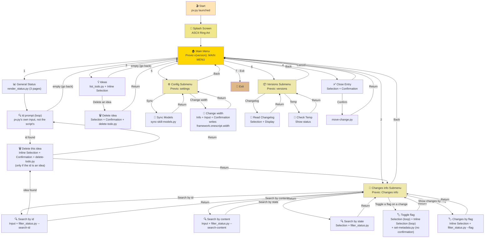
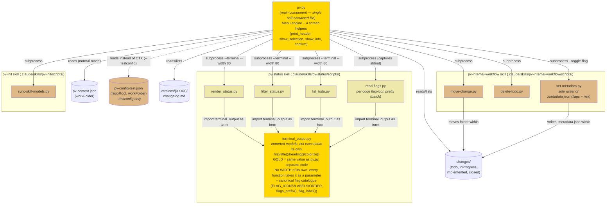

# pv.py Design Document

## Table of contents

- [Glossary](#glossary)
- [Purpose](#purpose)
- [Screen Hierarchy](#screen-hierarchy)
- [Navigation Flow](#navigation-flow)
- [Component Diagram](#component-diagram)
- [File Organization](#file-organization)
- [The Four Screen Helpers](#the-four-screen-helpers)
- [Style by Screen Type](#style-by-screen-type)
  - [The Detail Card](#the-detail-card)
- [Command-Line Configuration](#command-line-configuration)
- [How to Extend pv.py](#how-to-extend-pvpy)
  - [Guide for Extending pv.py](#guide-for-extending-pvpy)
  - [Common Mistakes When Extending](#common-mistakes-when-extending)
- [External Dependencies](#external-dependencies)
- [Accessibility Features](#accessibility-features)
- [Reference Configuration File](#reference-configuration-file)

## Glossary

Terms and their synonyms, used consistently throughout this document and in `pv.py`'s own comments. When the code or the development conversation uses a synonym, it's interchangeable with the term listed here — avoid introducing a third name for the same concept.

| Term | Synonyms | What it is |
|---|---|---|
| **Menu** (Main Menu / Submenu) | menu screen | GOLD screen generated by `run_menu()`/`print_header()` — a header with a centered title, a numbered list of options, and a fixed last item (`Back`/`Exit`). See "The Four Screen Helpers". |
| **Selection** | selection screen | DARK_GRAY screen generated by `show_selection()` — an (optional, see "Inline Selection") title and a numbered list framed by `hr("-")`, returning the chosen index. |
| **Inline Selection** | *Selección incrustada*, inline options, inline menu (avoid — it isn't a `run_menu()`) | A `show_selection()` with `title=""`, placed **immediately after** a listing (this file's own or delegated) to offer actions on its items, with no header, no blank-line spacing of its own, and no pause of its own — its `hr("-")` sits right below the listing's last line, visually continuing the same logical screen instead of opening a new one. See `show_ideas_menu()` (after this file's own listing) and `search_by_id()` (after a delegated detail card) in "Guide for Extending pv.py" for real examples. Don't confuse it with a submenu: it doesn't call `run_menu()`, doesn't carry `is_submenu = True`, and its "go back" is simply leaving the input empty (`None`), not one more numbered option. |
| **Confirmation** | y/N screen | `confirm()` — a `y/N` question with no header of its own, always nested inside another screen. |
| **Info** | info screen | `show_info()` — already-formatted text, `framed=True` (with DARK_GRAY rules) or `framed=False` (loose). |
| **Delegated info** | delegated screen, external render | Any screen that doesn't use `pv.py`'s helpers, but is instead printed by an external script (`render_status.py`, `filter_status.py`, `list_todo.py`) via `run_script()`, colored with its own independent GOLD palette (`terminal_output.py`). See "Component Diagram". |
| **Detail Card** | detail card | The 3- or 5-line block (depending on whether it's an idea or a change/fix) that `filter_status.py`'s `render_terminal()` prints per entry — part of Delegated Info, never produced by `pv.py`. See "The Detail Card". |
| **The four helpers** | screen helpers | `print_header()`, `show_selection()`, `show_info()`, `confirm()` — the only four valid ways to build an interactive screen in `pv.py`. Inline Selection isn't a fifth helper, it's a usage pattern of the second one; neither is `toggle_flag_on_change()`'s grouped listing + `show_selection(options_shown=True)` (same helper, the caller just prints the list itself). |

---

## Purpose

`pv.py` is an interactive command-line script that serves as a unified entry point for the `pv-*` framework. It lets advanced users:
- Inspect the general project status and changes in progress
- Filter changes by state (todo, inProgress, implemented, etc.)
- Review pending ideas
- Close implemented entries (move from `changes/implemented/` to `changes/closed/`)
- Sync skill configuration
- Review versions and their changelogs

**Note:** This script is generated automatically from `.claude/skills/pv-init/assets/pv.py` on every install/update. It must not be edited by hand at the repo root. It's a **single self-contained file** by design (not a folder of modules) — that way `pv-init` copies it as-is to `{repo root}/pv.py` without depending on a package structure.

---

## Screen Hierarchy

```
LEVEL 0 (Splash)
└── RING_ART (ASCII + gradient colors)

LEVEL 1 (Main Navigation)
└── "Previo v{version}: MAIN MENU" ({version} = pv-init/SKILL.md's metadata.version)
    ├── [1] Action: Show Status (→ external, 3 pages; the final id prompt is pv.py's own, not the script's)
    │   └── Input: search id, looped until empty (→ show_id_detail_card(), same card and Inline Selection as "Search by id")
    ├── [2] Submenu: Changes info
    │   └── "Previo: Changes info"
    │       ├── [1] Action: Search by id
    │       │   └── Input: search id (→ external, every state, no description.md reads except the match's)
    │       │       └── Inline Selection: no title (only if the id resolves to a todo/ idea, empty = go back)
    │       │           └── Action: Delete this idea
    │       │               └── Confirmation: "Confirm deleting..."
    │       ├── [2] Action: Search by content
    │       │   └── Input: search text (→ external, every state, reads every entry's description.md)
    │       ├── [3] Action: Search by state
    │       │   └── Selection: "Available states:" (→ external, one state)
    │       ├── [4] Action: Toggle a flag on a change (mutates state, no confirmation — reversible toggle)
    │       │   └── "Pick a change:" listing grouped by state (🟢/🟠/🟡, like "General project status"; no closed/) + Inline Selection (options_shown=True); loop; flag icons via read-flags.py
    │       │       └── Inline Selection: no title ([x]/[ ] per flag, loop)
    │       │           └── (pick one) → set-metadata.py --toggle-flag → the list is re-shown, updated
    │       ├── [5] Action: Show changes by flag
    │       │   └── Inline Selection: no title (Priority / Work in progress) (→ external, filter_status.py --flag)
    │       └── [6] Back
    ├── [3] Action: Show Ideas (→ external)
    │   └── Inline Selection: no title (a single option, empty = go back)
    │       └── Action: Delete an idea by code
    │           └── Selection: "Ideas in todo/:"
    │               └── Info: chosen idea's card
    │                   └── Confirmation: "Confirm deleting..."
    ├── [4] Action: Close Entry
    │   └── Selection: "Implemented entries..."
    │       └── Confirmation: "Confirm moving..."
    ├── [5] Submenu: Configuration
    │   └── "Previo: settings"
    │       ├── [1] Action: Sync Models (→ external)
    │       ├── [2] Action: Change max character width
    │       │   └── Info (current width) + Input (new width, empty = keep)
    │       │       └── Confirmation: "Set max character width to N..." → writes framework.onescript.width
    │       └── [3] Back
    ├── [6] Submenu: Versions
    │   └── "Previo: versions"
    │       ├── [1] Action: Changelog
    │       │   └── Selection: "Available versions:"
    │       │       └── Info: Show changelog.md
    │       ├── [2] Action: Check Temp
    │       │   └── Info: State of the temp directory
    │       └── [3] Back
    └── [7] Exit
```

---

## Navigation Flow



---

## Component Diagram

`pv.py` is a single, self-contained file (it doesn't import anything from any other Python module) — but **several of its menu options** delegate their entire rendering to an external script, run as a subprocess via `run_script()`. Those scripts, in turn, import a shared module from the `pv-status` skill that draws its own header with a color/style independent from `pv.py`'s. This diagram lays out that boundary clearly, since it's the most likely source of confusion when debugging a visual issue: **"is the bug in `pv.py` or in another component?"**



**Key takeaway from the diagram:**
- `pv.py` **never imports** anything — all communication with the other components goes through `subprocess.run()` (the `run_script()` function), meaning independent child processes that print to stdout. `pv.py` can't intercept or reformat that output.
- `terminal_output.py` (highlighted in gold, same as `pv.py`) is the **only other component that draws colored screens** — and it does so with its own code, without reusing any function from `pv.py`. If a "PROJECT STATUS" or "IDEAS IN TODO/" screen looks wrong, the fix belongs in `terminal_output.py`, never in `pv.py` (see the comment in `pv.py`'s own code, right before `show_general_status()`).
- `move-change.py`, `delete-todo.py`, `set-metadata.py`, and `sync-skill-models.py` are simple, single-step mutations with no rendering of their own — their output is plain text, no ANSI (`delete-todo.py` prints nothing on success; `set-metadata.py` prints one confirmation line).
- **`set-metadata.py` is the sole writer of `.metadata.json`** — the per-change mutable-state file where the *flags* live (`priority` ⭐, `workinprogress` ⚙️) and the `risk` field (integer 0-10, the median from `pv-internal-tech-risks`, written by `pv-how` in its step 3.1 with `--set-risk N`). `pv.py` **never** writes it directly and **only uses it for flags**: "Toggle a flag on a change" delegates the toggle to `set-metadata.py --xxxx <code> --state <state> --toggle-flag <value>` (never `--set-risk` — risk is written by `pv-how`, not `pv.py`). **No `confirm()`** — unlike "Close entry" (irreversible), a flag toggle is undone by the same action, so it's applied immediately; `set-metadata.py` prints its own one-line confirmation of what it did, and after each toggle the flag list is re-shown with the change reflected. Contrast with `framework.onescript.width` (a lone scalar in `pv-context.json` that `pv.py` does write): `.metadata.json` has an owning script in `pv-internal-workflow`.
- **`read-flags.py` is read-only** and `pv.py` **captures its stdout** (it doesn't let it print to the screen, unlike the other `pv-status` scripts): it returns one line per code with the flag-icon prefix already rendered (`⭐ ⚙️  `, or `[P] [W]  ` with no color), or an empty line if that change has no flags. It accepts **several `--xxxx` in a single invocation** (batch input — 1 subprocess, not N; Python startup on Windows is slow). Because `pv.py` captures its stdout (a pipe, never a tty), `read-flags.py`'s own `isatty()` check would always say "no color" — so **`pv.py` passes it `--color` / `--no-color`** matching `pv.py`'s own terminal. `list_implemented_entries()` calls it once with `--state implemented`; "Toggle a flag" groups the list by state (`flag_prefixes_by_state()`) because the same code can exist in two states (a `fast` change in `implemented` and its copy in `closed`) and a bare ambiguous code resolves to an empty prefix. The flag→icon/label map lives **only** in `terminal_output.py` (`pv-status` skill); `pv.py` doesn't reuse it via import (it imports nothing) — hence the read script. `pv.py` does keep a **manual** copy of the enum→human-label map (`FLAG_LABELS`) for its own flag `show_selection()`s.
- **Flag icons in change listings.** `render_status.py` and `filter_status.py` prepend `flags_prefix(entry["flags"])` to each row/card, and their card's line 1 follows the order `flags · code · [type] · (status) · Risk` (previously `(status) code [type] Risk`). In `/pv-status`'s markdown table (chat) the flags go as a leading `Flags` column. In `pv.py`, the **own** listings that show icons are `list_implemented_entries()` ("Close an implemented entry") and `toggle_flag_on_change()`'s "Pick a change:" listing — both via `read-flags.py`. That "Pick a change:" listing also **replicates "General project status"'s grouping** (`render_status.py`'s `render_terminal_page_in_progress()`): 🟢 `implemented/*`, 🟠 `inProgress/*` with `plan.md`, 🟡 `inProgress/*` with only `description.md`. `closed/*` is **left out of the listing** — a closed change is frozen (already folded into a release), so there's nothing left to re-prioritise or mark as in progress; `list_flaggable_changes()` skips `closed/` (and `todo/`). `list_flaggable_changes()` returns the entries already sorted by group then code; `_print_flaggable_listing()` prints the group headings (in GOLD) with continuous numbering, and `show_selection(options_shown=True)` reads the choice without reprinting. "Ideas in todo/" shows no icons: `todo` entries never carry flags.
- None of these components import each other, except `terminal_output.py` by `pv-status`'s three scripts — they're all independent processes connected only by argument convention (`--terminal`, `--xxxx`, etc.) and by the framework's paths (`changes/`, `versions/`). In particular, `render_status.py` **no longer invokes** `filter_status.py` — it only prints its three pages and exits.
- **The id prompt after "Project status"'s page 3 is `pv.py`'s own, not `render_status.py`'s.** It used to live inside `render_status.py`, forwarding the id as a subprocess to `filter_status.py --search-id`, with no involvement from `pv.py`. Now `render_status.py` only prints the three pages; the id loop lives in `show_general_status()` (`pv.py`), which calls the same `show_id_detail_card()` used by `search_by_id()` — so both routes produce the exact same screen, including the "Delete this idea" Inline Selection when it applies. The ownership moved precisely because a `pv-status` script running as a child subprocess has no access to `pv.py`'s helpers and can't invoke `delete-todo.py` with the right menu context.
- **`terminal_output.py` has no fixed `WIDTH` of its own** — every function (`hr()`, `title()`, `heading()`, `wrap()`) takes `width` as an explicit parameter (`DEFAULT_WIDTH = 70` when the caller doesn't have an opinion). The caller decides the width, not the module: `pv.py` passes `--width 80` (its own `WIDTH`) to the three `pv-status` scripts via `run_script()`, so delegated screens (general status, searches, the detail card, the ideas listing) measure exactly the same as its own menu/selection screens. The `pv-status` skill (invoked from chat, no `--terminal`) never passes `--width` — it doesn't apply there, it only produces markdown.
- `pv-config-test.json` (dashed line, only active with the `--testconfig` flag — see "Command-Line Configuration") fully replaces `pv-context.json`: its node tree **mirrors `pv-context.json`'s own** so the same code finds each value at the same path — `workFolder` at `framework.workFolder`, `pv.py`'s own settings at `framework.onescript.*` — plus a top-level `repoRoot` (no `pv-context.json` equivalent: only the harness needs it, so `pv.py` can locate the real `.claude/skills/...` scripts when run as a copy — `sandbox-test1/pv-test.py` — outside the repo root). `pv.py` never reads both files in the same run — it's one or the other, never a mix.

---

## File Organization

The file is split into blocks delimited by `# ====...====` comments, in this fixed order. When adding code, place it in the block it belongs to — don't slot it into another one just because it's near where it's used:

| Block | Contains | Touch it when... |
|---|---|---|
| `Rendering primitives` | `WIDTH` (default), `MIN_WIDTH`, colors (`GOLD`/`DARK_GRAY`), `colorize()`, `hr()`, `wrap()`, `RING_ART` | Almost never — changes the global color/width system |
| `Screen-type helpers` | `print_header()`, `show_selection()`, `show_info()`, `confirm()` | Almost never — changes the behavior of a screen type across **all** options at once |
| `Framework paths and shared lookups` | `work_root()`, `load_onescript_width()`, `save_onescript_width()`, `changes_dir()`, `versions_dir()`, `framework_version()`, `run_script()`, `load_test_config()` — plus the module globals `CONTEXT_PATH` and `ACTIVE_CONFIG_PATH` (the config file pv.py reads its settings from / writes them to: `CONTEXT_PATH` normally, the `--testconfig` file otherwise) | When adding a new framework path or subfolder several options need |
| `Actions -- root menu` | Action functions for the root menu | When adding a new option to "Previo: MAIN MENU" |
| `Actions -- Configuration submenu` | Action functions for "Previo: settings" (`sync_skill_models()`, `change_width()`) | When adding a new option to Configuration |
| `Actions -- Versions submenu` | Action functions for "Previo: versions" | When adding a new option to Versions |
| `Actions -- Changes info submenu` | Action functions for "Previo: Changes info" (`search_by_id()`, `search_by_content()`, `search_by_state()`, `list_states()`, `toggle_flag_on_change()`, `_toggle_flags_on()`, `_print_flaggable_listing()`, `show_changes_by_flag()`, `list_flaggable_changes()` (+ `_flaggable_group_of()`, `FLAG_GROUPS`), `read_change_flags()`, `flag_prefixes_for()`, `flag_prefixes_by_state()`, `_flag_label_with_icon()`) | When adding a new option to Changes info |
| `Actions -- Ideas (root menu)` | Functions for the "Ideas in todo/" root option (`show_todo_ideas()`, `list_todo_entries()`, `find_todo_code()`, `delete_idea_by_code()`, `delete_idea()`, `show_ideas_menu()`) — also `show_id_detail_card()`, one id's detail card (with an Inline Selection when it's an idea), reused by `search_by_id()` (Changes info) and `show_general_status()` (root menu) | When adding a new idea-related option |
| `Root menu definition` | The `MENU` list | When registering any new root menu option (always the last step) |
| `Menu engine` | `run_menu()`, `main()` | Almost never — changes the navigation loop for **all** menus at once |

For a new submenu (other than Configuration or Versions), add a `# Actions -- My New Submenu` block following the same pattern, placed before `Root menu definition`.

---

## The Four Screen Helpers

Every interactive `pv.py` screen is built with one of these four functions. There's no valid fifth "manual" way — if a new option doesn't fit any of them, it probably needs to be broken down into several calls to these helpers.

### `print_header(title)`
Menu header: `hr("=", GOLD)` + title centered in GOLD + `hr("=", GOLD)`. Used internally by `run_menu()` — never called directly from an action function.

### `show_selection(title, options, prompt, extra_option=None, options_shown=False) -> int | str | None`
A numbered list framed by `hr("-")` in DARK_GRAY. Takes a list of already-formatted display strings and returns:
- the **0-based index** in `options` of the chosen item, or
- `extra_option`'s lowercase key (e.g. `"a"`) if the non-numeric option was used, or
- `None` if the user canceled (empty input) or typed something invalid.

**Important:** it returns the index, not the option's text — so there's never any ambiguity if two options show the same text. The caller must always check `is None`, never `not result` (an index of `0` is a valid, falsy-in-Python result).

`extra_option` is a `(key, label)` tuple for a non-numeric option mixed into the list, like `("a", "Close all")` in `close_entry()`.

**`title=""` — Inline Selection.** Omits the title line and also the blank line that normally precedes `hr("-")`, leaving just `hr("-")` + list + `hr("-")` sitting right below whatever came before. Use it when the Selection goes **immediately after** a listing that already gives it context (this file's own or Delegated Info) — so the gray rule stays attached to that listing instead of floating apart with its own title. See "Inline Selection" in the Glossary and `show_ideas_menu()`/`search_by_id()` in "Guide for Extending pv.py" for real examples.

**`options_shown=True`.** The caller **has already printed the numbered list itself** (e.g. a grouped listing with headings `show_selection()` can't render) — so `show_selection()` doesn't reprint the flat list: it just reads the input. The caller's numbering must match `options`' order 1:1. Implies `title=""`. Only use: `toggle_flag_on_change()`, whose "Pick a change:" listing is grouped by state like "General project status"'s (see "Guide for Extending pv.py").

### `show_info(lines, framed=True) -> None`
Displays already-formatted lines of text. `framed=True` frames them with `hr("-")` in DARK_GRAY above and below (use it for "single-piece" content like a full changelog); `framed=False` prints them loose (use it for a short one- or two-sentence message, like a "nothing to show" notice).

### `confirm(question) -> bool`
Asks a `y/N` question with no header of its own — it's always nested inside another screen (usually right after a `show_selection()`). Returns `True` only if the answer is `"y"` or `"yes"` (case-insensitive); anything else, including empty, is `False`.

### `read_input(prompt) -> str`

A wrapper around `input()` — not one of the four screen types, but the single point every `input()` call that expects a real answer (not the "Press Enter to return..." pause) must go through. If the user types `"exit"` (case-insensitive, surrounding whitespace ignored), it quits the whole program instantly (`sys.exit(0)`), with no confirmation and no message — same effect as picking the root menu's numbered "Exit" option, but available from **any** screen that asks for text: `run_menu()`'s prompt, `show_selection()`, `confirm()`, or an action's free-text `input()` like `search_by_id()`/`search_by_content()`.

The three helpers (`show_selection`, `confirm`) and `run_menu()` already use `read_input()` internally — any action function that needs to ask for free text directly (outside those three) must use `read_input()` too, never bare `input()`, or "exit" stops working on that screen. The one deliberate exception is the `input("\nPress Enter to return to the menu...")` pause in `run_menu()`: that pause isn't asking a real question, so any text (including "exit") just continues.

### What NOT to do

- Don't call `hr()` directly from an action function — only the four helpers and `run_menu()` do.
- Don't mix `hr("=", GOLD)` and `hr("-")` (DARK_GRAY) within the same logical screen — each screen uses a single color from start to finish (see "Style by Screen Type").
- Don't compare `show_selection()`'s result with `if not result` — use `if result is None`.
- Don't call `input()` directly in an action function to ask for free text — use `read_input()`, or "exit" won't work on that particular screen (exception: the "Press Enter to return..." pause, which uses `input()` on purpose).

---

## Style by Screen Type

General rule: **one color per full screen**, never mixed within the same logical block. Two levels:

- **GOLD** = "you're navigating" → menu headers (`print_header()`, used by `run_menu()`) and the status screens delegated to `terminal_output.py` (see below)
- **DARK_GRAY** = "you're viewing or picking data" → `show_selection()` and `show_info()` with `framed=True`

### Menu (Main Menu and Submenus) — via `run_menu()` / `print_header()`

Everything in GOLD: the header (top, title, bottom) and also the `hr("=", GOLD)` that closes the option list before the "Choose an option:" prompt. `hr()`'s default is DARK_GRAY, so any new call to `hr()` inside `run_menu()` needs an explicit `color=GOLD` (see "Common Mistakes When Extending", point 1).

```
══════════════════════════════════════════════════════════════════   ← GOLD
                       Previo v0.9.5b7: MAIN MENU                      ← GOLD, centered
══════════════════════════════════════════════════════════════════   ← GOLD
  1. General project status
  2. Changes info
  ...
  7. Exit
══════════════════════════════════════════════════════════════════   ← GOLD
Choose an option:
```

A submenu follows exactly the same pattern — only the title and option text change.

### Selection — via `show_selection()`

Everything in DARK_GRAY: the two `hr("-")` lines and the uncolored title.

```
──────────────────────────────────────────────────────────────────   ← DARK_GRAY
Available states:                                                     ← no color
  1. todo
  2. inProgress
  3. implemented
──────────────────────────────────────────────────────────────────   ← DARK_GRAY
Choose a state (number, or empty to cancel):
```

**Exception: "Available states" (`search_by_state()`).** It's the only `show_selection()` whose individual options carry their own color, one per state — the frame (`hr("-")`, title) stays plain DARK_GRAY, unchanged; only each list row's text is tinted according to which state it belongs to:

| State | Color |
|---|---|
| `todo` | Blue (`STATE_BLUE`, `\033[38;5;75m`) |
| `inProgress` | Yellow (`STATE_YELLOW`, `\033[38;5;220m`) |
| `implemented` | Green (`STATE_GREEN`, `\033[38;5;114m`) |
| `closed` | White (`STATE_WHITE`, `\033[38;5;255m`) |

`search_by_state()` builds the colored label list (`colorize(state, STATE_COLORS[state])`) **before** passing it to `show_selection()`, and keeps the uncolored `states` list separately to index the result — `show_selection()` itself knows nothing about per-state colors, it only ever receives already-formatted display strings (that's the design: "Takes a list of already-formatted display strings", see above). If a new state is ever added to the framework, add its entry to `STATE_COLORS` too, or it falls back to plain DARK_GRAY (indistinguishable from the frame).

### Confirmation — via `confirm()`

No header or color of its own, continues the block of the screen that invoked it:

```
Confirm moving '1001 — Add user authentication' to changes/closed/?
(y/N):
```

### Info — via `show_info()`

`framed=True` uses DARK_GRAY, same as Selection; `framed=False` has no rule at all.

```
──────────────────────────────────────────────────────────────────   ← DARK_GRAY (framed=True)
# Changelog v1.2.0
- Added: new feature X
──────────────────────────────────────────────────────────────────   ← DARK_GRAY
```

```
changes/closed/temp/ isn't empty — the versioning process (pv-version)   ← framed=False,
has either failed or is currently in progress:                            no rule
  - 1003
```

### Delegated info — `render_status.py` / `filter_status.py` / `list_todo.py`

These three options don't use `pv.py`'s helpers — they invoke an external script with `run_script(..., "--terminal")`, and that script controls its own rendering using the sibling module `.claude/skills/pv-status/scripts/terminal_output.py`. That module has its **own** palette (same GOLD value, `\033[38;5;220m`) and its own `hr()`/`title()`/`heading()`, independent from `pv.py` — they share no code, only the color value. The entire block it generates (title, internal table separators, section underlines, closing line) comes out in uniform GOLD, following the same "one color per full screen" rule.

**`render_status.py` — "Versions: N" before the bars.** Page 1 (`render_terminal_page_summary()`) shows the total number of versions (subfolders of `versions/`) right under the title, before the per-state bars — it's the first thing the user sees after the header. `count_versions(changes_dir)` derives `versions_dir` as `changes_dir.parent / "versions"` (a sibling of `changes/` under the same `workFolder`) instead of duplicating the `workFolder` resolution `collect_status.py` already does — `collect_status.py` only ever knows `changes_dir`, never `versions_dir`. The same value (`versionsTotal`) was also added to the markdown mode (`render()`/`STATUS.template.md`, field `**Versions:** {versionsTotal}` right before `## Summary`), so `/pv-status` from chat shows it too — both modes share `count_versions()`, no duplicated calculation.

```
======================================================================
                            PROJECT STATUS                             ← GOLD (terminal_output.title)
                        Generated: 2026-08-19
======================================================================

Versions: 3                                                            ← no color, first line after the header

💡 Todo         ████████████████████  2
🔧 In progress  ████████████████████  2
...
```

**"Detail card" after page 3 — it's `pv.py`, not `render_status.py`.** `render_status.py --terminal` only prints its three pages and exits — it never asks for an id. The looping prompt (`Enter an id for its detail card, or press Enter to go back:`) lives in `pv.py`'s `show_general_status()`, right after invoking `render_status.py` via `run_script()`. This change of ownership (it used to live inside `render_status.py`, forwarding the id as a nested subprocess to `filter_status.py --search-id`) exists so this prompt can offer the same Inline Selection delete follow-up as "Search by id" — something a `pv-status` script running as a child subprocess couldn't do, since it has no access to `pv.py`'s helpers or to `delete-todo.py`. Each id entered calls the same `show_id_detail_card(query)` used by `search_by_id()` (see "Guide for Extending pv.py"): it shows the card (`filter_status.py --search-id <id> --terminal`, including its "no match" message if the id doesn't match any state) and, if the id resolves to a `todo/` idea, the "Delete this idea" Inline Selection right below. After that, it asks again — the loop only ends on empty input, which hands control back to `run_menu()` (the "Press Enter to return to the menu..." pause).

This prompt **doesn't appear in markdown mode** (`render()`, used by `/pv-status` from chat) — it's `--terminal`-exclusive, since `filter_status.py --search-id` is itself `--terminal`-only.

`filter_status.py` has **three entry points** from `pv.py`, all inside the "Changes info" submenu: `search_by_state()` invokes it with `<state> --terminal` (the original `show_filtered_status()`, just renamed); `search_by_id()` invokes it with `--search-id <text> --terminal`; and `search_by_content()` invokes it with `--search-content <text> --terminal`. The two searches were deliberately split into two menu options (and two separate CLI flags) instead of one combined search — that way each stays as fast as the kind of lookup it's actually doing: `--search-id` scans every state comparing only folder names (no `description.md` reads except the one match's), while `--search-content` has to read every entry's `description.md` to filter by content — no way around that. All three modes share `render_terminal()` — the title switches between `PROJECT STATUS — {state}` and `PROJECT STATUS — search: {text}`, and in search mode (by id or by content) each row prefixes the id with its origin state in parentheses (`(implemented)  1001  ...`), since results cross states.

**`--search-id` ignores zero-padding.** Ids under `changes/{inProgress,implemented,closed}` are zero-padded numbers (`00001`), but `todo/`'s are short alphanumeric codes (`a3f9k`) that aren't. `ids_match()` compares both sides as integers when both are digits-only (so `1`, `01`, and `00001` all find the same entry) and falls back to a case-insensitive string comparison otherwise (so `todo/`'s alphanumeric ids keep working, and a numeric id never accidentally matches an alphanumeric one).

```
══════════════════════════════════════════════════════════════════   ← GOLD (terminal_output.hr)
                      PROJECT STATUS — closed                         ← GOLD (terminal_output.title)
                       Generated: 2026-08-18
══════════════════════════════════════════════════════════════════   ← GOLD
```

### The Detail Card

The fixed name (along with "detail card") we use, in this document and in development conversation, for the block `render_terminal()` (in `filter_status.py`) prints per entry — it's the format shared by **all three** routes that reach `render_terminal()`: "Filter by state" (`<state>`), "Search by id" (`--search-id`), "Search by content" (`--search-content`), and also the id prompt at the end of "Project status" (`pv.py`'s `show_general_status()`, which also delegates to `filter_status.py --search-id` via `show_id_detail_card()`). All four routes produce exactly the same block — there's no fifth variant. Two of those four routes ("Search by id" and the "Project status" prompt, both directly controlled by `pv.py` via `show_id_detail_card()`) additionally offer the same "Delete this idea" Inline Selection when the id resolves to a `todo/` idea — "Filter by state" and "Search by content" don't offer it, since their result can mix several entries and there's no single id to act on.

No color of its own (inherits the GOLD of the surrounding block only for the screen's title/closing rule, the body stays uncolored, same as the rest of "Delegated info"). The format is the same regardless of mode — the `(state)` on line 1 is always shown, even in "Filter by state" where the screen's own title already says it (unified on purpose so the card always looks the same, instead of having a slightly different format depending on how you got to it).

**Line 1 order (decision 6.14 of the flags plan):** `flags · code · [type] · (status) · Risk`. That is: the flag-icon prefix (`⭐ ⚙️  `, or `[P] [W]  ` under `NO_COLOR`; empty if the change has no flags) comes **first**, then the `code`, then `[type]`, then `(status)` (which moved from first position to after `[type]`), and last `Risk`. It used to be `(status)  code  [type]  Risk`. The reason: with flags in front, putting `code` right after them keeps the code column almost aligned across entries (the icons are the only variable prefix), and groups `(status)`/`Risk` as trailing metadata. This order applies to **every** `filter_status.py` card (`--state`, `--search-id`, `--search-content`, `--flag`) and to `render_status.py`'s detail blocks too. **It's the only non-additive point of the flags plan** — it changes the format for users who don't use flags. Nobody parses that line programmatically (`pv.py` delegates the whole render), but any `pv-status` test snapshot/golden-file that captures line 1 has to be regenerated.

There are **two content variants, with a different number of lines** — 5 lines for change/fix, 3 for idea (`todo/`, no `Risk`, no extra-files count, no separate description line, see why below):

#### Change/fix card (`inProgress`/`implemented`/`closed`)

```
⭐⚙️  1001  [🆕 Change]  (implemented)  Risk: 6/10  ← Line 1: flags, id, type, (state), risk — no date here
created: 2026-08-01, planned: 2026-08-03      ← Line 2: created = description.md, planned = plan.md ("pending" if absent)
> Add user authentication                     ← Line 3: name (description.md's **Name** field), "> " prefix
  Lets users sign in with email and           ← Line 4: first 500 characters of the
  password, backed by a new sessions table…      description (## Full description), with "…" if truncated
extra files: 2                                ← Line 5: count of non-framework files directly in the entry folder
```

(The flag prefix is empty when the change has no flags, so a flagless card reads `1001  [🆕 Change]  (implemented)  Risk: 6/10` — same order, without the icon gap.)

- **`created`** (line 2): `description.md`'s `**Creation date**` field (bold inline); falls back to `description.md`'s mtime if absent.
- **`planned`** (line 2): `plan.md`'s `**Creation date**` field (same bold-inline format, see `PLAN.template.md`) — the date `pv-how` wrote the plan on, not the change's creation date. If `plan.md` doesn't exist yet, or exists but lacks that field, shows literally **`pending`** (not a dash or "unknown" — explicitly signals planning hasn't happened yet). `build_entry()` computes this by reusing `extract_date()` on `plan.md`'s text, no new pattern needed — the field has the exact same format in both files.
- **`Risk`** (line 1): `.metadata.json`'s `risk` field (integer 0-10, written by `pv-how` via `set-metadata.py --set-risk`), `{value}/10` format — `?` if the field is absent. `0` shows as `0/10`, not `?`.
- Line 4 uses **its own 500-character limit** (`TERMINAL_DESCRIPTION_MAX_CHARS`), separate from and independent of the 250-character limit used by `/pv-status`'s markdown table (chat) — changing one doesn't affect the other; they're two separate rendering paths inside `filter_status.py` (`render_terminal()` vs `render_report()`), and only terminal mode shows the detail card at all (the markdown table has no Name/Planned/extra-files columns).
- **`extra files`** (line 5): count of files directly inside the entry folder that aren't the framework's own (`description.md`, `plan.md`, `history.md`) — e.g. `design_*.html`/`design_*.txt` mockups, or anything else the folder accumulates. Computed by `count_extra_files()` against the `TERMINAL_FRAMEWORK_FILES` set; `0` if there are none.

#### Idea card (`todo/`)

Different, shorter format than the change/fix card — **3 lines, not 5**: no `Risk`, no extra-files count (`todo/` never has `plan.md`, and its entries only ever hold `description.md` — both would always have been `?`/`0`, noise not information) and no separate description line (the `## Idea` text already serves as the name, there's nothing else to show below it).

```
a3f9k  [💡 Todo]  (todo)                       ← Line 1: id, type, (state) — no flags (todo/ never carries any), no Risk
created: 2026-08-15                            ← Line 2: created only — no "planned" (todo/ has no plan.md)
> Dark mode                                   ← Line 3: the ## Idea text (see below), "> " prefix
```

`description.md` in `todo/` doesn't follow `pv-new`/`pv-fix`'s `**Name**:`/`**Type**:`/`## Full description` format — it uses `pv-todo`'s own markdown headings (`## Idea`, `## Creation date`, `## Notes`), with no separation between "name" and "description". `build_entry()` detects `state == "todo"` and uses `parse_todo_description()` (reused from `collect_status.py`, the same one `list_todo.py` uses) to extract the `## Idea` text as line 3 (name) — there's no line 4, `render_terminal()` stops there for this variant (`continue` after line 3, before the block that adds the description line). Line 2's `created` also uses its own pattern (`## Creation date`, a heading) instead of `**Creation date**` (bold inline) — `TODO_DATE_RE`, distinct from `DATE_RE`.

**If you touch `terminal_output.py`:** its `hr()` is already GOLD by default (unlike `pv.py`'s `hr()`, which defaults to DARK_GRAY) — any new call to `term.hr(...)` in `render_status.py`/`filter_status.py`/`list_todo.py` comes out gold without needing to pass it a color, so there's no color parameter there (nor does one exist).

### Summary

| Element | Menu (`pv.py`) | Selection | Confirmation | Info: framed=True | Info: framed=False | Info: delegated status |
|---|---|---|---|---|---|---|
| Rule character | `=` | `-` | none | `-` | none | `=` |
| Rule color | GOLD | DARK_GRAY | — | DARK_GRAY | — | GOLD |
| Responsible helper | `print_header()` / `run_menu()` | `show_selection()` | `confirm()` | `show_info(framed=True)` | `show_info(framed=False)` | `terminal_output.title()`/`hr()` |

---

## Command-Line Configuration

```bash
python3 pv.py
```

No arguments, in normal use. Reads configuration from:
- `pv-context.json` for `workFolder`
- `pv-context.json`'s `framework.onescript.width` for its own `WIDTH` (default 80 if absent/malformed)
- Checks that the framework directory exists

**`pv.py` writes `pv-context.json`** — the only place it does — through the "Configuration > Change max character width" option. It's a minimal read-modify-write (`json.load` → set `framework.onescript.width` → `json.dump(indent=2)`) that preserves every other field and key order, creating the `framework`/`onescript` objects if missing, always gated behind a `confirm()`. The written value is an integer `>= 40` (empty input keeps the current one; anything below 40 is rejected without writing — below that the ring-art splash and detail cards break). `framework.onescript.width` is an optional field in `schema.json`; `pv-init` never asks about it, and its absence just means `pv.py` uses the built-in default.

### `--testconfig` — for testing `pv.py` only, not normal use

```bash
python3 sandbox-test1/pv-test.py --testconfig
```

Flag exclusive to the framework's own test harness (`pv-test.py`, a plain identical copy of `pv.py` with no code of its own, placed next to its `pv-config-test.json` for convenience — `sandbox-test1/` in this repo). **It takes no argument** — it assumes a file named `pv-config-test.json` sits in the same folder as the script being run (`Path(__file__).resolve().parent`), and exits with an error if it's not there. When passed, `pv.py` **doesn't read** `.claude/pv-context.json` at all — instead it reads that `pv-config-test.json`, whose **node tree mirrors `pv-context.json`'s own** so the same code finds each value at the same path:

```json
{
  "repoRoot": "..",
  "framework": {
    "workFolder": "/sandbox-test1/previo-sdd",
    "onescript": { "width": 80 }
  }
}
```

- `repoRoot` (**required, top-level**): path to the real repo root (where `.claude/skills/...` lives), **resolved relative to the config file's own location** (itself always next to the script), not the directory the script is invoked from. Needed because `pv.py` still invokes the framework's real scripts (`filter_status.py`, `render_status.py`, etc.) — never copies — so it needs to know where they are. It stays top-level because it has **no equivalent in `pv-context.json`** — it's purely test-harness metadata (the real script, at the repo root, derives its root from `__file__`).
- `framework.workFolder` (**required**): the test `workFolder`, at the **same path `pv-context.json` uses** (`framework.workFolder`), so `work_root()`-style resolution needs no test-mode branch. Points at throwaway fixture data (e.g. `/sandbox-test1/previo-sdd`) so the project's real data is never touched.
- `framework.onescript.width` (**optional**): `pv.py`'s own persisted setting, read from — and written to by "Change max character width" — this file, at the **identical nested path** it would use in `pv-context.json`. `ACTIVE_CONFIG_PATH` (set in `main()`) just points `load_onescript_width()`/`save_onescript_width()` at whichever file is active; no test-mode branch there either. Absent → `pv.py` uses its built-in default (80).

`run_script()` forwards `framework.workFolder` as `--work-folder <value>` to the scripts that support that override (`SCRIPTS_ACCEPTING_WORK_FOLDER`: `filter_status.py`, `render_status.py`, `list_todo.py`, `read-flags.py`, `move-change.py`, `set-metadata.py`, `delete-todo.py`) — `sync-skill-models.py` is excluded since it doesn't touch `changes/`/`workFolder` at all and has no such flag. `read-flags.py` is also in `SCRIPTS_ACCEPTING_WIDTH` (it accepts `--width` for symmetry with the other `pv-status` scripts, though it ignores it: an icon prefix has no column to fit). `set-metadata.py` does **not** get `--width` (it prints no screens, only a confirmation line). Beyond `run_script()`'s generic forwarding, `flag_prefixes_for()` appends `--color` or `--no-color` to the `read-flags.py` call by hand (from `pv.py`'s `supports_color()`) — `run_script()` doesn't infer color, and a captured `read-flags.py` can't detect it itself.

If `pv-config-test.json` isn't found next to the script, has invalid JSON, or is missing `repoRoot` / `framework.workFolder`, `pv.py` exits with a clear error message (`sys.exit`, no traceback) — it never proceeds with a silent default. A missing `framework.onescript.width` is **not** an error (it's optional).

---

## How to Extend pv.py

### Guide for Extending pv.py

This section is the quick reference for adding new options without breaking visual consistency. Follow these steps in order.

#### Adding a read-only option to the root menu

1. Write a `def show_my_option() -> None:` function in the `# Actions -- root menu` section (or create a new `# Actions -- ...` section if it groups several related new options).
2. Inside, use **one of the four helpers** (`show_selection`, `show_info`, `confirm`, or `run_script` if it delegates to an external script) — never call `hr()`/`print()`/`colorize()` loose directly in an action function.
3. Add `("Visible label", show_my_option)` to the `MENU` list near the end of the file.
4. Don't mark `is_submenu` — only the `show_*_menu()` functions that call `run_menu()` carry it.

#### Adding a new submenu

1. Copy the pattern from `show_settings_menu()` or `show_versions_menu()`: a function that calls `run_menu(title, items, "Back")`.
2. Right below it, add `my_submenu.is_submenu = True` — without this line, the parent menu injects a double "Press Enter..." pause (one from the submenu on exit, another from the parent treating it as if it were a leaf action).
3. Write the submenu's actions as regular functions (previous step) in their own `# Actions -- My Submenu` section.
4. Add `("My Submenu", show_my_submenu)` to `MENU` (or to another submenu's `items`, if it's nested deeper).

#### Adding an option that mutates state (like "Close entry" or "Toggle a flag on a change")

1. Follow the pattern from `close_entry()` / `toggle_flag_on_change()`: `show_selection()` to pick the target, followed by `confirm()` **if the action isn't trivially reversible**. "Close entry" moves a folder (destructive from the user's view) → `confirm()`. "Toggle a flag" just flips a boolean in `.metadata.json` and the same action undoes it → **no `confirm()`**, applied immediately with the updated list re-shown. The rule: `confirm()` for what's costly to undo, not for everything that writes.
2. Delegate the actual mutation to a script from the corresponding skill via `run_script()` — `pv.py` must not write file content or business logic, only orchestrate. See "Single extension point" below. Example: `toggle_flag_on_change()` delegates **every** write to `.metadata.json` to `set-metadata.py` (`pv-internal-workflow`); `pv.py` only *reads* that file (`read_change_flags()`) to paint the `[x]`/`[ ]`, never writes it.
3. If the action is applied repeatedly (toggling several flags, closing several entries), wrap it in a loop that re-shows the listing after each operation instead of returning to the menu — `toggle_flag_on_change()` has two nested loops (pick change → toggle flags), each ending on empty input.
4. If the target listing is long or heterogeneous, group it with headings like `toggle_flag_on_change()` does — reusing the same partition as "General project status" (🟢 `implemented/*`, 🟠 `inProgress/*` with `plan.md`, 🟡 `inProgress/*` without `plan.md`; `closed/*` is left out as frozen). `show_selection()` can't render group headings: print the listing yourself (continuous numbering) and call `show_selection(..., options_shown=True)` so it only reads the choice. The printed numbering must match `options`' order 1:1 — achieved by sorting the entries by (group, code) before both. The group headings are tinted **GOLD** (a scoped exception to "one color per screen", same as `search_by_state()`'s per-state colors) to set them apart from the DARK_GRAY entry rows.
5. If the target can exist in more than one state (`inProgress`/`implemented`/`closed`), resolve the state **first** (part of the `show_selection()`) and pass it explicitly to the script (`--state <state>`) — don't let the script guess, because the same code can appear in two states (an implemented `fast` change and its copy in `closed`).

#### Single extension point (complexity boundary)

Any new option must be either:
- **Purely read-only** (delegates to an existing `--terminal` script or a new read-only one), or
- **A simple mutation already validated by its own script** (like moving a folder, or toggling a flag), with an explicit `confirm()` first **if it isn't trivially reversible**.

More complex mutations (deleting, creating versions, drafting file content) stay **out of `pv.py`'s scope** — they need context only the corresponding skill can provide via Claude Code. Don't add that logic here even if it seems convenient.

**The one config-write exception.** "Change max character width" writes `framework.onescript.width` into `pv-context.json` directly from `pv.py` (`save_onescript_width()`), with no external script. This is deliberately allowed because it's a single already-validated integer (range-checked in the action, `confirm()`ed first) written by a minimal read-modify-write that touches nothing else — the same "simple mutation" tier as moving a folder. It is **not** a precedent for `pv.py` writing anything richer into `pv-context.json`: any setting that isn't a single scalar with an obvious validation rule still belongs to `pv-init`/`pv-update`. If a second `pv.py`-owned setting ever appears, it goes under the same `framework.onescript.*` object, read/written by the same two helpers.

### Common Mistakes When Extending

Real friction points in this design — watch out for them when adding new code.

1. **`hr()` doesn't default to GOLD.** Its default is DARK_GRAY; any new `hr()` inside `run_menu()`/`print_header()` (or any code that should belong to the "menu" level) needs an explicit `color=GOLD`, or the line comes out gray and mixes two levels within the same screen.

2. **Comparing `show_selection()`'s result with `if not result`.** Since the helper returns a 0-based index, choosing the first option (`index 0`) is falsy in Python and would be mistaken for a cancellation. Always use `if result is None`.

3. **Using an option's text instead of its index to locate the original data.** If two displayed options share the same text (e.g. two entries with the same `code — name`), searching by text would return the first match instead of the chosen one. `show_selection()` avoids this at the root by returning the index, not the text — always use it that way.

4. **Adding file-mutation logic directly in `pv.py`.** Any change that touches content (not just moving a folder) belongs in a script from the corresponding skill, invoked via `run_script()` — see "Single extension point".

5. **Touching `terminal_output.py` without remembering it's an independent module.** It shares the GOLD color value with `pv.py` but imports nothing from it, nor vice versa — a palette change in one doesn't automatically propagate to the other.

---

## External Dependencies

### Scripts Run

| Script | Location | Purpose |
|--------|-----------|-----------|
| `render_status.py` | `.claude/skills/pv-status/scripts/` | Show general status (3 pages in `--terminal`). No longer asks for any id or invokes `filter_status.py` — that loop lives in `pv.py`'s `show_general_status()`. Prepends the flag-icon prefix to each row. Accepts `--width` |
| `list_todo.py` | `.claude/skills/pv-status/scripts/` | List ideas in todo/. Accepts `--width` |
| `filter_status.py` | `.claude/skills/pv-status/scripts/` | Filter changes by state (`<state>`), search by exact id across every state (`--search-id <text>`), search by `description.md` content (`--search-content <text>`), or list changes by flag across every state (`--flag <name>`, repeatable, OR semantics). Card line 1 in `flags · code · [type] · (status) · Risk` order. Accepts `--width` |
| `read-flags.py` | `.claude/skills/pv-status/scripts/` | Returns the already-rendered flag-icon prefix, one line per `--xxxx` (batch input). `pv.py` **captures its stdout** and passes `--color` / `--no-color` (from `pv.py`'s terminal, since the captured pipe is never a tty). Accepts `--work-folder`, `--state`, and `--width` (the last ignored) |
| `sync-skill-models.py` | `.claude/skills/pv-init/scripts/` | Sync skill models |
| `move-change.py` | `.claude/skills/pv-internal-workflow/scripts/` | Move entry to closed |
| `set-metadata.py` | `.claude/skills/pv-internal-workflow/scripts/` | Sole writer of `.metadata.json` (`flags` + `risk`). `pv.py` invokes it with `--xxxx <code> --state <state> --toggle-flag <value>` for "Toggle a flag on a change" (no prior `confirm()` — reversible toggle); it never uses `--set-risk` (that's `pv-how`'s job). Prints one confirmation line. Accepts `--work-folder`; **not** `--width` |
| `delete-todo.py` | `.claude/skills/pv-internal-workflow/scripts/` | Delete an idea folder at `changes/todo/{xxxx}` |
| `terminal_output.py` | `.claude/skills/pv-status/scripts/` | Rendering module shared by `pv-status`'s scripts (not an executable script, it's imported). No `WIDTH` of its own: every function takes it as a parameter, `DEFAULT_WIDTH = 70` when the caller doesn't have an opinion. Also holds the framework's **canonical flag catalogue**: `FLAG_ICONS`/`FLAG_ICONS_ASCII`/`FLAG_LABELS`/`FLAG_ORDER` + `flags_prefix()` / `flag_label()` — the one place the flag→icon/label map lives |

### Files and Directories

| Path | Purpose |
|------|-----------|
| `pv-context.json` | Framework configuration. Read for `workFolder` and `framework.onescript.width`. **Also written** (the only file `pv.py` writes) by "Configuration > Change max character width" — see "Command-Line Configuration" and the config-write exception under "How to Extend". Under `--testconfig`, `pv-config-test.json` takes its place for both reads and that write. |
| `pv-init/SKILL.md` | Read (not executed) by `framework_version()` to get the `pv-*` framework's own version (YAML frontmatter's `metadata.version`) shown in the main menu's title — distinct from the project's own version under `versions/{XXXX}/` |
| `changes/` | Changes directory (states) |
| `changes/{state}/{xxxx}/.metadata.json` | Per-change mutable state (dotfile, optional): `flags` and `risk` (integer 0-10). Read by `read-flags.py` / `pv-status`; written only by `set-metadata.py`. `pv.py` reads it directly in `read_change_flags()` (only for the `[x]`/`[ ]` in "Toggle a flag" — it has no interest in `risk`), but never writes it |
| `changes/implemented/` | Completed changes |
| `changes/closed/` | Closed changes |
| `changes/closed/temp/` | Temporary storage during versioning |
| `versions/` | Version history |
| `versions/{XXXX}/changelog.md` | Changelog per version |

---

## Accessibility Features

- **Windows ANSI support:** Enables ENABLE_VIRTUAL_TERMINAL_PROCESSING on Windows 11
- **No color:** Detects the `NO_COLOR` environment variable and disables colors
- **Terminal-responsive:** Detects `sys.stdout.isatty()` for colors
- **Maximum width:** 80 characters by default for readability in small terminals; user-adjustable (minimum 40) and persisted via "Configuration > Change max character width" (`framework.onescript.width` in `pv-context.json`), read on every launch
- **UTF-8 encoding:** Forces UTF-8 on Python's output

---

## Reference Configuration File

```python
WIDTH = 80                      # Default max line width; main() overrides it at
                               # startup with framework.onescript.width if set
MIN_WIDTH = 40                 # floor for a persisted width (ring art / detail cards break below)
COLOR_RESET = "\033[0m"         # ANSI reset
GOLD = "\033[38;5;220m"         # Gold color (menus, delegated status)
DARK_GRAY = "\033[38;5;238m"    # Dark gray color (selection, framed info)

# Only used to tint each "Available states:" option (search_by_state()) --
# a one-off exception to "one color per screen", see "Selection — via show_selection()".
STATE_BLUE = "\033[38;5;75m"    # todo
STATE_YELLOW = "\033[38;5;220m" # inProgress
STATE_GREEN = "\033[38;5;114m"  # implemented
STATE_WHITE = "\033[38;5;255m"  # closed

# Flag catalogue -- a MANUAL copy, kept in sync by hand with
# pv-status/scripts/terminal_output.py (FLAG_*) and
# pv-internal-workflow/metadata.schema.json (enum). pv.py imports nothing,
# so it only carries the enum->human-label map for its own
# show_selection()s; the ICONS in listings are rendered by read-flags.py.
FLAG_VALUES = ["priority", "workinprogress"]   # canonical order
FLAG_LABELS = {"priority": "Priority", "workinprogress": "Work in progress"}
FLAG_ICONS = {"priority": "⭐", "workinprogress": "⚙️"}
FLAG_ICONS_ASCII = {"priority": "[P]", "workinprogress": "[W]"}
```
