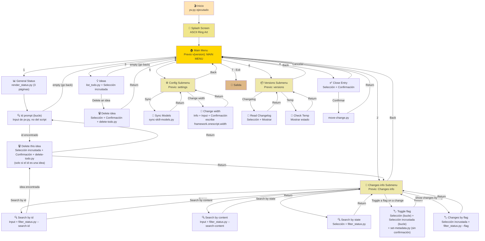
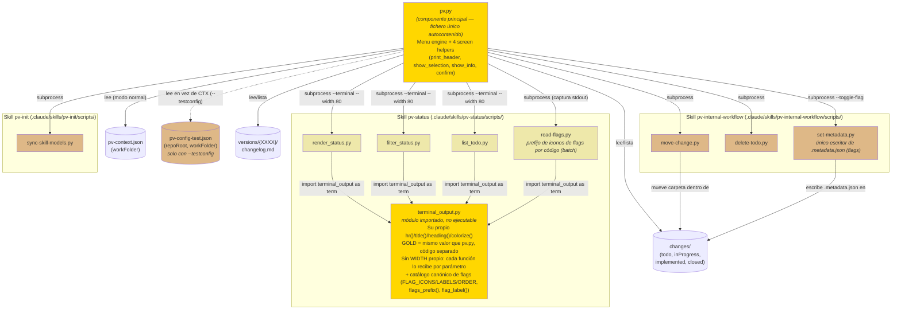

# pv.py Design Document

## Índice

- [Glosario](#glosario)
- [Propósito](#propósito)
- [Jerarquía de Pantallas](#jerarquía-de-pantallas)
- [Flujo de Navegación](#flujo-de-navegación)
- [Diagrama de Componentes](#diagrama-de-componentes)
- [Organización del Fichero](#organización-del-fichero)
- [Los Cuatro Helpers de Pantalla](#los-cuatro-helpers-de-pantalla)
- [Estilo por Tipo de Pantalla](#estilo-por-tipo-de-pantalla)
  - [La Ficha Detalle](#la-ficha-detalle)
- [Configuración de Línea de Comandos](#configuración-de-línea-de-comandos)
- [Cómo extender pv.py](#cómo-extender-pvpy)
  - [Guía para Extender pv.py](#guía-para-extender-pvpy)
  - [Errores Comunes al Extender](#errores-comunes-al-extender)
- [Dependencias Externas](#dependencias-externas)
- [Características de Accesibilidad](#características-de-accesibilidad)
- [Archivo de Configuración de Referencia](#archivo-de-configuración-de-referencia)

## Glosario

Términos y sus sinónimos, usados de forma consistente en este documento y en los comentarios del propio `pv.py`. Cuando el código o la conversación de desarrollo usa un sinónimo, es intercambiable con el término aquí listado — evita introducir un tercer nombre para el mismo concepto.

| Término | Sinónimos | Qué es |
|---|---|---|
| **Menú** (Main Menu / Submenú) | pantalla de menú | Pantalla GOLD generada por `run_menu()`/`print_header()` — una cabecera con título centrado, una lista numerada de opciones y un último ítem fijo (`Back`/`Exit`). Ver "Los Cuatro Helpers de Pantalla". |
| **Selección** | pantalla de selección | Pantalla DARK_GRAY generada por `show_selection()` — un título (opcional, ver "Selección incrustada") y una lista numerada framed por `hr("-")`, que devuelve el índice elegido. |
| **Selección incrustada** | *Inline Selection*, opciones incrustadas, menú incrustado (evitar — no es un `run_menu()`) | Un `show_selection()` con `title=""`, colocado **inmediatamente después** de un listado (propio o delegado) para ofrecer acciones sobre sus elementos, sin cabecera, sin línea en blanco de separación propia ni pausa propia — su `hr("-")` queda pegado justo debajo de la última línea del listado, continuando visualmente la misma pantalla lógica en vez de abrir una nueva. Ver `show_ideas_menu()` (tras un listado propio de `pv.py`) y `search_by_id()` (tras una ficha detalle delegada) en "Guía para Extender pv.py". No confundir con un submenú: no llama a `run_menu()`, no lleva `is_submenu = True`, y su "volver" es simplemente dejar el input vacío (`None`), no una opción numerada más. |
| **Confirmación** | pantalla y/N | `confirm()` — pregunta `y/N` sin cabecera propia, siempre anidada dentro de otra pantalla. |
| **Info** | pantalla de info | `show_info()` — texto ya formateado, `framed=True` (con reglas DARK_GRAY) o `framed=False` (suelto). |
| **Info delegada** | pantalla delegada, render externo | Cualquier pantalla que no usa los helpers de `pv.py`, sino que un script externo (`render_status.py`, `filter_status.py`, `list_todo.py`) imprime vía `run_script()`, coloreada con su propia paleta GOLD independiente (`terminal_output.py`). Ver "Diagrama de Componentes". |
| **Ficha Detalle** | ficha de detalle, tarjeta de detalle | El bloque de 3 o 5 líneas (según sea idea o cambio/fix) que `filter_status.py`'s `render_terminal()` imprime por cada entrada — parte de la Info delegada, nunca generado por `pv.py`. Ver "La Ficha Detalle". |
| **Los cuatro helpers** | screen helpers, helpers de pantalla | `print_header()`, `show_selection()`, `show_info()`, `confirm()` — las únicas cuatro formas válidas de construir una pantalla interactiva en `pv.py`. La Selección incrustada no es un quinto helper, es un patrón de uso del segundo; el listado agrupado + `show_selection(options_shown=True)` de `toggle_flag_on_change()` tampoco (mismo helper, el caller solo imprime la lista él mismo). |

---

## Propósito

`pv.py` es un script interactivo de línea de comandos que sirve como punto de entrada unificado para el framework `pv-*`. Permite a usuarios avanzados:
- Inspeccionar el estado general del proyecto y cambios en progreso
- Filtrar cambios por estado (todo, inProgress, implemented, etc.)
- Revisar ideas pendientes
- Cerrar entradas implementadas (mover de `changes/implemented/` a `changes/closed/`)
- Sincronizar configuración de skills
- Revisar versiones y sus changelogs

**Nota:** Este script se genera automáticamente desde `.claude/skills/pv-init/assets/pv.py` en cada instalación/actualización. No debe editarse manualmente en la raíz del repo. Es un **fichero único autocontenido** por diseño (no una carpeta de módulos) — así `pv-init` lo copia tal cual a `{raíz del repo}/pv.py` sin depender de una estructura de paquete.

---

## Jerarquía de Pantallas

```
NIVEL 0 (Splash)
└── RING_ART (ASCII + colores gradiente)

NIVEL 1 (Main Navigation)
└── "Previo v{version}: MAIN MENU" ({version} = metadata.version de pv-init/SKILL.md)
    ├── [1] Acción: Show Status (→ externo, 3 páginas; el prompt de id final es de pv.py, no del script)
    │   └── Input: id de búsqueda, en bucle hasta vacío (→ show_id_detail_card(), misma ficha y Selección incrustada que "Search by id")
    ├── [2] Submenu: Changes info
    │   └── "Previo: Changes info"
    │       ├── [1] Acción: Search by id
    │       │   └── Input: id de búsqueda (→ externo, todos los estados, sin leer description.md salvo del match)
    │       │       └── Selección incrustada: sin título (solo si el id resuelve a una idea de todo/, "empty" = volver)
    │       │           └── Acción: Delete this idea
    │       │               └── Confirmation: "Confirm deleting..."
    │       ├── [2] Acción: Search by content
    │       │   └── Input: texto de búsqueda (→ externo, todos los estados, lee description.md de cada entrada)
    │       ├── [3] Acción: Search by state
    │       │   └── Selection: "Available states:" (→ externo, un estado)
    │       ├── [4] Acción: Toggle a flag on a change (muta estado, sin confirmación — toggle reversible)
    │       │   └── Listado "Pick a change:" agrupado por estado (🟢/🟠/🟡, como "General project status"; sin closed/) + Selección incrustada (options_shown=True); bucle; iconos de flags vía read-flags.py
    │       │       └── Selección incrustada: sin título ([x]/[ ] por flag, bucle)
    │       │           └── (elegir una) → set-metadata.py --toggle-flag → se re-muestra la lista actualizada
    │       ├── [5] Acción: Show changes by flag
    │       │   └── Selección incrustada: sin título (Priority / Work in progress) (→ externo, filter_status.py --flag)
    │       └── [6] Back
    ├── [3] Acción: Show Ideas (→ externo)
    │   └── Selección incrustada: sin título (una sola opción, "empty" = volver)
    │       └── Acción: Delete an idea by code
    │           └── Selection: "Ideas in todo/:"
    │               └── Info: ficha de la idea elegida
    │                   └── Confirmation: "Confirm deleting..."
    ├── [4] Acción: Close Entry
    │   └── Selection: "Implemented entries..."
    │       └── Confirmation: "Confirm moving..."
    ├── [5] Submenu: Configuration
    │   └── "Previo: settings"
    │       ├── [1] Acción: Sync Models (→ externo)
    │       ├── [2] Acción: Change max character width
    │       │   └── Info (ancho actual) + Input (nuevo ancho, vacío = mantener)
    │       │       └── Confirmation: "Set max character width to N..." → escribe framework.onescript.width
    │       └── [3] Back
    ├── [6] Submenu: Versions
    │   └── "Previo: versions"
    │       ├── [1] Acción: Changelog
    │       │   └── Selection: "Available versions:"
    │       │       └── Info: Mostrar changelog.md
    │       ├── [2] Acción: Check Temp
    │       │   └── Info: Estado del directorio temp
    │       └── [3] Back
    └── [7] Exit
```

---

## Flujo de Navegación



---

## Diagrama de Componentes

`pv.py` es un fichero único y autocontenido (no importa nada de ningún otro módulo Python) — pero **varias de sus opciones de menú** delegan su render completo en un script externo, ejecutado como subproceso vía `run_script()`. Esos scripts, a su vez, importan un módulo compartido de la skill `pv-status` que dibuja su propia cabecera con un color/estilo independiente del de `pv.py`. Este diagrama muestra esa frontera con claridad, porque es la fuente de confusión más probable al depurar un problema visual: **"¿el bug está en `pv.py` o en otro componente?"**



**Lectura clave del diagrama:**
- `pv.py` **nunca importa** nada — toda comunicación con los otros componentes es vía `subprocess.run()` (función `run_script()`), es decir, procesos hijo independientes que imprimen a stdout. `pv.py` no puede interceptar ni reformatear esa salida.
- `terminal_output.py` (resaltado en dorado, igual que `pv.py`) es el **único otro componente que dibuja pantallas con color** — y lo hace con su propio código, no reutilizando ninguna función de `pv.py`. Si una pantalla de "PROJECT STATUS" o "IDEAS IN TODO/" se ve mal, el fix está en `terminal_output.py`, nunca en `pv.py` (ver el comentario en el propio código de `pv.py`, justo antes de `show_general_status()`).
- `move-change.py`, `delete-todo.py`, `set-metadata.py` y `sync-skill-models.py` son mutaciones simples de un solo paso, sin render propio — su salida es texto plano sin ANSI (`delete-todo.py` no imprime nada en éxito; `set-metadata.py` imprime una línea de confirmación).
- **`set-metadata.py` es el único escritor de `.metadata.json`** — el fichero de estado mutable por cambio donde viven las *flags* (`priority` ⭐, `workinprogress` ⚙️). `pv.py` **nunca** lo escribe directamente: "Toggle a flag on a change" delega el toggle en `set-metadata.py --xxxx <code> --state <state> --toggle-flag <value>`. **Sin `confirm()`** — a diferencia de "Close entry" (irreversible), un toggle de flag se deshace con la misma acción, así que se aplica al instante; el propio `set-metadata.py` imprime una línea de confirmación de lo que hizo, y tras cada toggle se re-muestra la lista de flags con el cambio reflejado. Contrasta con `framework.onescript.width` (escalar único en `pv-context.json` que `pv.py` sí escribe): `.metadata.json` tiene un script dueño en `pv-internal-workflow`.
- **`read-flags.py` es de solo lectura** y `pv.py` **captura su stdout** (no lo deja imprimir en pantalla, a diferencia de los otros scripts de `pv-status`): devuelve una línea por código con el prefijo de iconos de flags ya renderizado (`⭐ ⚙️  `, o `[P] [W]  ` sin color), o línea vacía si ese cambio no tiene flags. Acepta **varios `--xxxx` en una sola invocación** (batch de entrada — 1 subproceso, no N; el arranque de Python en Windows es lento). Como `pv.py` captura su stdout (una tubería, nunca un tty), el `isatty()` propio de `read-flags.py` siempre diría "sin color" — así que **`pv.py` le pasa `--color` / `--no-color`** según el color del propio terminal de `pv.py`. `list_implemented_entries()` lo llama una vez con `--state implemented`; "Toggle a flag" agrupa la lista por estado (`flag_prefixes_by_state()`) porque un mismo código puede existir en dos estados (un `fast` en `implemented` y su copia en `closed`) y un código ambiguo sin `--state` resuelve a prefijo vacío. El mapa flag→icono/label vive **solo** en `terminal_output.py` (skill `pv-status`); `pv.py` no lo reutiliza por import (no importa nada) — de ahí el script de lectura. `pv.py` sí mantiene una copia **manual** del mapa enum→label humano (`FLAG_LABELS`) para sus propios `show_selection()` de flags.
- **Iconos de flags en las listas de cambios.** `render_status.py` y `filter_status.py` anteponen `flags_prefix(entry["flags"])` a cada fila/ficha, y su línea 1 de ficha sigue el orden `flags · code · [type] · (status) · Risk` (antes `(status) code [type] Risk`). En la tabla markdown de `/pv-status` (chat) las flags van como columna `Flags` inicial. En `pv.py`, los listados **propios** que muestran iconos son `list_implemented_entries()` ("Close an implemented entry") y el listado "Pick a change:" de `toggle_flag_on_change()` — todos vía `read-flags.py`. Ese listado "Pick a change:" además **replica la agrupación de "General project status"** (`render_status.py`'s `render_terminal_page_in_progress()`): 🟢 `implemented/*`, 🟠 `inProgress/*` con `plan.md`, 🟡 `inProgress/*` solo con `description.md`. `closed/*` queda **fuera del listado** — un cambio cerrado está congelado (ya incorporado a una entrega), así que no hay nada que re-priorizar ni marcar como en progreso; `list_flaggable_changes()` salta `closed/` (y `todo/`). `list_flaggable_changes()` devuelve las entradas ya ordenadas por grupo y luego por código; `_print_flaggable_listing()` imprime los encabezados de grupo (en GOLD) con numeración continua, y `show_selection(options_shown=True)` lee la elección sin re-imprimir. "Ideas in todo/" no muestra iconos: los `todo` nunca llevan flags.
- Ninguno de estos componentes se importa entre sí salvo `terminal_output.py` por los tres scripts de `pv-status` — son todos procesos independientes conectados solo por convención de argumentos (`--terminal`, `--xxxx`, etc.) y por las rutas del framework (`changes/`, `versions/`). En particular, `render_status.py` **ya no invoca** `filter_status.py` — solo imprime sus tres páginas y termina.
- **El prompt de id tras la página 3 de "Project status" es de `pv.py`, no de `render_status.py`.** Antes, `render_status.py` pedía el id y lo reenviaba como subproceso a `filter_status.py --search-id`, sin que `pv.py` interviniera. Ahora `render_status.py` solo imprime las tres páginas; el bucle de id vive en `show_general_status()` (`pv.py`), que llama a la misma `show_id_detail_card()` que usa `search_by_id()` — así ambas rutas producen exactamente la misma pantalla, incluida la Selección incrustada "Delete this idea" cuando aplica. El cambio de dueño existió precisamente porque un script `pv-status` corriendo como subproceso hijo no tiene acceso a los helpers de `pv.py` ni puede invocar `delete-todo.py` con el contexto de menú correcto.
- **`terminal_output.py` no tiene un `WIDTH` propio fijo** — cada función (`hr()`, `title()`, `heading()`, `wrap()`) recibe `width` como parámetro explícito (`DEFAULT_WIDTH = 70` si el caller no opina). Quien decide el ancho es quien invoca, no el módulo: `pv.py` pasa `--width 80` (su propio `WIDTH`) a los tres scripts de `pv-status` vía `run_script()`, así las pantallas delegadas (status general, búsquedas, ficha detalle, listado de ideas) miden exactamente lo mismo que sus propias pantallas de menú/selección. La skill `pv-status` (invocada desde chat, sin `--terminal`) nunca pasa `--width` — no le aplica, solo genera markdown.
- `pv-config-test.json` (línea discontinua, solo activa con el flag `--testconfig` — ver "Configuración de Línea de Comandos") sustituye por completo a `pv-context.json`: su árbol de nodos **imita el de `pv-context.json`** para que el mismo código encuentre cada valor en la misma ruta — `workFolder` en `framework.workFolder`, los ajustes propios de `pv.py` en `framework.onescript.*` — más un `repoRoot` a nivel raíz (sin equivalente en `pv-context.json`: solo el harness lo necesita, para que `pv.py` localice los scripts reales de `.claude/skills/...` al ejecutarse como copia — `sandbox-test1/pv-test.py`— fuera de la raíz del repo). `pv.py` nunca lee ambos ficheros en la misma ejecución — es uno u otro, nunca una mezcla.

---

## Organización del Fichero

El fichero está dividido en bloques delimitados por comentarios `# ====...====`, en este orden fijo. Al añadir código, colócalo en el bloque que le corresponde — no lo intercales en otro solo porque quede cerca de donde se usa:

| Bloque | Contiene | Tocar cuando... |
|---|---|---|
| `Rendering primitives` | `WIDTH` (default), `MIN_WIDTH`, colores (`GOLD`/`DARK_GRAY`), `colorize()`, `hr()`, `wrap()`, `RING_ART` | Casi nunca — cambia el sistema de color/ancho global |
| `Screen-type helpers` | `print_header()`, `show_selection()`, `show_info()`, `confirm()` | Casi nunca — cambia el comportamiento de un tipo de pantalla en **todas** las opciones a la vez |
| `Framework paths and shared lookups` | `work_root()`, `load_onescript_width()`, `save_onescript_width()`, `changes_dir()`, `versions_dir()`, `framework_version()`, `run_script()`, `load_test_config()` — más los globales de módulo `CONTEXT_PATH` y `ACTIVE_CONFIG_PATH` (el fichero de config del que `pv.py` lee sus ajustes / al que los escribe: `CONTEXT_PATH` normalmente, el fichero de `--testconfig` en su defecto) | Al añadir una nueva ruta o subcarpeta del framework que varias opciones necesiten |
| `Actions -- root menu` | Funciones de acción del menú raíz | Al añadir una opción nueva a "Previo: MAIN MENU" |
| `Actions -- Configuration submenu` | Funciones de acción de "Previo: settings" (`sync_skill_models()`, `change_width()`) | Al añadir una opción nueva a Configuration |
| `Actions -- Versions submenu` | Funciones de acción de "Previo: versions" | Al añadir una opción nueva a Versions |
| `Actions -- Changes info submenu` | Funciones de acción de "Previo: Changes info" (`search_by_id()`, `search_by_content()`, `search_by_state()`, `list_states()`, `toggle_flag_on_change()`, `_toggle_flags_on()`, `_print_flaggable_listing()`, `show_changes_by_flag()`, `list_flaggable_changes()` (+ `_flaggable_group_of()`, `FLAG_GROUPS`), `read_change_flags()`, `flag_prefixes_for()`, `flag_prefixes_by_state()`, `_flag_label_with_icon()`) | Al añadir una opción nueva a Changes info |
| `Actions -- Ideas (root menu)` | Funciones de la opción raíz "Ideas in todo/" (`show_todo_ideas()`, `list_todo_entries()`, `find_todo_code()`, `delete_idea_by_code()`, `delete_idea()`, `show_ideas_menu()`) — también `show_id_detail_card()`, la ficha detalle de un id (con Selección incrustada si es idea), reutilizada por `search_by_id()` (Changes info) y `show_general_status()` (root menu) | Al añadir una opción nueva relacionada con ideas |
| `Root menu definition` | La lista `MENU` | Al registrar cualquier opción nueva del menú raíz (último paso siempre) |
| `Menu engine` | `run_menu()`, `main()` | Casi nunca — cambia el bucle de navegación para **todos** los menús a la vez |

Para un submenú nuevo (no Configuration ni Versions), añade un bloque `# Actions -- Mi Submenú Nuevo` siguiendo el mismo patrón, colocado antes de `Root menu definition`.

---

## Los Cuatro Helpers de Pantalla

Toda pantalla interactiva de `pv.py` se construye con una de estas cuatro funciones. No hay una quinta forma "manual" válida — si una opción nueva no encaja en ninguna, probablemente necesita descomponerse en varias llamadas a estos helpers.

### `print_header(title)`
Cabecera de menú: `hr("=", GOLD)` + título centrado en GOLD + `hr("=", GOLD)`. La usa internamente `run_menu()` — no se llama nunca directamente desde una función de acción.

### `show_selection(title, options, prompt, extra_option=None, options_shown=False) -> int | str | None`
Lista numerada enmarcada por `hr("-")` en DARK_GRAY. Recibe una lista de strings ya formateados para mostrar y devuelve:
- el **índice 0-based** en `options` de lo elegido, o
- la clave de `extra_option` en minúsculas (p.ej. `"a"`) si se usó la opción no numérica, o
- `None` si el usuario canceló (input vacío) o escribió algo inválido.

**Importante:** devuelve el índice, no el texto de la opción — así nunca hay ambigüedad si dos opciones muestran el mismo texto. El caller siempre debe comprobar `is None`, nunca `not resultado` (un índice `0` es un resultado válido y falsy en Python).

`extra_option` es una tupla `(key, label)` para una opción no numérica mezclada en la lista, como `("a", "Close all")` en `close_entry()`.

**`title=""` — Selección incrustada.** Omite la línea de título y también la línea en blanco que normalmente precede a `hr("-")`, dejando solo `hr("-")` + lista + `hr("-")` pegado justo debajo de lo anterior. Úsalo cuando la Selección va **inmediatamente después** de un listado que ya la contextualiza (propio o de Info delegada) — así la regla gris queda pegada a ese listado en vez de flotar separada con su propio título. Ver "Selección incrustada" en el Glosario y `show_ideas_menu()`/`search_by_id()` en "Guía para Extender pv.py" para ejemplos reales.

**`options_shown=True`.** El caller **ya ha impreso él mismo la lista numerada** (p.ej. un listado agrupado con encabezados que `show_selection()` no sabe renderizar) — así que `show_selection()` no vuelve a imprimir la lista plana: solo lee el input. La numeración del caller debe corresponder 1:1 al orden de `options`. Implica `title=""`. Único uso: `toggle_flag_on_change()`, cuyo listado "Pick a change:" va agrupado por estado como el de "General project status" (ver "Guía para Extender pv.py").

### `show_info(lines, framed=True) -> None`
Muestra líneas de texto ya formateadas. `framed=True` las enmarca con `hr("-")` en DARK_GRAY arriba y abajo (úsalo para contenido "de una pieza" como un changelog completo); `framed=False` las imprime sueltas (úsalo para un mensaje corto de una o dos frases, como un aviso de "no hay nada que mostrar").

### `confirm(question) -> bool`
Pregunta `y/N` sin cabecera propia — se anida siempre dentro de otra pantalla (normalmente tras un `show_selection()`). Devuelve `True` solo si la respuesta es `"y"` o `"yes"` (case-insensitive); cualquier otra cosa, incluido vacío, es `False`.

### `read_input(prompt) -> str`

Envoltorio de `input()` — no es uno de los cuatro tipos de pantalla, pero es el único punto por el que debe pasar cualquier `input()` que espere una respuesta real (no la pausa "Press Enter to return..."). Si el usuario escribe `"exit"` (case-insensitive, ignorando espacios), termina el programa entero al instante (`sys.exit(0)`), sin confirmar ni imprimir nada — funciona igual que elegir la opción numerada "Exit" del menú raíz, pero disponible desde **cualquier** pantalla que pida texto: el prompt de `run_menu()`, `show_selection()`, `confirm()`, o el `input()` libre de una acción como `search_by_id()`/`search_by_content()`.

Los tres helpers (`show_selection`, `confirm`) y `run_menu()` ya usan `read_input()` internamente — cualquier función de acción que necesite pedir texto libre directamente (fuera de esos tres) debe usar `read_input()` también, nunca `input()` a secas, para que "exit" siga funcionando ahí. La única excepción deliberada es la pausa `input("\nPress Enter to return to the menu...")` en `run_menu()`: esa pausa no pide una respuesta real, cualquier texto (incluido "exit") simplemente continúa.

### Lo que NO hay que hacer

- No llamar a `hr()` directamente desde una función de acción — solo los cuatro helpers y `run_menu()` lo hacen.
- No mezclar `hr("=", GOLD)` y `hr("-")` (DARK_GRAY) dentro de la misma pantalla lógica — cada pantalla usa un único color de principio a fin (ver "Estilo por Tipo de Pantalla").
- No comparar el resultado de `show_selection()` con `if not resultado` — usa `if resultado is None`.
- No llamar a `input()` directamente en una función de acción para pedir texto libre — usa `read_input()`, o "exit" dejará de funcionar en esa pantalla concreta (excepción: la pausa "Press Enter to return...", que sí usa `input()` a propósito).

---

## Estilo por Tipo de Pantalla

Regla general: **un color por pantalla completa**, nunca mezclado dentro del mismo bloque lógico. Dos niveles:

- **GOLD** = "estás navegando" → cabeceras de menú (`print_header()`, usado por `run_menu()`) y las pantallas de status delegadas en `terminal_output.py` (ver más abajo)
- **DARK_GRAY** = "estás viendo o eligiendo datos" → `show_selection()` y `show_info()` con `framed=True`

### Menú (Main Menu y Submenús) — vía `run_menu()` / `print_header()`

Todo en GOLD: la cabecera (arriba, título, abajo) y también el `hr("=", GOLD)` que cierra la lista de opciones antes del prompt "Choose an option:". El default de `hr()` es DARK_GRAY, así que cualquier llamada nueva a `hr()` dentro de `run_menu()` necesita `color=GOLD` explícito (ver "Errores Comunes al Extender", punto 1).

```
══════════════════════════════════════════════════════════════════   ← GOLD
                       Previo v0.9.5b7: MAIN MENU                      ← GOLD, centrado
══════════════════════════════════════════════════════════════════   ← GOLD
  1. General project status
  2. Changes info
  ...
  7. Exit
══════════════════════════════════════════════════════════════════   ← GOLD
Choose an option:
```

Un submenú usa exactamente el mismo patrón — cambia solo el texto de título y opciones.

### Selección — vía `show_selection()`

Todo en DARK_GRAY: las dos líneas `hr("-")` y el título sin colorear.

```
──────────────────────────────────────────────────────────────────   ← DARK_GRAY
Available states:                                                     ← sin color
  1. todo
  2. inProgress
  3. implemented
──────────────────────────────────────────────────────────────────   ← DARK_GRAY
Choose a state (number, or empty to cancel):
```

**Excepción: "Available states" (`search_by_state()`).** Es el único `show_selection()` cuyas opciones individuales llevan color propio, uno por estado — el marco (`hr("-")`, título) sigue siendo DARK_GRAY sin cambios, solo el texto de cada línea de la lista se tiñe según a qué estado pertenece:

| Estado | Color |
|---|---|
| `todo` | Azul (`STATE_BLUE`, `\033[38;5;75m`) |
| `inProgress` | Amarillo (`STATE_YELLOW`, `\033[38;5;220m`) |
| `implemented` | Verde (`STATE_GREEN`, `\033[38;5;114m`) |
| `closed` | Blanco (`STATE_WHITE`, `\033[38;5;255m`) |

`search_by_state()` construye la lista de etiquetas coloreadas (`colorize(state, STATE_COLORS[state])`) **antes** de pasarla a `show_selection()`, y mantiene por separado la lista `states` sin colorear para indexar el resultado — `show_selection()` en sí no sabe nada de colores por estado, solo recibe strings ya formateados (así es como está diseñado: "Recibe una lista de strings ya formateados para mostrar", ver más abajo). Si se añade un nuevo estado al framework, hay que añadir su entrada a `STATE_COLORS` o cae en el fallback DARK_GRAY (sin distinguir).

### Confirmación — vía `confirm()`

Sin cabecera ni color propio, continúa el bloque de la pantalla que la invocó:

```
Confirm moving '1001 — Add user authentication' to changes/closed/?
(y/N):
```

### Info — vía `show_info()`

`framed=True` usa DARK_GRAY igual que Selección; `framed=False` no lleva regla ninguna.

```
──────────────────────────────────────────────────────────────────   ← DARK_GRAY (framed=True)
# Changelog v1.2.0
- Added: nueva funcionalidad X
──────────────────────────────────────────────────────────────────   ← DARK_GRAY
```

```
changes/closed/temp/ isn't empty — the versioning process (pv-version)   ← framed=False,
has either failed or is currently in progress:                            sin regla
  - 1003
```

### Info delegada — `render_status.py` / `filter_status.py` / `list_todo.py`

Estas tres opciones no usan los helpers de `pv.py` — invocan un script externo con `run_script(..., "--terminal")`, y ese script controla su propio render usando el módulo hermano `.claude/skills/pv-status/scripts/terminal_output.py`. Ese módulo tiene su **propia** paleta (mismo valor GOLD, `\033[38;5;220m`) y su propio `hr()`/`title()`/`heading()`, independiente de `pv.py` — no comparten código, solo el valor de color. Todo el bloque que genera (título, separadores internos de tabla, subrayados de sección, línea de cierre) sale en GOLD uniforme, siguiendo la misma regla de "un color por pantalla completa".

**`render_status.py` — "Versions: N" antes de las barras.** La página 1 (`render_terminal_page_summary()`) muestra el número total de versiones (subcarpetas de `versions/`) justo debajo del título, antes de las barras por estado — es lo primero que ve el usuario tras la cabecera. `count_versions(changes_dir)` deriva `versions_dir` como `changes_dir.parent / "versions"` (hermano de `changes/` bajo el mismo `workFolder`) en vez de duplicar la resolución de `workFolder` que ya hace `collect_status.py` — `collect_status.py` solo conoce `changes_dir`, nunca `versions_dir`. El mismo dato (`versionsTotal`) también se añadió al modo markdown (`render()`/`STATUS.template.md`, campo `**Versions:** {versionsTotal}` justo antes de `## Summary`), así que `/pv-status` desde el chat lo muestra igual — ambos modos comparten `count_versions()`, ningún cálculo duplicado.

```
======================================================================
                            PROJECT STATUS                             ← GOLD (terminal_output.title)
                        Generated: 2026-08-19
======================================================================

Versions: 3                                                            ← sin color, primera línea tras la cabecera

💡 Todo         ████████████████████  2
🔧 In progress  ████████████████████  2
...
```

**"Ficha detalle" tras la página 3 — es `pv.py`, no `render_status.py`.** `render_status.py --terminal` solo imprime sus tres páginas y termina — no pide ningún id. El prompt en bucle (`Enter an id for its detail card, or press Enter to go back:`) vive en `pv.py`'s `show_general_status()`, justo después de invocar `render_status.py` vía `run_script()`. Este cambio de dueño (antes vivía dentro de `render_status.py`, invocando `filter_status.py --search-id` como subproceso anidado) existe para que este prompt pueda ofrecer la misma Selección incrustada de borrado que "Search by id" — algo que un script `pv-status` corriendo como subproceso hijo no podía hacer, al no tener acceso a los helpers de `pv.py` ni a `delete-todo.py`. Cada id introducido llama a la misma `show_id_detail_card(query)` que usa `search_by_id()` (ver "Guía para Extender pv.py"): muestra la ficha (`filter_status.py --search-id <id> --terminal`, incluido su mensaje de "no existe" si no matchea ningún estado) y, si el id resuelve a una idea de `todo/`, la Selección incrustada "Delete this idea" debajo. Tras eso, vuelve a preguntar — el bucle solo termina con un input vacío, que devuelve el control a `run_menu()` (pausa "Press Enter to return to the menu...").

Este prompt **no aparece en el modo markdown** (`render()`, usado por `/pv-status` desde el chat) — es exclusivo de `--terminal`, ya que `filter_status.py --search-id` es en sí mismo `--terminal`-only.

`filter_status.py` tiene **tres puntos de entrada** desde `pv.py`, todos dentro del submenú "Changes info": `search_by_state()` lo invoca con `<estado> --terminal` (el `show_filtered_status()` original, solo renombrado); `search_by_id()` lo invoca con `--search-id <texto> --terminal`; y `search_by_content()` lo invoca con `--search-content <texto> --terminal`. Las dos búsquedas se separaron deliberadamente en dos opciones de menú (y dos flags CLI distintos) en vez de una sola combinada — así cada una es tan rápida como el tipo de búsqueda que hace de verdad: `--search-id` recorre todos los estados comparando solo el nombre de carpeta (sin leer ningún `description.md` salvo el de la entrada que ya matcheó), mientras `--search-content` sí necesita leer el `description.md` de cada entrada para poder filtrar por contenido — no hay forma de evitarlo. Los tres modos comparten `render_terminal()` — el título cambia entre `PROJECT STATUS — {estado}` y `PROJECT STATUS — search: {texto}`, y en modo búsqueda (por id o por contenido) cada fila añade el estado de origen entre paréntesis antes del id (`(implemented)  1001  ...`), ya que los resultados cruzan estados.

**`--search-id` ignora el padding de ceros.** Los ids de `changes/{inProgress,implemented,closed}` son números con ceros a la izquierda (`00001`), pero los de `todo/` son códigos alfanuméricos cortos (`a3f9k`) que no lo son. `ids_match()` compara ambos lados como enteros cuando los dos son solo dígitos (así `1`, `01` y `00001` encuentran la misma entrada) y cae a comparación de string case-insensitive en cualquier otro caso (para no romper los ids alfanuméricos de `todo/`, ni matchear un id numérico con uno alfanumérico por casualidad).

```
══════════════════════════════════════════════════════════════════   ← GOLD (terminal_output.hr)
                      PROJECT STATUS — closed                         ← GOLD (terminal_output.title)
                       Generated: 2026-08-18
══════════════════════════════════════════════════════════════════   ← GOLD
```

### La Ficha Detalle

Es el nombre fijo (junto con "ficha de detalle") con el que nos referimos, en este documento y en la conversación de desarrollo, al bloque que `render_terminal()` (en `filter_status.py`) imprime por cada entrada — es el formato compartido por **las tres** rutas que llegan a `render_terminal()`: "Filter by state" (`<estado>`), "Search by id" (`--search-id`), "Search by content" (`--search-content`), y también el prompt de id al final de "Project status" (`pv.py`'s `show_general_status()`, que también delega en `filter_status.py --search-id` vía `show_id_detail_card()`). Las cuatro rutas producen exactamente el mismo bloque — no hay una quinta variante. Dos de esas cuatro rutas ("Search by id" y el prompt de "Project status", ambas controladas directamente por `pv.py` vía `show_id_detail_card()`) además ofrecen la misma Selección incrustada "Delete this idea" cuando el id resuelve a una idea de `todo/` — "Filter by state" y "Search by content" no la ofrecen, porque su resultado puede mezclar varias entradas y no hay un único id sobre el que actuar.

Sin color propio (hereda el GOLD del bloque que la contiene solo en el título/cierre de la pantalla, el cuerpo va sin colorear, igual que el resto de "Info delegada"). El formato es el mismo sea cual sea el modo — el `(estado)` de la línea 1 se muestra siempre, incluso en "Filter by state" donde el título de la pantalla ya lo indica (unificado a propósito para que la ficha se vea siempre igual, en vez de tener un formato ligeramente distinto según cómo se llegó a ella).

**Orden de la línea 1 (decisión 6.14 del plan de flags):** `flags · code · [type] · (status) · Risk`. Es decir: el prefijo de iconos de flags (`⭐ ⚙️  `, o `[P] [W]  ` bajo `NO_COLOR`; vacío si el cambio no tiene flags) va **primero**, luego el `code`, luego `[type]`, luego `(status)` (que se movió de la primera posición a después del `[type]`), y por último `Risk`. Antes era `(status)  code  [type]  Risk`. El motivo: con las flags delante, poner el `code` inmediatamente después deja la columna de códigos casi alineada entre entradas (los iconos son el único prefijo variable), y agrupa `(status)`/`Risk` como metadatos al final. Este orden aplica a **todas** las fichas de `filter_status.py` (`--state`, `--search-id`, `--search-content`, `--flag`) y también a los bloques de detalle de `render_status.py`. **Es el único punto no-aditivo del plan de flags** — cambia el formato para usuarios que no usan flags. Nadie parsea esa línea programáticamente (`pv.py` delega el render entero), pero cualquier snapshot/golden-file de tests de `pv-status` que capture la línea 1 hay que regenerarlo.

Hay **dos variantes de contenido, con distinto número de líneas** — 5 líneas para cambio/fix, 3 para idea (`todo/`, sin `Risk`, sin conteo de ficheros adicionales, ni descripción separada, ver más abajo por qué):

#### Ficha de un cambio/fix (`inProgress`/`implemented`/`closed`)

```
⭐⚙️  1001  [🆕 Change]  (implemented)  Risk: 6/10  ← Línea 1: flags, id, tipo, (estado), riesgo — sin fecha aquí
created: 2026-08-01, planned: 2026-08-03      ← Línea 2: created = description.md, planned = plan.md ("pending" si no existe)
> Add user authentication                     ← Línea 3: nombre (description.md, campo **Name**), prefijo "> "
  Lets users sign in with email and           ← Línea 4: primeros 500 caracteres de la
  password, backed by a new sessions table…      descripción (## Full description), con "…" si se trunca
extra files: 2                                ← Línea 5: nº de ficheros no-framework directamente en la carpeta del cambio
```

(El prefijo de flags va vacío si el cambio no tiene ninguna, así que una ficha sin flags se ve `1001  [🆕 Change]  (implemented)  Risk: 6/10` — mismo orden, sin el hueco de iconos.)

- **`created`** (línea 2): `description.md`'s campo `**Creation date**` (bold inline); si no existe, cae al mtime de `description.md`.
- **`planned`** (línea 2): `plan.md`'s campo `**Creation date**` (mismo formato bold-inline, ver `PLAN.template.md`) — es la fecha en que `pv-how` escribió el plan, no la de creación del cambio. Si `plan.md` no existe todavía, o existe pero le falta ese campo, se muestra literalmente **`pending`** (no un guion ni "unknown" — indica explícitamente que la planificación aún no ha ocurrido). `build_entry()` calcula esto reutilizando `extract_date()` sobre el texto de `plan.md`, sin un patrón nuevo — el campo tiene exactamente el mismo formato en ambos ficheros.
- **`Risk`** (línea 1): `plan.md`'s campo `**Risk**`, formato `{valor}/10` — `?` si no hay `plan.md` o el campo no tiene ese formato exacto.
- La línea 4 usa **su propio límite de 500 caracteres** (`TERMINAL_DESCRIPTION_MAX_CHARS`), distinto e independiente de los 250 caracteres que usa la tabla markdown de `/pv-status` (chat) — cambiar uno no afecta al otro; son dos rutas de render separadas dentro de `filter_status.py` (`render_terminal()` vs `render_report()`), y solo el modo terminal muestra la ficha detalle en absoluto (la tabla markdown no tiene columnas Name/Planned/extra files).
- **`extra files`** (línea 5): nº de ficheros directamente dentro de la carpeta del cambio que no son del framework (`description.md`, `plan.md`, `history.md`) — p.ej. mockups `design_*.html`/`design_*.txt`, o cualquier otro fichero que acumule la carpeta. Se calcula con `count_extra_files()` contra el conjunto `TERMINAL_FRAMEWORK_FILES`; `0` si no hay ninguno.

#### Ficha de una idea (`todo/`)

Formato distinto y más corto que el de cambio/fix — **3 líneas, no 5**: sin `Risk` ni conteo de ficheros adicionales (`todo/` nunca tiene `plan.md`, y sus entradas solo tienen `description.md` — ambos siempre habrían sido `?`/`0`, ruido no información) y sin línea de descripción separada (el texto de `## Idea` ya hace de nombre, no hay nada más que mostrar debajo).

```
a3f9k  [💡 Todo]  (todo)                       ← Línea 1: id, tipo, (estado) — sin flags (todo/ nunca lleva), sin Risk
created: 2026-08-15                            ← Línea 2: solo created — sin "planned" (todo/ no tiene plan.md)
> Modo oscuro                                 ← Línea 3: el texto de ## Idea (ver más abajo), prefijo "> "
```

`description.md` en `todo/` no sigue el formato `**Name**:`/`**Type**:`/`## Full description` de `pv-new`/`pv-fix` — usa encabezados markdown propios de `pv-todo` (`## Idea`, `## Creation date`, `## Notes`), sin separación entre "nombre" y "descripción". `build_entry()` detecta `state == "todo"` y usa `parse_todo_description()` (reutilizada de `collect_status.py`, la misma que usa `list_todo.py`) para extraer el texto de `## Idea` como línea 3 (nombre) — no hay línea 4, `render_terminal()` corta ahí para esta variante (`continue` tras la línea 3, antes del bloque que añade la línea de descripción). El `created` de la línea 2 también usa su propio patrón (`## Creation date`, heading) en vez de `**Creation date**` (bold inline) — `TODO_DATE_RE`, distinto de `DATE_RE`.

**Si tocas `terminal_output.py`:** su `hr()` ya es GOLD por defecto (a diferencia del `hr()` de `pv.py`, que es DARK_GRAY por defecto) — cualquier llamada nueva a `term.hr(...)` en `render_status.py`/`filter_status.py`/`list_todo.py` sale dorada sin tener que pasarle color, así que no hace falta (ni existe) un parámetro de color ahí.

### Resumen

| Elemento | Menú (`pv.py`) | Selección | Confirmación | Info: framed=True | Info: framed=False | Info: status delegado |
|---|---|---|---|---|---|---|
| Carácter de regla | `=` | `-` | ninguno | `-` | ninguno | `=` |
| Color de la regla | GOLD | DARK_GRAY | — | DARK_GRAY | — | GOLD |
| Helper responsable | `print_header()` / `run_menu()` | `show_selection()` | `confirm()` | `show_info(framed=True)` | `show_info(framed=False)` | `terminal_output.title()`/`hr()` |

---

## Configuración de Línea de Comandos

```bash
python3 pv.py
```

Sin argumentos, en el uso normal. Lee configuración de:
- `pv-context.json` para `workFolder`
- `framework.onescript.width` de `pv-context.json` para su propio `WIDTH` (default 80 si falta o está mal formado)
- Verifica existencia de directorio framework

**`pv.py` escribe `pv-context.json`** — el único sitio donde lo hace — a través de la opción "Configuration > Change max character width". Es un read-modify-write mínimo (`json.load` → fija `framework.onescript.width` → `json.dump(indent=2)`) que preserva todos los demás campos y el orden de claves, creando los objetos `framework`/`onescript` si faltan, siempre tras un `confirm()`. El valor escrito es un entero `>= 40` (input vacío mantiene el actual; por debajo de 40 se rechaza sin escribir — bajo ese umbral el splash de arte ASCII y las fichas detalle se rompen). `framework.onescript.width` es un campo opcional en `schema.json`; `pv-init` nunca pregunta por él, y su ausencia solo significa que `pv.py` usa el default interno.

### `--testconfig` — solo para probar `pv.py`, no para uso normal

```bash
python3 sandbox-test1/pv-test.py --testconfig
```

Flag exclusivo del test harness del propio framework (`pv-test.py`, una copia idéntica de `pv.py` sin lógica propia, colocada junto a su `pv-config-test.json` por comodidad — `sandbox-test1/` en este repo). **No recibe ningún argumento** — asume que hay un fichero llamado `pv-config-test.json` en la misma carpeta que el script que se está ejecutando (`Path(__file__).resolve().parent`), y sale con error si no existe ahí. Cuando se pasa, `pv.py` **no lee** `.claude/pv-context.json` en absoluto — en su lugar lee ese `pv-config-test.json`, cuyo **árbol de nodos imita el de `pv-context.json`** para que el mismo código encuentre cada valor en la misma ruta:

```json
{
  "repoRoot": "..",
  "framework": {
    "workFolder": "/sandbox-test1/previo-sdd",
    "onescript": { "width": 80 }
  }
}
```

- `repoRoot` (**obligatorio, nivel raíz**): ruta a la raíz real del repo (donde vive `.claude/skills/...`), **resuelta relativa a la ubicación del propio fichero de config** (que a su vez está siempre junto al script), no al directorio desde el que se invoca. Necesaria porque `pv.py` sigue invocando los scripts reales del framework (`filter_status.py`, `render_status.py`, etc.) — nunca copias — así que necesita saber dónde están. Se queda a nivel raíz porque **no tiene equivalente en `pv-context.json`** — es metadato exclusivo del harness (el script real, en la raíz del repo, deriva su raíz de `__file__`).
- `framework.workFolder` (**obligatorio**): el `workFolder` de prueba, en la **misma ruta que usa `pv-context.json`** (`framework.workFolder`), para que la resolución tipo `work_root()` no necesite un caso especial de modo test. Apunta a datos de fixture desechables (p.ej. `/sandbox-test1/previo-sdd`) para no tocar los datos reales del proyecto.
- `framework.onescript.width` (**opcional**): el ajuste persistido propio de `pv.py`, leído de — y escrito por "Change max character width" en — este fichero, en la **misma ruta anidada** que usaría en `pv-context.json`. `ACTIVE_CONFIG_PATH` (fijado en `main()`) solo apunta `load_onescript_width()`/`save_onescript_width()` al fichero que esté activo; tampoco hay rama de modo test ahí. Ausente → `pv.py` usa su default interno (80).

`run_script()` reenvía `framework.workFolder` como `--work-folder <valor>` a los scripts que soportan ese override (`SCRIPTS_ACCEPTING_WORK_FOLDER`: `filter_status.py`, `render_status.py`, `list_todo.py`, `read-flags.py`, `move-change.py`, `set-metadata.py`, `delete-todo.py`) — `sync-skill-models.py` queda excluido porque no toca `changes/`/`workFolder` en absoluto y no tiene ese flag. `read-flags.py` va además en `SCRIPTS_ACCEPTING_WIDTH` (acepta `--width` por simetría con los otros scripts de `pv-status`, aunque lo ignora: un prefijo de iconos no tiene columna que ajustar). `set-metadata.py` **no** recibe `--width` (no imprime pantallas, solo una línea de confirmación). Aparte del reenvío genérico de `run_script()`, `flag_prefixes_for()` añade a mano `--color` o `--no-color` a la llamada a `read-flags.py` (según `supports_color()` de `pv.py`) — `run_script()` no infiere color, y `read-flags.py` capturado no puede detectarlo por sí mismo.

Si `pv-config-test.json` no existe junto al script, tiene JSON inválido, o le falta `repoRoot` / `framework.workFolder`, `pv.py` termina con un mensaje de error claro (`sys.exit`, sin traceback) — nunca sigue adelante con un valor por defecto silencioso. Un `framework.onescript.width` ausente **no** es un error (es opcional).

---

## Cómo extender pv.py

### Guía para Extender pv.py

Esta sección es la referencia rápida para añadir opciones nuevas sin romper la consistencia visual. Sigue estos pasos en orden.

#### Añadir una opción de solo lectura al menú raíz

1. Escribe una función `def show_mi_opcion() -> None:` en la sección `# Actions -- root menu` (o crea una nueva sección `# Actions -- ...` si agrupa varias opciones nuevas relacionadas).
2. Dentro, usa **uno de los cuatro helpers** (`show_selection`, `show_info`, `confirm`, o `run_script` si delega en un script externo) — nunca llames a `hr()`/`print()`/`colorize()` sueltos directamente en una función de acción.
3. Añade `("Etiqueta visible", show_mi_opcion)` a la lista `MENU` cerca del final del fichero.
4. No marques `is_submenu` — solo los `show_*_menu()` que llaman a `run_menu()` lo llevan.

#### Añadir un submenú nuevo

1. Copia el patrón de `show_settings_menu()` o `show_versions_menu()`: una función que llama a `run_menu(title, items, "Back")`.
2. Justo debajo, añade `mi_submenu.is_submenu = True` — sin esta línea, el menú padre inyectará una pausa doble "Press Enter..." (una del submenú al salir, otra del padre al recibirlo como si fuera una acción hoja).
3. Escribe las acciones del submenú como funciones normales (paso anterior) en su propia sección `# Actions -- Mi Submenú`.
4. Añade `("Mi Submenú", show_mi_submenu)` a `MENU` (o al `items` de otro submenú, si es anidado más profundo).

#### Añadir una opción que muta estado (como "Close entry" o "Toggle a flag on a change")

1. Sigue el patrón de `close_entry()` / `toggle_flag_on_change()`: `show_selection()` para elegir el objetivo, seguido de `confirm()` **si la acción no es trivialmente reversible**. "Close entry" mueve una carpeta (destructivo desde la vista del usuario) → `confirm()`. "Toggle a flag" solo flipa un booleano en `.metadata.json` y la misma acción lo deshace → **sin `confirm()`**, se aplica al instante y se re-muestra la lista actualizada. La regla es: `confirm()` para lo que cuesta deshacer, no para todo lo que escribe.
2. Delega la mutación real en un script de la skill correspondiente vía `run_script()` — `pv.py` no debe escribir contenido de ficheros ni lógica de negocio, solo orquestar. Ver "Punto de extensión único" más abajo. Ejemplo: `toggle_flag_on_change()` delega **toda** escritura de `.metadata.json` en `set-metadata.py` (`pv-internal-workflow`); `pv.py` solo *lee* ese fichero (`read_change_flags()`) para pintar los `[x]`/`[ ]`, nunca lo escribe.
3. Si la acción es de aplicación repetida (togglear varias flags, cerrar varias entradas), envuélvela en un bucle que re-muestre el listado tras cada operación en vez de volver al menú — `toggle_flag_on_change()` tiene dos bucles anidados (elegir cambio → togglear flags), cada uno termina con input vacío.
4. Si el objetivo puede existir en más de un estado (`inProgress`/`implemented`/`closed`), resuelve **primero** el estado (parte del `show_selection()`) y pásalo explícito al script (`--state <state>`) — no dejes que el script adivine, porque un mismo código puede aparecer en dos estados (`fast` implementado y su copia en `closed`).
5. Si el listado de objetivos es largo o heterogéneo, agrúpalo con encabezados como hace `toggle_flag_on_change()` — que reusa la misma partición que "General project status" (🟢 `implemented/*`, 🟠 `inProgress/*` con `plan.md`, 🟡 `inProgress/*` sin `plan.md`; `closed/*` se deja fuera por congelado). `show_selection()` no sabe pintar encabezados de grupo: imprime el listado tú mismo (numeración continua) y llama a `show_selection(..., options_shown=True)` para que solo lea la elección. La numeración impresa debe corresponder 1:1 al orden de `options` — se consigue ordenando las entradas por (grupo, código) antes de ambas cosas. Los encabezados de grupo van en **GOLD** (excepción puntual a "un color por pantalla", igual que los colores por estado de `search_by_state()`) para separarlos de las filas de entrada en DARK_GRAY.

#### Punto de extensión único (límite de complejidad)

Cualquier opción nueva debe ser:
- **Puramente de lectura** (delega en un script `--terminal` existente o uno nuevo de solo lectura), o
- **Una mutación simple ya validada por su propio script** (como mover una carpeta, o togglear una flag), con `confirm()` explícito antes **si no es trivialmente reversible**.

Mutaciones más complejas (borrar, crear versiones, redactar contenido de ficheros) quedan **fuera del alcance de `pv.py`** — necesitan contexto que solo la skill correspondiente puede aportar vía Claude Code. No añadas esa lógica aquí aunque parezca conveniente.

**La única excepción de escritura de config.** "Change max character width" escribe `framework.onescript.width` en `pv-context.json` directamente desde `pv.py` (`save_onescript_width()`), sin script externo. Se permite a propósito porque es un único entero ya validado (rango comprobado en la acción, `confirm()` antes) escrito con un read-modify-write mínimo que no toca nada más — el mismo nivel de "mutación simple" que mover una carpeta. **No** es un precedente para que `pv.py` escriba nada más rico en `pv-context.json`: cualquier ajuste que no sea un único escalar con regla de validación obvia sigue siendo de `pv-init`/`pv-update`. Si algún día aparece un segundo ajuste propio de `pv.py`, va bajo el mismo objeto `framework.onescript.*`, leído/escrito por los mismos dos helpers.

### Errores Comunes al Extender

Puntos de fricción reales de este diseño — ten cuidado con ellos al añadir código nuevo.

1. **`hr()` no colorea por defecto en GOLD.** Su valor por defecto es DARK_GRAY; cualquier `hr()` nuevo dentro de `run_menu()`/`print_header()` (o de cualquier código que deba pertenecer al nivel "menú") necesita `color=GOLD` explícito, o la línea sale gris y mezcla dos niveles dentro de la misma pantalla.

2. **Comparar el resultado de `show_selection()` con `if not resultado`.** Como el helper devuelve un índice 0-based, elegir la primera opción (`índice 0`) es falsy en Python y se confundiría con una cancelación. Usa siempre `if resultado is None`.

3. **Usar el texto de una opción en vez de su índice para localizar el dato original.** Si dos opciones mostradas coinciden en texto (p.ej. dos entradas con el mismo `código — nombre`), buscar por texto devolvería la primera coincidencia en vez de la elegida. `show_selection()` evita esto de raíz devolviendo el índice, no el texto — úsalo siempre así.

4. **Añadir lógica de mutación de fichero directamente en `pv.py`.** Cualquier cambio que toque contenido (no solo mover una carpeta) pertenece a un script de la skill correspondiente, invocado vía `run_script()` — ver "Punto de extensión único".

5. **Tocar `terminal_output.py` sin recordar que es un módulo independiente.** Comparte el valor de color GOLD con `pv.py` pero no importa nada de él ni viceversa — un cambio de paleta en uno no se propaga automáticamente al otro.

---

## Dependencias Externas

### Scripts Ejecutados

| Script | Ubicación | Propósito |
|--------|-----------|-----------|
| `render_status.py` | `.claude/skills/pv-status/scripts/` | Mostrar estado general (3 páginas en `--terminal`). Ya no pide ningún id ni invoca `filter_status.py` — ese bucle vive en `pv.py`'s `show_general_status()`. Antepone el prefijo de iconos de flags a cada fila. Acepta `--width` |
| `list_todo.py` | `.claude/skills/pv-status/scripts/` | Listar ideas en todo/. Acepta `--width` |
| `filter_status.py` | `.claude/skills/pv-status/scripts/` | Filtrar cambios por estado (`<estado>`), buscar por id exacto en todos los estados (`--search-id <texto>`), buscar por contenido de `description.md` (`--search-content <texto>`), o listar cambios por flag en todos los estados (`--flag <name>`, repetible, semántica OR). Línea 1 de ficha en orden `flags · code · [type] · (status) · Risk`. Acepta `--width` |
| `read-flags.py` | `.claude/skills/pv-status/scripts/` | Devuelve el prefijo de iconos de flags ya renderizado, una línea por `--xxxx` (batch de entrada). `pv.py` **captura su stdout** y le pasa `--color` / `--no-color` (según el color del terminal de `pv.py`, ya que la tubería capturada nunca es un tty). Acepta `--work-folder`, `--state` y `--width` (este último ignorado) |
| `sync-skill-models.py` | `.claude/skills/pv-init/scripts/` | Sincronizar modelos de skills |
| `move-change.py` | `.claude/skills/pv-internal-workflow/scripts/` | Mover entrada a closed |
| `set-metadata.py` | `.claude/skills/pv-internal-workflow/scripts/` | Único escritor de `.metadata.json`. `pv.py` lo invoca con `--xxxx <code> --state <state> --toggle-flag <value>` para "Toggle a flag on a change" (sin `confirm()` previo — toggle reversible). Imprime una línea de confirmación. Acepta `--work-folder`; **no** `--width` |
| `delete-todo.py` | `.claude/skills/pv-internal-workflow/scripts/` | Borrar una carpeta de idea en `changes/todo/{xxxx}` |
| `terminal_output.py` | `.claude/skills/pv-status/scripts/` | Módulo de rendering compartido por los scripts de `pv-status` (no un script ejecutable, se importa). Sin `WIDTH` propio: cada función lo recibe por parámetro, `DEFAULT_WIDTH = 70` si el caller no opina. Contiene además el **catálogo canónico de flags** (`FLAG_ICONS`/`FLAG_ICONS_ASCII`/`FLAG_LABELS`/`FLAG_ORDER`, `flags_prefix()`, `flag_label()`) — el único sitio donde vive el mapa flag→icono/label |

### Archivos y Directorios

| Ruta | Propósito |
|------|-----------|
| `pv-context.json` | Configuración del framework. Leído para `workFolder` y `framework.onescript.width`. **También escrito** (el único fichero que `pv.py` escribe) por "Configuration > Change max character width" — ver "Configuración de Línea de Comandos" y la excepción de escritura de config en "Cómo extender". Bajo `--testconfig`, `pv-config-test.json` ocupa su lugar tanto para las lecturas como para esa escritura. |
| `pv-init/SKILL.md` | Leído (no ejecutado) por `framework_version()` para obtener la versión del propio framework `pv-*` (`metadata.version` de su frontmatter YAML), mostrada en el título del menú principal — distinta de la versión del proyecto bajo `versions/{XXXX}/` |
| `changes/` | Directorio de cambios (estados) |
| `changes/{state}/{xxxx}/.metadata.json` | Estado mutable por cambio (dotfile, opcional): `flags`. Leído por `read-flags.py` / `pv-status`; escrito solo por `set-metadata.py`. `pv.py` lo lee directamente en `read_change_flags()` (para los `[x]`/`[ ]` de "Toggle a flag"), pero nunca lo escribe |
| `changes/implemented/` | Cambios completados |
| `changes/closed/` | Cambios cerrados |
| `changes/closed/temp/` | Almacenamiento temporal durante versioning |
| `versions/` | Historial de versiones |
| `versions/{XXXX}/changelog.md` | Notas de cambio por versión |

---

## Características de Accesibilidad

- **Soporte Windows ANSI:** Activa ENABLE_VIRTUAL_TERMINAL_PROCESSING en Windows 11
- **Sin color:** Detecta variable de entorno `NO_COLOR` y desactiva colores
- **Responsivo a terminal:** Detecta `sys.stdout.isatty()` para colores
- **Ancho máximo:** 80 caracteres por defecto para legibilidad en terminales pequeñas; ajustable por el usuario (mínimo 40) y persistido vía "Configuration > Change max character width" (`framework.onescript.width` en `pv-context.json`), leído en cada arranque
- **Encodificación UTF-8:** Fuerza UTF-8 en salida de Python

---

## Archivo de Configuración de Referencia

```python
WIDTH = 80                      # Ancho máximo de líneas por defecto; main() lo
                               # sobrescribe al arrancar con framework.onescript.width si existe
MIN_WIDTH = 40                 # suelo de un ancho persistido (bajo eso el arte / fichas se rompen)
COLOR_RESET = "\033[0m"         # ANSI reset
GOLD = "\033[38;5;220m"         # Color dorado (menús, status delegado)
DARK_GRAY = "\033[38;5;238m"    # Color gris oscuro (selección, info framed)

# Solo para colorear cada opción de "Available states:" (search_by_state()) --
# excepción puntual a "un color por pantalla", ver "Selección — vía show_selection()".
STATE_BLUE = "\033[38;5;75m"    # todo
STATE_YELLOW = "\033[38;5;220m" # inProgress
STATE_GREEN = "\033[38;5;114m"  # implemented
STATE_WHITE = "\033[38;5;255m"  # closed

# Catálogo de flags -- copia MANUAL, sincronizada a mano con
# pv-status/scripts/terminal_output.py (FLAG_*) y
# pv-internal-workflow/metadata.schema.json (enum). pv.py no importa nada,
# así que solo lleva el mapa enum->label humano para sus propios
# show_selection(); los ICONOS de las listas los renderiza read-flags.py.
FLAG_VALUES = ["priority", "workinprogress"]   # orden canónico
FLAG_LABELS = {"priority": "Priority", "workinprogress": "Work in progress"}
FLAG_ICONS = {"priority": "⭐", "workinprogress": "⚙️"}
FLAG_ICONS_ASCII = {"priority": "[P]", "workinprogress": "[W]"}
```
