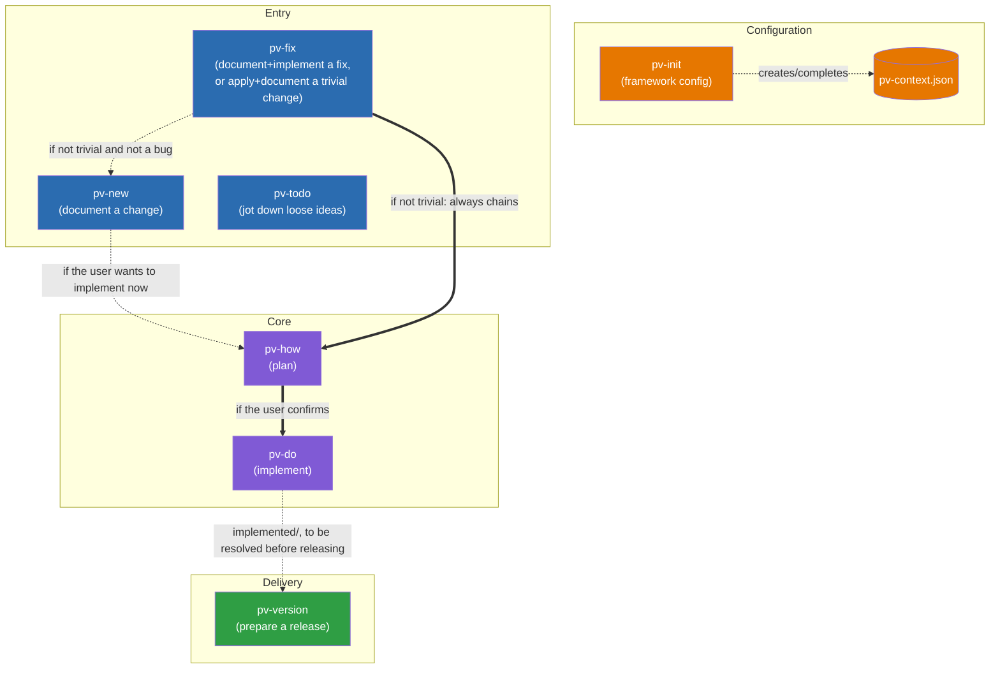
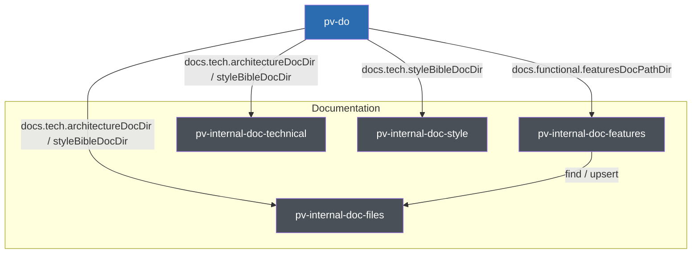

# Previo: Design documentation

Map of the skills that make up the `pv-*` framework and how they invoke each other.

## Table of contents

- [Relationship diagram](#relationship-diagram)
- [Responsibilities of each skill](#responsibilities-of-each-skill)
  - [User-invocable](#user-invocable)
  - [Internal and support](#internal-and-support)
    - [Analysis](#analysis)
    - [Documentation](#documentation)
- [The `pv-context.json` file](#the-pv-contextjson-file)
  - [skillModels](#skillmodels)
  - [framework](#framework)
- [The `pv.py` launcher](#the-pvpy-launcher)
- [Marker convention in templates](#marker-convention-in-templates)
- [Workflow diagrams](#workflow-diagrams)
- [Full folder and file structure](#full-folder-and-file-structure)

## Relationship diagram

Simplified diagram showing only the main flow visible to the user. The internal skills (`pv-internal-workflow`, `pv-internal-tech-analysis`, `pv-internal-tech-security`, `pv-internal-tech-mermaid`, `pv-internal-tech-risks`, `pv-internal-mockups-html`, `pv-internal-mockups-ascii`, `pv-internal-doc-files`, `pv-internal-doc-features`, `pv-internal-doc-technical`, `pv-internal-doc-style`, `pv-internal-changelog`) and the support skill (`pv-status`) don't appear here — their relationship to the rest is described in the responsibilities section below. The internal flow of `pv-version`/`pv-internal-changelog` (with guardrails and step-by-step detail) has its own diagram, not duplicated here: [`.claude/skills/pv-version/version-flow-diagram.template.md`](skills/pv-version/version-flow-diagram.template.md).

`pv-how` (plan) and `pv-do` (implement) are two separate skills: `pv-how` analyzes the technical solution and writes `plan.md`, and only if the user confirms they want to implement it right away does it chain into `pv-do`, which is the one that edits the code. You can also invoke `pv-do` directly on an entry that already has a `plan.md`, without going through `pv-how` again.



Legend:
- Solid arrows (`-->`, `==>`): direct skill-to-skill invocation within the same process.
- Dotted arrows (`-.->`): configuration dependency or conditional invocation.
- `pv-todo` has no arrow into the rest of the flow: it lives isolated in `{changesDir}/todo/`, unrelated to the other skills.
- `pv-fix` is the only "Entry" skill that can finish without going through `plan.md`: if the change (bug or not) truly qualifies as trivial, it creates the entry in `{changesDir}/inProgress/{xxxx}/` via `pv-internal-workflow` (normal `xxxx` numbering) and moves it to `implemented` in the same invocation, without generating `plan.md` or chaining `pv-how`/`pv-do`. It only falls through to `pv-new` when the analysis reveals it wasn't trivial and isn't a bug either (it affects architecture/style, information is missing, it touches more than 2 files, or it's new functionality).
- `pv-version` doesn't consume `pv-do`'s output directly: it only requires, as a starting guardrail, that `{changesDir}/implemented/` be empty (each resolved entry is moved to `closed` before continuing).
- Every skill reads `.claude/pv-context.json` to work, not just the ones shown here connected to it — that arrow is omitted for each one to avoid cluttering the diagram; `pv-init` is the only one that writes it.

## Responsibilities of each skill

### User-invocable

- **pv-init** — Initializes the framework: creates/completes `.claude/pv-context.json` (`framework.workFolder` — fixed at `/previo-sdd`, never asked about, the root relative to the repo under which the framework manages `changes/`, `versions/`, and `stuff/`, fixed-name subfolders that the skills create on their own —, docs to sync, and language configuration) and checks that the required command-line tools are installed. On a first `pv-init`, it always asks for the interaction language (`framework.interaction.language`) and, with a yes/no question, whether the rest of the areas (`changes`, `versions`, `docs.functional`, `docs.tech`) share that same language or are configured one by one; it records the reasoning behind each choice in `framework._comments`. If the project was already initialized without a configured language (`hasLanguage: false`), it adds that question to the same round that completes the rest of the pending optional fields, without asking again about anything already resolved. It's the single point of configuration all other skills depend on. *Uses:* no other skill.

  Assets and scripts:
  - [`workflow.init.md`](skills/pv-init/workflow.init.md) — Mermaid diagram of this skill's full flow (see "Workflow diagrams" above); read before running any step, source of truth for sequence and branches.
  - [`assets/pv.py`](skills/pv-init/assets/pv.py) — master copy of the `pv.py` launcher; `scaffold-project.py` copies it (always overwriting) to the repo root on every `pv-init` run.
  - [`schema.json`](skills/pv-init/schema.json) — the complete JSON Schema for `.claude/pv-context.json` (`additionalProperties: false` at every level); the normative reference for which fields exist and their default values.
  - [`scripts/check-context.py`](skills/pv-init/scripts/check-context.py) — checks whether `pv-context.json` exists and is complete (whether the `framework` section is present, whether it has `interaction.language`), so `pv-init` can decide whether the full questionnaire is needed, only the missing parts, or nothing at all.
  - [`scripts/collect-skill-models.py`](skills/pv-init/scripts/collect-skill-models.py) — reads the actual `model`/`effort` frontmatter from every `pv-*` `SKILL.md` and proposes a `skillModels` section (`default` + `overrides`) that mirrors it, so `pv-init` can write it into `pv-context.json` even if the user doesn't customize anything.
  - [`scripts/scaffold-project.py`](skills/pv-init/scripts/scaffold-project.py) — creates the base folder structure (`changes/{inProgress,implemented,todo,closed}`, `versions/`, `stuff/`) and any missing `docs.tech.*`/`docs.functional.featuresDocPathDir` placeholders, and overwrites `pv.py` at the repo root with the copy from `assets/pv.py`.
  - [`scripts/sync-skill-models.py`](skills/pv-init/scripts/sync-skill-models.py) — propagates `pv-context.json#skillModels` (`default`/`overrides`) to the real frontmatter (`model:`/`effort:`) of every `pv-*` `SKILL.md`, bumping the patch of `metadata.version` if anything changed; this is the only step that makes `skillModels` actually take effect, since the harness only reads the frontmatter.

- **pv-new** — Documents an intentional change (new functionality or a deliberate behavior change, not a bug). It invokes `pv-internal-tech-analysis` to gather technical context before anticipating typical functional questions, generates `description.md` via `pv-internal-workflow`, and, where applicable, functional Mermaid diagrams per use case (via `pv-internal-tech-mermaid`) and visual mockups `design_*.html` (via `pv-internal-mockups-html`, or whatever alternative is configured in `framework.skills.mockups`), validating both with the user before considering the change documented. It doesn't implement anything itself, but if the user wants to implement right away, it can invoke `pv-how` directly on the newly created entry. *Uses:* `pv-internal-workflow`, `pv-internal-tech-analysis`, `pv-internal-tech-mermaid`, `pv-internal-mockups-html`, `pv-how`.

  Assets and scripts:
  - [`extend-entry.md`](skills/pv-new/extend-entry.md) — full procedure for when the given `xxxx` already exists in `inProgress`: instead of creating a new entry, it extends the existing one, updating `description.md`/`history.md` directly (without going through `pv-internal-workflow`, which only knows how to create entries), regenerating diagrams/mockups/data if the extension touches them, and warning if a `plan.md` already existed and would now be out of date.
  - [`todo-mode.md`](skills/pv-new/todo-mode.md) — procedure for `/pv-new todo <code>`: takes an idea already jotted down in `{changesDir}/todo/{code}/` as if it were the user's request, offers to refine it before documenting, and automatically deletes the `todo/` folder as soon as the new `inProgress` entry exists.

- **pv-fix** — Documents a bug and implements it end to end, and is also the framework's fast path for changes so small they barely need any analysis (a typo, some text, a value/constant, an isolated style tweak, whether or not it's a bug). It first invokes `pv-internal-tech-analysis` to assess whether the request is `fast` (unambiguous, ≤2 files, doesn't affect `docs.tech.architectureDocDir`/`docs.tech.styleBibleDocDir` and has no detected inconsistencies with them, and introduces no new behavior). If it's `fast`, it creates the entry via `pv-internal-workflow` (`action=create`, `type=fast`), applies the change directly, and moves it to `implemented` (`action=move`) in the same invocation, without a `plan.md`. If it's not `fast` and is a bug, it generates `description.md` via `pv-internal-workflow` (`type=fix`), invoking `pv-internal-tech-mermaid`/`pv-internal-mockups-html` when the fix has a flow or visual component to represent, and automatically chains into `pv-how` to fix it end to end, with the analysis strictly scoped to the root cause (no scope creep). If it's not `fast` and not a bug, it tells the user and invokes `pv-new` with their request. *Uses:* `pv-internal-workflow`, `pv-internal-tech-analysis`, `pv-internal-tech-mermaid`, `pv-internal-mockups-html`, `pv-new`, `pv-how`.

  Assets and scripts: none of its own — it reuses `pv-new`'s `extend-entry.md` when the given `xxxx` already exists in `inProgress`.

- **pv-how** — Takes an entry already documented in `inProgress`, invokes `pv-internal-tech-analysis` to gather technical context, analyzes the technical solution, and writes `plan.md` (using `pv-internal-tech-mermaid`/`pv-internal-mockups-html` when what needs describing is a flow or requires a visual mockup). Once `plan.md` is written, it invokes `pv-internal-tech-risks` to assess the risk of breaking something during implementation and writes the returned median in the plan's header (the detail of all 9 factors is added only if the user asks for it). If the user confirms they want to implement now, it chains directly into `pv-do` on the same entry. *Uses:* `pv-internal-tech-analysis`, `pv-internal-tech-mermaid`, `pv-internal-mockups-html`, `pv-internal-tech-risks`, `pv-do`.

  Assets and scripts:
  - [`PLAN.template.md`](skills/pv-how/PLAN.template.md) — template for `plan.md`: header (date, risk), functional notes (out of scope, resolved questions), a checklist-style technical solution, architecture/style changes (optional), a checklist-style verification section, and risk detail (only if the user asks for it), with the table explaining what each 0–10 median value means.
  - [`scripts/get-max-change-codes.py`](skills/pv-how/scripts/get-max-change-codes.py) — returns the highest existing `xxxx` in each state (`inProgress`/`implemented`/`closed`) of `changes/`; `pv-how` uses it as a pre-check to detect whether the entry being planned is older than another one created since, and should therefore be re-analyzed before planning.

- **pv-do** — Takes an `inProgress` entry whose `plan.md` is already written (by `pv-how`, or invoked directly by the user), implements the code, updates the synced documentation (`docs.tech.architectureDocDir`/`docs.functional.featuresDocPathDir`/`docs.tech.styleBibleDocDir` — including any inconsistency `pv-internal-tech-analysis` reported via `pv-how`), and moves the folder to `implemented` via `pv-internal-workflow`. If `docs.functional.featuresDocPathDir` is a folder, it delegates to `pv-internal-doc-features` both reading/writing it and deciding what content the entry holds and how to write it (`pv-do` only supplies a summary and context). Before writing or editing content in `docs.tech.architectureDocDir`/`styleBibleDocDir`, it invokes `pv-internal-doc-technical` to load its writing style (meant to be read by an AI, not a person) and applies it when writing; for `styleBibleDocDir` specifically, it also invokes `pv-internal-doc-style` to get the applicable style categories and their own writing rules. *Uses:* `pv-internal-workflow`, `pv-internal-doc-features`, `pv-internal-doc-technical`, `pv-internal-doc-style`.

  Assets and scripts:
  - [`FEATURES.template.md`](skills/pv-do/FEATURES.template.md) — entry template for `docs.functional.featuresDocPathDir` when that field is a single `.md` file (projects not yet migrated to a folder): functional area, name, description, optional functional Mermaid diagram, where it's used, and associated `xxxx` code(s).

- **pv-status** — Gives a read-only overview of the project's state (totals by type — including `fast`, `pv-fix`'s trivial shortcut — and by state, a breakdown of what's only described versus ready to implement, and a separate list of already-applied `fast` changes). It doesn't create, move, or modify anything; the report is delivered in chat unless the user asks to save it. *Uses:* no other skill.

  Assets and scripts:
  - [`STATUS.template.md`](skills/pv-status/STATUS.template.md) — template for the full report: a summary with text bars, a table of totals by type/state, lists of "ready to close"/"pending technical analysis"/"planned", optional sections (`fast`, warnings) that are removed entirely when they don't apply, and ideas in `todo/`.
  - [`STATUS.filtered.template.md`](skills/pv-status/STATUS.filtered.template.md) — template for the listing filtered to a single state (`/pv-status <state>`): a table with code, type, description, risk, and date.
  - [`STATUS.todo.template.md`](skills/pv-status/STATUS.todo.template.md) — template for the full listing of ideas in `todo/` (`/pv-status todo`), with each idea's full, untruncated text.
  - [`scripts/collect_status.py`](skills/pv-status/scripts/collect_status.py) — walks `{changesDir}` and returns a JSON with the detail and aggregated totals of every entry (type, name, whether it has `description.md`/`plan.md`, sub-state within `inProgress`, risk); writes nothing, purely diagnostic.
  - [`scripts/filter_status.py`](skills/pv-status/scripts/filter_status.py) — listing of a single state, already rendered as markdown (or plain text with `--terminal`) per `STATUS.filtered.template.md`, so the model invoking it doesn't have to apply the template by hand.
  - [`scripts/list_todo.py`](skills/pv-status/scripts/list_todo.py) — full listing of `todo/`, already rendered per `STATUS.todo.template.md` (or `--terminal`), reusing `collect_status.py`'s parser.
  - [`scripts/render_status.py`](skills/pv-status/scripts/render_status.py) — renders the full report per `STATUS.template.md` (or `--terminal`), applying the entire field/bar/optional-section mapping so the model only has to paste the output.
  - [`scripts/terminal_output.py`](skills/pv-status/scripts/terminal_output.py) — formatting helpers for `--terminal` mode (fixed 70-column width, conditional color, emoji-aware display width); used exclusively by `pv.py` — the skill invoked from chat must never pass that flag.

- **pv-todo** — A notebook for loose ideas, deliberately kept outside the framework's workflow: it lives in `{changesDir}/todo/`, with its own numbering and identifiers that no other `pv-*` skill reads or counts. It's used to jot down incomplete ideas without forcing the scope analysis of `pv-new`/`pv-fix`. *Uses:* no other skill.

  Assets and scripts:
  - [`description.template.md`](skills/pv-todo/description.template.md) — template for an idea's `description.md`: short name, code, creation date, and free-form notes, without forcing `pv-new`/`pv-fix`'s structure.
  - [`scripts/new-todo-code.py`](skills/pv-todo/scripts/new-todo-code.py) — generates a short alphanumeric code (5 characters by default) that doesn't collide with any existing `{changesDir}/todo/` entry; its own numbering space, unrelated to change/fix's `xxxx`.

- **pv-version** — Prepares a release in `{workFolder}/versions/{XXXX}/`: it first requires `{changesDir}/implemented/` to be empty (each entry is resolved by moving it to `closed`), generates the deliverable following `{workFolder}/stuff/how-to-compile-version.md` (a project-specific procedure, written the first time it's needed, able to describe several steps if the build produces multiple artifacts), zips and copies whichever of `docs.tech.architectureDocDir`/`docs.tech.styleBibleDocDir`/`docs.functional.featuresDocPathDir` are configured, and chains into `pv-internal-changelog` for the functional changelog. If invoked only to report a change to the build procedure, it updates `{workFolder}/stuff/how-to-compile-version.md` without kicking off the rest of the process unless explicitly confirmed. `{XXXX}` is free text chosen by the user on each invocation, unrelated to change/fix's `xxxx` numbering or to any other "versions" folder that might exist in the repo. *Uses:* `pv-internal-changelog`.

  Assets and scripts:
  - [`how-to-compile-version.template.md`](skills/pv-version/how-to-compile-version.template.md) — template that `pv-version` copies to `{workFolder}/stuff/how-to-compile-version.md` the first time it's needed: command(s) to run, generated file(s), and notes, with support for several independent steps if the build produces multiple artifacts.
  - [`scripts/copy-build-artifacts.py`](skills/pv-version/scripts/copy-build-artifacts.py) — copies each already-generated artifact (one or more `--source`) to `{workFolder}/versions/{xxxx}/files/`, keeping the filename; fails without copying anything if any source is missing, so as not to leave a half-finished release.
  - [`scripts/copy-docs.py`](skills/pv-version/scripts/copy-docs.py) — zips each of `docs.tech.architectureDocDir`/`styleBibleDocDir`/`docs.functional.featuresDocPathDir` that's configured (whether a full folder or a standalone `.md` file) and saves them to `{workFolder}/versions/{xxxx}/docs/`; unconfigured ones are skipped without error.
  - [`scripts/init-version-folder.py`](skills/pv-version/scripts/init-version-folder.py) — creates `{workFolder}/versions/{xxxx}/` with its empty `files/` and `docs/` subfolders; fails without touching anything if that folder already exists.
  - [`version-flow-diagram.template.md`](skills/pv-version/version-flow-diagram.template.md) — a general Mermaid diagram of the `pv-version` process (empty-`implemented/` guardrail → create folder → compile → zip docs → changelog → confirm), meant to be shown as-is if the user asks how `/pv-version` works.

### Internal and support

`pv-internal-workflow`, `pv-internal-tech-analysis`, `pv-internal-tech-security`, `pv-internal-doc-files`, `pv-internal-doc-style`, and `pv-internal-changelog` only run when another framework skill invokes them as part of its own process; if the user invokes them directly (or asks in plain text to "run X" outside that context), they stop without doing anything and point to the corresponding skill instead.

They split into two groups: **analysis** (technical context, risk, security, diagrams, mockups, `changes/` file mechanics, changelog) and **documentation** (managing `docs.functional`/`docs.tech`), each with its own relationship diagram.

#### Analysis

Relationship diagram for the analysis skills, both among themselves and with the user-invocable skills that use them. Gray for the internal skills in this subsection; blue for the user-invocable ones (same color as in the main diagram).


Legend:
- Solid arrows (`-->`): direct skill-to-skill invocation within the same process.
- Dotted arrows (`-.->`): swappable configuration (`framework.skills.mockups`) — the origin doesn't invoke itself, it replaces the destination only when that alternative is configured.
- `pv-internal-tech-mermaid` and `pv-internal-mockups-html` are the skills behind `framework.skills.diagrams`/`framework.skills.mockups` — `pv-new`/`pv-fix`/`pv-how` invoke whichever name is configured there, by default the ones shown in the diagram; `pv-internal-mockups-ascii` is the only alternative already built into the framework for `skills.mockups`, transparent to whoever invokes it.

- **pv-internal-workflow** — Centralizes the framework's file mechanics: numbering and creating new entries in `inProgress` (`action=create`, with `type` `change`/`fix`/`fast`), and moving folders between states (`action=move`). It doesn't analyze or decide anything, it only executes what the calling skill already resolved. For `pv-fix`'s `fast` shortcut, the caller typically chains `create` and `move` in the same invocation, without going through `plan.md`. *Uses:* no other skill.

  Assets and scripts:
  - [`description.template.md`](skills/pv-internal-workflow/description.template.md) — template for a change/fix's `description.md`: name, code, type, creation date, a full functional description (no technical detail), and optional technical notes.
  - [`history.template.md`](skills/pv-internal-workflow/history.template.md) — template for `history.md`: a verbatim history of the prompts the user used to raise/expand the entry, for the exclusive use of `pv-new`/`pv-fix` — no other skill should read it or take it into account.
  - [`scripts/move-change.py`](skills/pv-internal-workflow/scripts/move-change.py) — moves `{workFolder}/changes/{from}/{xxxx}/` to `{workFolder}/changes/{to}/{xxxx}/` along with all its content; fails without moving anything if the source doesn't exist or the destination is already occupied.
  - [`scripts/next-change-number.py`](skills/pv-internal-workflow/scripts/next-change-number.py) — computes the next free `xxxx` by finding the highest number among all numeric subfolders of any `changes/` sub-state (except `todo/`, which has its own numbering unrelated to the change/fix flow).

- **pv-internal-tech-analysis** — Centralizes how reliable technical context is gathered: it first reads the configured `framework.docs.tech` documentation, and only explores code if more information is needed. If the topic touches an interface or data structure, it requires having its complete definition (signature, parameters, return value, fields) before considering the context gathered, exploring code as needed — and if a definitional question remains that neither the documentation nor the code resolves, it confirms it directly with the user. If it detects a mismatch between documentation and code, the code wins, and the inconsistency is returned as a finding to the caller. When done, it invokes `pv-internal-tech-security` to check the change against its security checklist and adds the pending items to the result (it never edits anything itself). Used by `pv-new`, `pv-fix`, and `pv-how`. *Uses:* `pv-internal-tech-security`.

  Assets and scripts: none of its own.

- **pv-internal-tech-security** — Checks a change/fix against a checklist of security categories (authentication, authorization, input validation/injection, secrets, transport, sensitive data, dependencies, infrastructure, API, logging, client hardening), based on a summary of the change and the context already gathered by the caller. For each applicable category, it distinguishes between what's already covered by the available context and what's still pending review. It doesn't explore code on its own initiative or make design decisions, it only checks against the checklist. Used by `pv-internal-tech-analysis`. *Uses:* no other skill.

  Assets and scripts: none of its own.

- **pv-internal-tech-mermaid** — Generates Mermaid diagrams (functional or technical: flow, sequence) representing a use case, user story, workflow, or communication between components, based on the list of diagrams the caller needs (type and what each one should represent). It doesn't decide which diagrams are needed or where they go, it only writes the Mermaid code. It's the default diagramming skill for `framework.skills.diagrams` — a project can replace it with another one as long as it follows the same input/output contract. Used by `pv-internal-workflow`, `pv-new`, `pv-fix`, and `pv-how`. *Uses:* no other skill.

  Assets and scripts: none of its own.

- **pv-internal-tech-risks** — Assesses the risk of breaking something when implementing the technical solution already written in a change/fix's `plan.md`: it scores 9 factors (shared usage, scope, depth, test coverage, criticality, reversibility, persistent data, security surface, sensitive data) from 0 to 10, exploring `sourcecodeDir` as needed if `plan.md`/`description.md` aren't enough to assess one of them, and returns the `factor=value` list plus the median. It's only invoked once `plan.md` is already written — before that there isn't enough information. It writes nothing; the caller decides what to persist. Used by `pv-how`. *Uses:* no other skill.

  Assets and scripts: none of its own.

- **pv-internal-mockups-html** — Generates or edits static visual mockups in self-contained HTML/CSS/SVG (`design_*.html`) for a new or modified UI element, based on the destination folder and the list of elements the caller needs mocked up. It doesn't decide which elements are needed or validate anything with the user, it only produces the files and returns their paths. It's the default mockup skill for `framework.skills.mockups`. Used by `pv-new` and `pv-fix`. *Uses:* no other skill.

  Assets and scripts: none of its own.

- **pv-internal-mockups-ascii** — Same function and same input/output contract as `pv-internal-mockups-html`, but generating the mockups as plain-text ASCII art (`design_*.txt`) instead of HTML. Only invoked when a project configures `framework.skills.mockups` to use this alternative instead of the default. *Uses:* no other skill.

  Assets and scripts: none of its own.

#### Documentation

Skills dedicated to managing `docs.functional.featuresDocPathDir`, `docs.tech.architectureDocDir`, and `docs.tech.styleBibleDocDir`: what to write, how to write it, and where to store it.



Legend:
- Solid arrows (`-->`): direct skill-to-skill invocation, labeled with the `docs.*` field it corresponds to.
- `pv-do` invokes `pv-internal-doc-files` directly for `architectureDocDir`/`styleBibleDocDir` (it has no intermediate domain skill the way `pv-internal-doc-features` does for features); for `featuresDocPathDir` it always goes through `pv-internal-doc-features`, which in turn delegates to `pv-internal-doc-files`.
- `pv-internal-doc-features`/`pv-internal-doc-technical`/`pv-internal-doc-style` never invoke `pv-internal-doc-files`, nor the other way around: all three decide what to document (each in its own field: `doc-features` in `featuresDocPathDir`, `doc-technical` in `architectureDocDir`, `doc-style` in `styleBibleDocDir`) and how to write it; `doc-files` only decides where/how to store it.

**Responsibility comparison table:**

| | `pv-internal-doc-files` | `pv-internal-doc-features` | `pv-internal-doc-technical` | `pv-internal-doc-style` |
|---|---|---|---|---|
| Decides **what** the content says | No | **Yes, for `featuresDocPathDir`** — a checklist of domain fields (functional description, functional diagrams, `Available in`/`Code`/`Since`/`Last modified`) and the in-place-edit-vs-new-entry criterion | **Yes, for `architectureDocDir`** — a checklist of technical categories (components, contracts, data flows, decisions, dependencies, data model, configuration); each document's structure stays free. Doesn't decide the what of `styleBibleDocDir` (that's `doc-style`) | **Yes** — a checklist of categories + what each one must record |
| Decides **how to write it** | No | **Yes** — its own functional writing rules (prose for a human reader, no technical detail, descriptive not-changelog tone, relative cross-links) | **Yes** — general writing rules (dense fragments, tables, code, fixed tags) | **Yes** — its own writing rules, on top of `doc-technical`'s |
| Manages the file (`NNN` numbering, `Area`, `INDEX.md`, `find`/`upsert`) | **Yes** — for all three folders (`featuresDocPathDir`, `architectureDocDir`, `styleBibleDocDir`) | No — delegates to `pv-internal-doc-files` | No | No — `pv-do` manages the file by invoking `pv-internal-doc-files` |
| Writes anything to disk | **Yes** (`upsert` action) | No (delegates to `doc-files`) | No | No, never |
| Which field it applies to | `docs.functional.featuresDocPathDir`, `docs.tech.architectureDocDir`, **and** `docs.tech.styleBibleDocDir` | `docs.functional.featuresDocPathDir` | `docs.tech.architectureDocDir` **and** `docs.tech.styleBibleDocDir` | `docs.tech.styleBibleDocDir` only |

`pv-internal-doc-files` is the single point that touches disk for all three documentation areas: it numbers (`NNN`), computes the slug, writes the file with the `**Area**:` field, and regenerates `INDEX.md`. `pv-internal-doc-features`, `pv-internal-doc-technical`, and `pv-internal-doc-style` each decide, in their own field, what content the document holds and how to write it (from a summary of the change and the context already gathered, never receiving pre-drafted content), but none of them manage the file or decide where it's stored — that's always `pv-internal-doc-files`, invoked by `doc-features` (for `featuresDocPathDir`) or directly by `pv-do` (for `architectureDocDir`/`styleBibleDocDir`).

- **pv-internal-doc-files** — Shared, project-agnostic file-management skill for the three documentation folders (`docs.functional.featuresDocPathDir`, `docs.tech.architectureDocDir`, `docs.tech.styleBibleDocDir`): `find` locates whether a topic already has its own file by reading `INDEX.md` (regenerating it first if missing) and confirming plausible candidates; `upsert` writes `{folder}/{NNN}-{slug}.md` (three-digit number, `**Area**:` field, then the caller's already-drafted `body`) and regenerates `INDEX.md`. It doesn't decide what the documentation says or how to write it — only where and how it's stored on disk; the caller (`pv-internal-doc-features`, or `pv-do` directly for architecture/style) supplies `area`, `title`, and a fully-formatted `body`. Used by `pv-internal-doc-features` and `pv-do`. *Uses:* no other skill.

  Assets and scripts:
  - [`scripts/_slug.py`](skills/pv-internal-doc-files/scripts/_slug.py) — shared internal helper, not directly invocable: `slugify()` normalizes a title into a lowercase ASCII slug, and `github_anchor()` replicates GitHub's anchor algorithm to rewrite `#anchor` links when migrating a legacy `FEATURES.md`.
  - [`scripts/next-feature-number.py`](skills/pv-internal-doc-files/scripts/next-feature-number.py) — computes the next free number (the title's prefix, not the filename) by finding the highest one already used in the folder; a deleted number is never reused.
  - [`scripts/rebuild-index.py`](skills/pv-internal-doc-files/scripts/rebuild-index.py) — regenerates `INDEX.md` from every file in the folder, grouped by area; the sole source of truth for that index, never hand-edited.
  - [`scripts/slugify.py`](skills/pv-internal-doc-files/scripts/slugify.py) — computes the text part (slug) of a new file's filename (`{number}-{slug}.md`); the number already guarantees no collision, so the slug doesn't need to check anything on its own.

- **pv-internal-doc-features** — What and how to write `docs.functional.featuresDocPathDir` when it's a folder (one file per feature): a checklist of domain fields (`Available in`/`Code`/`Since`/`Last modified`, functional description, optional Mermaid diagram, cross-links `[text](NNN-slug.md)`), the in-place-edit-vs-new-entry criterion, the never-duplicate-an-entry rule, and its own writing rules (prose for a human reader, no technical detail, descriptive not-changelog tone). Given a summary of what was implemented and the context already gathered (touched code, `plan.md`, this entry's functional diagrams/mockups), it drafts the final content itself and delegates all file management — numbering, `INDEX.md`, `find`/`upsert` — to `pv-internal-doc-files`. Used by `pv-do`. *Uses:* `pv-internal-doc-files`.

  Assets and scripts:
  - [`FEATURE.template.md`](skills/pv-internal-doc-features/FEATURE.template.md) — template for each feature file: number, area, functional description, optional Mermaid diagram, where it's used, associated `xxxx` code(s), and creation/last-modified dates.
  - [`scripts/migrate-legacy-features-doc.py`](skills/pv-internal-doc-features/scripts/migrate-legacy-features-doc.py) — a one-off utility (not an invocable skill) that splits a monolithic `FEATURES.md` (`## Area` / `### Feature`) into one file per feature inside a folder, rewrites internal links, assigns sequential numbering, and regenerates `INDEX.md`; used to adopt the folder convention in a project that still had a single file.

- **pv-internal-doc-technical** — What and how to write `docs.tech.architectureDocDir` (a checklist of technical content categories — components, contracts, data flows, decisions, dependencies, data model, configuration) and the writing style shared with `styleBibleDocDir` (dense fact fragments meant to be read by an AI — `pv-internal-tech-analysis` and, later, `pv-do`/`pv-how` — not prose for a person: code for signatures/types, tables for parallel structures, no narrative or summaries, fixed English labels for recurring properties). It doesn't decide the what of `styleBibleDocDir` (that's `pv-internal-doc-style`) nor each document's concrete topic/structure, and doesn't write anything itself: it only loads the checklist and the rules before the caller drafts. Used by `pv-do`. *Uses:* no other skill.

  Assets and scripts: none of its own.

- **pv-internal-doc-style** — On top of `pv-internal-doc-technical`'s shared writing style, defines what `docs.tech.styleBibleDocDir` specifically must cover: a checklist of style categories (writing/naming conventions always apply; visual design tokens, layout, interaction patterns, accessibility, reusable components, and content/microcopy apply only when the project has a presentation layer — including a CLI's colored output, tables, and prompts, not just a GUI) plus writing rules of its own (always give the concrete value, one table row per token/state/variant, state the condition that triggers each interaction state, never assume accessibility compliance, point at the mockup/component source instead of re-describing it, group by category not by change). Given a summary of what's being documented and the context already gathered, it returns which categories apply, which are already covered versus still pending, and the writing rules to apply — it drafts nothing, decides no structure, and writes nothing itself. Used by `pv-do`. *Uses:* no other skill.

  Assets and scripts: none of its own.

- **pv-internal-changelog** — Drafts a release's `changelog.md` from the entries accumulated in `{changesDir}/closed/`: `fix`-type entries go straight into the Fixes section, and the rest are classified — by comparing against the previous version's `changelog.md` in `{workFolder}/versions/` (if one exists) — into New/Changed/Removed. It adds a header with the entry count for each section and deletes the folded-in `closed/` folders after explicit user confirmation. Used by `pv-version`. *Uses:* no other skill.

  Assets and scripts:
  - [`changelog.template.md`](skills/pv-internal-changelog/changelog.template.md) — template for `changelog.md`: a header with the count for each section (New/Changed/Removed/Fixes), changelog-style past tense, no mention of files or technical detail; an empty section is omitted entirely.
  - [`scripts/stage-closed-entries.py`](skills/pv-internal-changelog/scripts/stage-closed-entries.py) — moves the current entries in `closed/` to `closed/temp/` before drafting, so any change/fix closed while the release is being prepared doesn't affect the changelog in progress.
  - [`scripts/list-closed-entries.py`](skills/pv-internal-changelog/scripts/list-closed-entries.py) — lists the entries already in `closed/temp/` (code and path to their `description.md`) without interpreting them — the New/Changed/Removed classification is done by the skill, not the script.
  - [`scripts/find-previous-version.py`](skills/pv-internal-changelog/scripts/find-previous-version.py) — locates the previous version in `{workFolder}/versions/` (by folder mtime, excluding the one currently being generated) to compare against its `changelog.md`; the result is confirmed with the user if there's any ambiguity.
  - [`scripts/delete-closed-entries.py`](skills/pv-internal-changelog/scripts/delete-closed-entries.py) — deletes only the `closed/temp/` folders whose `xxxx` is explicitly passed in (never "all of `temp/`" blindly), after explicit user confirmation — an irreversible action.
  - [`scripts/cleanup-temp-entries.py`](skills/pv-internal-changelog/scripts/cleanup-temp-entries.py) — at the end, moves back to `closed/` any folder left in `closed/temp/` without deletion confirmation, and removes `temp/` if it ends up empty; always safe to run even if `temp/` doesn't exist.

## The `pv-context.json` file

Example of an already-configured `.claude/pv-context.json`:

```json
{
  "skillModels": {
    "_instructions": "Tras editar 'default' o 'overrides' de esta seccion, ejecuta desde la raiz del repo: python .claude/skills/pv-init/scripts/sync-skill-models.py -- reescribe el campo 'model'/'effort' en el frontmatter de cada SKILL.md 'pv-*' segun lo que quede configurado aqui. El harness de Claude Code solo lee ese frontmatter, no este JSON, asi que sin ejecutar el script los cambios de aqui no tienen efecto.",
    "default": { "model": "claude-sonnet-5", "effort": "medium" },
    "overrides": {
      "pv-status": { "model": "claude-haiku-4-5-20251001", "effort": "medium" },
      "pv-todo": { "model": "claude-haiku-4-5-20251001", "effort": "medium" },
      "pv-do": { "model": "claude-haiku-4-5-20251001", "effort": "high" }
    }
  },
  "framework": {
    "skills": {
      "mockups": "pv-internal-mockups-html",
      "diagrams": "pv-internal-tech-mermaid"
    },
    "sourcecodeDir": "/src",
    "workFolder": "/previo-sdd",
    "numberWidth": 5,
    "interaction": { "language": "en" },
    "changes": { "language": "es" },
    "versions": { "language": "es" },
    "docs": {
      "functional": {
        "featuresDocPathDir": "docs/features",
        "language": "es"
      },
      "tech": {
        "architectureDocDir": "docs/architecture",
        "styleBibleDocDir": "docs/style",
        "language": "en"
      }
    },
    "_comments": {
      "workFolder": "Es la carpeta de trabajo principal del framework, relativa siempre a la raíz del repo.",
      "sourcecodeDir": "Es la carpeta del código fuente del proyecto, relativa siempre a la raíz del repo.",
      "interaction.language": "El equipo habla con Claude en inglés.",
      "changes.language": "Cada change/fix en curso se documenta en español, idioma del equipo.",
      "versions.language": "El changelog publicado se redacta en español.",
      "docs.functional.language": "Documentación de funcionalidades en español.",
      "docs.tech.language": "Arquitectura y biblia de estilo en inglés, para compartir con colaboradores externos."
    }
  }
}
```

`.claude/pv-context.json` is the framework's single point of configuration: it's what makes the `pv-*` skills generic instead of tied to a specific project. Its shape is defined in [`.claude/skills/pv-init/schema.json`](skills/pv-init/schema.json) (JSON Schema, `additionalProperties: false` at every level — any field outside the schema is an error).

Only `pv-init` writes it: it creates the file the first time, and on later invocations merges onto what's already there without overwriting anything the user has already configured. Every other skill only reads it; if they need a field that's missing, the instruction is to ask the user to run/complete `pv-init`, never to reimplement that bootstrap on their own or assume a default value not documented in the schema.

It has two top-level keys: `skillModels` (optional) and `framework` (required).

### skillModels

The declarative source of truth for which Claude model/effort each `pv-*` skill runs with in this repo. It has no effect on its own: the Claude Code harness only reads the `model`/`effort` field from each `SKILL.md`'s frontmatter, not this JSON. After editing `default` or `overrides`, you need to run `.claude/skills/pv-init/scripts/sync-skill-models.py` (or the equivalent option in `pv.py`'s menu), which rewrites that frontmatter according to what's configured here — a deterministic script that doesn't invoke any model.

- **`_instructions`** (`string`): a reminder embedded in the file itself about how to apply changes to `default`/`overrides`. No skill should delete this key.
- **`default`** (`modelConfig`): the model/effort that applies to any `pv-*` skill without its own entry in `overrides`.
- **`overrides`** (`object`, optional): a `modelConfig` per skill name (the `name:` from its `SKILL.md`, e.g. `pv-status`) for those that need something other than `default`.

Where `modelConfig` is `{ "model": string, "effort": string }` — `model` accepts the same IDs as `/model` (e.g. `claude-sonnet-5`, `claude-haiku-4-5-20251001`, or `inherit`); `effort` accepts the same values as the frontmatter (`low`/`medium`/`high`).

### framework

Fixed-shape configuration used directly by the `pv-*` skills, divided into four blocks: the basics, swappable-skill configuration, language configuration, and external reference documentation.

#### The basics

- **`workFolder`** (`string`, optional, default `"/previo-sdd"`): the folder, relative to the repo root, under which the framework manages all its work. The leading `/` is only a visual convention (to make it clear at a glance that this path, unlike `docs.*`, isn't relative to `workFolder` itself) — it's optional, and every `pv-*` script strips it before resolving the path, so `"previo-sdd"` and `"/previo-sdd"` behave identically; it's never a real absolute filesystem path. It's the only field in `framework` that `pv-init` never asks about or confirms: it always writes the default silently, same as `skills.mockups`/`skills.diagrams`. If a different folder is ever wanted, it's changed by hand in `pv-context.json`, at the editor's own risk. Inside it, `pv-init`'s `scaffold-project.py` creates three fixed-name subfolders right after writing `pv-context.json`, which the user doesn't choose or rename:
  - `{workFolder}/changes/` — containing `inProgress/` (documented, pending planning/implementation), `implemented/` (plan already implemented, pending release — `pv-do` moves entries here), `todo/` (loose ideas from `pv-todo`, unrelated to the change/fix flow), and `closed/` (already folded into a release, managed by `pv-version`/`pv-internal-changelog`). A given `{xxxx}` is never reused between `inProgress`/`implemented`.
  - `{workFolder}/versions/` — one subfolder per release prepared with `pv-version`, with a free-text `XXXX` code chosen by the user on each invocation; a numbering space entirely independent from `changes/`'s `{xxxx}`.
  - `{workFolder}/stuff/` — project-specific files that no other framework skill decides on its own, starting with `how-to-compile-version.md` (the build procedure `pv-version` asks about and writes the first time it's needed).
- **`sourcecodeDir`** (`string`, optional, default `"/src"`): the project's source code root folder, relative to the repo root — with a leading `/` to make it clear at a glance that, unlike `docs.*`, it's relative to the repo root rather than `workFolder`. Same convention as `workFolder`: that leading `/` is optional and purely visual, never a real absolute path — `"src"` and `"/src"` resolve identically. Used by `pv-how` as fallback context when analyzing a change/fix and writing its `plan.md`, only when `docs.tech.architectureDocDir` doesn't exist as a real folder in the repo.
- **`numberWidth`** (`integer`, optional, default `5`, minimum `1`): the number of digits in the sequential `xxxx` code, zero-padded.

#### Skill configuration

- **`skills`** (`object`, optional): swappable skill names that the rest of the framework invokes by name instead of hardcoding them into whichever skill needs them — swapping the value is enough to switch technology without touching `pv-new`/`pv-fix`/`pv-how`/`pv-internal-workflow`, as long as the named skill follows the same input/output contract as the one it replaces:
  - **`mockups`** (`string`, default `"pv-internal-mockups-html"`): the skill `pv-new`/`pv-fix` invoke for a change/fix's `design_*.html` mockups. Contract: destination folder + list of elements to create/edit as input; paths of the resulting files as output.
  - **`diagrams`** (`string`, default `"pv-internal-tech-mermaid"`): the skill `pv-internal-workflow`/`pv-new`/`pv-fix`/`pv-how` invoke for Mermaid diagrams. Contract: a list of diagrams to generate (type + what each one represents) as input; each diagram's code as output.

#### Language configuration

Each point where the framework writes something can have its own language instead of a single global one. `pv-init` asks about this configuration the first time it initializes the project (see its entry above); every other skill only reads it.

- **`interaction.language`** (`string`, optional, default `"en"`): the language the `pv-*` skills use to talk to the user in chat (questions, confirmations, summaries). It's also the fallback value for `changes.language`, `versions.language`, and any `docs.*.language` that isn't configured separately. Free text or an ISO 639-1 code (e.g. `"es"`, `"fr"`).
- **`changes.language`** (`string`, optional, default `interaction.language`): the language of an in-progress change/fix's documents (`description.md`, `plan.md`, `history.md`, and the sample text in `design_*.html`/`.txt` mockups) under `{workFolder}/changes/**`.
- **`versions.language`** (`string`, optional, default `interaction.language`): the language of `changelog.md`, generated by `pv-internal-changelog` in `{workFolder}/versions/{XXXX}/` from `changes/closed`.
- **`docs.functional.language`** (`string`, optional, default `interaction.language`): the language of `docs.functional.featuresDocPathDir` (see "Documentation" below), which `pv-do` keeps up to date after every implemented change/fix.
- **`docs.tech.language`** (`string`, optional, default `interaction.language`): the language shared by `docs.tech.architectureDocDir` and `docs.tech.styleBibleDocDir` (see "Documentation" below), which `pv-do` keeps up to date after every implemented change/fix — it doesn't apply to the fixed English labels `pv-internal-doc-technical` requires for recurring properties, which always stay in English.
- **`_comments`** (`object`, optional): informational metadata for whoever edits the JSON by hand — for example, why each language was chosen. Ignored at runtime by every skill, same pattern as `skillModels._instructions`. `pv-init` fills it in alongside every `language` it writes.

#### Documentation

- **`docs`** (`object`, optional): the project's external reference documentation, grouped by area. All three paths are relative to `workFolder` (not the repo root) — the only field in `pv-context.json` relative to the repo root is `sourcecodeDir`:
  - **`functional.featuresDocPathDir`** (`string`, optional): a listing of already-implemented features. It can be a folder (recommended — one file per feature plus a generated `INDEX.md`, in which case `pv-do` delegates reading/writing to `pv-internal-doc-features`) or, in projects not yet migrated, a single `.md` file. `pv-do` adds or updates the corresponding entry whenever it implements a change/fix, creating the path if it doesn't exist. If not configured, that step is skipped without asking. Its language is set in `functional.language` (see "Language configuration" above).
  - **`tech.architectureDocDir`** (`string`, optional): a folder with the architecture/technical design document, split into several files with an `INDEX.md` summarizing each one — one `{NNN}-{slug}.md` file per topic (three-digit number, `**Area**:` field), same convention as `docs.functional.featuresDocPathDir`. `pv-do` keeps it in sync after every change/fix, via `pv-internal-doc-files`, creating a new file with the next free number if the topic doesn't fit any existing one. Before writing or editing its content, `pv-do` invokes `pv-internal-doc-technical` to apply its writing style.
  - **`tech.styleBibleDocDir`** (`string`, optional): same convention as `architectureDocDir`, but for the project's style guide (visual, interaction, writing).
  - The language shared by both `tech.*` fields is set in `tech.language` (see "Language configuration" above).

Any `docs` field left unconfigured means the corresponding step is skipped without asking anything — the framework works the same either way, just with less context available for analysis and without keeping that documentation in sync.

## The `pv.py` launcher

A self-contained Python script for anyone who wants to check or close out framework changes directly from a terminal, without going through Claude Code. Full design (screens, navigation flow, dependencies) in [`pv-design-onescript.es.md`](../pv-design-onescript/pv-design-onescript.es.md).

## Marker convention in templates

Every `*.template.md` a `pv-*` skill writes from (`description.template.md`, `PLAN.template.md`, `FEATURE.template.md`, `pv-todo`'s `description.template.md`, etc.) is written in one fixed language (English), but the document it produces follows whichever `language` field applies (`changes.language`, `docs.functional.language`, etc.) — see "Language configuration" above. Most of a template is free text and translates along with everything else. A few field labels and headings, however, are parsed literally by `pv-*` scripts (`pv-status`'s `collect_status.py`/`filter_status.py`, `pv-internal-doc-features`'s `rebuild-index.py`/`next-feature-number.py`) with English-only regular expressions — if the model translates one of those labels instead of just the value that follows it, the script silently stops finding it: the field shows up empty, `—`, or "unknown" in `/pv-status` or `INDEX.md`, with no error anywhere.

To make that distinction unambiguous at the point where it matters — while a template is being followed to write a real file — any span wrapped in **`[[[...]]]`** inside a template is a structural marker that always stays in English, regardless of the target language. Everything else in the template (plain `[placeholder]` text, prose, `<...>` authoring notes) follows the configured language as usual. For example:

```
- **[[[Creation date]]]**: [YYYY-MM-DD]
```

produces, once written to a real file with `changes.language` set to Spanish:

```
- **Creation date**: 2026-08-19
```

`[[[...]]]` is template-only syntax: it tells whoever is filling in the template what not to translate. It never appears in the generated file — the brackets are stripped the same way `[YYYY-MM-DD]` resolves to an actual date; only the label inside survives, in English, unchanged.

When a new field is added to a template that some script will parse literally, mark it with `[[[...]]]` in the template itself rather than only describing the rule in prose in a `SKILL.md` — the template is the single source of truth for which labels are protected, so there's nothing to keep in sync by hand. A `SKILL.md` that writes from a marked template only needs a short reminder in its "Language." note that marked labels stay fixed — not a restated list of which ones.

## Workflow diagrams

Some `pv-*` skills have a multi-step flow with several branches (`pv-init`, `pv-update`). For those, the sequence and branches themselves live in a dedicated Mermaid file next to the skill's `SKILL.md`, and the skill reads that file **first**, before running any step, following it as the source of truth instead of improvising the flow from prose alone.

This is a framework-wide documentation convention, independent of `framework.skills.diagrams` (`pv-internal-tech-mermaid` or whatever alternative a project configures there) — that skill only draws diagrams a caller asks it to generate for the user (functional/technical diagrams inside a change/fix), it doesn't know anything about this convention, and a project is free to swap it for another diagramming technology without affecting workflow diagrams at all.

**File name and location**: `workflow.<flow-name>.md`, inside the skill's own folder (e.g. `pv-init/workflow.init.md`, `pv-update/workflow.audit.md`) — no need to repeat the skill's name in the file, the folder it lives in already says that. A skill can have more than one such file if its `SKILL.md` covers several independent entry points/flows.

**File content**: a single ```mermaid``` `flowchart TD` block with the complete flow (every step and branch), followed by the fixed legend below in plain text outside the block — nothing else. Each step's detail (which script to run, what exact text to use) stays in the `SKILL.md`; this file is the map of sequence and branches, not the full text. It must be readable on its own, without needing to come back to this section to understand the notation.

Four node kinds, on top of `flowchart`'s usual `[Text]`/`{Decision}`/`(Start/End)` shapes:

- **Internal step**: `ID[Text]` — the skill acts without talking to the user (read a file, run a script, write something).
- **Informs without blocking**: `ID[INFO: Text]` — the skill tells the user something but keeps going without waiting for a reply.
- **Informs and asks for confirmation (blocking)**: `ID[ASK: Text]` — the skill can't proceed until the user answers; if the question's own options are the branches, follow it with a `{...}` node right after, connected by `-->`.
- **Decision branch**: `ID{Text}` — every outgoing edge labeled (`-->|Yes|`, `-->|No|`, or the specific case), same as any other decision in a Mermaid flowchart.

**Fixed legend** — copy verbatim, without translating or rewording, at the end of every new `workflow.*.md` file:

```
Legend:
- `[Text]` — internal step, the skill acts without talking to the user.
- `[INFO: Text]` — the skill informs the user; doesn't block, continues without waiting for a reply.
- `[ASK: Text]` — the skill informs and asks for confirmation/input; blocking, doesn't proceed without the user's answer.
- `{Text}` — decision branch; each outgoing edge carries its own label.
```

**Reading rule**: any skill with a `workflow.*.md` must read it **before** running any step of its flow (the very first thing in its `SKILL.md`, ahead of even its current "step 0"), and follow it node by node. If the file doesn't exist or can't be parsed as the diagram describing its own flow, that's a hard stop: the skill halts and reports it — never improvising the flow from memory, nor following the `SKILL.md`'s prose alone as if the diagram didn't exist.

**Relationship with the `SKILL.md`**: the diagram governs sequence and branching; the `SKILL.md`'s numbered prose supplies each step's detail. If the two ever disagree, the diagram wins and the prose gets corrected to match — never the other way around.

## Full folder and file structure

Complete view of what the framework creates and where, with the default configuration (`workFolder` fixed at `/previo-sdd`, `docs.*` at `{workFolder}/docs/...`). Everything under `{workFolder}` (`changes/`, `versions/`, `stuff/`) has a fixed name — no skill asks about it or lets the user choose it; the only configurable things are `workFolder` itself (by hand, in `pv-context.json`, without going through `pv-init`) and the `docs.*` paths within it. `sourcecodeDir` is the only path in `pv-context.json` relative to the repo root instead of to `workFolder`.

```
{repo root}/
├── pv.py                              # framework launcher (copied/updated by pv-init)
├── src/                               # sourcecodeDir (default "/src") — the only path relative to the repo root
├── .claude/
│   ├── pv-context.json                # single point of configuration (written by pv-init)
│   ├── pv-doc/
│   │   ├── pv-guide.{es,en}.md        # usage guide (distributed by install.sh/install.ps1)
│   │   ├── pv-design/
│   │   │   └── pv-design.{es,en}.md   # this document
│   │   └── pv-design-onescript/
│   │       └── pv-design-onescript.{es,en}.md  # pv.py design
│   └── skills/
│       ├── pv-init/                   # initializes/completes pv-context.json
│       ├── pv-new/                    # documents a change
│       ├── pv-fix/                    # documents+implements a fix (or the fast shortcut)
│       ├── pv-how/                    # plans: writes plan.md
│       ├── pv-do/                     # implements the code
│       ├── pv-status/                 # read-only view of the state
│       ├── pv-todo/                   # loose ideas, outside the flow
│       ├── pv-version/                # prepares a release
│       │   └── how-to-compile-version.template.md  # template pv-version copies when writing stuff/how-to-compile-version.md
│       └── pv-internal-*/             # internal skills, invoked by the ones above
│
└── previo-sdd/                        # {workFolder} — fixed default, never asked about
    ├── changes/                       # fixed name
    │   ├── inProgress/                # documented, pending planning/implementation
    │   │   └── {xxxx}/                # e.g. 00007 (numbered, numberWidth digits)
    │   │       ├── description.md     # functional summary (pv-new/pv-fix, via pv-internal-workflow)
    │   │       ├── history.md         # original prompt verbatim, exclusive use of pv-new/pv-fix
    │   │       ├── plan.md            # technical solution, only after pv-how
    │   │       └── design_*.html      # visual mockups, if the change has a UI component
    │   ├── implemented/               # same content as inProgress, moved by pv-do
    │   │   └── {xxxx}/                # folder moved as-is from inProgress/{xxxx}
    │   ├── todo/                      # pv-todo's notes, own numbering
    │   │   └── {code}/                # e.g. a3f9k (5 alphanumeric characters)
    │   │       ├── description.md     # idea jotted down as-is, no scope analysis
    │   │       └── design_*.html      # optional mockup, only if the user provides one
    │   └── closed/                    # already folded into a release
    │       └── {xxxx}/                # deleted after pv-internal-changelog + user confirmation
    │
    ├── versions/                      # fixed name
    │   └── {XXXX}/                    # free text chosen by the user, e.g. v1.2
    │       ├── files/                 # generated deliverable(s), copied by script
    │       ├── docs/                  # .zip of docs.tech.*/docs.functional.* current at this release
    │       └── changelog.md           # drafted by pv-internal-changelog from changes/closed/
    │
    ├── stuff/                         # fixed name — project-specific files
    │   └── how-to-compile-version.md  # build procedure, written by pv-version (lazy creation)
    │
    └── docs/                          # docs.* — configurable paths (relative to workFolder), kept up to date by pv-do
        ├── architecture/              # docs.tech.architectureDocDir
        │   ├── INDEX.md                 # generated index, summarizes each sibling file
        │   └── 001-overview.md, 002-...   # actual content, 3-digit numeric prefix + **Area** per topic
        ├── style/                     # docs.tech.styleBibleDocDir
        │   ├── INDEX.md                 # same pattern as architecture/INDEX.md
        │   └── 001-overview.md, 002-...   # same pattern as architecture/
        └── features/                  # docs.functional.featuresDocPathDir
            ├── INDEX.md                 # index generated by pv-internal-doc-files
            └── {feature}.md              # one file per already-implemented feature
```

Notes:
- `{xxxx}` (`changes/` numbering) and `{XXXX}` (`versions/` numbering) are entirely independent numbering spaces from each other and from `todo/`'s `{code}`.
- `stuff/how-to-compile-version.md` is created lazily: it doesn't exist until `pv-version` needs it for the first time (or until a change to the build procedure is reported without requesting a release).
- `docs/` is the default path `pv-init` proposes/generates for all three `docs` fields, within `workFolder`; any of the three can point elsewhere (always relative to `workFolder`), or not exist at all if the user chooses not to maintain it. Don't confuse this with `versions/{XXXX}/docs/`, which is just this folder zipped at the moment of each release.
- `sourcecodeDir` (default `"/src"`) is the only field in `pv-context.json` relative to the repo root instead of to `workFolder` — the project's source code isn't managed by the framework. The leading `/` is the visual convention that distinguishes it from `docs.*`, which is relative to `workFolder`.
</content>
