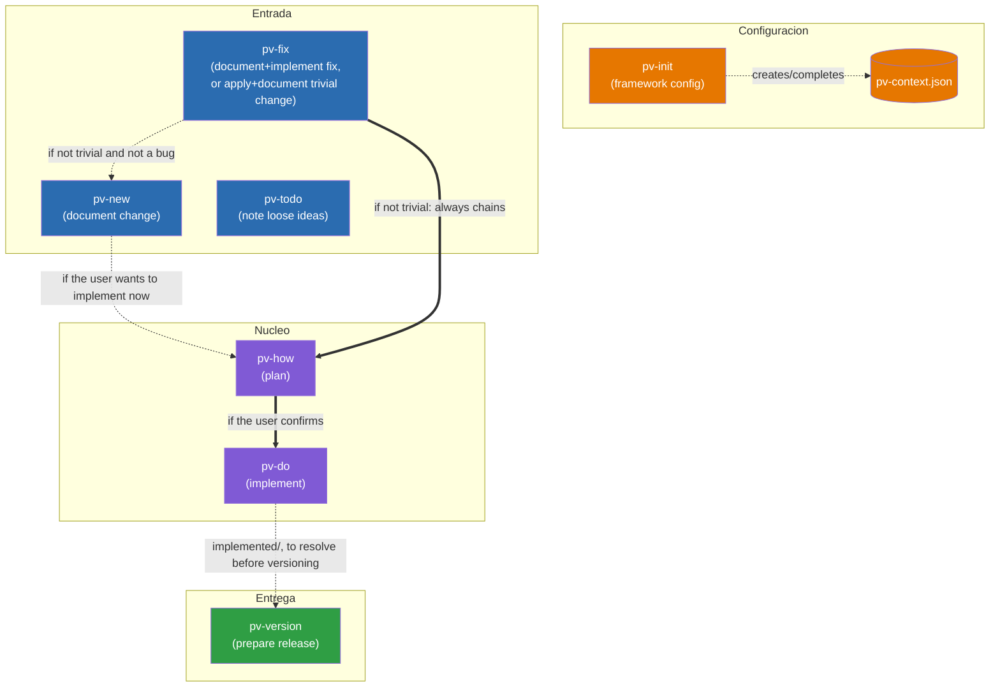
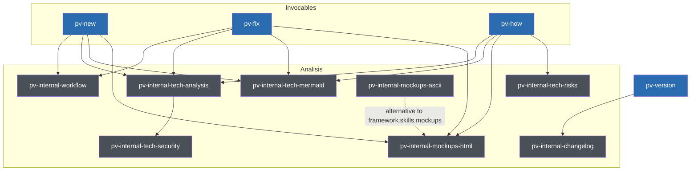
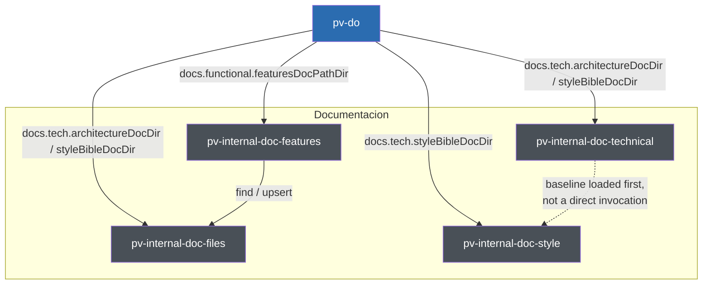

# Previo: Design documentation

A map of the skills that make up the `pv-*` framework and how they invoke each other.

## Contents

- [Relationship diagram](#relationship-diagram)
- [Responsibilities of each skill](#responsibilities-of-each-skill)
  - [User-invocable](#user-invocable)
  - [Internal and support](#internal-and-support)
    - [Analysis](#analysis)
    - [Documentation](#documentation)
- [The `pv-context.json` file](#the-pv-contextjson-file)
  - [skillModels](#skillmodels)
  - [framework](#framework)
- [The `pv.py` launcher](#the-pvpy-launcher)
- [Marker convention in templates](#marker-convention-in-templates)
- [Workflow diagrams](#workflow-diagrams)
- [Full folder and file structure](#full-folder-and-file-structure)

## Relationship diagram

A simplified diagram showing only the main flow visible to the user. The internal skills (`pv-internal-workflow`, `pv-internal-tech-analysis`, `pv-internal-tech-security`, `pv-internal-tech-mermaid`, `pv-internal-tech-risks`, `pv-internal-mockups-html`, `pv-internal-mockups-ascii`, `pv-internal-doc-files`, `pv-internal-doc-features`, `pv-internal-doc-technical`, `pv-internal-doc-style`, `pv-internal-changelog`) and support skills (`pv-status`) don't appear here — their relationship with the rest is described in the responsibilities section below. `pv-fix`, `pv-how`, `pv-new`, and `pv-version` each have their own detailed workflow diagram, not duplicated here: see their `workflow.*.md` files in the responsibilities section below (`pv-version` also has a simplified, user-oriented version in [`.claude/skills/pv-version/version-flow-diagram.template.md`](skills/pv-version/version-flow-diagram.template.md)).

`pv-how` (plan) and `pv-do` (implement) are two separate skills: `pv-how` analyzes the technical solution and writes `plan.md`, and only if the user confirms they want to implement now does it chain `pv-do`, which is the one that edits the code. You can also invoke `pv-do` directly on an entry that already has a `plan.md`, without going through `pv-how` again.



Legend:
- Solid arrows (`-->`, `==>`): direct skill-to-skill invocation within the same process.
- Dotted arrows (`-.->`): a configuration dependency or conditional invocation.
- `pv-todo` has no arrow to the rest of the flow: it lives isolated in `{changesDir}/todo/`, unrelated to the other skills.
- `pv-fix` is the only "Entry" skill that can finish without going through `plan.md`: if the change (bug or not) really qualifies as trivial, it creates the entry in `{changesDir}/inProgress/{xxxx}/` via `pv-internal-workflow` (normal `xxxx` numbering) and moves it to `implemented` in the same invocation, without generating `plan.md` or chaining `pv-how`/`pv-do`. It only falls back to `pv-new` when the analysis reveals that it wasn't trivial and isn't a bug either (it affects architecture/style, information is missing, it touches more than 2 files, or it's a new feature).
- `pv-version` doesn't consume `pv-do`'s output directly: it only requires, as a startup guardrail, that `{changesDir}/implemented/` be empty (each resolved entry is moved to `closed` before continuing).
- All the skills read `.claude/pv-context.json` to work, not just the ones shown connected to it here — that arrow to each one is omitted to keep the diagram uncluttered; `pv-init` is the only one that writes it.

## Responsibilities of each skill

### User-invocable

- **pv-init** — Initializes the framework: creates/completes `.claude/pv-context.json` (`framework.workFolder` — fixed at `/previo-sdd`, never asked, a repo-relative root under which the framework manages `changes/`, `versions/`, and `stuff/`, fixed-name subfolders that the skills create themselves —, docs to sync, language configuration) and checks that the required command-line tools are installed. On a first `pv-init`, it always asks for the interaction language (`framework.interaction.language`) and, with a yes/no, whether the other areas (`changes`, `versions`, `docs.functional`) share that same language or are configured one by one; it records the rationale for each choice in `framework._comments`. `docs.tech` isn't part of that question — it's always technical English. If the project was already initialized without a configured language (`hasLanguage: false`), it adds that question to the same round that completes the rest of the pending optionals, without asking again if it was already resolved. The three documentation paths (`docs.functional.featuresDocPathDir`, `docs.tech.architectureDocDir`, `docs.tech.styleBibleDocDir`) are not among the "optional" fields it can leave unset — they're always written and scaffolded; it never asks whether the project wants that documentation. The single configuration point that all the other skills depend on. *Uses:* no other skill.

  Assets and scripts:
  - [`workflow.init.md`](skills/pv-init/workflow.init.md) — Mermaid diagram of this skill's full flow (see "Workflow diagrams" above); read before executing any step, the source of truth for the sequence and the branches.
  - [`assets/pv.py`](skills/pv-init/assets/pv.py) — the master copy of the `pv.py` launcher; `scaffold-project.py` copies it (always overwriting) to the repo root on every `pv-init`.
  - [`schema.json`](skills/pv-init/schema.json) — the complete JSON Schema of `.claude/pv-context.json` (`additionalProperties: false` at every level); the normative reference for which fields exist and their default values.
  - [`scripts/check-context.py`](skills/pv-init/scripts/check-context.py) — checks whether `pv-context.json` exists and is complete (the `framework` section present, whether it has `interaction.language`), so `pv-init` can decide whether it needs the full questionnaire, only what's missing, or nothing.
  - [`scripts/collect-skill-models.py`](skills/pv-init/scripts/collect-skill-models.py) — reads the real `model`/`effort` frontmatter of each `pv-*` `SKILL.md` and proposes a `skillModels` section (`default` + `overrides`) that reflects it, so `pv-init` can write it into `pv-context.json` even if the user doesn't customize anything.
  - [`scripts/scaffold-project.py`](skills/pv-init/scripts/scaffold-project.py) — creates the base folder structure (`changes/{inProgress,implemented,todo,closed}`, `versions/`, `stuff/`) and any missing placeholders for `docs.tech.*`/`docs.functional.featuresDocPathDir`, and overwrites `pv.py` in the repo root with the copy from `assets/pv.py`.
  - [`scripts/sync-skill-models.py`](skills/pv-init/scripts/sync-skill-models.py) — propagates `pv-context.json#skillModels` (`default`/`overrides`) to the real frontmatter (`model:`/`effort:`) of each `pv-*` `SKILL.md`, bumping the `metadata.version` patch if anything changed; it's the only step that makes `skillModels` take real effect, since the harness only reads the frontmatter.

- **pv-new** — Documents an intentional change (a new feature or a deliberate behavior modification, not a bug). It invokes `pv-internal-tech-analysis` to gather technical context before anticipating the typical functional questions, generates `description.md` via `pv-internal-workflow` and, if applicable, functional Mermaid diagrams per use case (via `pv-internal-tech-mermaid`) and `design_*.html` visual mockups (via `pv-internal-mockups-html`, or the alternative configured in `framework.skills.mockups`), validating both with the user before the change is considered documented. It implements nothing itself, but if the user wants to implement immediately it can invoke `pv-how` directly on the newly created entry. *Uses:* `pv-internal-workflow`, `pv-internal-tech-analysis`, `pv-internal-tech-mermaid`, `pv-internal-mockups-html`, `pv-how`.

  Assets and scripts:
  - [`workflow.new.md`](skills/pv-new/workflow.new.md) — Mermaid diagram of this skill's full flow (see "Workflow diagrams" above); read before executing any step, the source of truth for the sequence and the branches, including its several entry points (new entry, extend an existing `xxxx`, from `todo/`) and the four non-exclusive visual-representation cases.
  - [`extend-entry.md`](skills/pv-new/extend-entry.md) — the complete procedure for when the given `xxxx` already exists in `inProgress`: instead of creating a new entry, it updates `description.md`/`history.md` directly (without going through `pv-internal-workflow`, which only knows how to create), regenerates diagrams/mockups/data if the extension touches them, and warns if there was already a `plan.md` that would become outdated.
  - [`todo-mode.md`](skills/pv-new/todo-mode.md) — the procedure for `/pv-new todo <code>`: it takes an idea already noted in `{changesDir}/todo/{code}/` as if it were the user's request, offers to refine it before documenting, and deletes the `todo/` folder automatically as soon as the new `inProgress` entry exists.

- **pv-fix** — Documents a bug and implements it end to end, and is also the framework's fast path for changes so small they barely require analysis (a typo, a text string, a value/constant, an isolated style tweak, whether or not it's a bug). It first invokes `pv-internal-tech-analysis` to assess whether the request is `fast` (unambiguous, ≤2 files, no impact on `docs.tech.architectureDocDir`/`docs.tech.styleBibleDocDir` and no detected inconsistencies with them, no new behavior). If it's `fast`, it creates the entry via `pv-internal-workflow` (`action=create`, `type=fast`), applies the change directly, and moves it to `implemented` (`action=move`) in the same invocation, without `plan.md`. If it's not `fast` and it's a bug, it generates `description.md` via `pv-internal-workflow` (`type=fix`), invoking `pv-internal-tech-mermaid`/`pv-internal-mockups-html` when the fix has a flow or visual component to represent, and automatically chains `pv-how` to fix it end to end, with the analysis strictly confined to the root cause (no scope expansion). If it's not `fast` and it's not a bug, it warns the user and invokes `pv-new` with their request. *Uses:* `pv-internal-workflow`, `pv-internal-tech-analysis`, `pv-internal-tech-mermaid`, `pv-internal-mockups-html`, `pv-new`, `pv-how`.

  Assets and scripts:
  - [`workflow.fix.md`](skills/pv-fix/workflow.fix.md) — Mermaid diagram of this skill's full flow (see "Workflow diagrams" above), covering both the fast-track subflow and the non-trivial one; read before executing any step, the source of truth for the sequence and the branches.
  - Reuses `extend-entry.md` from `pv-new` when the given `xxxx` already exists in `inProgress`.

- **pv-how** — Takes an entry already documented in `inProgress`, invokes `pv-internal-tech-analysis` to gather the technical context, analyzes the technical solution, and writes `plan.md` (using `pv-internal-tech-mermaid`/`pv-internal-mockups-html` when what needs describing is a flow or requires a visual mockup). With `plan.md` written, it invokes `pv-internal-tech-risks` to assess the risk of breaking something when implementing it, and writes the returned median into the plan's header (the detail of the 9 factors is only added if the user asks for it). If the user confirms they want to implement now, it chains directly into `pv-do` on the same entry. *Uses:* `pv-internal-tech-analysis`, `pv-internal-tech-mermaid`, `pv-internal-mockups-html`, `pv-internal-tech-risks`, `pv-do`.

  Assets and scripts:
  - [`workflow.how.md`](skills/pv-how/workflow.how.md) — Mermaid diagram of this skill's full flow (see "Workflow diagrams" above), including the regenerate-vs-reuse `plan.md` re-entry and the final decision to implement now; read before executing any step, the source of truth for the sequence and the branches.
  - [`PLAN.template.md`](skills/pv-how/PLAN.template.md) — the `plan.md` template: header (date, risk), functional notes (out of scope, resolved questions), technical solution as a checklist, architecture/style changes (optional), verification as a checklist, and risk detail (only if the user asks), with the table explaining the meaning of each median value 0-10.
  - [`scripts/get-max-change-codes.py`](skills/pv-how/scripts/get-max-change-codes.py) — returns the highest existing `xxxx` in each state (`inProgress`/`implemented`/`closed`) of `changes/`; `pv-how` uses it as a preliminary check to detect whether the entry to plan is older than another one created afterward, and should therefore be re-analyzed before planning.

- **pv-do** — Takes an entry from `inProgress` whose `plan.md` is already written (by `pv-how`, or invoked directly by the user), implements the code, updates the synced documentation (`docs.tech.architectureDocDir`/`docs.functional.featuresDocPathDir`/`docs.tech.styleBibleDocDir` — including any inconsistency that `pv-internal-tech-analysis` reported via `pv-how`) and moves the folder to `implemented` via `pv-internal-workflow`. If `docs.functional.featuresDocPathDir` is a folder, it delegates to `pv-internal-doc-features` both the reading/writing and the decision of what content the entry carries and how to write it (`pv-do` only supplies a summary and context). Before writing or editing content in `docs.tech.architectureDocDir`/`styleBibleDocDir`, it invokes `pv-internal-doc-technical` to load its writing style (designed to be read by an AI, not a person) and applies it while writing; for `styleBibleDocDir` specifically, it also invokes `pv-internal-doc-style` to get the applicable style categories and their own writing rules. It always writes both in **technical English** (there's no `docs.tech.language`), translating from `plan.md` if it came in another language. When the change adds or renames a citable concept/statement, it maintains `{architectureDocDir}/00-namespace.md` by editing it with direct Read/Edit (never via `upsert`). *Uses:* `pv-internal-workflow`, `pv-internal-doc-features`, `pv-internal-doc-technical`, `pv-internal-doc-style`.

  Assets and scripts:
  - [`FEATURES.template.md`](skills/pv-do/FEATURES.template.md) — the entry template for `docs.functional.featuresDocPathDir` when that field is a single `.md` file (projects not yet migrated to a folder): functional area, name, description, optional functional Mermaid diagram, where it's used, and associated `xxxx` code(s).

- **pv-status** — Gives a read-only overview of the project state (totals by type — including `fast`, the trivial shortcut of `pv-fix` — and by state, a breakdown of what is only described vs. ready to implement, and a separate listing of the `fast` changes already applied). It reads each change's **flags** from its `.metadata.json` and shows them as icons in every listing; it also offers `filter_status.py --flag <name>` to list the changes carrying a given flag, and `read-flags.py` as a read-only service for `pv.py`. It creates, moves, or modifies nothing; the report is delivered in chat unless the user asks to save it. *Uses:* no other skill.

  Assets and scripts:
  - [`STATUS.template.md`](skills/pv-status/STATUS.template.md) — the template for the full report: a summary with text bars, a table of totals by type/state, lists of "ready to close"/"pending analysis"/"planned" (each with a leading `Flags` column), optional sections (`fast`, warnings) that are removed entirely if they don't apply, and ideas in `todo/`.
  - [`STATUS.filtered.template.md`](skills/pv-status/STATUS.filtered.template.md) — the template for the listing filtered to a single state (`/pv-status <state>`): a table with flags, code, type, description, risk, and date.
  - [`STATUS.todo.template.md`](skills/pv-status/STATUS.todo.template.md) — the template for the full listing of ideas in `todo/` (`/pv-status todo`), with each idea's full, untruncated text.
  - [`scripts/collect_status.py`](skills/pv-status/scripts/collect_status.py) — walks `{changesDir}` and returns a JSON with the detail and aggregated totals of each entry (type, name, whether it has `description.md`/`plan.md`, sub-state within `inProgress`, risk, **`flags`** read from `.metadata.json`); it writes nothing, it only diagnoses. Exposes `read_flags()` / `read_metadata()` reused by the other scripts.
  - [`scripts/filter_status.py`](skills/pv-status/scripts/filter_status.py) — a single-state listing already rendered in markdown (or plain text with `--terminal`) according to `STATUS.filtered.template.md`. Cross-state modes: `--search-id`, `--search-content`, and `--flag <name>` (repeatable, OR semantics — lists the changes carrying any of the given flags). Card line 1 in `flags · code · [type] · (status) · Risk` order.
  - [`scripts/list_todo.py`](skills/pv-status/scripts/list_todo.py) — the full listing of `todo/` already rendered according to `STATUS.todo.template.md` (or `--terminal`), reusing the parser from `collect_status.py`. Unchanged by flags — `todo` entries carry none.
  - [`scripts/render_status.py`](skills/pv-status/scripts/render_status.py) — renders the full report according to `STATUS.template.md` (or `--terminal`), applying all the field mapping, bars, and optional sections so the model only has to paste the output. Prepends the flag-icon prefix to each row/block.
  - [`scripts/read-flags.py`](skills/pv-status/scripts/read-flags.py) — returns the already-rendered flag-icon prefix, **one line per `--xxxx`** (accepts several per invocation — batch input). So `pv.py` can show icons in its own listings without importing the canonical map. `--color` / `--no-color` force the icon style (`pv.py` passes them based on its own terminal, since it captures this stdout and the script's own `isatty()` would always say "no color"). Read-only.
  - [`scripts/terminal_output.py`](skills/pv-status/scripts/terminal_output.py) — formatting helpers for `--terminal` mode (conditional width, conditional color, visual width with emojis); used exclusively by `pv.py`, the skill invoked from chat never passes that flag. Also holds the framework's **canonical flag catalogue**: `FLAG_ICONS`/`FLAG_ICONS_ASCII`/`FLAG_LABELS`/`FLAG_ORDER` + `flags_prefix()` / `flag_label()` — the one place the flag→icon/label map lives.

- **pv-todo** — A notebook for loose ideas, deliberately outside the framework's workflow: it lives in `{changesDir}/todo/`, with its own numbering and identifiers that no other `pv-*` skill reads or counts. It serves to note incomplete ideas without forcing the scope analysis of `pv-new`/`pv-fix`. *Uses:* no other skill.

  Assets and scripts:
  - [`description.template.md`](skills/pv-todo/description.template.md) — the `description.md` template for an idea: a short name, a code, a creation date, and free notes, without forcing the structure of `pv-new`/`pv-fix`.
  - [`scripts/new-todo-code.py`](skills/pv-todo/scripts/new-todo-code.py) — generates a short alphanumeric code (5 characters by default) that doesn't collide with any existing `{changesDir}/todo/`; its own numbering space, unrelated to the `xxxx` of a change/fix.

- **pv-version** — Prepares a release in `{workFolder}/versions/{XXXX}/`: it first requires `{changesDir}/implemented/` to be empty (each entry is resolved by moving it to `closed`), generates the deliverable following `{workFolder}/stuff/how-to-compile-version.md` (a project-specific procedure, written the first time it's needed, able to describe several steps if the build generates several artifacts), compresses into `.zip` and copies whichever of `docs.tech.architectureDocDir`/`docs.tech.styleBibleDocDir`/`docs.functional.featuresDocPathDir` are configured, and chains `pv-internal-changelog` for the functional changelog. If invoked only to report a change in the build procedure, it updates `{workFolder}/stuff/how-to-compile-version.md` without running the rest of the process unless explicitly confirmed. `{XXXX}` is free text chosen by the user on each invocation, with no relation to the `xxxx` numbering of a change/fix nor to any other "versions" folder that exists in the repo. *Uses:* `pv-internal-changelog`.

  Assets and scripts:
  - [`workflow.version.md`](skills/pv-version/workflow.version.md) — Mermaid diagram of this skill's full flow (see "Workflow diagrams" above); read before executing any step, the source of truth for the sequence and the branches. Not to be confused with `version-flow-diagram.template.md` below: this one is the complete internal flow (every `ASK`/`INFO` node and branch), the other is a simplified user-oriented view.
  - [`how-to-compile-version.template.md`](skills/pv-version/how-to-compile-version.template.md) — the template that `pv-version` copies to `{workFolder}/stuff/how-to-compile-version.md` the first time it's needed: command(s) to run, generated file(s), and notes, with support for several independent steps if the build generates several artifacts.
  - [`scripts/copy-build-artifacts.py`](skills/pv-version/scripts/copy-build-artifacts.py) — copies each already-generated artifact (one or several `--source`) to `{workFolder}/versions/{xxxx}/files/`, keeping the file name; it fails without copying anything if any source doesn't exist, so as not to leave a half-finished release.
  - [`scripts/copy-docs.py`](skills/pv-version/scripts/copy-docs.py) — compresses into `.zip` whichever of `docs.tech.architectureDocDir`/`styleBibleDocDir`/`docs.functional.featuresDocPathDir` is configured (a full folder or a standalone `.md` file) and saves them in `{workFolder}/versions/{xxxx}/docs/`; the unconfigured ones are skipped without error.
  - [`scripts/init-version-folder.py`](skills/pv-version/scripts/init-version-folder.py) — creates `{workFolder}/versions/{xxxx}/` with its empty `files/` and `docs/` subfolders; it fails without touching anything if that folder already exists.
  - [`version-flow-diagram.template.md`](skills/pv-version/version-flow-diagram.template.md) — a general, simplified Mermaid diagram of the `pv-version` process (the empty-`implemented/` guardrail → create folder → compile → compress docs → changelog → confirm), meant to be shown as-is if the user asks how `/pv-version` works — only the information relevant and understandable to the user, not all the internal branching that `workflow.version.md` does cover.

### Internal and support

`pv-internal-workflow`, `pv-internal-tech-analysis`, `pv-internal-tech-security`, `pv-internal-doc-files`, `pv-internal-doc-style`, and `pv-internal-changelog` only run when another framework skill invokes them as part of its own process; if the user invokes them directly (or asks "run X" in plain text without coming from that context), they stop without doing anything and redirect to the corresponding skill.

They split into two groups: the **analysis** ones (technical context, risk, security, diagrams, mockups, the `changes/` file mechanics, changelog) and the **documentation** ones (managing `docs.functional`/`docs.tech`), each with its own relationship diagram.

#### Analysis

The relationship diagram of the analysis skills with each other and with the user-invocable skills that use them. In gray, the internal ones from this subsection; in blue, the user-invocable ones (same color as in the main diagram).



Legend:
- Solid arrows (`-->`): direct skill-to-skill invocation within the same process.
- Dotted arrows (`-.->`): interchangeable configuration (`framework.skills.mockups`) — whoever appears as the source doesn't invoke itself; it replaces the destination only if that alternative is configured.
- `pv-internal-tech-mermaid` and `pv-internal-mockups-html` are the skills for `framework.skills.diagrams`/`framework.skills.mockups` — `pv-new`/`pv-fix`/`pv-how` invoke them by the name configured there, by default the ones shown in the diagram; `pv-internal-mockups-ascii` is the only alternative already included in the framework for `skills.mockups`, transparent to whoever invokes it.

- **pv-internal-workflow** — Centralizes the framework's file mechanics: numbering and creating new entries in `inProgress` (`action=create`, with `type` `change`/`fix`/`fast`), and moving folders between states (`action=move`). It analyzes and decides nothing, it only executes what the calling skill already resolved. For the `fast` shortcut of `pv-fix`, the caller typically chains `create` and `move` in the same invocation, without going through `plan.md`. It is also the **owner of the `.metadata.json` contract** (the per-change mutable-state file: today the *flags*) and of `set-metadata.py`, the sole writer of that file. *Uses:* no other skill.

  Assets and scripts:
  - [`description.template.md`](skills/pv-internal-workflow/description.template.md) — the `description.md` template for a change/fix: name, code, type, creation date, the complete functional description (no technical details), and optional technical notes.
  - [`history.template.md`](skills/pv-internal-workflow/history.template.md) — the `history.md` template: a verbatim history of the prompts with which the user posed/expanded the entry, used exclusively by `pv-new`/`pv-fix` — no other skill should read it or take it into account.
  - [`metadata.schema.json`](skills/pv-internal-workflow/metadata.schema.json) — JSON Schema for `.metadata.json` (`{workFolder}/changes/{state}/{xxxx}/.metadata.json`, an optional dotfile): `flags` (array, enum `priority`/`workinprogress` — the framework's **canonical flag catalogue**), `flagsLastModified` (ISO date), and `risk` (integer 0-10 | null, declared but not written by this flow — the hook for a later plan). Referenced by `pv-status` when it reads the file and by `pv-update` when it audits it.
  - [`scripts/set-metadata.py`](skills/pv-internal-workflow/scripts/set-metadata.py) — the sole writer of `.metadata.json`. `--xxxx <code>` (+ state resolution by searching for the folder, or explicit `--state`), `--add-flag`/`--remove-flag`/`--toggle-flag <name>` (repeatable, validated against the enum), `--work-folder`, `--print`. Read-modify-write with a **file lock**; rejects any operation under `todo/`; creates the file if absent and **never deletes it** (even when `flags` ends up `[]`); preserves unknown fields.
  - [`scripts/move-change.py`](skills/pv-internal-workflow/scripts/move-change.py) — moves `{workFolder}/changes/{from}/{xxxx}/` to `{workFolder}/changes/{to}/{xxxx}/` with all its content (including `.metadata.json`, which travels inside the folder — `shutil.move()` of the whole directory); it fails without moving anything if the source doesn't exist or the destination is already occupied.
  - [`scripts/next-change-number.py`](skills/pv-internal-workflow/scripts/next-change-number.py) — computes the next free `xxxx` by finding the highest number among all the numeric subfolders of any sub-state of `changes/` (except `todo/`, which has its own numbering unrelated to the change/fix flow).

- **pv-internal-tech-analysis** — Centralizes how to gather reliable technical context: it first reads the configured `framework.docs.tech` documentation, and only explores code if information needs completing. If the topic touches an interface or data structure, it requires having its complete definition (signature, parameters, return, fields) before considering the context gathered, exploring code selectively if needed — and if a definition question remains that neither the documentation nor the code resolves, it confirms it directly with the user. If it detects inconsistencies between documentation and code, the code wins and the inconsistency is returned as a finding to the caller. When done, it invokes `pv-internal-tech-security` to check the change against its security checklist and adds the pending items to the result (it never edits anything itself). Used by `pv-new`, `pv-fix`, and `pv-how`. *Uses:* `pv-internal-tech-security`.

  Assets and scripts: none of its own.

- **pv-internal-tech-security** — Checks a change/fix against a checklist of security categories (authentication, authorization, input validation/injection, secrets, transport, sensitive data, dependencies, infrastructure, API, logging, client hardening), based on the summary of the change and the context already gathered by the caller. For each applicable category, it distinguishes between those already covered by the available context and those still pending review. It doesn't explore code on its own initiative or decide design, it only checks against the checklist. Used by `pv-internal-tech-analysis`. *Uses:* no other skill.

  Assets and scripts: none of its own.

- **pv-internal-tech-mermaid** — Generates Mermaid diagrams (functional or technical: flow, sequence) representing a use case, user story, workflow, or communication between components, from the list of diagrams the caller needs (type and what each one should represent). It doesn't decide which diagrams are needed or where they're inserted, it only writes the Mermaid code. It's the default diagram skill for `framework.skills.diagrams` — a project can replace it with another as long as it meets the same input/output contract. Used by `pv-internal-workflow`, `pv-new`, `pv-fix`, and `pv-how`. *Uses:* no other skill.

  Assets and scripts: none of its own.

- **pv-internal-tech-risks** — Assesses the risk of breaking something when implementing the technical solution already written in a change/fix's `plan.md`: it scores 9 factors (shared usage, scope, depth, test coverage, criticality, reversibility, persistent data, security surface, sensitive data) from 0 to 10, exploring `sourcecodeDir` selectively if `plan.md`/`description.md` aren't enough to assess one, and returns the `factor=value` list plus the median. It's only invoked once `plan.md` is written — before that there's not enough information. It writes nothing; the caller decides what to persist. Used by `pv-how`. *Uses:* no other skill.

  Assets and scripts: none of its own.

- **pv-internal-mockups-html** — Generates or edits static visual mockups in self-contained HTML/CSS/SVG (`design_*.html`) of a new or modified UI element, from the destination folder and the list of elements the caller needs to mock up. It doesn't decide which elements are needed or validate anything with the user, it only produces the files and returns their paths. It's the default mockup skill for `framework.skills.mockups`. Used by `pv-new` and `pv-fix`. *Uses:* no other skill.

  Assets and scripts: none of its own.

- **pv-internal-mockups-ascii** — The same function and the same input/output contract as `pv-internal-mockups-html`, but generating the mockups as plain-text ASCII art (`design_*.txt`) instead of HTML. It's only invoked when a project configures `framework.skills.mockups` to use this alternative instead of the default. *Uses:* no other skill.

  Assets and scripts: none of its own.

#### Documentation

Skills dedicated to managing `docs.functional.featuresDocPathDir`, `docs.tech.architectureDocDir`, and `docs.tech.styleBibleDocDir`: what to write, how to write it, and where to store it.



Legend:
- Solid arrows (`-->`): direct skill-to-skill invocation, with the label indicating which `docs.*` field it corresponds to.
- `pv-do` invokes `pv-internal-doc-files` directly for `architectureDocDir`/`styleBibleDocDir` (there's no intermediate domain skill like `pv-internal-doc-features`); for `featuresDocPathDir` it always goes through `pv-internal-doc-features`, which in turn delegates to `pv-internal-doc-files`.
- `pv-internal-doc-features`/`pv-internal-doc-technical`/`pv-internal-doc-style` never invoke `pv-internal-doc-files` or the reverse: the three decide what to document (each in its own field: `doc-features` in `featuresDocPathDir`, `doc-technical` in `architectureDocDir`, `doc-style` in `styleBibleDocDir`) and how to write it; `doc-files` only decides where/how to store it.
- The dotted arrow `pv-internal-doc-technical -.-> pv-internal-doc-style`: it's not a direct invocation (neither skill invokes the other) — it's an ordering dependency imposed by `pv-do`, which always invokes `pv-internal-doc-technical` first to load the base writing style (dense fragments, tables, code, fixed tags) and then `pv-internal-doc-style`, whose own writing rules are defined as an extension of that baseline and assume it's already loaded in context.

**Comparative responsibilities table:**

| | `pv-internal-doc-files` | `pv-internal-doc-features` | `pv-internal-doc-technical` | `pv-internal-doc-style` |
|---|---|---|---|---|
| Decides **what** the content says | No | **Yes, for `featuresDocPathDir`** — a checklist of functional fields (description, functional diagrams, `Available in`/`Code`/`Since`/`Last modified`) and the in-place-edit vs. new-entry criterion | **Yes, for `architectureDocDir`** — a checklist of technical categories (components, contracts, data flows, decisions, dependencies, data model, configuration); the document structure remains free. It doesn't decide the what of `styleBibleDocDir` (that's `doc-style`) | **Yes** — a checklist of categories + what each must record |
| Decides **how to write it** | No | **Yes** — its own functional writing rules (prose for a human reader, no technical detail, descriptive non-changelog tone, relative cross-links) | **Yes** — general writing rules (dense fragments, tables, code, fixed tags) | **Yes** — its own writing rules, on top of `doc-technical`'s |
| Manages the file (`NNN` numbering, `Area`, `INDEX.md`, `find`/`upsert`) | **Yes** — for all three folders (`featuresDocPathDir`, `architectureDocDir`, `styleBibleDocDir`) | No — delegates to `pv-internal-doc-files` | No | No — the file is managed by `pv-do` invoking `pv-internal-doc-files` |
| Writes anything to disk | **Yes** (the `upsert` action) | No (delegates to `doc-files`) | No | No, never |
| Which field it applies to | `docs.functional.featuresDocPathDir`, `docs.tech.architectureDocDir`, **and** `docs.tech.styleBibleDocDir` | `docs.functional.featuresDocPathDir` | `docs.tech.architectureDocDir` **and** `docs.tech.styleBibleDocDir` | `docs.tech.styleBibleDocDir` only |

`pv-internal-doc-files` is the only point that touches disk for the three documentation areas: it numbers (`NNN`), computes the slug, writes the file with the `**Area**:` field, and regenerates `INDEX.md`. `pv-internal-doc-features`, `pv-internal-doc-technical`, and `pv-internal-doc-style` each decide, in their own field, what content the document carries and how to write it (from a summary of the change and the context already gathered, never receiving the pre-written content), but none of them manages the file or decides where it's stored — that's always done by `pv-internal-doc-files`, invoked by `doc-features` (for `featuresDocPathDir`) or directly by `pv-do` (for `architectureDocDir`/`styleBibleDocDir`).

- **pv-internal-doc-files** — A shared, project-agnostic skill for the file management of the three documentation folders (`docs.functional.featuresDocPathDir`, `docs.tech.architectureDocDir`, `docs.tech.styleBibleDocDir`): `find` locates whether a topic already has its own file by reading `INDEX.md` (regenerating it first if missing) and confirming plausible candidates; `upsert` writes `{folder}/{NNN}-{slug}.md` (a three-digit number, the `**Area**:` field, and then the `body` already written by the caller) and regenerates `INDEX.md`. It doesn't decide what the documentation says or how to write it — only where and how it's stored on disk; the caller (`pv-internal-doc-features`, or `pv-do` directly for architecture/style) supplies `area`, `title`, and a fully formatted `body`. The `00-` prefix is **reserved** for the folder's infrastructure files (e.g. `00-namespace.md`): excluded from `INDEX.md` and from the `{NNN}` numbering, written directly by their owner skill, never via `upsert` (which, if it receives one, is a usage error). Used by `pv-internal-doc-features` and `pv-do`. *Uses:* no other skill.

  Assets and scripts:
  - [`scripts/_slug.py`](skills/pv-internal-doc-files/scripts/_slug.py) — a shared internal helper, not directly invocable: `slugify()` normalizes a title to a lowercase ASCII slug, and `github_anchor()` replicates GitHub's anchor algorithm to rewrite `#anchor` links when migrating a legacy `FEATURES.md`.
  - [`scripts/next-feature-number.py`](skills/pv-internal-doc-files/scripts/next-feature-number.py) — computes the next free number (the prefix of the title, not of the file name) by finding the maximum already used in the folder; a deleted number is never reused. It excludes `INDEX.md` and any `00-*.md`.
  - [`scripts/rebuild-index.py`](skills/pv-internal-doc-files/scripts/rebuild-index.py) — regenerates `INDEX.md` from all the topic files in the folder, grouped by area; the single source of truth for that index, never edited by hand. It excludes `INDEX.md` and any `00-*.md`.
  - [`scripts/slugify.py`](skills/pv-internal-doc-files/scripts/slugify.py) — computes the text part (slug) of the file name for a new file (`{number}-{slug}.md`); the number already guarantees there's no collision, so the slug doesn't need to check anything itself.

- **pv-internal-doc-features** — What and how to write `docs.functional.featuresDocPathDir` when it's a folder (one file per feature): a checklist of domain fields (`Available in`/`Code`/`Since`/`Last modified`, functional description, optional Mermaid diagram, `[text](NNN-slug.md)` cross-links), the in-place-edit vs. create-new-entry criterion, the rule of never duplicating an entry, and its own writing rules (prose for a human reader, no technical detail, descriptive non-changelog tone). From a summary of what was implemented and the context already gathered (code touched, `plan.md`, the entry's functional diagrams/mockups), it writes the final content itself and delegates all file management — numbering, `INDEX.md`, `find`/`upsert` — to `pv-internal-doc-files`. Used by `pv-do`. *Uses:* `pv-internal-doc-files`.

  Assets and scripts:
  - [`FEATURE.template.md`](skills/pv-internal-doc-features/FEATURE.template.md) — the template for each feature file: number, area, functional description, optional Mermaid diagram, where it's used, associated `xxxx` code(s), and the creation/last-modified dates.
  - [`scripts/migrate-legacy-features-doc.py`](skills/pv-internal-doc-features/scripts/migrate-legacy-features-doc.py) — a one-off utility (not an invocable skill) that splits a monolithic `FEATURES.md` (`## Area` / `### Feature`) into one file per feature inside a folder, rewrites the internal links, assigns sequential numbering, and regenerates `INDEX.md`; for adopting the folder convention in a project that still had a single file.

- **pv-internal-doc-technical** — What and how to write `docs.tech.architectureDocDir` (a checklist of technical content categories — components, contracts, data flows, decisions, dependencies, data model, configuration) and the writing style shared with `styleBibleDocDir`. The style is **notation-native by default** (tables, code, propositional logic, `assert`, `pre:/post:` contracts, FSM, Mermaid diagrams — a content→notation catalog); prose is the rationed exception, a single sentence marked `[motivación]` and only if it passes a 4-step checklist. A fixed vocabulary of English tags, including `[gotcha]` (marks a fact that contradicts the default pattern a reader with general software knowledge would assume) and `[motivación]`. It forbids anaphora (repeating the exact name or the namespace path) and intensifiers without a figure. It defines the project's **single hierarchical namespace**: a tree of canonical concept→`anchor:`-to-code paths, in `{architectureDocDir}/00-namespace.md`, one per project (style concepts hang off their `ui.*` branch). Its output and all of `docs.tech` is **fixed technical English, with no language option**. It doesn't decide the what of `styleBibleDocDir` (`pv-internal-doc-style` does) or the specific structure/topic of each document, nor does it write anything itself: it only loads the checklist and the rules before the caller writes. Used by `pv-do`. *Uses:* no other skill.

  Assets and scripts: none of its own.

- **pv-internal-doc-style** — On top of the shared writing style of `pv-internal-doc-technical`, it defines what `docs.tech.styleBibleDocDir` must specifically cover: a checklist of style categories (writing/naming conventions, which always apply; visual design tokens, layout, interaction patterns, accessibility, reusable components, and content/microcopy, which only apply if the project has a presentation layer — including a CLI's colored output, tables, and prompts, not just a GUI) plus its own writing rules (always give the concrete value, one table row per token/state/variant, state the condition that triggers each interaction state, never assume accessibility without the data that backs it, point to the source mockup or component instead of re-describing it, group by category and not by change/fix). From a summary of what's being documented and the context already gathered, it returns which categories apply, which are already covered and which are still pending, and the writing rules to apply — it drafts nothing, decides no structure, and writes nothing itself. Used by `pv-do`. *Uses:* no other skill.

  Assets and scripts: none of its own.

- **pv-internal-changelog** — Drafts a release's `changelog.md` from the entries accumulated in `{changesDir}/closed/`: the `fix`-type ones go straight to the Fixes section, and the rest are classified by comparing against the `changelog.md` of the previous version in `{workFolder}/versions/` (if it exists) into New/Changes/Removed. It adds a header with the number of entries in each section and deletes the folded-in folders from `closed/` after the user's explicit confirmation. Used by `pv-version`. *Uses:* no other skill.

  Assets and scripts:
  - [`changelog.template.md`](skills/pv-internal-changelog/changelog.template.md) — the `changelog.md` template: a header with the count of each section (New/Changes/Removed/Fixes), a past-tense changelog tone, no mention of files or technical details; an empty section is omitted entirely.
  - [`scripts/stage-closed-entries.py`](skills/pv-internal-changelog/scripts/stage-closed-entries.py) — moves the current entries in `closed/` to `closed/temp/` before drafting, so that any change/fix closed while the release is being prepared doesn't affect the changelog in progress.
  - [`scripts/list-closed-entries.py`](skills/pv-internal-changelog/scripts/list-closed-entries.py) — lists the entries already in `closed/temp/` (code and path of their `description.md`) without interpreting them — the New/Changes/Removed classification is done by the skill, not the script.
  - [`scripts/find-previous-version.py`](skills/pv-internal-changelog/scripts/find-previous-version.py) — locates the previous version in `{workFolder}/versions/` (by folder mtime, excluding the one being generated) to compare against its `changelog.md`; the result is confirmed with the user if there's ambiguity.
  - [`scripts/delete-closed-entries.py`](skills/pv-internal-changelog/scripts/delete-closed-entries.py) — deletes only the `closed/temp/` folders whose `xxxx` is passed explicitly (never "all of `temp/`" blindly), after the user's explicit confirmation — an irreversible action.
  - [`scripts/cleanup-temp-entries.py`](skills/pv-internal-changelog/scripts/cleanup-temp-entries.py) — when finished, returns to `closed/` any folder that was left in `closed/temp/` without a deletion confirmation, and removes `temp/` if it's left empty; always safe to run even if `temp/` doesn't exist.

## The `pv-context.json` file

Example of a fully configured `.claude/pv-context.json`:

```json
{
  "skillModels": {
    "_instructions": "Tras editar 'default' o 'overrides' de esta seccion, ejecuta desde la raiz del repo: python .claude/skills/pv-init/scripts/sync-skill-models.py -- reescribe el campo 'model'/'effort' en el frontmatter de cada SKILL.md 'pv-*' segun lo que quede configurado aqui. El harness de Claude Code solo lee ese frontmatter, no este JSON, asi que sin ejecutar el script los cambios de aqui no tienen efecto.",
    "default": { "model": "claude-sonnet-5", "effort": "medium" },
    "overrides": {
      "pv-status": { "model": "claude-haiku-4-5-20251001", "effort": "medium" },
      "pv-todo": { "model": "claude-haiku-4-5-20251001", "effort": "medium" },
      "pv-do": { "model": "claude-haiku-4-5-20251001", "effort": "high" }
    }
  },
  "framework": {
    "skills": {
      "mockups": "pv-internal-mockups-html",
      "diagrams": "pv-internal-tech-mermaid"
    },
    "sourcecodeDir": "/src",
    "workFolder": "/previo-sdd",
    "numberWidth": 5,
    "interaction": { "language": "en" },
    "changes": { "language": "es" },
    "versions": { "language": "es" },
    "docs": {
      "functional": {
        "featuresDocPathDir": "docs/features",
        "language": "es"
      },
      "tech": {
        "architectureDocDir": "docs/architecture",
        "styleBibleDocDir": "docs/style"
      }
    },
    "_comments": {
      "workFolder": "Es la carpeta de trabajo principal del framework, relativa siempre a la raíz del repo.",
      "sourcecodeDir": "Es la carpeta del código fuente del proyecto, relativa siempre a la raíz del repo.",
      "interaction.language": "El equipo habla con Claude en inglés.",
      "changes.language": "Cada change/fix en curso se documenta en español, idioma del equipo.",
      "versions.language": "El changelog publicado se redacta en español.",
      "docs.functional.language": "Documentación de funcionalidades en español."
    }
  }
}
```

`.claude/pv-context.json` is the framework's single configuration point: it's what makes the `pv-*` skills generic rather than tied to a specific project. Its shape is defined in [`.claude/skills/pv-init/schema.json`](skills/pv-init/schema.json) (JSON Schema, `additionalProperties: false` at every level — any field outside the schema is an error).

Only `pv-init` writes it: it creates the file the first time and, on later invocations, *merges* onto what already exists without overwriting anything the user has already configured. The other skills only read it; if they need a missing field, the instruction is to ask the user to run/complete `pv-init`, never to reimplement that bootstrap on their own or assume an undocumented default not in the schema.

It has two top-level keys: `skillModels` (optional) and `framework` (required).

### skillModels

The declarative source of truth for the Claude model/effort each `pv-*` skill runs with. It has no effect on its own: the Claude Code harness only reads the `model`/`effort` field from each `SKILL.md`'s frontmatter, not this JSON. After editing `default` or `overrides`, you need to run `.claude/skills/pv-init/scripts/sync-skill-models.py` (or the equivalent option in the `pv.py` menu), which rewrites that frontmatter according to what's configured here — it's a deterministic script, invoking no model.

- **`_instructions`** (`string`): a reminder embedded in the file itself of how to apply `default`/`overrides` changes. No skill should delete this key.
- **`default`** (`modelConfig`): the model/effort that applies to any `pv-*` skill without its own entry in `overrides`.
- **`overrides`** (`object`, optional): one `modelConfig` per skill name (the `name:` of its `SKILL.md`, e.g. `pv-status`) for those that need something different from `default`.

Where `modelConfig` is `{ "model": string, "effort": string }` — `model` accepts the same IDs as `/model` (e.g. `claude-sonnet-5`, `claude-haiku-4-5-20251001`, or `inherit`); `effort` accepts the same values as the frontmatter (`low`/`medium`/`high`).

### framework

Fixed-shape configuration that the `pv-*` skills use directly, split into four blocks: the basics, the interchangeable-skills configuration, the language configuration, and the external reference documentation.

#### The basics

- **`workFolder`** (`string`, optional, default `"/previo-sdd"`): a repo-relative folder under which the framework manages all of its work. The leading `/` is just a visual convention (so it stands out at a glance from `docs.*`, which is relative to `workFolder` itself) — it's optional and every `pv-*` script strips it before resolving the path, so `"previo-sdd"` and `"/previo-sdd"` work the same; it's never a real absolute filesystem path. It's the only `framework` field that `pv-init` never asks about or confirms: it always writes the default silently, just like `skills.mockups`/`skills.diagrams`. If you ever want a different folder, change it by hand in `pv-context.json`, at the risk of whoever edits it. It's resolved via `resolve-path.py` — see "Path resolution" below. Inside it, `pv-init`'s `scaffold-project.py` creates three fixed-name subfolders right after writing `pv-context.json`, which the user doesn't choose or rename:
  - `{workFolder}/changes/` — with `inProgress/` (documented, pending planning/implementation), `implemented/` (plan already implemented, pending release — `pv-do` moves it there), `todo/` (loose ideas from `pv-todo`, unrelated to the change/fix flow) and `closed/` (already folded into a release, managed by `pv-version`/`pv-internal-changelog`). The same `{xxxx}` is never repeated between `inProgress`/`implemented`.
  - `{workFolder}/versions/` — one subfolder per release prepared with `pv-version`, with a free-text `XXXX` code chosen by the user on each invocation; a numbering space completely independent of the `{xxxx}` of `changes/`.
  - `{workFolder}/stuff/` — project-specific files that no other framework skill decides for it, starting with `how-to-compile-version.md` (the build procedure that `pv-version` asks about and writes the first time it's needed).
- **`sourcecodeDir`** (`string`, optional, default `"/src"`): the root folder of the project's source code, relative to the repo root — with a leading `/` so it stands out at a glance from `docs.*`, which is relative to `workFolder`. Same convention as `workFolder`: that leading `/` is optional and purely visual, never a real absolute path — `"src"` and `"/src"` resolve the same. It's the root from which `pv-internal-tech-analysis` explores the real code when the technical documentation doesn't answer what a change/fix analysis needs (e.g. `architectureDocDir` is still only its placeholder, or doesn't cover the area touched). It's resolved via `resolve-path.py` — see "Path resolution" below.
- **`numberWidth`** (`integer`, optional, default `5`, minimum `1`): the number of digits of the sequential `xxxx` code, zero-padded on the left.

#### Skills configuration

- **`skills`** (`object`, optional): interchangeable skill names that the rest of the framework invokes by name rather than hard-coding them in whoever needs them — replacing the value is enough to switch technology without touching `pv-new`/`pv-fix`/`pv-how`/`pv-internal-workflow`, as long as the given skill meets the same input/output contract as the one it replaces:
  - **`mockups`** (`string`, default `"pv-internal-mockups-html"`): the skill that `pv-new`/`pv-fix` invoke for a change/fix's `design_*.html` mockups. Contract: destination folder + list of elements to create/edit as input; paths of the resulting files as output.
  - **`diagrams`** (`string`, default `"pv-internal-tech-mermaid"`): the skill that `pv-internal-workflow`/`pv-new`/`pv-fix`/`pv-how` invoke for the Mermaid diagrams. Contract: list of diagrams to generate (type + what each represents) as input; the code for each diagram as output.

#### Language configuration

Each of the framework's writing points can have its own language rather than a single global one — **except `docs.tech`**, which is the exception: fixed technical English, not configurable. `pv-init` asks about this configuration the first time it initializes the project (see its entry above); the other skills only read it.

- **`interaction.language`** (`string`, optional, default `"en"`): the language the `pv-*` skills speak to the user in, in chat (questions, confirmations, summaries). It's also the fallback for `changes.language`, `versions.language`, and `docs.functional.language`. Free text or an ISO 639-1 code (e.g. `"es"`, `"fr"`).
- **`changes.language`** (`string`, optional, default `interaction.language`): the language of an in-progress change/fix's documents (`description.md`, `plan.md`, `history.md`, and the example text in the `design_*.html`/`.txt` mockups) inside `{workFolder}/changes/**`.
- **`versions.language`** (`string`, optional, default `interaction.language`): the language of `changelog.md`, generated by `pv-internal-changelog` in `{workFolder}/versions/{XXXX}/` from `changes/closed`.
- **`docs.functional.language`** (`string`, optional, default `interaction.language`): the language of `docs.functional.featuresDocPathDir` (see "Documentation" below), which `pv-do` keeps up to date after each implemented change/fix.
- **`docs.tech`** has no language field: `architectureDocDir` and `styleBibleDocDir` are always fixed technical English, with no configurable option. It's optimized to be read by the skills themselves (`pv-internal-tech-analysis`, and from there `pv-do`/`pv-how`), not by a person.
- **`_comments`** (`object`, optional): informational metadata for whoever edits the JSON by hand — for example, why each language was chosen. Ignored at runtime by all the skills, the same pattern as `skillModels._instructions`. `pv-init` fills it in alongside each `language` it writes.

#### Documentation

- **`docs`** (`object`, required): the project's external reference documentation, grouped by area. Always written by `pv-init`. The three paths live under `workFolder` (not in the repo root) — the only `pv-context.json` field relative to the root is `sourcecodeDir`:
  - **`functional.featuresDocPathDir`** (`string`, required): the list of already-implemented features. It can be a folder (recommended — one file per feature plus a generated `INDEX.md`, in which case `pv-do` delegates the reading/writing to `pv-internal-doc-features`) or, in projects not yet migrated, a single `.md` file. `pv-do` adds/updates the corresponding entry when implementing each change/fix, creating the path if it doesn't exist. Its language is configured in `functional.language` (see "Language configuration" above). It's resolved via `resolve-path.py` — see "Path resolution" below.
  - **`tech.architectureDocDir`** (`string`, required): a folder with the architecture/technical-design document, split across several files with an `INDEX.md` that summarizes each one — one `{NNN}-{slug}.md` file per topic (a three-digit number, the `**Area**:` field), the same convention as `docs.functional.featuresDocPathDir`. It also contains an infrastructure file `00-namespace.md` — the project's single namespace tree (concept→canonical path, with an `anchor:` to code), excluded from `INDEX.md` and from the `{NNN}` numbering, written directly by `pv-do` (never via `upsert`). `pv-do` keeps it in sync after each change/fix, via `pv-internal-doc-files`, creating a new file with the next free number if the topic doesn't fit any existing one. Before writing or editing its content, `pv-do` invokes `pv-internal-doc-technical` to apply its writing style. It's resolved via `resolve-path.py` — see "Path resolution" below.
  - **`tech.styleBibleDocDir`** (`string`, required): the same convention as `architectureDocDir`, but for the project's style guide (visual, interaction, writing). It does **not** have its own `00-namespace.md` file: its concepts hang off the `ui.*` branch of `architectureDocDir`'s single tree. It's resolved via `resolve-path.py` — see "Path resolution" below.
  - `docs.tech` has no language field — its content is always technical English.

`pv-init` always configures all three. A `pv-context.json` missing `docs`, one of its sub-objects, or any of the three paths (edited by hand, or from a framework version predating their being required) is a broken state: the skill that encounters it stops and sends the user to `/pv-update`, which recreates the missing folder with its placeholder `INDEX.md`. `styleBibleDocDir` (or any of the three) can legitimately be **empty** — only its placeholder, without any `{NNN}-*.md` yet — in a project whose documentation hasn't been populated yet, or with no visual layer; that is **not** the same as being unconfigured, and never sends anyone to `/pv-update`.

The five paths above — `workFolder`, `sourcecodeDir`, and the three `docs.*` — are resolved via `resolve-path.py` (see "Path resolution" below).

#### Path resolution

No skill parses `pv-context.json`'s path fields on its own. The resolution rules (which field, which base folder, the leading-`/` stripping) live in a single place: [`.claude/skills/pv-init/scripts/resolve-path.py`](skills/pv-init/scripts/resolve-path.py), owned by `pv-init` (the schema owner). Any skill that needs an absolute path requests it by logical key:

```
python .claude/skills/pv-init/scripts/resolve-path.py --what architectureDocDir
```

Keys: `workFolder`, `sourcecodeDir`, `changesDir`, `versionsDir`, `stuffDir`, `architectureDocDir`, `styleBibleDocDir`, `featuresDocPathDir`. The first two read a `framework` field (with a default in the schema); `changesDir`/`versionsDir`/`stuffDir` are derived from `workFolder`; the last three are resolved **under `workFolder`** and read a configurable field with no default. On success it prints the absolute path and exits 0. On any failure — a missing/corrupt file (exit 2), an unconfigured field (exit 3), a folder missing on disk (exit 4), an unknown key (exit 5) — it prints a diagnostic and **the calling skill must stop and tell the user to run `/pv-update`** (or `/pv-init` for exit 2). Only `pv-init` and `pv-update` know the JSON's internal shape; the other skills go through this script.

Two flags: `--json` prints `{"what":…, "field":…, "path":…, "exists":…}` instead of the bare path (for debugging / other scripts); `--allow-missing` turns exit 4 into exit 0 and prints the path anyway — used by `pv-init` when scaffolding a folder that doesn't exist yet. The flow skills pass neither.

`resolve-path.py` and `pv-update`'s `audit-context.py` share the same resolution logic (copied, not imported — the framework's scripts are self-contained); changing one forces changing the other.

## The `pv.py` launcher

A self-contained Python script for anyone who wants to inspect or close framework changes directly from a terminal, without going through Claude Code. Full design (screens, navigation flow, dependencies) in [`pv-design-onescript.es.md`](../pv-design-onescript/pv-design-onescript.es.md).

## Marker convention in templates

Every `*.template.md` that a `pv-*` skill uses to write a file (`description.template.md`, `PLAN.template.md`, `FEATURE.template.md`, `pv-todo`'s `description.template.md`, and so on) is written in a fixed language (English), but the document it produces follows the applicable `language` (`changes.language`, `docs.functional.language`, and so on — see "Language configuration" above). Most of a template is free text and is translated along with everything else. However, some field labels and headings are parsed literally by `pv-*` scripts (`pv-status`'s `collect_status.py`/`filter_status.py`, `pv-internal-doc-features`'s `rebuild-index.py`/`next-feature-number.py`) with English-only regular expressions — if the model translates one of those labels instead of translating only the value that follows it, the script silently stops finding it: the field shows up empty, `—`, or "unknown" in `/pv-status` or in `INDEX.md`, with no visible error.

To make that distinction unambiguous right at the moment it matters — while a template is being followed to write a real file — any fragment wrapped in **`[[[...]]]`** within a template is a structural marker that always stays in English, whatever the target language. Everything else in the template (normal `[placeholder]` text, prose, `<...>` notes for the writer) follows the configured language as usual. A marker can wrap a **field label** or a whole **section heading** — whatever a script or another skill looks for by its literal English text:

```
- **[[[Creation date]]]**: [YYYY-MM-DD]
## [[[Full description]]]
## [[[(a) Functional notes]]]
```

produce, once written into a real file with `changes.language` set to Spanish (the marker text doesn't change, everything else is translated):

```
- **Creation date**: 2026-08-19
## Full description
## (a) Functional notes
```

**Only mark elements that the template guarantees are always present.** A conditional section (one the template says to "omit entirely if it doesn't apply", e.g. `## (c)`/`## (d)`/`## (f)` of `PLAN.template.md`, or the optional `## Technical notes` of `description.template.md`) must **not** be marked: `pv-update`'s marker check can't tell a legitimately omitted section from a translated one, so marking it would make every entry that skips that section look broken. Keep writing those headings in English for consistency — they just don't carry `[[[...]]]`.

`[[[...]]]` is template-only syntax: it tells whoever fills the template in what not to translate. It never appears in the generated file — the brackets are removed just as `[YYYY-MM-DD]` resolves to a real date; only the label survives, in English, unchanged.

When a new field or heading is added to a template that some script or skill will look for literally, mark it with `[[[...]]]` in the template itself (if it's always present — see the conditional-sections rule above) instead of just describing the rule in prose in a `SKILL.md` — the template is the single source of truth for which elements are protected, so there's nothing to keep in sync by hand. A `SKILL.md` that writes from a marked template only needs a brief reminder in its "Language." note that the marked elements stay fixed — not a repeated list of which they are. `pv-update`'s `audit-context.py` reads the list of markers fresh from each template on every run and flags any marked element missing from a real `description.md`/`plan.md` under `changes/` (`marker-missing:*`), which is how the headings of a document dragged forward from an earlier framework version that still located the templates are detected and repaired.

The same `audit-context.py` also validates the normative headings `## Notation` and `## Tree` of `architectureDocDir`'s `00-namespace.md` (`namespace-section-missing`), its presence (`namespace-missing`), and that the `anchor:`s in its `## Tree` point to files that exist (`namespace-anchor-broken:*`, it only checks the file, not the symbol) — the same family of check as the template markers, a different source: here the literals are fixed by this framework design, not by a `[[[...]]]` template.

It also audits every `.metadata.json` under `{workFolder}/changes/**` against `pv-internal-workflow/metadata.schema.json` (`metadata-invalid-json:*`, `metadata-unknown-key:*`, `metadata-flags-not-array:*`, `metadata-flags-unknown-value:*`, `metadata-flags-duplicate:*`, `metadata-risk-invalid:*`) and flags any `.metadata.json` that appears under `todo/` (`metadata-in-todo:*`), where there must never be one — flags don't apply to loose ideas. This is shape validation only; it doesn't judge whether a change *should* have the flags it has.

## Workflow diagrams

Some `pv-*` skills have a flow with several steps and branches (`pv-init`, `pv-update`, `pv-fix`, `pv-how`, `pv-new`, `pv-version`). For those, the sequence and the branches live in a dedicated Mermaid file next to the skill's `SKILL.md`, and the skill reads it **first**, before executing any step, following it as the source of truth rather than improvising the flow from the prose alone.

This is a documentation convention for the whole framework, independent of `framework.skills.diagrams` (`pv-internal-tech-mermaid` or whatever alternative a project configures there) — that skill only draws the diagrams a caller asks it to generate for the user (functional/technical diagrams within a change/fix), it doesn't know this convention, and a project can replace it with another diagramming technology without affecting the workflow diagrams at all.

**File name and location**: `workflow.<flow-name>.md`, inside the skill's own folder (e.g. `pv-init/workflow.init.md`, `pv-update/workflow.audit.md`, `pv-fix/workflow.fix.md`, `pv-how/workflow.how.md`, `pv-new/workflow.new.md`, `pv-version/workflow.version.md`) — no need to repeat the skill name in the file, the containing folder already indicates it. A skill can have more than one file of this kind if its `SKILL.md` covers several independent entries/flows.

**File content**: a single ```mermaid``` `flowchart TD` block with the full flow (all the steps and branches), followed by the fixed legend below in plain text outside the block — nothing else. The detail of each step (which script to run, what exact text to use) stays in the `SKILL.md`; this file is the map of the sequence and the branches, not the full text. It must be readable in a self-contained way, without depending on this section to understand the notation.

Four node types, in addition to `flowchart`'s usual shapes (`[Text]`/`{Decision}`/`(Start/End)`):

- **Internal step**: `ID[Text]` — the skill acts without talking to the user (reading a file, running a script, writing something).
- **Informs without blocking**: `ID[INFO: Text]` — the skill communicates something to the user but continues without waiting for a response.
- **Informs and asks for confirmation (blocking)**: `ID[ASK: Text]` — the skill can't proceed until the user responds; if the question already has the options as branches, follow with a `{...}` node right after, connected by `-->`.
- **Decision branch**: `ID{Text}` — each outgoing edge labeled (`-->|Yes|`, `-->|No|`, or the specific case), like any other decision in a Mermaid flowchart.

**Legend template** — a fixed block to copy **as-is**, without translating or rephrasing a single word, at the end of every new `workflow.*.md` file (it's the only text in this document meant to be pasted literally into another file):

```
Leyenda:
- `[Texto]` — paso interno, la skill actúa sin hablar con el usuario.
- `[INFO: Texto]` — la skill informa al usuario; no bloquea, continúa sin esperar respuesta.
- `[ASK: Texto]` — la skill informa y pide confirmación/datos; bloqueante, no avanza sin respuesta del usuario.
- `{Texto}` — rama de decisión; cada arista de salida lleva su propia etiqueta.
```

**Reading rule**: every skill that has a `workflow.*.md` must read it **before** executing any step of its flow (the first thing in its `SKILL.md`, even before its current "step 0"), and follow it node by node. If the file doesn't exist or can't be parsed as the diagram describing its own flow, it's a hard failure: the skill stops and reports it — it never improvises the flow from memory or follows only the `SKILL.md` prose as if the diagram didn't exist.

**Relationship with the `SKILL.md`**: the diagram is authoritative for the sequence and the branches; the `SKILL.md`'s numbered prose provides the detail of each step. If they ever conflict, the prose is corrected to match the diagram — never the other way around.

## Full folder and file structure

A complete view of what the framework creates and where, with the default configuration (`workFolder` fixed at `/previo-sdd`, `docs.*` under `{workFolder}/docs/...`). Everything hanging off `{workFolder}` (`changes/`, `versions/`, `stuff/`) has a fixed name — no skill asks about it or lets the user choose it; the only configurable things are `workFolder` itself (by hand, in `pv-context.json`, not via `pv-init`) and the `docs.*` paths within it. `sourcecodeDir` is the only `pv-context.json` path relative to the repo root rather than to `workFolder`.

```
{repo root}/
├── pv.py                              # the framework launcher (pv-init copies/updates it)
├── src/                               # sourcecodeDir (default "/src") — the only path relative to the repo root
├── .claude/
│   ├── pv-context.json                # the single configuration point (pv-init writes it)
│   ├── pv-doc/
│   │   ├── pv-guide.{es,en}.md        # user guide (distributed by install.sh/install.ps1)
│   │   ├── pv-design/
│   │   │   └── pv-design.{es,en}.md   # this document
│   │   └── pv-design-onescript/
│   │       └── pv-design-onescript.{es,en}.md  # pv.py design
│   └── skills/
│       ├── pv-init/                   # initializes/completes pv-context.json
│       ├── pv-new/                    # documents a change
│       ├── pv-fix/                    # documents+implements a fix (or the fast shortcut)
│       ├── pv-how/                    # plans: writes plan.md
│       ├── pv-do/                     # implements the code
│       ├── pv-status/                 # read-only view of the state
│       ├── pv-todo/                   # loose ideas, outside the flow
│       ├── pv-version/                # prepares a release
│       │   └── how-to-compile-version.template.md  # template pv-version copies when writing stuff/how-to-compile-version.md
│       └── pv-internal-*/             # internal skills, invoked by the ones above
│
└── previo-sdd/                        # {workFolder} — fixed default, not asked
    ├── changes/                       # fixed name
    │   ├── inProgress/                # documented, pending planning/implementation
    │   │   └── {xxxx}/                # e.g. 00007 (numbered, numberWidth digits)
    │   │       ├── description.md     # functional summary (pv-new/pv-fix, via pv-internal-workflow)
    │   │       ├── history.md         # original prompt verbatim, used exclusively by pv-new/pv-fix
    │   │       ├── plan.md            # technical solution, only after pv-how
    │   │       ├── .metadata.json     # dotfile, optional: mutable state (flags). Only if the change has any. Written only by set-metadata.py
    │   │       └── design_*.html      # visual mockups, if the change has a UI component
    │   ├── implemented/               # same content as inProgress, moved by pv-do
    │   │   └── {xxxx}/                # folder moved as-is from inProgress/{xxxx}
    │   ├── todo/                      # notes from pv-todo, its own numbering
    │   │   └── {code}/                # e.g. a3f9k (5 alphanumeric characters)
    │   │       ├── description.md     # idea noted as-is, no scope analysis
    │   │       └── design_*.html      # optional mockup, only if the user supplies it
    │   └── closed/                    # already folded into a release
    │       └── {xxxx}/                # deleted after pv-internal-changelog + user confirmation
    │
    ├── versions/                      # fixed name
    │   └── {XXXX}/                    # free text chosen by the user, e.g. v1.2
    │       ├── files/                 # generated deliverable(s), copied by script
    │       ├── docs/                  # .zip of docs.tech.*/docs.functional.* current in this release
    │       └── changelog.md           # drafted by pv-internal-changelog from changes/closed/
    │
    ├── stuff/                         # fixed name — project-specific files
    │   └── how-to-compile-version.md  # build procedure, written by pv-version (lazy creation)
    │
    └── docs/                          # docs.* — configurable paths (relative to workFolder), maintained by pv-do
        ├── architecture/              # docs.tech.architectureDocDir
        │   ├── INDEX.md                 # generated index, summarizes each sibling file
        │   ├── 00-namespace.md           # the project's single namespace tree — outside INDEX.md and the numbering
        │   └── 001-overview.md, 002-...   # real content, 3-digit numeric prefix + **Area** per topic
        ├── style/                     # docs.tech.styleBibleDocDir (no 00-namespace.md of its own — uses architecture/'s ui.* branch)
        │   ├── INDEX.md                 # same pattern as architecture/INDEX.md
        │   └── 001-overview.md, 002-...   # same pattern as architecture/
        └── features/                  # docs.functional.featuresDocPathDir
            ├── INDEX.md                 # index generated by pv-internal-doc-files
            └── {feature}.md             # one file per already-implemented feature
```

Notes:
- `{xxxx}` (the `changes/` numbering) and `{XXXX}` (the `versions/` numbering) are completely independent numbering spaces, from each other and from the `{code}` of `todo/`.
- `stuff/how-to-compile-version.md` is lazily created: it doesn't exist until `pv-version` needs it for the first time (or until a change in the build procedure is reported without requesting a release).
- `docs/` is the default path `pv-init` proposes/generates for the three `docs` fields, within `workFolder`; any of the three can point to another path (always relative to `workFolder`), or not exist if the user decides not to maintain it. Not to be confused with `versions/{XXXX}/docs/`, which is only the `.zip` of this folder at the time of each release.
- `sourcecodeDir` (default `"/src"`) is the only `pv-context.json` field relative to the repo root rather than to `workFolder` — the project's source code is not managed by the framework. The leading `/` is the visual convention that distinguishes it from `docs.*`, which is relative to `workFolder`.
