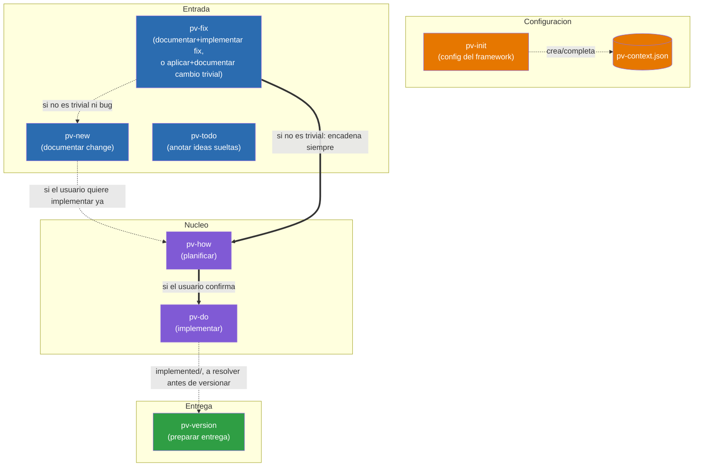
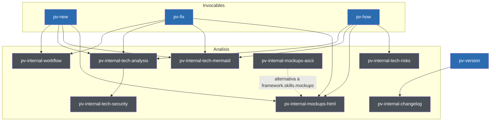
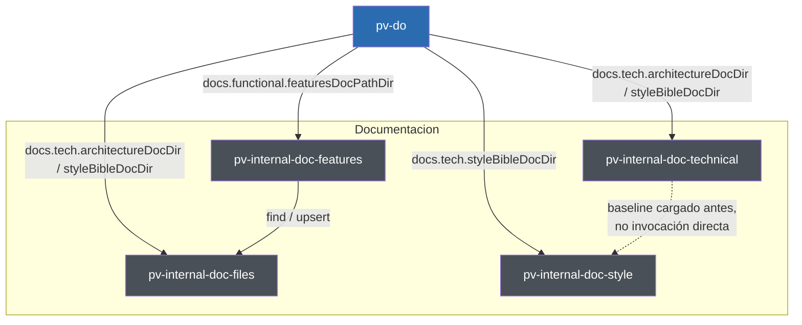

# Previo: Documentación de diseño

Mapa de las skills que componen el framework `pv-*` y cómo se invocan entre sí.

## Índice

- [Diagrama de relaciones](#diagrama-de-relaciones)
- [Responsabilidades de cada skill](#responsabilidades-de-cada-skill)
  - [Invocables por el usuario](#invocables-por-el-usuario)
  - [Internas y de soporte](#internas-y-de-soporte)
    - [Análisis](#análisis)
    - [Documentación](#documentación)
- [El fichero `pv-context.json`](#el-fichero-pv-contextjson)
  - [skillModels](#skillmodels)
  - [framework](#framework)
- [El lanzador `pv.py`](#el-lanzador-pvpy)
- [Convención de marcadores en plantillas](#convención-de-marcadores-en-plantillas)
- [Diagramas de flujo (workflow diagrams)](#diagramas-de-flujo-workflow-diagrams)
- [Estructura completa de carpetas y ficheros](#estructura-completa-de-carpetas-y-ficheros)

## Diagrama de relaciones

Diagrama simplificado con solo el flujo principal visible al usuario. Las skills internas (`pv-internal-workflow`, `pv-internal-tech-analysis`, `pv-internal-tech-security`, `pv-internal-tech-mermaid`, `pv-internal-tech-risks`, `pv-internal-mockups-html`, `pv-internal-mockups-ascii`, `pv-internal-doc-files`, `pv-internal-doc-features`, `pv-internal-doc-technical`, `pv-internal-doc-style`, `pv-internal-changelog`) y de soporte (`pv-status`) no aparecen aquí — su relación con el resto está descrita en la sección de responsabilidades más abajo. El flujo interno de `pv-version`/`pv-internal-changelog` (con guardarraíles y detalle paso a paso) tiene su propio diagrama, no duplicado aquí: [`.claude/skills/pv-version/version-flow-diagram.template.md`](skills/pv-version/version-flow-diagram.template.md).

`pv-how` (planificar) y `pv-do` (implementar) son dos skills separadas: `pv-how` analiza la solución técnica y escribe `plan.md`, y solo si el usuario confirma que quiere implementar ya, encadena `pv-do`, que es quien edita el código. También se puede invocar `pv-do` directamente sobre una entrada que ya tenga `plan.md`, sin pasar por `pv-how` de nuevo.



Leyenda:
- Flechas sólidas (`-->`, `==>`): invocación directa de skill a skill dentro del mismo proceso.
- Flechas punteadas (`-.->`): dependencia de configuración o invocación condicional.
- `pv-todo` no tiene ninguna flecha hacia el resto del flujo: vive aislado en `{changesDir}/todo/`, ajeno al resto de skills.
- `pv-fix` es la única skill de "Entrada" que puede terminar sin pasar por `plan.md`: si el cambio (bug o no) de verdad califica como trivial, crea la entrada en `{changesDir}/inProgress/{xxxx}/` vía `pv-internal-workflow` (numeración `xxxx` normal) y la mueve a `implemented` en la misma invocación, sin generar `plan.md` ni encadenar `pv-how`/`pv-do`. Solo cae en `pv-new` cuando el análisis revela que no era trivial y tampoco es un bug (afecta a arquitectura/estilo, falta información, toca más de 2 ficheros, o es funcionalidad nueva).
- `pv-version` no consume la salida de `pv-do` directamente: solo exige, como guardarraíl de arranque, que `{changesDir}/implemented/` esté vacío (cada entrada resuelta se mueve a `closed` antes de continuar).
- Todas las skills leen `.claude/pv-context.json` para funcionar, no solo las que aparecen aquí conectadas a él — se omite esa flecha hacia cada una para no saturar el diagrama; `pv-init` es la única que lo escribe.

## Responsabilidades de cada skill

### Invocables por el usuario

- **pv-init** — Inicializa el framework: crea/completa `.claude/pv-context.json` (`framework.workFolder` — fijo en `/previo-sdd`, nunca preguntado, raíz relativa al repo bajo la que el framework gestiona `changes/`, `versions/` y `stuff/`, subcarpetas de nombre fijo que las skills crean por sí mismas —, docs a sincronizar, configuración de idioma) y comprueba que las herramientas de línea de comandos necesarias estén instaladas. En un primer `pv-init`, pregunta siempre el idioma de interacción (`framework.interaction.language`) y, con un sí/no, si el resto de áreas (`changes`, `versions`, `docs.functional`, `docs.tech`) comparten ese mismo idioma o se configuran una a una; deja constancia del porqué de cada elección en `framework._comments`. Si el proyecto ya estaba inicializado sin idioma configurado (`hasLanguage: false`), añade esa pregunta a la misma ronda que complete el resto de opcionales pendientes, sin volver a preguntar si ya estaba resuelto. Único punto de configuración del que dependen todas las demás skills. *Usa:* ninguna otra skill.

  Assets y scripts:
  - [`workflow.init.md`](skills/pv-init/workflow.init.md) — diagrama Mermaid del flujo completo de esta skill (ver "Diagramas de flujo" más arriba); se lee antes de ejecutar cualquier paso, fuente de verdad de la secuencia y las ramas.
  - [`assets/pv.py`](skills/pv-init/assets/pv.py) — copia maestra del lanzador `pv.py`; `scaffold-project.py` la copia (sobrescribiendo siempre) a la raíz del repo en cada `pv-init`.
  - [`schema.json`](skills/pv-init/schema.json) — JSON Schema completo de `.claude/pv-context.json` (`additionalProperties: false` en cada nivel); es la referencia normativa de qué campos existen y sus valores por defecto.
  - [`scripts/check-context.py`](skills/pv-init/scripts/check-context.py) — comprueba si `pv-context.json` existe y está completo (sección `framework` presente, si tiene `interaction.language`), para que `pv-init` decida si hace falta el cuestionario completo, solo lo que falta, o nada.
  - [`scripts/collect-skill-models.py`](skills/pv-init/scripts/collect-skill-models.py) — lee el frontmatter `model`/`effort` real de cada `SKILL.md` `pv-*` y propone una sección `skillModels` (`default` + `overrides`) que lo refleja, para que `pv-init` la escriba en `pv-context.json` incluso si el usuario no personaliza nada.
  - [`scripts/scaffold-project.py`](skills/pv-init/scripts/scaffold-project.py) — crea la estructura base de carpetas (`changes/{inProgress,implemented,todo,closed}`, `versions/`, `stuff/`) y los placeholders de `docs.tech.*`/`docs.functional.featuresDocPathDir` que falten, y sobrescribe `pv.py` en la raíz del repo con la copia de `assets/pv.py`.
  - [`scripts/sync-skill-models.py`](skills/pv-init/scripts/sync-skill-models.py) — propaga `pv-context.json#skillModels` (`default`/`overrides`) al frontmatter real (`model:`/`effort:`) de cada `SKILL.md` `pv-*`, subiendo el patch de `metadata.version` si algo cambió; es el único paso que hace que `skillModels` tenga efecto real, ya que el harness solo lee el frontmatter.

- **pv-new** — Documenta un cambio intencionado (funcionalidad nueva o modificación de comportamiento a propósito, no un bug). Invoca `pv-internal-tech-analysis` para reunir contexto técnico antes de anticipar dudas funcionales típicas, genera `description.md` vía `pv-internal-workflow` y, si aplica, diagramas Mermaid funcionales por caso de uso (vía `pv-internal-tech-mermaid`) y maquetas visuales `design_*.html` (vía `pv-internal-mockups-html`, o la alternativa configurada en `framework.skills.mockups`), validando ambos con el usuario antes de dar el cambio por documentado. No implementa nada por sí misma, pero si el usuario quiere implementar de inmediato puede invocar directamente `pv-how` sobre la entrada recién creada. *Usa:* `pv-internal-workflow`, `pv-internal-tech-analysis`, `pv-internal-tech-mermaid`, `pv-internal-mockups-html`, `pv-how`.

  Assets y scripts:
  - [`extend-entry.md`](skills/pv-new/extend-entry.md) — procedimiento completo para cuando el `xxxx` indicado ya existe en `inProgress`: en vez de crear una entrada nueva, actualiza `description.md`/`history.md` directamente (sin pasar por `pv-internal-workflow`, que solo sabe crear), regenera diagramas/maquetas/datos si la extensión los toca, y avisa si ya había `plan.md` que quedaría desactualizado.
  - [`todo-mode.md`](skills/pv-new/todo-mode.md) — procedimiento para `/pv-new todo <code>`: toma una idea ya anotada en `{changesDir}/todo/{code}/` como si fuera la petición del usuario, ofrece refinarla antes de documentar, y borra la carpeta de `todo/` automáticamente en cuanto la nueva entrada de `inProgress` existe.

- **pv-fix** — Documenta un bug y lo implementa de punta a punta, y además es la vía rápida del framework para cambios tan pequeños que casi no requieren análisis (typo, texto, un valor/constante, un ajuste de estilo aislado, sea o no un bug). Primero invoca `pv-internal-tech-analysis` para valorar si lo pedido es `fast` (sin ambigüedad, ≤2 ficheros, sin afectar a `docs.tech.architectureDocDir`/`docs.tech.styleBibleDocDir` ni incongruencias detectadas con ellos, sin comportamiento nuevo). Si es `fast`, crea la entrada vía `pv-internal-workflow` (`action=create`, `type=fast`), aplica el cambio directamente y la mueve a `implemented` (`action=move`) en la misma invocación, sin `plan.md`. Si no es `fast` y es un bug, genera `description.md` vía `pv-internal-workflow` (`type=fix`), invocando `pv-internal-tech-mermaid`/`pv-internal-mockups-html` cuando el fix tiene flujo o componente visual que representar, y encadena automáticamente `pv-how` para corregirlo de punta a punta, con el análisis acotado estrictamente a la causa raíz (sin ampliar alcance). Si no es `fast` y no es un bug, avisa al usuario e invoca `pv-new` con su petición. *Usa:* `pv-internal-workflow`, `pv-internal-tech-analysis`, `pv-internal-tech-mermaid`, `pv-internal-mockups-html`, `pv-new`, `pv-how`.

  Assets y scripts: ninguno propio — reutiliza `extend-entry.md` de `pv-new` cuando el `xxxx` indicado ya existe en `inProgress`.

- **pv-how** — Toma una entrada ya documentada en `inProgress`, invoca `pv-internal-tech-analysis` para reunir el contexto técnico, analiza la solución técnica y escribe `plan.md` (usando `pv-internal-tech-mermaid`/`pv-internal-mockups-html` cuando lo que hay que describir es un flujo o requiere maqueta visual). Con `plan.md` ya escrito, invoca `pv-internal-tech-risks` para valorar el riesgo de romper algo al implementarlo y escribe la mediana devuelta en la cabecera del plan (el detalle de los 9 factores solo se añade si el usuario lo pide). Si el usuario confirma que quiere implementar ya, encadena directamente `pv-do` sobre la misma entrada. *Usa:* `pv-internal-tech-analysis`, `pv-internal-tech-mermaid`, `pv-internal-mockups-html`, `pv-internal-tech-risks`, `pv-do`.

  Assets y scripts:
  - [`PLAN.template.md`](skills/pv-how/PLAN.template.md) — plantilla de `plan.md`: cabecera (fecha, riesgo), notas funcionales (fuera de alcance, dudas resueltas), solución técnica en checklist, cambios de arquitectura/estilo (opcionales), verificación en checklist, y detalle de riesgo (solo si el usuario lo pide), con la tabla de significado de cada valor de mediana 0-10.
  - [`scripts/get-max-change-codes.py`](skills/pv-how/scripts/get-max-change-codes.py) — devuelve el `xxxx` más alto existente en cada estado (`inProgress`/`implemented`/`closed`) de `changes/`; `pv-how` lo usa como comprobación previa para detectar si la entrada a planificar es más antigua que otra ya creada después, y por tanto debería reanalizarse antes de planificar.

- **pv-do** — Toma una entrada de `inProgress` cuyo `plan.md` ya está escrito (por `pv-how`, o invocada directamente por el usuario), implementa el código, actualiza la documentación sincronizada (`docs.tech.architectureDocDir`/`docs.functional.featuresDocPathDir`/`docs.tech.styleBibleDocDir` — incluyendo cualquier incongruencia que `pv-internal-tech-analysis` haya reportado vía `pv-how`) y mueve la carpeta a `implemented` vía `pv-internal-workflow`. Si `docs.functional.featuresDocPathDir` es una carpeta, delega su lectura/escritura en `pv-internal-doc-features` en vez de tocarla directamente. Antes de redactar o editar contenido de `docs.tech.architectureDocDir`/`styleBibleDocDir`, invoca `pv-internal-doc-technical` para cargar su estilo de escritura (pensado para que lo lea una IA, no una persona) y lo aplica al redactar; para `styleBibleDocDir` en concreto, invoca además `pv-internal-doc-style` para obtener las categorías de estilo aplicables y sus propias reglas de escritura. *Usa:* `pv-internal-workflow`, `pv-internal-doc-features`, `pv-internal-doc-technical`, `pv-internal-doc-style`.

  Assets y scripts:
  - [`FEATURES.template.md`](skills/pv-do/FEATURES.template.md) — plantilla de entrada para `docs.functional.featuresDocPathDir` cuando ese campo es un único fichero `.md` (proyectos aún no migrados a carpeta): área funcional, nombre, descripción, diagrama Mermaid funcional opcional, dónde se usa y código(s) `xxxx` asociados.

- **pv-status** — Da una vista general de solo lectura del estado del proyecto (totales por tipo —incluido `fast`, el atajo trivial de `pv-fix`— y por estado, detalle de qué está solo descrito vs. listo para implementar, y listado aparte de los cambios `fast` ya aplicados). No crea, mueve ni modifica nada; el informe se entrega en el chat salvo que el usuario pida guardarlo. *Usa:* ninguna otra skill.

  Assets y scripts:
  - [`STATUS.template.md`](skills/pv-status/STATUS.template.md) — plantilla del informe completo: resumen con barras de texto, tabla de totales por tipo/estado, listas de "listo para cerrar"/"pendiente de análisis"/"planificado", secciones opcionales (`fast`, avisos) que se eliminan enteras si no aplican, e ideas en `todo/`.
  - [`STATUS.filtered.template.md`](skills/pv-status/STATUS.filtered.template.md) — plantilla del listado filtrado a un único estado (`/pv-status <estado>`): tabla con código, tipo, descripción, riesgo y fecha.
  - [`STATUS.todo.template.md`](skills/pv-status/STATUS.todo.template.md) — plantilla del listado completo de ideas en `todo/` (`/pv-status todo`), con el texto íntegro de cada idea sin truncar.
  - [`scripts/collect_status.py`](skills/pv-status/scripts/collect_status.py) — recorre `{changesDir}` y devuelve un JSON con el detalle y los totales agregados de cada entrada (tipo, nombre, si tiene `description.md`/`plan.md`, sub-estado dentro de `inProgress`, riesgo); no escribe nada, solo diagnostica.
  - [`scripts/filter_status.py`](skills/pv-status/scripts/filter_status.py) — listado de un único estado ya renderizado en markdown (o texto plano con `--terminal`) según `STATUS.filtered.template.md`, para que el modelo no tenga que aplicar la plantilla a mano.
  - [`scripts/list_todo.py`](skills/pv-status/scripts/list_todo.py) — listado completo de `todo/` ya renderizado según `STATUS.todo.template.md` (o `--terminal`), reutilizando el parser de `collect_status.py`.
  - [`scripts/render_status.py`](skills/pv-status/scripts/render_status.py) — renderiza el informe completo según `STATUS.template.md` (o `--terminal`), aplicando todo el mapeo de campos, barras y secciones opcionales para que el modelo solo tenga que pegar la salida.
  - [`scripts/terminal_output.py`](skills/pv-status/scripts/terminal_output.py) — helpers de formato para el modo `--terminal` (ancho fijo a 70 columnas, color condicional, ancho visual con emojis); uso exclusivo de `pv.py`, la skill invocada desde chat nunca pasa ese flag.

- **pv-todo** — Cuaderno de ideas sueltas, deliberadamente fuera del flujo de trabajo del framework: vive en `{changesDir}/todo/`, con numeración e identificadores propios que ninguna otra skill `pv-*` lee ni cuenta. Sirve para anotar ideas incompletas sin forzar el análisis de alcance de `pv-new`/`pv-fix`. *Usa:* ninguna otra skill.

  Assets y scripts:
  - [`description.template.md`](skills/pv-todo/description.template.md) — plantilla de `description.md` de una idea: nombre corto, código, fecha de creación y notas libres, sin forzar la estructura de `pv-new`/`pv-fix`.
  - [`scripts/new-todo-code.py`](skills/pv-todo/scripts/new-todo-code.py) — genera un código alfanumérico corto (5 caracteres por defecto) que no colisiona con ningún `{changesDir}/todo/` existente; espacio de numeración propio, ajeno al `xxxx` de change/fix.

- **pv-version** — Prepara una entrega en `{workFolder}/versions/{XXXX}/`: exige primero que `{changesDir}/implemented/` esté vacío (cada entrada se resuelve moviéndola a `closed`), genera el entregable siguiendo `{workFolder}/stuff/how-to-compile-version.md` (procedimiento propio del proyecto, escrito la primera vez que hace falta, capaz de describir varios pasos si el build genera varios artefactos), comprime en `.zip` y copia `docs.tech.architectureDocDir`/`docs.tech.styleBibleDocDir`/`docs.functional.featuresDocPathDir` que estén configuradas, y encadena `pv-internal-changelog` para el changelog funcional. Si se invoca solo para informar de un cambio en el procedimiento de build, actualiza `{workFolder}/stuff/how-to-compile-version.md` sin lanzar el resto del proceso salvo confirmación explícita. `{XXXX}` es texto libre elegido por el usuario en cada invocación, sin relación con la numeración `xxxx` de change/fix ni con ninguna otra carpeta "versions" que exista en el repo. *Usa:* `pv-internal-changelog`.

  Assets y scripts:
  - [`how-to-compile-version.template.md`](skills/pv-version/how-to-compile-version.template.md) — plantilla que `pv-version` copia a `{workFolder}/stuff/how-to-compile-version.md` la primera vez que hace falta: comando(s) a ejecutar, fichero(s) generado(s) y notas, con soporte para varios pasos independientes si el build genera varios artefactos.
  - [`scripts/copy-build-artifacts.py`](skills/pv-version/scripts/copy-build-artifacts.py) — copia cada artefacto ya generado (uno o varios `--source`) a `{workFolder}/versions/{xxxx}/files/`, manteniendo el nombre de fichero; falla sin copiar nada si algún origen no existe, para no dejar una entrega a medias.
  - [`scripts/copy-docs.py`](skills/pv-version/scripts/copy-docs.py) — comprime en `.zip` cada una de `docs.tech.architectureDocDir`/`styleBibleDocDir`/`docs.functional.featuresDocPathDir` que esté configurada (carpeta completa o fichero `.md` suelto) y las guarda en `{workFolder}/versions/{xxxx}/docs/`; las no configuradas se omiten sin error.
  - [`scripts/init-version-folder.py`](skills/pv-version/scripts/init-version-folder.py) — crea `{workFolder}/versions/{xxxx}/` con sus subcarpetas vacías `files/` y `docs/`; falla sin tocar nada si esa carpeta ya existe.
  - [`version-flow-diagram.template.md`](skills/pv-version/version-flow-diagram.template.md) — diagrama Mermaid general del proceso de `pv-version` (guardarraíl de `implemented/` vacío → crear carpeta → compilar → comprimir docs → changelog → confirmar), pensado para mostrarse tal cual si el usuario pregunta cómo funciona `/pv-version`.

### Internas y de soporte

`pv-internal-workflow`, `pv-internal-tech-analysis`, `pv-internal-tech-security`, `pv-internal-doc-files`, `pv-internal-doc-style` y `pv-internal-changelog` solo se ejecutan cuando otra skill del framework las invoca como parte de su propio proceso; si el usuario las invoca directamente (o pide "ejecuta X" en texto plano sin venir de ese contexto), se detienen sin hacer nada y redirigen a la skill correspondiente.

Se dividen en dos grupos: las de **análisis** (contexto técnico, riesgo, seguridad, diagramas, maquetas, mecánica de fichero de `changes/`, changelog) y las de **documentación** (gestión de `docs.functional`/`docs.tech`), cada una con su propio diagrama de relaciones.

#### Análisis

Diagrama de relaciones de las skills de análisis entre sí y con las skills invocables por el usuario que las usan. En gris, las internas de esta subsección; en azul, las invocables por el usuario (mismo color que en el diagrama principal).



Leyenda:
- Flechas sólidas (`-->`): invocación directa de skill a skill dentro del mismo proceso.
- Flechas punteadas (`-.->`): configuración intercambiable (`framework.skills.mockups`) — quien aparece como origen no se invoca a sí mismo, sustituye al destino solo si esa alternativa está configurada.
- `pv-internal-tech-mermaid` y `pv-internal-mockups-html` son las skills de `framework.skills.diagrams`/`framework.skills.mockups` — `pv-new`/`pv-fix`/`pv-how` las invocan por el nombre configurado ahí, por defecto las que aparecen en el diagrama; `pv-internal-mockups-ascii` es la única alternativa ya incluida en el framework para `skills.mockups`, transparente para quien la invoca.

- **pv-internal-workflow** — Centraliza la mecánica de fichero del framework: numerar y crear entradas nuevas en `inProgress` (`action=create`, con `type` `change`/`fix`/`fast`), y mover carpetas entre estados (`action=move`). No analiza ni decide nada, solo ejecuta lo que la skill llamante ya resolvió. Para el atajo `fast` de `pv-fix`, quien invoca típicamente encadena `create` y `move` en la misma invocación, sin pasar por `plan.md`. *Usa:* ninguna otra skill.

  Assets y scripts:
  - [`description.template.md`](skills/pv-internal-workflow/description.template.md) — plantilla de `description.md` de un change/fix: nombre, código, tipo, fecha de creación, descripción funcional completa (sin detalles técnicos) y notas técnicas opcionales.
  - [`history.template.md`](skills/pv-internal-workflow/history.template.md) — plantilla de `history.md`: histórico verbatim de los prompts con los que el usuario planteó/amplió la entrada, de uso exclusivo de `pv-new`/`pv-fix` — ninguna otra skill debe leerlo ni tenerlo en cuenta.
  - [`scripts/move-change.py`](skills/pv-internal-workflow/scripts/move-change.py) — mueve `{workFolder}/changes/{from}/{xxxx}/` a `{workFolder}/changes/{to}/{xxxx}/` con todo su contenido; falla sin mover nada si el origen no existe o el destino ya está ocupado.
  - [`scripts/next-change-number.py`](skills/pv-internal-workflow/scripts/next-change-number.py) — calcula el siguiente `xxxx` libre buscando el número más alto entre todas las subcarpetas numéricas de cualquier subestado de `changes/` (excepto `todo/`, que tiene numeración propia ajena al flujo de change/fix).

- **pv-internal-tech-analysis** — Centraliza cómo reunir contexto técnico fiable: lee primero la documentación de `framework.docs.tech` configurada, y solo explora código si hace falta completar información. Si el tema toca una interfaz o estructura de datos, exige tener su definición completa (firma, parámetros, retorno, campos) antes de dar el contexto por reunido, explorando código puntualmente si hace falta — y si queda una duda de definición que ni la documentación ni el código resuelven, la confirma directamente con el usuario. Si detecta incongruencias entre documentación y código, el código manda y la incongruencia se devuelve como hallazgo a quien invoca. Al terminar, invoca `pv-internal-tech-security` para contrastar el cambio contra su checklist de seguridad y añade los pendientes al resultado (nunca edita nada ella misma). La usan `pv-new`, `pv-fix` e `pv-how`. *Usa:* `pv-internal-tech-security`.

  Assets y scripts: ninguno propio.

- **pv-internal-tech-security** — Contrasta un change/fix contra una checklist de categorías de seguridad (autenticación, autorización, validación de entradas/inyección, secretos, transporte, datos sensibles, dependencias, infraestructura, API, logging, hardening de cliente), a partir del resumen del cambio y el contexto ya reunido por quien invoca. Para cada categoría aplicable, distingue entre las ya cubiertas por el contexto disponible y las que quedan pendientes de revisar. No explora código por iniciativa propia ni decide diseño, solo contrasta contra la checklist. La usa `pv-internal-tech-analysis`. *Usa:* ninguna otra skill.

  Assets y scripts: ninguno propio.

- **pv-internal-tech-mermaid** — Genera diagramas Mermaid (funcionales o técnicos: flujo, secuencia) que representan un caso de uso, historia de usuario, flujo de trabajo o comunicación entre componentes, a partir de la lista de diagramas que quien invoca necesita (tipo y qué debe representar cada uno). No decide qué diagramas hacen falta ni dónde se insertan, solo redacta el código Mermaid. Es la skill de diagramas por defecto de `framework.skills.diagrams` — un proyecto puede sustituirla por otra siempre que cumpla el mismo contrato de entrada/salida. La usan `pv-internal-workflow`, `pv-new`, `pv-fix` y `pv-how`. *Usa:* ninguna otra skill.

  Assets y scripts: ninguno propio.

- **pv-internal-tech-risks** — Valora el riesgo de romper algo al implementar la solución técnica ya escrita en `plan.md` de un change/fix: puntúa 9 factores (uso compartido, alcance, profundidad, cobertura de tests, criticidad, reversibilidad, datos persistentes, superficie de seguridad, datos sensibles) de 0 a 10, explorando `sourcecodeDir` puntualmente si `plan.md`/`description.md` no bastan para valorar alguno, y devuelve la lista `factor=valor` más la mediana. Solo se invoca cuando `plan.md` ya está escrito — antes no hay información suficiente. No escribe nada; quien invoca decide qué persistir. La usa `pv-how`. *Usa:* ninguna otra skill.

  Assets y scripts: ninguno propio.

- **pv-internal-mockups-html** — Genera o edita maquetas visuales estáticas en HTML/CSS/SVG autocontenido (`design_*.html`) de un elemento de UI nuevo o modificado, a partir de la carpeta destino y la lista de elementos que quien invoca necesita maquetar. No decide qué elementos hacen falta ni valida nada con el usuario, solo produce los ficheros y devuelve sus rutas. Es la skill de maquetas por defecto de `framework.skills.mockups`. La usan `pv-new` y `pv-fix`. *Usa:* ninguna otra skill.

  Assets y scripts: ninguno propio.

- **pv-internal-mockups-ascii** — Misma función y mismo contrato de entrada/salida que `pv-internal-mockups-html`, pero generando las maquetas como arte ASCII en texto plano (`design_*.txt`) en vez de HTML. Solo se invoca cuando un proyecto configura `framework.skills.mockups` para usar esta alternativa en lugar de la de por defecto. *Usa:* ninguna otra skill.

  Assets y scripts: ninguno propio.

#### Documentación

Skills dedicadas a gestionar `docs.functional.featuresDocPathDir`, `docs.tech.architectureDocDir` y `docs.tech.styleBibleDocDir`: qué escribir, cómo redactarlo y dónde guardarlo.



Leyenda:
- Flechas sólidas (`-->`): invocación directa de skill a skill, con la etiqueta indicando a qué campo de `docs.*` corresponde.
- `pv-do` invoca `pv-internal-doc-files` directamente para `architectureDocDir`/`styleBibleDocDir` (no tiene skill de dominio intermedia como `pv-internal-doc-features`); para `featuresDocPathDir` pasa siempre por `pv-internal-doc-features`, que a su vez delega en `pv-internal-doc-files`.
- `pv-internal-doc-technical`/`pv-internal-doc-style` nunca invocan a `pv-internal-doc-files` ni a la inversa: las dos primeras deciden qué documentar (cada una en su campo: `doc-technical` en `architectureDocDir`, `doc-style` en `styleBibleDocDir`) y cómo redactarlo; la última solo decide dónde/cómo guardarlo.
- Flecha punteada `pv-internal-doc-technical -.-> pv-internal-doc-style`: no es una invocación directa (ninguna de las dos skills invoca a la otra) — es una dependencia de orden que impone `pv-do`, que siempre invoca primero `pv-internal-doc-technical` para cargar el estilo de escritura base (fragmentos densos, tablas, código, tags fijos) y después `pv-internal-doc-style`, cuyas propias reglas de escritura están definidas como una extensión de ese baseline y presuponen que ya está cargado en contexto.

**Tabla de responsabilidades comparadas:**

| | `pv-internal-doc-files` | `pv-internal-doc-features` | `pv-internal-doc-technical` | `pv-internal-doc-style` |
|---|---|---|---|---|
| Decide **qué** dice el contenido | No | No — lo hace `pv-do` | **Sí, para `architectureDocDir`** — checklist de categorías técnicas (componentes, contratos, flujos de datos, decisiones, dependencias, modelo de datos, configuración); estructura del documento sigue libre. No decide el qué de `styleBibleDocDir` (eso es `doc-style`) | **Sí** — checklist de categorías + qué debe registrar cada una |
| Decide **cómo redactarlo** | No | No — construye el `body` con las reglas de dominio de features (campos, diagramas, cross-links) pero no decide el estilo de prosa | **Sí** — reglas de escritura generales (fragmentos densos, tablas, código, tags fijos) | **Sí** — reglas de escritura propias, encima de las de `doc-technical` |
| Gestiona el fichero (numeración `NNN`, `Area`, `INDEX.md`, `find`/`upsert`) | **Sí** — para las tres carpetas (`featuresDocPathDir`, `architectureDocDir`, `styleBibleDocDir`) | No — delega en `pv-internal-doc-files` | No | No — el fichero lo gestiona `pv-do` invocando `pv-internal-doc-files` |
| Escribe algo en disco | **Sí** (acción `upsert`) | No (delega en `doc-files`) | No | No, nunca |
| A qué campo aplica | `docs.functional.featuresDocPathDir`, `docs.tech.architectureDocDir` **y** `docs.tech.styleBibleDocDir` | `docs.functional.featuresDocPathDir` | `docs.tech.architectureDocDir` **y** `docs.tech.styleBibleDocDir` | `docs.tech.styleBibleDocDir` únicamente |

`pv-internal-doc-files` es el único punto que toca disco para las tres áreas de documentación: numera (`NNN`), calcula el slug, escribe el fichero con el campo `**Area**:` y regenera `INDEX.md`. `pv-internal-doc-features` conserva su responsabilidad de dominio (plantilla, campos `Available in`/`Code`/`Since`/`Last modified`, diagramas funcionales, regla de no duplicar entrada) pero delega en `doc-files` todo lo que es numeración/índice. `pv-internal-doc-technical`/`pv-internal-doc-style` no gestionan fichero ni deciden dónde se guarda — eso lo hace `pv-do` invocando `pv-internal-doc-files` — pero `doc-technical` sí decide el catálogo de categorías de contenido para `architectureDocDir` (ver tabla anterior).

- **pv-internal-doc-files** — Skill compartida y agnóstica de proyecto para la gestión de fichero de las tres carpetas de documentación (`docs.functional.featuresDocPathDir`, `docs.tech.architectureDocDir`, `docs.tech.styleBibleDocDir`): `find` localiza si un tema ya tiene fichero propio leyendo `INDEX.md` (regenerándolo primero si falta) y confirmando candidatos plausibles; `upsert` escribe `{folder}/{NNN}-{slug}.md` (número de tres dígitos, campo `**Area**:`, y a continuación el `body` ya redactado por quien invoca) y regenera `INDEX.md`. No decide qué dice la documentación ni cómo redactarla — solo dónde y cómo se guarda en disco; quien invoca (`pv-internal-doc-features`, o `pv-do` directamente para architecture/style) aporta `area`, `title` y un `body` ya completamente formateado. La usan `pv-internal-doc-features` y `pv-do`. *Usa:* ninguna otra skill.

  Assets y scripts:
  - [`scripts/_slug.py`](skills/pv-internal-doc-files/scripts/_slug.py) — helper interno compartido, no invocable directamente: `slugify()` normaliza un título a slug ASCII en minúsculas, y `github_anchor()` replica el algoritmo de anclas de GitHub para reescribir enlaces `#ancla` al migrar un `FEATURES.md` legado.
  - [`scripts/next-feature-number.py`](skills/pv-internal-doc-files/scripts/next-feature-number.py) — calcula el siguiente número libre (prefijo del título, no del nombre de fichero) buscando el máximo ya usado en la carpeta; un número borrado nunca se reutiliza.
  - [`scripts/rebuild-index.py`](skills/pv-internal-doc-files/scripts/rebuild-index.py) — regenera `INDEX.md` a partir de todos los ficheros de la carpeta, agrupados por área; única fuente de verdad de ese índice, nunca se edita a mano.
  - [`scripts/slugify.py`](skills/pv-internal-doc-files/scripts/slugify.py) — calcula la parte de texto (slug) del nombre de fichero de un fichero nuevo (`{número}-{slug}.md`); el número ya garantiza que no hay colisión, así que el slug no necesita comprobar nada por sí mismo.

- **pv-internal-doc-features** — Encapsula las reglas de dominio de `docs.functional.featuresDocPathDir` cuando es una carpeta (un fichero por funcionalidad): construye el `body` con sus campos específicos (`Available in`/`Code`/`Since`/`Last modified`, descripción funcional, diagrama Mermaid opcional, cross-links `[text](NNN-slug.md)`) y la regla de nunca duplicar una entrada (editarla en su sitio). Delega toda la gestión de fichero — numeración, `INDEX.md`, `find`/`upsert` — en `pv-internal-doc-files`. La usa `pv-do`. *Usa:* `pv-internal-doc-files`.

  Assets y scripts:
  - [`FEATURE.template.md`](skills/pv-internal-doc-features/FEATURE.template.md) — plantilla de cada fichero de funcionalidad: número, área, descripción funcional, diagrama Mermaid opcional, dónde se usa, código(s) `xxxx` asociados y fechas de alta/última modificación.
  - [`scripts/migrate-legacy-features-doc.py`](skills/pv-internal-doc-features/scripts/migrate-legacy-features-doc.py) — utilidad puntual (no una skill invocable) que divide un `FEATURES.md` monolítico (`## Área` / `### Funcionalidad`) en un fichero por funcionalidad dentro de una carpeta, reescribe los enlaces internos, asigna numeración secuencial y regenera `INDEX.md`; para adoptar la convención de carpeta en un proyecto que aún tenía un único fichero.

- **pv-internal-doc-technical** — Qué y cómo escribir `docs.tech.architectureDocDir` (checklist de categorías de contenido técnico — componentes, contratos, flujos de datos, decisiones, dependencias, modelo de datos, configuración) y estilo de escritura compartido con `styleBibleDocDir` (fragmentos densos, tablas, código, tags fijos en inglés). No decide el qué de `styleBibleDocDir` (lo hace `pv-internal-doc-style`) ni la estructura/tema concretos de cada documento, ni escribe nada por sí misma: solo carga la checklist y las reglas antes de que quien invoca redacte. La usa `pv-do`. *Usa:* ninguna otra skill.

  Assets y scripts: ninguno propio.

- **pv-internal-doc-style** — Encima del estilo de escritura compartido de `pv-internal-doc-technical`, define qué debe cubrir en concreto `docs.tech.styleBibleDocDir`: una checklist de categorías de estilo (convenciones de escritura/nombrado, que siempre aplica; tokens de diseño visual, layout, patrones de interacción, accesibilidad, componentes reutilizables y contenido/microcopy, que solo aplican si el proyecto tiene capa de presentación — incluida la salida coloreada, tablas y prompts de una CLI, no solo una GUI) más reglas de escritura propias (dar siempre el valor concreto, una fila de tabla por token/estado/variante, indicar la condición que dispara cada estado de interacción, no dar nunca por hecha la accesibilidad sin el dato que la respalde, señalar la maqueta o el componente fuente en vez de redescribirlo, agrupar por categoría y no por change/fix). A partir de un resumen de lo que se está documentando y el contexto ya reunido, devuelve qué categorías aplican, cuáles ya están cubiertas y cuáles quedan pendientes, y las reglas de escritura a aplicar — no redacta nada, no decide estructura ni escribe nada por sí misma. La usa `pv-do`. *Usa:* ninguna otra skill.

  Assets y scripts: ninguno propio.

- **pv-internal-changelog** — Redacta `changelog.md` de una entrega a partir de las entradas acumuladas en `{changesDir}/closed/`: las de tipo `fix` van directas a la sección Fixes, y el resto se clasifica comparando contra el `changelog.md` de la versión anterior en `{workFolder}/versions/` (si existe) en Nuevo/Cambios/Eliminado. Añade una cabecera con el número de entradas de cada sección y borra las carpetas incorporadas de `closed/` tras confirmación explícita del usuario. La usa `pv-version`. *Usa:* ninguna otra skill.

  Assets y scripts:
  - [`changelog.template.md`](skills/pv-internal-changelog/changelog.template.md) — plantilla de `changelog.md`: cabecera con el conteo de cada sección (Nuevo/Cambios/Eliminado/Fixes), tono de changelog en pasado, sin mencionar ficheros ni detalles técnicos; una sección vacía se omite entera.
  - [`scripts/stage-closed-entries.py`](skills/pv-internal-changelog/scripts/stage-closed-entries.py) — mueve las entradas actuales de `closed/` a `closed/temp/` antes de redactar, para que cualquier change/fix cerrado mientras se prepara la entrega no afecte al changelog en curso.
  - [`scripts/list-closed-entries.py`](skills/pv-internal-changelog/scripts/list-closed-entries.py) — lista las entradas ya en `closed/temp/` (código y ruta de su `description.md`) sin interpretarlas — la clasificación Nuevo/Cambios/Eliminado la hace la skill, no el script.
  - [`scripts/find-previous-version.py`](skills/pv-internal-changelog/scripts/find-previous-version.py) — localiza la versión anterior en `{workFolder}/versions/` (por mtime de carpeta, excluyendo la que se está generando) para comparar contra su `changelog.md`; el resultado se confirma con el usuario si hay ambigüedad.
  - [`scripts/delete-closed-entries.py`](skills/pv-internal-changelog/scripts/delete-closed-entries.py) — borra, solo las carpetas de `closed/temp/` cuyo `xxxx` se pasa explícitamente (nunca "todo `temp/`" a ciegas), tras confirmación explícita del usuario — acción irreversible.
  - [`scripts/cleanup-temp-entries.py`](skills/pv-internal-changelog/scripts/cleanup-temp-entries.py) — al terminar, devuelve a `closed/` cualquier carpeta que quedara en `closed/temp/` sin confirmación de borrado, y elimina `temp/` si queda vacía; siempre seguro de ejecutar aunque `temp/` no exista.

## El fichero `pv-context.json`

Ejemplo de `.claude/pv-context.json` ya configurado:

```json
{
  "skillModels": {
    "_instructions": "Tras editar 'default' o 'overrides' de esta seccion, ejecuta desde la raiz del repo: python .claude/skills/pv-init/scripts/sync-skill-models.py -- reescribe el campo 'model'/'effort' en el frontmatter de cada SKILL.md 'pv-*' segun lo que quede configurado aqui. El harness de Claude Code solo lee ese frontmatter, no este JSON, asi que sin ejecutar el script los cambios de aqui no tienen efecto.",
    "default": { "model": "claude-sonnet-5", "effort": "medium" },
    "overrides": {
      "pv-status": { "model": "claude-haiku-4-5-20251001", "effort": "medium" },
      "pv-todo": { "model": "claude-haiku-4-5-20251001", "effort": "medium" },
      "pv-do": { "model": "claude-haiku-4-5-20251001", "effort": "high" }
    }
  },
  "framework": {
    "skills": {
      "mockups": "pv-internal-mockups-html",
      "diagrams": "pv-internal-tech-mermaid"
    },
    "sourcecodeDir": "/src",
    "workFolder": "/previo-sdd",
    "numberWidth": 5,
    "interaction": { "language": "en" },
    "changes": { "language": "es" },
    "versions": { "language": "es" },
    "docs": {
      "functional": {
        "featuresDocPathDir": "docs/features",
        "language": "es"
      },
      "tech": {
        "architectureDocDir": "docs/architecture",
        "styleBibleDocDir": "docs/style",
        "language": "en"
      }
    },
    "_comments": {
      "workFolder": "Es la carpeta de trabajo principal del framework, relativa siempre a la raíz del repo.",
      "sourcecodeDir": "Es la carpeta del código fuente del proyecto, relativa siempre a la raíz del repo.",
      "interaction.language": "El equipo habla con Claude en inglés.",
      "changes.language": "Cada change/fix en curso se documenta en español, idioma del equipo.",
      "versions.language": "El changelog publicado se redacta en español.",
      "docs.functional.language": "Documentación de funcionalidades en español.",
      "docs.tech.language": "Arquitectura y biblia de estilo en inglés, para compartir con colaboradores externos."
    }
  }
}
```

`.claude/pv-context.json` es el único punto de configuración del framework: lo que hace que las skills `pv-*` sean genéricas en vez de estar atadas a un proyecto concreto. Su forma está definida en [`.claude/skills/pv-init/schema.json`](skills/pv-init/schema.json) (JSON Schema, `additionalProperties: false` en cada nivel — cualquier campo fuera del schema es un error).

Solo lo escribe `pv-init`: crea el fichero la primera vez y, en invocaciones posteriores, hace *merge* sobre lo ya existente sin pisar nada que el usuario ya haya configurado. El resto de skills solo lo leen; si necesitan un campo que falta, la instrucción es pedirle al usuario que ejecute/complete `pv-init`, nunca reimplementar ese bootstrap por su cuenta ni asumir un valor por defecto no documentado en el schema.

Tiene dos claves de primer nivel: `skillModels` (opcional) y `framework` (obligatoria).

### skillModels

Fuente de verdad declarativa para el modelo/esfuerzo de Claude con el que corre cada skill `pv-*`. No tiene efecto por sí sola: el harness de Claude Code solo lee el campo `model`/`effort` del frontmatter de cada `SKILL.md`, no este JSON. Tras editar `default` u `overrides` hay que ejecutar `.claude/skills/pv-init/scripts/sync-skill-models.py` (o la opción equivalente del menú de `pv.py`), que reescribe ese frontmatter según lo configurado aquí — es un script determinista, sin invocar ningún modelo.

- **`_instructions`** (`string`): recordatorio embebido en el propio fichero de cómo aplicar cambios de `default`/`overrides`. Ninguna skill debe borrar esta clave.
- **`default`** (`modelConfig`): modelo/esfuerzo que aplica a cualquier skill `pv-*` sin entrada propia en `overrides`.
- **`overrides`** (`object`, opcional): un `modelConfig` por nombre de skill (el `name:` de su `SKILL.md`, p.ej. `pv-status`) para las que necesiten algo distinto del `default`.

Donde `modelConfig` es `{ "model": string, "effort": string }` — `model` acepta los mismos IDs que `/model` (p.ej. `claude-sonnet-5`, `claude-haiku-4-5-20251001`, o `inherit`); `effort` acepta los mismos valores que el frontmatter (`low`/`medium`/`high`).

### framework

Configuración de forma fija que las skills `pv-*` usan directamente, dividida en cuatro bloques: lo básico, la configuración de skills intercambiables, la configuración de idioma y la documentación de referencia externa.

#### Lo básico

- **`workFolder`** (`string`, opcional, default `"/previo-sdd"`): carpeta relativa a la raíz del repo bajo la que el framework gestiona todo su trabajo. La `/` inicial es solo un convenio visual (para que se distinga a simple vista de `docs.*`, que es relativa a `workFolder` mismo) — es opcional y todo script `pv-*` la quita antes de resolver la ruta, así que `"previo-sdd"` y `"/previo-sdd"` funcionan igual; nunca es una ruta absoluta real del sistema de ficheros. Es el único campo de `framework` que `pv-init` nunca pregunta ni confirma: siempre escribe el default en silencio, igual que `skills.mockups`/`skills.diagrams`. Si algún día se quiere otra carpeta, se cambia a mano en `pv-context.json`, bajo la responsabilidad de quien lo edite. Dentro de ella, `scaffold-project.py` de `pv-init` crea tres subcarpetas de nombre fijo justo después de escribir `pv-context.json`, que el usuario no elige ni renombra:
  - `{workFolder}/changes/` — con `inProgress/` (documentado, pendiente de planificar/implementar), `implemented/` (plan ya implementado, pendiente de entrega — lo mueve ahí `pv-do`), `todo/` (ideas sueltas de `pv-todo`, ajenas al flujo de change/fix) y `closed/` (ya incorporado a una entrega, gestionado por `pv-version`/`pv-internal-changelog`). Un mismo `{xxxx}` nunca se repite entre `inProgress`/`implemented`.
  - `{workFolder}/versions/` — una subcarpeta por entrega preparada con `pv-version`, con código `XXXX` de texto libre elegido por el usuario en cada invocación; espacio de numeración totalmente independiente del `{xxxx}` de `changes/`.
  - `{workFolder}/stuff/` — ficheros propios del proyecto que ninguna otra skill del framework decide por él, empezando por `how-to-compile-version.md` (procedimiento de build que `pv-version` pregunta y escribe la primera vez que hace falta).
- **`sourcecodeDir`** (`string`, opcional, default `"/src"`): carpeta raíz del código fuente del proyecto, relativa a la raíz del repo — con `/` inicial para que se distinga a simple vista de `docs.*`, que es relativa a `workFolder`. Mismo convenio que `workFolder`: esa `/` inicial es opcional y solo visual, nunca una ruta absoluta real — `"src"` y `"/src"` resuelven igual. La usa `pv-how` como contexto de respaldo al escribir `plan.md`, solo cuando `docs.tech.architectureDocDir` no existe como carpeta real en el repo.
- **`numberWidth`** (`integer`, opcional, default `5`, mínimo `1`): número de dígitos del código secuencial `xxxx`, con ceros a la izquierda.

#### Configuración de skills

- **`skills`** (`object`, opcional): nombres de skill intercambiables que el resto del framework invoca por nombre en vez de tenerlos fijos en el código de quien los necesita — sustituir el valor basta para cambiar de tecnología sin tocar `pv-new`/`pv-fix`/`pv-how`/`pv-internal-workflow`, siempre que la skill indicada cumpla el mismo contrato de entrada/salida que la que sustituye:
  - **`mockups`** (`string`, default `"pv-internal-mockups-html"`): skill que `pv-new`/`pv-fix` invocan para las maquetas `design_*.html` de un change/fix. Contrato: carpeta destino + lista de elementos a crear/editar como entrada; rutas de los ficheros resultantes como salida.
  - **`diagrams`** (`string`, default `"pv-internal-tech-mermaid"`): skill que `pv-internal-workflow`/`pv-new`/`pv-fix`/`pv-how` invocan para los diagramas Mermaid. Contrato: lista de diagramas a generar (tipo + qué representa cada uno) como entrada; código de cada diagrama como salida.

#### Configuración de idioma

Cada punto de escritura del framework puede tener su propio idioma en vez de uno único global. `pv-init` pregunta por esta configuración la primera vez que inicializa el proyecto (ver su entrada más arriba); el resto de skills solo la leen.

- **`interaction.language`** (`string`, opcional, default `"en"`): idioma en el que las skills `pv-*` hablan con el usuario en el chat (preguntas, confirmaciones, resúmenes). También es el valor de respaldo (*fallback*) de `changes.language`, `versions.language` y cualquier `docs.*.language` que no se configure aparte. Texto libre o código ISO 639-1 (p.ej. `"es"`, `"fr"`).
- **`changes.language`** (`string`, opcional, default `interaction.language`): idioma de los documentos de un change/fix en curso (`description.md`, `plan.md`, `history.md` y los textos de ejemplo de las maquetas `design_*.html`/`.txt`) dentro de `{workFolder}/changes/**`.
- **`versions.language`** (`string`, opcional, default `interaction.language`): idioma de `changelog.md`, generado por `pv-internal-changelog` en `{workFolder}/versions/{XXXX}/` a partir de `changes/closed`.
- **`docs.functional.language`** (`string`, opcional, default `interaction.language`): idioma de `docs.functional.featuresDocPathDir` (ver "Documentación" más abajo), que `pv-do` mantiene actualizada tras cada change/fix implementado.
- **`docs.tech.language`** (`string`, opcional, default `interaction.language`): idioma compartido por `docs.tech.architectureDocDir` y `docs.tech.styleBibleDocDir` (ver "Documentación" más abajo), que `pv-do` mantiene actualizadas tras cada change/fix implementado — no aplica a las etiquetas fijas en inglés que exige `pv-internal-doc-technical` para propiedades recurrentes, que se mantienen en inglés siempre.
- **`_comments`** (`object`, opcional): metadatos informativos para quien edite el JSON a mano — por ejemplo, por qué se eligió cada idioma. Ignorado en tiempo de ejecución por todas las skills, mismo patrón que `skillModels._instructions`. `pv-init` lo rellena junto con cada `language` que escribe.

#### Documentación

- **`docs`** (`object`, opcional): documentación de referencia externa del proyecto, agrupada por área. Las tres rutas son relativas a `workFolder` (no a la raíz del repo) — el único campo de `pv-context.json` relativo a la raíz es `sourcecodeDir`:
  - **`functional.featuresDocPathDir`** (`string`, opcional): listado de funcionalidades ya implementadas. Puede ser una carpeta (recomendado — un fichero por funcionalidad más un `INDEX.md` generado, en cuyo caso `pv-do` delega la lectura/escritura en `pv-internal-doc-features`) o, en proyectos aún no migrados, un único fichero `.md`. `pv-do` añade/actualiza la entrada correspondiente al implementar cada cambio/fix, creando la ruta si no existe. Si no está configurado, ese paso se omite sin preguntar. Su idioma se configura en `functional.language` (ver "Configuración de idioma" más arriba).
  - **`tech.architectureDocDir`** (`string`, opcional): carpeta con el documento de arquitectura/diseño técnico, partido en varios ficheros con un `INDEX.md` que resume cada uno — un fichero `{NNN}-{slug}.md` por tema (número de tres dígitos, campo `**Area**:`), misma convención que `docs.functional.featuresDocPathDir`. `pv-do` la mantiene sincronizada tras cada cambio/fix, vía `pv-internal-doc-files`, creando un fichero nuevo con el siguiente número libre si el tema no encaja en ninguno existente. Antes de redactar o editar su contenido, `pv-do` invoca `pv-internal-doc-technical` para aplicar su estilo de escritura.
  - **`tech.styleBibleDocDir`** (`string`, opcional): misma convención que `architectureDocDir`, pero para la guía de estilo (visual, de interacción, de redacción) del proyecto.
  - El idioma compartido por ambos campos `tech.*` se configura en `tech.language` (ver "Configuración de idioma" más arriba).

Cualquier campo de `docs` que no esté configurado hace que el paso correspondiente se omita sin preguntar nada — el framework funciona igual, solo con menos contexto al analizar y sin mantener esa documentación sincronizada.

## El lanzador `pv.py`

Script Python autocontenido pensado para quien quiera consultar o cerrar cambios del framework directamente desde una terminal, sin pasar por Claude Code. Diseño completo (pantallas, flujo de navegación, dependencias) en [`pv-design-onescript.es.md`](../pv-design-onescript/pv-design-onescript.es.md).

## Convención de marcadores en plantillas

Cada `*.template.md` que una skill `pv-*` usa para escribir un fichero (`description.template.md`, `PLAN.template.md`, `FEATURE.template.md`, el `description.template.md` de `pv-todo`, etc.) está redactado en un idioma fijo (inglés), pero el documento que produce sigue el `language` que corresponda (`changes.language`, `docs.functional.language`, etc. — ver "Configuración de idioma" más arriba). La mayor parte de una plantilla es texto libre y se traduce con todo lo demás. Sin embargo, algunas etiquetas de campo y encabezados los parsean literalmente scripts `pv-*` (`collect_status.py`/`filter_status.py` de `pv-status`, `rebuild-index.py`/`next-feature-number.py` de `pv-internal-doc-features`) con expresiones regulares solo en inglés — si el modelo traduce una de esas etiquetas en vez de traducir solo el valor que la sigue, el script deja de encontrarla en silencio: el campo aparece vacío, `—`, o "unknown" en `/pv-status` o en `INDEX.md`, sin ningún error visible.

Para que esa distinción sea inequívoca justo en el momento en que importa —mientras se sigue una plantilla para escribir un fichero real—, cualquier fragmento envuelto en **`[[[...]]]`** dentro de una plantilla es un marcador estructural que se queda siempre en inglés, sea cual sea el idioma de destino. Todo lo demás en la plantilla (texto `[placeholder]` normal, prosa, notas `<...>` para quien redacta) sigue el idioma configurado como de costumbre. Por ejemplo:

```
- **[[[Creation date]]]**: [YYYY-MM-DD]
```

produce, una vez escrito en un fichero real con `changes.language` en español:

```
- **Creation date**: 2026-08-19
```

`[[[...]]]` es sintaxis exclusiva de la plantilla: le indica a quien la rellena qué no traducir. Nunca aparece en el fichero generado — los corchetes se eliminan igual que `[YYYY-MM-DD]` se resuelve a una fecha real; solo sobrevive la etiqueta, en inglés, sin cambios.

Cuando se añada un campo nuevo a una plantilla que algún script vaya a parsear literalmente, márcalo con `[[[...]]]` en la propia plantilla en vez de limitarte a describir la regla en prosa en un `SKILL.md` — la plantilla es la única fuente de verdad de qué etiquetas están protegidas, así que no hay nada que mantener sincronizado a mano. Un `SKILL.md` que escribe a partir de una plantilla marcada solo necesita un recordatorio breve en su nota "Language." de que las etiquetas marcadas se quedan fijas — no una lista repetida de cuáles son.

## Diagramas de flujo (workflow diagrams)

Algunas skills `pv-*` tienen un flujo con varios pasos y ramas (`pv-init`, `pv-update`). Para esas, la secuencia y las ramas viven en un fichero Mermaid dedicado junto al `SKILL.md` de la skill, y la skill lo lee **primero**, antes de ejecutar cualquier paso, siguiéndolo como fuente de verdad en vez de improvisar el flujo solo a partir de la prosa.

Esta es una convención documental de todo el framework, independiente de `framework.skills.diagrams` (`pv-internal-tech-mermaid` o la alternativa que un proyecto configure ahí) — esa skill solo dibuja los diagramas que un llamador le pide generar para el usuario (diagramas funcionales/técnicos dentro de un change/fix), no conoce esta convención, y un proyecto puede sustituirla por otra tecnología de diagramación sin afectar en nada a los diagramas de flujo.

**Nombre y ubicación del fichero**: `workflow.<nombre-flujo>.md`, dentro de la propia carpeta de la skill (p. ej. `pv-init/workflow.init.md`, `pv-update/workflow.audit.md`) — no hace falta repetir el nombre de la skill en el fichero, ya lo indica la carpeta que lo contiene. Una skill puede tener más de un fichero de este tipo si su `SKILL.md` cubre varias entradas/flujos independientes.

**Contenido del fichero**: un único bloque ```mermaid``` `flowchart TD` con el flujo completo (todos los pasos y ramas), seguido de la leyenda fija de abajo en texto plano fuera del bloque — nada más. El detalle de cada paso (qué script correr, qué texto exacto usar) se queda en el `SKILL.md`; este fichero es el mapa de la secuencia y las ramas, no el texto completo. Debe poder leerse de forma autocontenida, sin depender de esta sección para entender la notación.

Cuatro tipos de nodo, además de las formas habituales de `flowchart` (`[Texto]`/`{Decisión}`/`(Inicio/Fin)`):

- **Paso interno**: `ID[Texto]` — la skill actúa sin hablar con el usuario (leer un fichero, correr un script, escribir algo).
- **Informa sin bloquear**: `ID[INFO: Texto]` — la skill comunica algo al usuario pero continúa sin esperar respuesta.
- **Informa y pide confirmación (bloqueante)**: `ID[ASK: Texto]` — la skill no puede avanzar hasta que el usuario responda; si la pregunta ya tiene las opciones como ramas, seguir con un nodo `{...}` justo después, conectado por `-->`.
- **Rama de decisión**: `ID{Texto}` — cada arista de salida etiquetada (`-->|Sí|`, `-->|No|`, o el caso concreto), igual que cualquier otra decisión en un flowchart de Mermaid.

**Leyenda fija** — copiar tal cual, sin traducir ni reformular, al final de cada fichero `workflow.*.md` nuevo:

```
Leyenda:
- `[Texto]` — paso interno, la skill actúa sin hablar con el usuario.
- `[INFO: Texto]` — la skill informa al usuario; no bloquea, continúa sin esperar respuesta.
- `[ASK: Texto]` — la skill informa y pide confirmación/datos; bloqueante, no avanza sin respuesta del usuario.
- `{Texto}` — rama de decisión; cada arista de salida lleva su propia etiqueta.
```

**Regla de lectura**: toda skill que tenga un `workflow.*.md` debe leerlo **antes** de ejecutar cualquier paso de su flujo (lo primero en su `SKILL.md`, incluso antes de su actual "paso 0"), y seguirlo nodo a nodo. Si el fichero no existe o no se puede parsear como el diagrama que describe su propio flujo, es un fallo duro: la skill se detiene y lo reporta — nunca improvisa el flujo de memoria ni sigue solo la prosa del `SKILL.md` como si el diagrama no existiera.

**Relación con el `SKILL.md`**: el diagrama manda en secuencia y ramas; la prosa numerada del `SKILL.md` aporta el detalle de cada paso. Si alguna vez entran en conflicto, se corrige la prosa para que cuadre con el diagrama — nunca al revés.

## Estructura completa de carpetas y ficheros

Vista completa de qué crea el framework y dónde, con la configuración por defecto (`workFolder` fijo en `/previo-sdd`, `docs.*` en `{workFolder}/docs/...`). Todo lo que cuelga de `{workFolder}` (`changes/`, `versions/`, `stuff/`) tiene nombre fijo — ninguna skill pregunta por él ni lo deja elegir al usuario; lo único configurable es el propio `workFolder` (a mano, en `pv-context.json`, sin pasar por `pv-init`) y las rutas de `docs.*` dentro de él. `sourcecodeDir` es la única ruta de `pv-context.json` relativa a la raíz del repo en vez de a `workFolder`.

```
{raíz del repo}/
├── pv.py                              # lanzador del framework (lo copia/actualiza pv-init)
├── src/                               # sourcecodeDir (default "/src") — única ruta relativa a la raíz del repo
├── .claude/
│   ├── pv-context.json                # único punto de configuración (lo escribe pv-init)
│   ├── pv-doc/
│   │   ├── pv-guide.{es,en}.md        # guía de uso (distribuido por install.sh/install.ps1)
│   │   ├── pv-design/
│   │   │   └── pv-design.{es,en}.md   # este documento
│   │   └── pv-design-onescript/
│   │       └── pv-design-onescript.{es,en}.md  # diseño de pv.py
│   └── skills/
│       ├── pv-init/                   # inicializa/completa pv-context.json
│       ├── pv-new/                    # documenta un change
│       ├── pv-fix/                    # documenta+implementa un fix (o atajo fast)
│       ├── pv-how/                    # planifica: escribe plan.md
│       ├── pv-do/                     # implementa el código
│       ├── pv-status/                 # vista de solo lectura del estado
│       ├── pv-todo/                   # ideas sueltas, fuera del flujo
│       ├── pv-version/                # prepara una entrega
│       │   └── how-to-compile-version.template.md  # plantilla que pv-version copia al escribir stuff/how-to-compile-version.md
│       └── pv-internal-*/             # skills internas, invocadas por las de arriba
│
└── previo-sdd/                        # {workFolder} — default fijo, no se pregunta
    ├── changes/                       # nombre fijo
    │   ├── inProgress/                # documentado, pendiente de planificar/implementar
    │   │   └── {xxxx}/                # p.ej. 00007 (numerado, numberWidth dígitos)
    │   │       ├── description.md     # resumen funcional (pv-new/pv-fix, vía pv-internal-workflow)
    │   │       ├── history.md         # prompt original verbatim, uso exclusivo de pv-new/pv-fix
    │   │       ├── plan.md            # solución técnica, solo tras pv-how
    │   │       └── design_*.html      # maquetas visuales, si el cambio tiene componente de UI
    │   ├── implemented/               # mismo contenido que inProgress, movido por pv-do
    │   │   └── {xxxx}/                # carpeta trasladada tal cual desde inProgress/{xxxx}
    │   ├── todo/                      # notas de pv-todo, numeración propia
    │   │   └── {code}/                # p.ej. a3f9k (5 caracteres alfanuméricos)
    │   │       ├── description.md     # idea anotada tal cual, sin análisis de alcance
    │   │       └── design_*.html      # maqueta opcional, solo si el usuario la aporta
    │   └── closed/                    # ya incorporado a una entrega
    │       └── {xxxx}/                # se borra tras pv-internal-changelog + confirmación del usuario
    │
    ├── versions/                      # nombre fijo
    │   └── {XXXX}/                    # texto libre elegido por el usuario, p.ej. v1.2
    │       ├── files/                 # entregable(s) generado(s), copiado(s) por script
    │       ├── docs/                  # .zip de docs.tech.*/docs.functional.* vigentes en esta entrega
    │       └── changelog.md           # redactado por pv-internal-changelog a partir de changes/closed/
    │
    ├── stuff/                         # nombre fijo — ficheros propios del proyecto
    │   └── how-to-compile-version.md  # procedimiento de build, escrito por pv-version (creación perezosa)
    │
    └── docs/                          # docs.* — rutas configurables (relativas a workFolder), mantenidas por pv-do
        ├── architecture/              # docs.tech.architectureDocDir
        │   ├── INDEX.md                 # índice generado, resume cada fichero hermano
        │   └── 001-overview.md, 002-...   # contenido real, prefijo numérico de 3 dígitos + **Area** por tema
        ├── style/                     # docs.tech.styleBibleDocDir
        │   ├── INDEX.md                 # mismo patrón que architecture/INDEX.md
        │   └── 001-overview.md, 002-...   # mismo patrón que architecture/
        └── features/                  # docs.functional.featuresDocPathDir
            ├── INDEX.md                 # índice generado por pv-internal-doc-files
            └── {funcionalidad}.md        # un fichero por funcionalidad ya implementada
```

Notas:
- `{xxxx}` (numeración de `changes/`) y `{XXXX}` (numeración de `versions/`) son espacios de numeración completamente independientes entre sí y del `{code}` de `todo/`.
- `stuff/how-to-compile-version.md` es de creación perezosa: no existe hasta que `pv-version` lo necesita por primera vez (o hasta que se reporta un cambio en el procedimiento de build sin pedir entrega).
- `docs/` es la ruta por defecto que `pv-init` propone/genera para los tres campos de `docs`, dentro de `workFolder`; cualquiera de los tres puede apuntar a otra ruta (siempre relativa a `workFolder`), o no existir si el usuario decide no mantenerlo. No confundir con `versions/{XXXX}/docs/`, que es solo el `.zip` de esta carpeta en el momento de cada entrega.
- `sourcecodeDir` (default `"/src"`) es el único campo de `pv-context.json` relativo a la raíz del repo en vez de a `workFolder` — el código fuente del proyecto no es gestionado por el framework. El `/` inicial es la convención visual que lo distingue de `docs.*`, relativo a `workFolder`.
