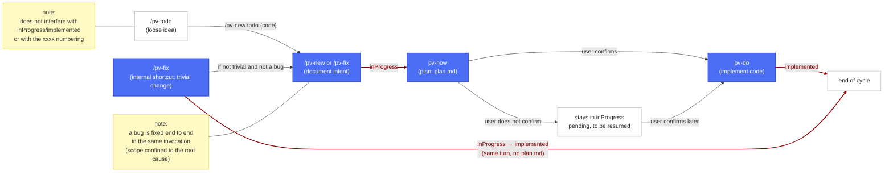
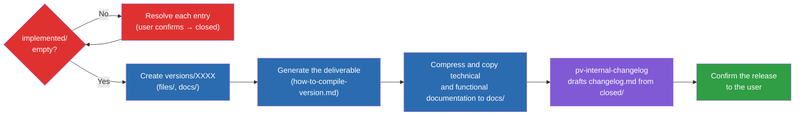

# Previo: User guide

**Previo** (the `pv-*` framework) is a set of Claude Code skills that standardizes how changes in this project are documented, planned, and implemented. Every real code change goes through the same cycle: **document the intent → plan the technical solution → implement**. Packaging a release (generating the deliverable, copying the current technical documentation, and drafting the functional changelog) is also part of the framework: `/pv-version` handles it (see [Preparing a release: `/pv-version`](#preparing-a-release-pv-version)).

All the skills live under `.claude/skills/pv-*` and share a single configuration file: `.claude/pv-context.json`.

## Contents

- [Setup](#setup)
  - [1. Required tools](#1-required-tools)
  - [2. Initialize the framework: `/pv-init`](#2-initialize-the-framework-pv-init)
- [Folder structure](#folder-structure)
- [Quick-start guide: the natural flow](#quick-start-guide-the-natural-flow)
  - [Step 0 (optional) — Jot down loose ideas: `/pv-todo`](#step-0-optional--jot-down-loose-ideas-pv-todo)
  - [Step 1 — Define the change: two ways](#step-1--define-the-change-two-ways)
    - [1. `/pv-new` — new feature or intentional behavior change](#1-pv-new--new-feature-or-intentional-behavior-change)
    - [2. `/pv-fix` — fix a bug (or apply a trivial change on the fly)](#2-pv-fix--fix-a-bug-or-apply-a-trivial-change-on-the-fly)
  - [Step 2 — Plan and implement: `pv-how` + `pv-do`](#step-2--plan-and-implement-pv-how--pv-do)
- [Preparing a release: `/pv-version`](#preparing-a-release-pv-version)
- [A full-cycle example](#a-full-cycle-example)
- [More ways to customize Previo](#more-ways-to-customize-previo)
- [The `pv.py` script: inspect and close changes without Claude Code](#the-pvpy-script-inspect-and-close-changes-without-claude-code)
- [Other tips](#other-tips)


## Setup

### 1. Required tools

`pv-init` itself checks this for you the first time, but for reference:

- **Git** — the repo already is one; you just need the CLI to work (`git --version`).
- **Python 3** — used by the internal scripts of `pv-internal-workflow`, `pv-how`, and `pv-do` (change numbering, moving folders). Check `python --version`.
- **Conditional tools depending on the project**, for example:
  - Node/npm if there's a `package.json`.
  - Any other interpreter the project needs.

Generating a version of the deliverable **is** part of the `pv-*` framework: `/pv-version` packages it (see [Preparing a release: `/pv-version`](#preparing-a-release-pv-version)). In this repo (Errantes), the build command it uses under the hood is `python ./src/scripts/build.py`, which auto-increments `CURRENT_VERSION` in `src/data/version.js` and writes `src/_output/versions/index-v{NNNN}.html` — a folder and numbering owned by the build script, unrelated to the numbering used by `/pv-version`.

### 2. Initialize the framework: `/pv-init`

Before you can use any other `pv-*` skill, you must run `/pv-init` once per project. It generates `.claude/pv-context.json`, the single place where the configuration lives: where changes are stored, whether the project versions deliverables, where the source code is, which documents to keep in sync, and so on.

`pv-init` scans the repo for clues (`package.json`, architecture docs, and the like) and only asks about what it can't infer. `workFolder` is not one of those questions: it's always `/previo-sdd`, set silently without asking for confirmation. If you ever want a different folder, change it yourself in `.claude/pv-context.json`, at your own risk. If it's run again on an already-initialized project, it lets you reconfigure or fill in missing fields without repeating the whole questionnaire.

Example of a fully configured `.claude/pv-context.json`:

```json
{
  "skillModels": {
    "_instructions": "Tras editar 'default' o 'overrides' de esta seccion, ejecuta desde la raiz del repo: python .claude/skills/pv-init/scripts/sync-skill-models.py -- reescribe el campo 'model'/'effort' en el frontmatter de cada SKILL.md 'pv-*' segun lo que quede configurado aqui. El harness de Claude Code solo lee ese frontmatter, no este JSON, asi que sin ejecutar el script los cambios de aqui no tienen efecto.",
    "default": { "model": "claude-sonnet-5", "effort": "medium" },
    "overrides": {
      "pv-status": { "model": "claude-haiku-4-5-20251001", "effort": "medium" },
      "pv-todo": { "model": "claude-haiku-4-5-20251001", "effort": "medium" },
      "pv-do": { "model": "claude-haiku-4-5-20251001", "effort": "high" }
    }
  },
  "framework": {
    "skills": {
      "mockups": "pv-internal-mockups-html",
      "diagrams": "pv-internal-tech-mermaid"
    },
    "sourcecodeDir": "/src",
    "workFolder": "/previo-sdd",
    "numberWidth": 5,
    "interaction": { "language": "en" },
    "changes": { "language": "es" },
    "versions": { "language": "es" },
    "docs": {
      "functional": {
        "featuresDocPathDir": "docs/features",
        "language": "es"
      },
      "tech": {
        "architectureDocDir": "docs/architecture",
        "styleBibleDocDir": "docs/style"
      }
    },
    "_comments": {
      "workFolder": "Es la carpeta de trabajo principal del framework, relativa siempre a la raíz del repo.",
      "sourcecodeDir": "Es la carpeta del código fuente del proyecto, relativa siempre a la raíz del repo.",
      "interaction.language": "El equipo habla con Claude (en inglés en este ejemplo).",
      "changes.language": "Cada change/fix en curso se documenta (en español en este ejemplo), idioma del equipo.",
      "versions.language": "El changelog publicado se redacta (en español en este ejemplo).",
      "docs.functional.language": "Documentación de funcionalidades (en español en este ejemplo)."
    }
  }
}
```


`.claude/pv-context.json` also accepts two optional blocks for fine-tuning the framework: `skillModels` (which model/effort each skill uses) and the `language` fields under `framework` (the language each thing speaks or writes in). `pv-init` asks you about the language on the first initialization; the details of both blocks are in [More ways to customize Previo](#more-ways-to-customize-previo).

## Full folder structure

A quick view of what each folder the framework uses is for, with the default configuration. The details of the specific files inside each one are in `pv-design.en.md`, meant for anyone who wants to understand the internals.

```
{repo root}/
├── src/                        # your source code (sourcecodeDir); pv-how consults it if architecture docs are missing
├── .claude/
│   └── skills/
│       ├── pv-init/             # run it once per project to bootstrap the framework
│       ├── pv-new/              # documents a new feature or an intentional behavior change
│       ├── pv-fix/              # fixes a bug, or applies a trivial change on the fly
│       ├── pv-how/              # plans the technical solution for an already-documented entry
│       ├── pv-do/               # implements the code for an entry whose plan.md is already written
│       ├── pv-status/           # inspects the project state without touching anything
│       ├── pv-todo/             # jots down loose ideas without committing to documenting them yet
│       ├── pv-version/          # packages a release once you have work ready
│       └── pv-internal-*/       # internal support — you never invoke these directly
│
└── previo-sdd/                  # {workFolder} — all the framework's in-progress work lives here
    ├── changes/                 # all your documentation and implementation work passes through here
    │   ├── inProgress/          # changes already documented, pending planning or implementation
    │   │   └── {xxxx}/          # one folder per change/fix, numbered automatically
    │   ├── implemented/         # changes already implemented, pending inclusion in a release
    │   │   └── {xxxx}/          # moved here only when pv-do finishes
    │   ├── todo/                # loose ideas from /pv-todo, outside the normal flow
    │   │   └── {code}/          # one folder per idea, with its own short code
    │   └── closed/              # changes already included in a release, waiting to be cleaned up
    │       └── {xxxx}/          # deleted automatically when the changelog is drafted, with your confirmation
    │
    ├── versions/                # every release you prepare with /pv-version appears here
    │   └── {XXXX}/              # one folder per release, with a code you choose
    │       ├── files/           # the generated deliverable, ready to distribute
    │       └── docs/            # a copy of the documentation current at the time of that release
    │
    ├── stuff/                   # your project's build procedure is stored here
    │
    └── docs/                    # the reference documentation that pv-do keeps in sync
        ├── architecture/        # the project's architecture and technical design
        ├── style/               # visual, interaction, and writing style guide
        └── features/            # list of already-implemented features
```

## Quick-start guide: the natural flow



Blue nodes = a mandatory step of the cycle (Step 1 and Step 2) or an equivalent direct path (the internal `fast` shortcut of `/pv-fix`, which applies the code without going through `plan.md` when the change — bug or not — qualifies as trivial). White nodes = an entry point or optional operation (`/pv-todo`, or staying pending in `inProgress`). The dark-red arrows with a white background and dark-red text indicate a state change (only the destination folder name: `inProgress`, `implemented`); the rest of the arrows indicate just a transition with no folder change. The yellow boxes are clarifying notes connected without an arrow to the node they refer to.

Each work entry lives in a numbered folder `xxxx` (e.g. `00007`) that travels between the subfolders of `changesDir` according to its state: `inProgress/` → `implemented/`.

### Step 0 (optional) — Jot down ideas for the future: `/pv-todo`

Before an idea is a change or a fix, you may just want to note it down for later without committing to documenting or implementing it yet. `/pv-todo <idea>` stores it in `changes/todo/{code}/description.md` — a separate folder that no other framework skill uses or takes into account, so it doesn't interfere with `inProgress`/`implemented` or with the `xxxx` numbering.

- **Note or expand**: `/pv-todo <idea>` creates a new one; `/pv-todo {code} <more detail>` keeps developing an existing one.
- **Review what's noted**: `/pv-status todo` lists the pending ideas with their code and full text.
- **Turn it into a change**: when an idea on the list matures and you want to move it into the real flow, `/pv-new todo {code}` starts `pv-new` from that idea instead of a new request, and deletes the `todo/` entry automatically when it finishes (without asking for confirmation) — the idea now lives as a normal entry in `changes/inProgress/`.

### Step 1 — Define the change

The framework offers two entry points depending on the nature of the change — the choice depends on whether it's a bug or a feature/intentional change. Within `/pv-fix`, there's also an automatic shortcut for trivial changes (see below).

#### 1. `/pv-new` — new feature or intentional behavior change

For a new feature or an **intentional** behavior change that isn't trivial. Example: `/pv-new add a button to shuffle the event deck manually`.

#### 2. `/pv-fix` — fix bugs or apply small fixes

For a bug — something that should already work differently. Example: `/pv-fix reloading the page loses the game in progress even though it was saved`. It's also the entry point for something so small that it doesn't warrant going through `description.md` + `plan.md` + confirmation (a typo, a text string, a one-off value/constant, an isolated style tweak, whether or not it's a bug): `/pv-fix fix the button text "Guradar" to "Guardar"`.

`pv-fix` first assesses whether the request is trivial (unambiguous, at most 2 files, no new behavior, no changes to `docs.tech.architectureDocDir` or `docs.tech.styleBibleDocDir`):

- **If it's trivial** (`fast` shortcut, bug or not): it applies the change directly in the code and, in the same invocation, documents what was done in `changes/implemented/{xxxx}/description.md` — it passes briefly through `inProgress` (normal `xxxx` numbering via `pv-internal-workflow`) and moves to `implemented` in the same turn, without generating `plan.md` or chaining `pv-how`/`pv-do`.
- **If it's not trivial and it's a bug**: it follows the normal flow described below (documents + chains `pv-how`/`pv-do`).
- **If it's not trivial and it's not a bug** (it affects architecture/style, information is missing, it touches more than 2 files, or it's a new feature): it touches no code, tells you why it doesn't fit, and invokes `pv-new` directly with your request to start the normal documentation flow.

For the non-trivial case (`/pv-new` and the `/pv-fix` that turns out to be a real bug), the skill:

1. Analyzes the scope and **anticipates** the typical questions (edge cases, coexistence with what already exists, data scope, who can use it, high-level visual appearance) and proposes reasonable answers for you to confirm or correct, rather than asking blindly.
2. Generates `changes/inProgress/{xxxx}/description.md` with the functional summary (never a technical solution yet).
3. If the change has a new or modified flow or behavior with no UI dimension (logic, the order of an operation, decisions, chained edge cases), it includes a functional Mermaid diagram in `description.md` itself for each distinct use case or user story.
4. If the change has a visual component, it creates static `design_*.html` mockups (HTML/CSS/SVG only, no logic; the `pv-internal-mockups-html` skill by default, configurable in `framework.skills.mockups`) as a navigable visual reference — to validate the design before writing a single line of real code.
5. If the change defines or uses something that needs a list of associated properties or data (an object's properties, the contents of a database table, the fields of a configuration, and so on), it writes that list explicitly in one or more `design_data_*.md` files, generally as table(s). It's a **functional** definition of what data is needed — how to store or manipulate it is a technical decision that `pv-how` makes later, from that table.

The diagrams, the mockups, and the data tables are all presented to you for confirmation before the change is considered documented — generating them isn't enough; your explicit validation is required.

Key difference: `/pv-fix` (non-trivial case) automatically chains `pv-how` (which in turn chains `pv-do`) when it finishes (a bug is fixed end to end in the same invocation, with scope strictly confined to the root cause). `/pv-new` only documents — you decide when to plan/implement afterward.

If an entry already exists in `inProgress` and you want to expand it instead of creating a new one, invoke `/pv-new {xxxx} <description of the expansion>` — it detects that it already exists and adds to what's documented instead of creating another folder.

### Step 2 — Plan and implement: `pv-how` + `pv-do`

`/pv-how {xxxx}` takes an entry already documented in `inProgress` and:

1. Analyzes the root cause (fix) or designs the technical solution (change), using the real code, the architecture documentation (`docs.tech.architectureDocDir`), and the style guide (`docs.tech.styleBibleDocDir`) as the source of truth — never what other `changes/` entries assume or the conversation's memory.
2. Writes `changes/inProgress/{xxxx}/plan.md` with three sections: (a) functional notes, (b) step-by-step technical solution, (c) architecture changes if applicable.
3. Asks whether you want to implement it now. If you confirm, it chains directly into `pv-do`, which edits the code, updates `docs.tech.architectureDocDir`/`docs.functional.featuresDocPathDir`/`docs.tech.styleBibleDocDir` as appropriate, and moves the folder to `changes/implemented/{xxxx}/`.

If you invoke `/pv-how` with no argument, it lists what's pending in `inProgress` and asks which one you want. If `plan.md` already existed (for example, you want to resume it), it asks whether you want to regenerate it from scratch or implement directly what it already says (in which case it chains `pv-do` without analyzing again). You can also invoke `/pv-do {xxxx}` directly on an entry that already has a `plan.md`, without going through `pv-how` again.

## Preparing a release: `/pv-version`

When there's work ready (`changes/implemented/`) and you want to prepare a release, `/pv-version <XXXX>` packages everything in `{workFolder}/versions/{XXXX}/`: it generates the deliverable, compresses and copies the current technical and functional documentation, and drafts the functional changelog from whatever has been closed in `changes/closed/`.

`{XXXX}` is free text that you choose on each invocation (e.g. `00001`, `v1`, `beta3`) — it has no relation to the `xxxx` numbering of a change/fix, nor to `src/_output/versions/` (the folder that `build.py` already generates on its own with its own `NNNN` counter): they are three completely independent spaces.

> ❗**IMPORTANT:**
> /pv-version uses the file `{workFolder}/stuff/how-to-compile-version.md` to know how to compile a version of your application. If, when the time comes, this file doesn't exist or is empty, it asks you about the process to document it and figure out what to do. <u>Before you reach this point</u>, you should already have your build pipeline ready (usually with scripts) so you can tell Previo what steps to follow.

> ❗**IMPORTANT:**
> If you invoke `/pv-version` only to report a change in the build procedure (e.g. "the build now also generates a rules PDF"), without asking to prepare a release, it updates `{workFolder}/stuff/how-to-compile-version.md` with that and asks whether you want to run the versioning process now — it doesn't run it on its own.




Legend: red = the `implemented/` guardrail (blocks until resolved); blue = the mechanical steps of `pv-version`; purple = delegated to `pv-internal-changelog`; green = the end of the process.

In prose:

1. **Startup guardrail**: if `changes/implemented/` has any entry, `/pv-version` doesn't proceed until they're all resolved — for each one it asks whether it moves to `closed` (irreversible without confirmation) before continuing.
2. **Create the version folder**: `{workFolder}/versions/{XXXX}/{files,docs}/`. If `{XXXX}` already exists, it asks whether to regenerate over what's there or choose a different code.
3. **Generate the deliverable**: it follows the procedure in `{workFolder}/stuff/how-to-compile-version.md` (asked and written the first time it's needed, with one step per artifact if the build generates several; in this repo it runs `python ./src/scripts/build.py`) and copies the result to `files/` via a script.
4. **Compress and copy documentation**: the paths configured in `docs.tech.architectureDocDir`/`docs.tech.styleBibleDocDir`/`docs.functional.featuresDocPathDir` (whichever are configured) are each compressed into a `.zip` and saved in `docs/`, as a record of which documentation was current at the time of this release.
5. **Functional changelog**: `pv-internal-changelog` (an internal skill) reads each `description.md` in `changes/closed/`. `fix`-type entries go straight to **Fixes**; the rest are compared against the changelog of the previous version detected in `{workFolder}/versions/` (confirming it with you before using it) and classified into **New** / **Changes** / **Removed**. `changelog.md` carries a header with the number of entries in each section, in purely functional language. After your explicit confirmation, it deletes from `closed/` only the folders already folded in (never "all of `closed/`" blindly); if you don't confirm the deletion, the changelog is written anyway and `closed/` is left untouched.

All the file copying/deleting in this process (build artifact, documentation, `closed/` entries) is done by the skills' own scripts, never by manual edits.

You can ask "how does `/pv-version` work?" in the middle of the invocation and it shows you this same diagram.

> ❗**NOTE ON LARGER PROJECTS**:
> Obviously, in larger projects, the process of releasing a new version doesn't end here — it probably still has to go through many more states (deployment to several environments, updating configuration values per environment, automated-test validations, etc.).
> `/pv-version` makes sure everything is prepared so you have a version of your app with everything it needs. From this point on, if the project requires it, we'll have our pipelines take the result of this process from the `versions/{XXXX}` folder (the generated files, the changelog, the collected documentation, etc.) and continue our delivery process. That's why it's important to design how and what a release includes and have Previo store it in `{workFolder}/stuff/how-to-compile-version.md`.

## A full-cycle example

```
/pv-fix the turn timer doesn't stop when the game is paused
```

1. `pv-fix` documents the bug in `changes/inProgress/00008/description.md` and chains `pv-how` automatically.
2. `pv-how` analyzes the root cause, writes `plan.md` (confined to that bug only), and asks whether to implement.
3. You confirm → `pv-how` chains `pv-do`, which edits the code, updates `FEATURES.md`/`docs/architecture/` if applicable, and moves the folder to `changes/implemented/00008/`.
4. When you want to cut a new release: `/pv-version 00001` → moves `00008` (and any other entry in `implemented/`) to `closed`, generates the deliverable (`python ./src/scripts/build.py` under the hood, which bumps the version in `version.js`), compresses and copies the current technical and functional documentation, and drafts `changelog.md` with what has accumulated in `closed/` (this `00008`, being a `fix`, lands in the Fixes section).

And for something trivial:

```
/pv-fix fix the button text "Guradar" to "Guardar"
```

1. `pv-fix` assesses that it's trivial (a text string, one file) and applies the change directly.
2. It documents what was done in `changes/inProgress/00009/description.md` (normal numbering via `pv-internal-workflow`) and, in the same turn, moves the folder to `changes/implemented/00009/`, without having generated `plan.md` or chained `pv-how`/`pv-do`.

## More ways to customize Previo

### 1. Creating mockups and diagrams

Some pieces of the framework can be swapped for your own without touching the rest, by configuring `framework.skills` in `.claude/pv-context.json`. By default you don't need to touch anything; you only configure this if you want to change either of these two pieces:

- **Visual mockups** (`mockups`): by default it generates HTML/CSS/SVG mockups that are navigable in the browser. If you prefer plain-text mockups (ASCII art), change it to `pv-internal-mockups-ascii`.
- **Diagrams** (`diagrams`): by default it generates Mermaid diagrams to represent flows and use cases.

Example, to use ASCII mockups instead of HTML:

```json
"framework": {
  "skills": {
    "mockups": "pv-internal-mockups-ascii",
    "diagrams": "pv-internal-tech-mermaid"
  }
}
```

You can also point either of the two at a skill of your own instead of one included in Previo, as long as it receives and returns the same information as the skill it replaces: the change/fix's destination folder and the list of elements to mock up or diagram as input, and the paths of what was generated as output.

### 2. Language configuration

The instructions for each `pv-*` skill (each `SKILL.md`, its templates, its scripts) are always in English, whatever the configuration — it's the language these skills are best tested in, and what makes following complex instructions reliable. What `language` controls is only the language of what a skill produces *outward*: what it says to you in chat, and the content of the documents it writes. If you never configure `language` anywhere, everything works in English by default.

Previo separates the language you speak to the framework in from the language each type of document is written in, by configuring the `framework` block of `.claude/pv-context.json`. One language is defined per point:

- **`interaction.language`**: the language the `pv-*` skills speak to you in, in chat (questions, confirmations, summaries). It's also the default (*fallback*) for the other points you don't configure separately.
- **`changes.language`**: the language of the documents for each in-progress change/fix (`description.md`, `plan.md`, `history.md`, and the text in the `design_*.html`/`.txt` mockups) inside `changes/`.
- **`versions.language`**: the language of `changelog.md`, generated by `pv-internal-changelog` from `changes/closed`.
- **`docs.functional.language`**: the language of the feature documentation (`featuresDocPathDir`) that `pv-do` keeps up to date after each implemented change/fix.

The technical documentation (`docs.tech.architectureDocDir` + `docs.tech.styleBibleDocDir`) has **no** language point: it's always technical English, not configurable.

Every point except `interaction.language` is optional: if you don't configure them, they inherit the language of `interaction.language` (and if that isn't configured either, English is used). This lets you, for example, talk to Previo in Spanish while the changelog and the features come out in Spanish — the technical documentation always goes in English, not configurable:

```json
"framework": {
  "interaction": { "language": "es" },
  "changes": { "language": "es" },
  "versions": { "language": "es" },
  "docs": {
    "functional": { "language": "es" }
  }
}
```

`pv-init` always asks about the language on a from-scratch initialization, proposing English by default for `interaction` and offering to reuse the same value for the rest unless you want something different — "the rest" no longer includes the technical documentation. If you initialized this project before language support existed, the next time you run `pv-init` it will ask you only this, without repeating the rest of the questionnaire. You can edit the values by hand in `.claude/pv-context.json` at any time afterward.

**Three** things always stay in English, whatever you configure: the table in the `pv-status` report (deterministic scripts generate it, not the model, so it's free in tokens and consistent — only the sentence that introduces it follows `interaction.language`); the markdown field labels that the scripts parse literally in `description.md` and `plan.md` (`**Type**`, `**Name**`, `**Creation date**`, `## Idea`, `## Notes`, and so on) — marked with `[[[...]]]` in each skill's `*.template.md`, see the "Marker convention in templates" section of `pv-design.en.md`, so only the text following each label follows the configured language; and **all the technical documentation** (`architectureDocDir` + `styleBibleDocDir`), which is optimized to be read by the skills themselves, not by a person, and therefore can't be configured. If you configured Spanish and your technical documentation comes out in English, this is why: it's not a bug.

### 3. Model/effort per skill: `skillModels`

`.claude/pv-context.json` can also include an optional `skillModels` section that decides which model (Sonnet, Haiku, and so on) and effort each `pv-*` skill in the project runs with. It serves both to lower the cost of the more mechanical skills (for example, `pv-status` or `pv-todo` to Haiku) and to raise the capability of a specific skill that needs it — for example, if you want `pv-how` (the one that designs the technical solution) to reason with a more capable model than the rest:

```json
"skillModels": {
  "default": { "model": "claude-sonnet-5", "effort": "medium" },
  "overrides": {
    "pv-how": { "model": "claude-opus-5", "effort": "high" }
  }
}
```

- `default`: the model/effort that applies to any `pv-*` skill without its own entry in `overrides`.
- `overrides`: one entry per skill name (the `name:` of its `SKILL.md`) for those that need something different from `default`.

After editing `default` or `overrides`, you need to sync the framework for the change to take effect — the configuration file alone isn't enough. You have two options for this:

- (Recommended) Run `pv.py` and select the option _Sync skill models according to pv-context.json_ (see [The `pv.py` script](#the-pvpy-script-inspect-and-close-changes-without-claude-code) below).
- Run the script `.claude/skills/pv-init/scripts/sync-skill-models.py`.

It's an automatic process that doesn't spend tokens; it can be repeated at any time after editing `skillModels` by hand, or you can ask `pv-init` to do it for you the next time you invoke it.

## The `pv.py` script: inspect and close changes without Claude Code


```
     ........
  :=. . ..:::::----:
 -*:.:..:---=---:-====-.
:*#-.       .:=*+==--==+=:
++#*:            :-+*+==**+.
++*##=              :+**==**: 	Previo: the AI-driven, visual,
*+=*##*:              :**=+#*.	rapid-development framework.
 *++***#*-.             +*=**:
  +*+******+-.           ***= 	One script, growing
   -**+++*####*+-:.      --:. 	to manage more.
     -++++**#*##***++===---:
       .=*###+#****+**+--:
           :=+*###%#*=:.
```

To inspect the project state or close changes without going through Claude Code, run from the project root:

```
python3 pv.py
```

It's generated and updated automatically — both when installing/updating Previo with `install.sh`/`install.ps1` and on every run of `/pv-init` — so you don't need to create or maintain it by hand. It's a file you should not edit directly: any manual change would be lost on the next install or reinitialization.

The menu contains options for managing in-progress changes:

1. **Overall project status** — the same summary as `/pv-status`.
2. **Changes info** — opens a submenu with five options: search by id, search by content, list by state (`todo`, `inProgress`, `implemented`, and so on), **toggle a flag on a change**, and **list changes by flag**. See "Flags: work focus" below.
3. **Ideas in `todo/`** — the same as `/pv-status todo`.
4. **Close an implemented entry** (move it to `changes/closed/`) — it lets you choose a specific entry or close them all at once, asking for confirmation (`y`/`N`) before moving anything.
5. **Configuration** — opens a submenu:
   - **Sync skill models according to `pv-context.json`** — applies the changes you made by hand in `skillModels` (see [Model/effort per skill](#3-modeleffort-per-skill-skillmodels) above), without you having to run the script by hand or invoke `pv-init` again.
6. **Check Previo versions** — opens a submenu:
   - **List versions and read their changelog** — lists the folders in `{workFolder}/versions/{XXXX}/` and, after you pick one, shows its `changelog.md`.
   - **Check that `changes/closed/temp/` is empty** — this folder should always be empty or nonexistent; if it has something inside, it means a `pv-version` run failed partway through or is still running, and this option warns you and lists what got stuck there.
7. **Exit**.

Each submenu has its own "Back" option to return to the main menu. No option spends tokens: everything is deterministic scripts, the same kind of operation you'd run yourself from the terminal. Useful for a quick look at the project or for closing changes without opening Claude Code.

### Flags: work focus

Each change can carry one or more **flags** — status labels orthogonal to the lifecycle (`inProgress`/`implemented`/`closed`), meant as a layer of *personal focus*:

| Flag | Icon | Meaning |
|---|---|---|
| `priority` | ⭐ | Marked as a priority, so it moves up the queue |
| `workinprogress` | ⚙️ | Actively being worked on right now |

A change can have both, one, or none. **`todo/` ideas never carry flags** (a loose idea outside the flow has nothing "in progress" or "prioritized within the flow" to mark).

- **Toggle**: `pv.py` → *Changes info* → *Toggle a flag on a change* → the change list comes out **grouped the same way as "Overall project status"** (ready to close / planned / pending analysis); changes in `closed/` don't appear (they're frozen in a release — nothing left to prioritise). Pick the change, pick the flag (`[x]`/`[ ]` depending on whether it's active), and it applies instantly (no confirmation prompt — a toggle is undone by the same action). The list is re-shown, updated, and you can keep toggling flags or pick another change without leaving. Also from Claude Code, though there's no dedicated command: the system is handled by `pv-internal-workflow`'s `set-metadata.py` script.
- **List by flag**: `pv.py` → *Changes info* → *Show changes by flag*, or `/pv-status` shows the ⭐/⚙️ icons in all its change listings (a `Flags` column in chat; an icon prefix in the terminal).
- **Where it's stored**: in a hidden `.metadata.json` file inside the change's folder, next to `description.md`/`plan.md`. It only appears once the change has at least one flag; a change with no flags has no such file. It travels with the folder when the change moves between states.

`/pv-update` audits that file: valid JSON, flags within the known catalogue, and no `.metadata.json` showing up under `todo/`.

## Other tips

- **Re-analyze or ask anything about a change at any time**: if you invoke `/pv-new {xxxx} ...` or `/pv-how {xxxx}` on an `xxxx` that already exists in `inProgress`, the framework doesn't create a new folder — it resumes that same entry. `/pv-new {xxxx} <expansion>` adds to the functional documentation already written without losing what was there (useful if new edge cases come up or the scope changes midway). `/pv-how {xxxx}` regenerates `plan.md` from scratch with the updated context, for example after expanding `description.md` or after correcting the technical direction of a plan that no longer fits. In both cases you keep working on the same `xxxx`, with no duplicates and no loss of what's already documented.
- **Chain several steps in a single request**: the normal flow is turn by turn (plan → confirm → implement), but if you already know you want to proceed you don't need to wait for it to ask. You can request it all at once, for example:

  ```
  pv-how 00007 and if the plan makes sense, implement it directly
  ```

  This runs `pv-how` and, without stopping to ask, chains `pv-do` in the same response if the plan turns out to be reasonable. Useful for small changes or ones already clear in your head, where reviewing the plan before implementing adds nothing.
- **Quick fixes**: fixes with `pv-fix` work much like changes (documenting them, analyzing them, and so on), but if the fix is small and/or trivial and poses no risk at all, the framework implements it directly.
