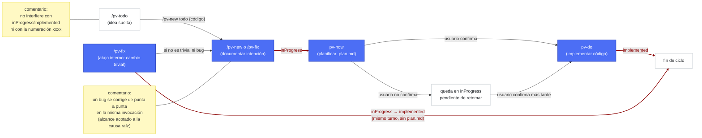
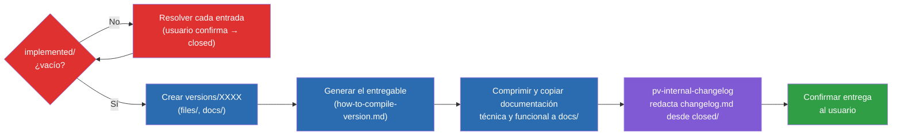

# Previo: Guía de uso

**Previo** (framework `pv-*`) es un conjunto de skills de Claude Code que estandariza cómo se documentan, planifican e implementan los cambios en este proyecto. Todo cambio real en el código pasa por el mismo ciclo: **documentar la intención → planificar la solución técnica → implementar**. Empaquetar una entrega (generar el entregable, copiar la documentación técnica vigente y redactar el changelog funcional) también forma parte del framework: lo hace `/pv-version` (ver [Preparar una entrega: `/pv-version`](#preparar-una-entrega-pv-version)).

Todas las skills viven bajo `.claude/skills/pv-*` y comparten un único fichero de configuración: `.claude/pv-context.json`.

## Índice

- [Preparación](#preparación)
  - [1. Herramientas necesarias](#1-herramientas-necesarias)
  - [2. Inicializar el framework: `/pv-init`](#2-inicializar-el-framework-pv-init)
- [Estructura de carpetas](#estructura-de-carpetas)
- [Guía de uso rápida: el flujo natural](#guía-de-uso-rápida-el-flujo-natural)
  - [Paso 0 (opcional) — Apuntar ideas sueltas: `/pv-todo`](#paso-0-opcional--apuntar-ideas-sueltas-pv-todo)
  - [Paso 1 — Definir el cambio: dos maneras](#paso-1--definir-el-cambio-dos-maneras)
    - [1. `/pv-new` — funcionalidad nueva o cambio de comportamiento intencionado](#1-pv-new--funcionalidad-nueva-o-cambio-de-comportamiento-intencionado)
    - [2. `/pv-fix` — corregir un bug (o aplicar un cambio trivial al vuelo)](#2-pv-fix--corregir-un-bug-o-aplicar-un-cambio-trivial-al-vuelo)
  - [Paso 2 — Planificar e implementar: `pv-how` + `pv-do`](#paso-2--planificar-e-implementar-pv-how--pv-do)
- [Preparar una entrega: `/pv-version`](#preparar-una-entrega-pv-version)
- [Ejemplo de ciclo completo](#ejemplo-de-ciclo-completo)
- [Más formas de personalizar Previo](#más-formas-de-personalizar-previo)
- [El script `pv.py`: consultar y cerrar cambios sin Claude Code](#el-script-pvpy-consultar-y-cerrar-cambios-sin-claude-code)
- [Otros trucos](#otros-trucos)


## Preparación

### 1. Herramientas necesarias

El propio `pv-init` comprueba esto por ti la primera vez, pero para referencia:

- **Git** — el repo ya lo es; solo hace falta que el CLI funcione (`git --version`).
- **Python 3** — usado por los scripts internos de `pv-internal-workflow`, `pv-how` y `pv-do` (numeración de cambios, mover carpetas). Comprueba `python --version`.
- **Herramientas condicionales según el proyecto**, por ejemplo:
  - Node/npm si hay `package.json`.
  - Cualquier otro intérprete que necesite el proyecto.

Generar una versión del entregable **sí** forma parte del framework `pv-*`: `/pv-version` la empaqueta (ver [Preparar una entrega: `/pv-version`](#preparar-una-entrega-pv-version)). En este repo (Errantes), el comando de compilación que usa por debajo es `python ./src/scripts/build.py`, que autoincrementa `CURRENT_VERSION` en `src/data/version.js` y escribe `src/_output/versions/index-v{NNNN}.html` — carpeta y numeración propias del build script, sin relación con la numeración de `/pv-version`.

### 2. Inicializar el framework: `/pv-init`

Antes de poder usar cualquier otra skill `pv-*`, hay que ejecutar `/pv-init` una vez por proyecto. Genera `.claude/pv-context.json`, que es el único sitio donde vive la configuración: dónde se guardan los cambios, si el proyecto versiona entregables, dónde está el código fuente, qué documentos mantener sincronizados, etc.

`pv-init` explora el repo en busca de pistas (`package.json`, docs de arquitectura...) y solo pregunta lo que no puede deducir. `workFolder` no es una de esas preguntas: siempre es `/previo-sdd`, fijado en silencio sin pedir confirmación; si algún día quieres otra carpeta, la cambias tú mismo en `.claude/pv-context.json`, bajo tu responsabilidad. Si se vuelve a invocar sobre un proyecto ya inicializado, permite reconfigurar o completar campos que falten sin repetir todo el cuestionario.

Ejemplo de `.claude/pv-context.json` ya configurado:

```json
{
  "skillModels": {
    "_instructions": "Tras editar 'default' o 'overrides' de esta seccion, ejecuta desde la raiz del repo: python .claude/skills/pv-init/scripts/sync-skill-models.py -- reescribe el campo 'model'/'effort' en el frontmatter de cada SKILL.md 'pv-*' segun lo que quede configurado aqui. El harness de Claude Code solo lee ese frontmatter, no este JSON, asi que sin ejecutar el script los cambios de aqui no tienen efecto.",
    "default": { "model": "claude-sonnet-5", "effort": "medium" },
    "overrides": {
      "pv-status": { "model": "claude-haiku-4-5-20251001", "effort": "medium" },
      "pv-todo": { "model": "claude-haiku-4-5-20251001", "effort": "medium" },
      "pv-do": { "model": "claude-haiku-4-5-20251001", "effort": "high" }
    }
  },
  "framework": {
    "skills": {
      "mockups": "pv-internal-mockups-html",
      "diagrams": "pv-internal-tech-mermaid"
    },
    "sourcecodeDir": "/src",
    "workFolder": "/previo-sdd",
    "numberWidth": 5,
    "interaction": { "language": "en" },
    "changes": { "language": "es" },
    "versions": { "language": "es" },
    "docs": {
      "functional": {
        "featuresDocPathDir": "docs/features",
        "language": "es"
      },
      "tech": {
        "architectureDocDir": "docs/architecture",
        "styleBibleDocDir": "docs/style"
      }
    },
    "_comments": {
      "workFolder": "Es la carpeta de trabajo principal del framework, relativa siempre a la raíz del repo.",
      "sourcecodeDir": "Es la carpeta del código fuente del proyecto, relativa siempre a la raíz del repo.",
      "interaction.language": "El equipo habla con Claude (en inglés en este ejemplo).",
      "changes.language": "Cada change/fix en curso se documenta (en español en este ejemplo), idioma del equipo.",
      "versions.language": "El changelog publicado se redacta (en español en este ejemplo).",
      "docs.functional.language": "Documentación de funcionalidades (en español en este ejemplo)."
    }
  }
}
```


`.claude/pv-context.json` también admite dos bloques opcionales para afinar el framework: `skillModels` (qué modelo/esfuerzo usa cada skill) y los campos `language` de `framework` (en qué idioma habla o escribe cada cosa). `pv-init` te pregunta por el idioma en la primera inicialización; el detalle de ambos bloques está en [Más formas de personalizar Previo](#más-formas-de-personalizar-previo).

## Estructura completa de carpetas

Vista rápida de para qué sirve cada carpeta que usa el framework, con la configuración por defecto. El detalle de los ficheros concretos que hay dentro de cada una está en `pv-design.es.md`, pensado para quien quiera entender el funcionamiento interno.

```
{raíz del repo}/
├── src/                        # tu código fuente (sourcecodeDir); pv-how lo consulta si falta documentación de arquitectura
├── .claude/
│   └── skills/
│       ├── pv-init/             # ejecútala una vez por proyecto para arrancar el framework
│       ├── pv-new/              # documenta funcionalidad nueva o un cambio de comportamiento intencionado
│       ├── pv-fix/              # corrige un bug, o aplica al vuelo un cambio trivial
│       ├── pv-how/              # planifica la solución técnica de una entrada ya documentada
│       ├── pv-do/               # implementa el código de una entrada con plan.md ya escrito
│       ├── pv-status/           # consulta el estado del proyecto sin tocar nada
│       ├── pv-todo/             # apunta ideas sueltas sin comprometerte todavía a documentarlas
│       ├── pv-version/          # empaqueta una entrega cuando ya tienes trabajo listo
│       └── pv-internal-*/       # soporte interno — nunca las invocas tú directamente
│
└── previo-sdd/                  # {workFolder} — aquí vive todo el trabajo en curso del framework
    ├── changes/                 # todo tu trabajo de documentación e implementación pasa por aquí
    │   ├── inProgress/          # cambios ya documentados, pendientes de planificar o implementar
    │   │   └── {xxxx}/          # una carpeta por change/fix, numerada automáticamente
    │   ├── implemented/         # cambios ya implementados, pendientes de incluir en una entrega
    │   │   └── {xxxx}/          # se mueve aquí solo al terminar pv-do
    │   ├── todo/                # ideas sueltas de /pv-todo, fuera del flujo normal
    │   │   └── {code}/          # una carpeta por idea, con su propio código corto
    │   └── closed/              # cambios ya incluidos en una entrega, a la espera de limpiarse
    │       └── {xxxx}/          # se borra automáticamente al redactar el changelog, con tu confirmación
    │
    ├── versions/                # aquí aparece cada entrega que prepares con /pv-version
    │   └── {XXXX}/              # una carpeta por entrega, con el código que tú elijas
    │       ├── files/           # el entregable ya generado, listo para distribuir
    │       └── docs/            # copia de la documentación vigente en el momento de esa entrega
    │
    ├── stuff/                   # aquí queda guardado el procedimiento de build de tu proyecto
    │
    └── docs/                    # la documentación de referencia que pv-do mantiene sincronizada
        ├── architecture/        # arquitectura y diseño técnico del proyecto
        ├── style/               # guía de estilo visual, de interacción y de redacción
        └── features/            # listado de funcionalidades ya implementadas
```

## Guía de uso rápida: el flujo natural



Nodos azules = paso obligatorio del ciclo (Paso 1 y Paso 2) o vía directa equivalente (el atajo `fast` interno de `/pv-fix`, que aplica el código sin pasar por `plan.md` si el cambio — bug o no — califica como trivial). Nodos blancos = punto de entrada u operación opcional (`/pv-todo`, o quedarse pendiente en `inProgress`). Las flechas rojo oscuro con fondo blanco y texto rojo oscuro indican un cambio de estado (solo el nombre de la carpeta destino: `inProgress`, `implemented`); el resto de flechas indican solo una transición sin cambio de carpeta. Los cuadros amarillos son comentarios aclaratorios conectados sin flecha al nodo al que se refieren.

Cada entrada de trabajo vive en una carpeta numerada `xxxx` (p.ej. `00007`) que va viajando entre subcarpetas de `changesDir` según su estado: `inProgress/` → `implemented/`.

### Paso 0 (opcional) — Apuntar las ideas para el futuro: `/pv-todo`

Antes de que una idea sea un change o un fix, puede que solo quieras dejarla anotada para más adelante sin comprometerte a documentarla ni implementarla todavía. `/pv-todo <idea>` la guarda en `changes/todo/{código}/description.md` — una carpeta aparte que ninguna otra skill del framework usa ni tiene en cuenta, así que no interfiere con `inProgress`/`implemented` ni con la numeración `xxxx`.

- **Apuntar o ampliar**: `/pv-todo <idea>` crea una nueva; `/pv-todo {código} <más detalle>` sigue desarrollando una ya existente.
- **Consultar lo apuntado**: `/pv-status todo` lista las ideas pendientes con su código y texto completo.
- **Convertir en cambio**: cuando una idea de la lista madura y quieres llevarla al flujo real, `/pv-new todo {código}` arranca `pv-new` partiendo de esa idea en vez de una petición nueva, y borra la entrada de `todo/` automáticamente al terminar (sin pedir confirmación) — la idea pasa a vivir como entrada normal en `changes/inProgress/`.

### Paso 1 — Definir los cambios

El framework ofrece dos puntos de entrada según la naturaleza del cambio — la elección depende de si es un bug o funcionalidad/cambio intencionado. Dentro de `/pv-fix`, además, hay un atajo automático para lo trivial (ver más abajo).

#### 1. `/pv-new` — funcionalidad nueva o cambio de comportamiento intencionado

Para funcionalidad nueva o un cambio de comportamiento **intencionado** que no sea trivial. Ejemplo: `/pv-new añade un botón para barajar el mazo de eventos manualmente`.

#### 2. `/pv-fix` — corregir bugs o aplicar arreglos

Para un bug, algo que ya debería funcionar de otra forma. Ejemplo: `/pv-fix al recargar la página se pierde la partida en curso aunque estaba guardada`. También es el punto de entrada para algo tan pequeño que no merece pasar por `description.md` + `plan.md` + confirmación (un typo, un texto, un valor/constante puntual, un ajuste de estilo aislado, sea o no un bug): `/pv-fix corrige el texto del botón "Guradar" a "Guardar"`.

`pv-fix` primero valora si lo pedido es trivial (sin ambigüedad, como mucho 2 ficheros, sin comportamiento nuevo, sin tocar `docs.tech.architectureDocDir` ni `docs.tech.styleBibleDocDir`):

- **Si es trivial** (atajo `fast`, bug o no): aplica el cambio directamente en el código y, en la misma invocación, documenta lo hecho en `changes/implemented/{xxxx}/description.md` — pasa brevemente por `inProgress` (numeración `xxxx` normal vía `pv-internal-workflow`) y se mueve a `implemented` en el mismo turno, sin generar `plan.md` ni encadenar `pv-how`/`pv-do`.
- **Si no es trivial y es un bug**: sigue el flujo normal descrito abajo (documenta + encadena `pv-how`/`pv-do`).
- **Si no es trivial y no es un bug** (afecta a arquitectura/estilo, falta información, toca más de 2 ficheros, o es funcionalidad nueva): no toca nada de código, te avisa de por qué no encaja, e invoca directamente `pv-new` con tu petición para arrancar el flujo normal de documentación.

Para el caso no trivial (`/pv-new` y el `/pv-fix` que resulta ser un bug real), la skill:

1. Analiza el alcance y **anticipa** las dudas típicas (casos límite, convivencia con lo existente, alcance de los datos, quién puede usarlo, aspecto visual de alto nivel) y te propone respuestas razonables para que las confirmes o corrijas, en vez de preguntar a ciegas.
2. Genera `changes/inProgress/{xxxx}/description.md` con el resumen funcional (nunca solución técnica todavía).
3. Si el cambio tiene un flujo o funcionamiento nuevo/modificado sin dimensión de UI (lógica, orden de una operación, decisiones, casos límite encadenados), incluye en el propio `description.md` un diagrama Mermaid funcional por cada caso de uso o historia de usuario distinto.
4. Si el cambio tiene componente visual, crea maquetas estáticas `design_*.html` (solo HTML/CSS/SVG, sin lógica; skill `pv-internal-mockups-html` por defecto, configurable en `framework.skills.mockups`) como referencia visual navegable — para validar el diseño antes de escribir una sola línea de código real.
5. Si el cambio define o usa algo que necesita una lista de propiedades o datos asociados (propiedades de un objeto, contenido de una tabla de base de datos, campos de una configuración...), escribe esa lista explícitamente en uno o varios ficheros `design_data_*.md`, generalmente como tabla(s). Es una definición **funcional** de qué datos hacen falta — la forma de guardarlos o manipularlos es una decisión técnica que toma `pv-how` después, a partir de esa tabla.

Tanto los diagramas como las maquetas y las tablas de datos se te presentan para que los confirmes antes de dar el cambio por documentado — no basta con generarlos, hace falta tu validación explícita.

Diferencia clave: `/pv-fix` (caso no trivial) encadena automáticamente `pv-how` (que a su vez encadena `pv-do`) al terminar (un bug se corrige de punta a punta en la misma invocación, con alcance estrictamente acotado a la causa raíz). `/pv-new` solo documenta — decides tú cuándo planificar/implementar después.

Si ya existe una entrada en `inProgress` y quieres ampliarla en vez de crear una nueva, invoca `/pv-new {xxxx} <descripción de la ampliación>` — detecta que ya existe y añade a lo documentado en vez de crear otra carpeta.

### Paso 2 — Planificar e implementar: `pv-how` + `pv-do`

`/pv-how {xxxx}` toma una entrada ya documentada en `inProgress` y:

1. Analiza la causa raíz (fix) o diseña la solución técnica (change), usando como fuente de verdad el código real, la documentación de arquitectura (`docs.tech.architectureDocDir`) y la guía de estilo (`docs.tech.styleBibleDocDir`) — nunca lo que otras entradas de `changes/` asuman ni la memoria de la conversación.
2. Escribe `changes/inProgress/{xxxx}/plan.md` con tres secciones: (a) anotaciones funcionales, (b) solución técnica paso a paso, (c) cambios de arquitectura si aplica.
3. Pregunta si quieres implementarlo ya. Si confirmas, encadena directamente `pv-do`, que edita el código, actualiza `docs.tech.architectureDocDir`/`docs.functional.featuresDocPathDir`/`docs.tech.styleBibleDocDir` según corresponda, y mueve la carpeta a `changes/implemented/{xxxx}/`.

Si invocas `/pv-how` sin argumento, lista lo que hay pendiente en `inProgress` y te pregunta cuál quieres. Si `plan.md` ya existía (por ejemplo, quieres retomarlo), te pregunta si quieres regenerarlo desde cero o implementar directamente lo que ya dice (en ese caso encadena `pv-do` sin volver a analizar). También puedes invocar `/pv-do {xxxx}` directamente sobre una entrada que ya tenga `plan.md`, sin pasar por `pv-how` de nuevo.

## Preparar una entrega: `/pv-version`

Cuando ya hay trabajo listo (`changes/implemented/`) y quieres preparar una entrega, `/pv-version <XXXX>` empaqueta todo en `{workFolder}/versions/{XXXX}/`: genera el entregable, comprime y copia la documentación técnica y funcional vigente, y redacta el changelog funcional a partir de lo que se haya ido cerrando en `changes/closed/`. 

`{XXXX}` es texto libre que eliges tú en cada invocación (p.ej. `00001`, `v1`, `beta3`) — no tiene relación con la numeración `xxxx` de change/fix, ni con `src/_output/versions/` (la carpeta que ya genera `build.py` por su cuenta con su propio contador `NNNN`): son tres espacios completamente independientes.

> ❗**IMPORTANTE:**
> /pv-version utiliza el fichero `{workFolder}/stuff/how-to-compile-version.md` para saber como compilar una versión de tu aplicación. Si cuando llegue el momento este fichero no existe o está vacío, te preguntará sobre el proceso para documentarse y saber qué hacer. <u>Antes de llegar a este momento</u> deberías tener listo ya tu pipeline de compilación (generalmente con scripts) para poder contarle a Previo qué pasos debe seguir.

> ❗**IMPORTANTE:**
> Si invocas `/pv-version` solo para informar de un cambio en el procedimiento de build (p.ej. "ahora el build también genera un PDF de reglas"), sin pedir preparar una entrega, actualiza `{workFolder}/stuff/how-to-compile-version.md` con eso y te pregunta si quieres lanzar el proceso de versionado ahora — no lo lanza por su cuenta.




Leyenda: rojo = guardarraíl de `implemented/` (bloquea hasta resolverse); azul = pasos mecánicos de `pv-version`; morado = delegado en `pv-internal-changelog`; verde = fin del proceso.

En prosa:

1. **Guardarraíl de arranque**: si `changes/implemented/` tiene alguna entrada, `/pv-version` no avanza hasta resolverlas todas — por cada una pregunta si pasa a `closed` (irreversible sin confirmación) antes de seguir.
2. **Crear la carpeta de la versión**: `{workFolder}/versions/{XXXX}/{files,docs}/`. Si `{XXXX}` ya existe, pregunta si regenerar sobre lo existente o elegir otro código.
3. **Generar el entregable**: sigue el procedimiento de `{workFolder}/stuff/how-to-compile-version.md` (se pregunta y se escribe la primera vez que hace falta, con un paso por artefacto si el build genera varios; en este repo ejecuta `python ./src/scripts/build.py`) y copia el resultado a `files/` mediante script.
4. **Comprimir y copiar documentación**: las rutas configuradas en `docs.tech.architectureDocDir`/`docs.tech.styleBibleDocDir`/`docs.functional.featuresDocPathDir` (las que estén configuradas) se comprimen en un `.zip` cada una y se guardan en `docs/`, como constancia de qué documentación estaba vigente en el momento de esta entrega.
5. **Changelog funcional**: `pv-internal-changelog` (skill interna) lee cada `description.md` de `changes/closed/`. Las entradas de tipo `fix` van directas a **Fixes**; el resto se compara contra el changelog de la versión anterior detectada en `{workFolder}/versions/` (confirmándotela antes de usarla) y se clasifica en **Nuevo** / **Cambios** / **Eliminado**. `changelog.md` lleva una cabecera con el número de entradas de cada sección, en lenguaje puramente funcional. Tras tu confirmación explícita, borra de `closed/` solo las carpetas ya incorporadas (nunca "todo `closed/`" a ciegas); si no confirmas el borrado, el changelog queda escrito igualmente y `closed/` no se toca.

Todo el copiado/borrado de ficheros de este proceso (artefacto del build, documentación, entradas de `closed/`) lo hacen scripts propios de las skills, nunca ediciones manuales.

Puedes preguntar "¿cómo funciona `/pv-version`?" en mitad de la invocación y te muestra este mismo diagrama.

> ❗**NOTA SOBRE PROYECTOS MÁS GRANDES**:
> Obviamente, en proyectos más grandes, el proceso de liberar una nueva versión no termina aquí, sino que probablemente tenga que pasar todavía por muchos más estados (despliegue en varios entornos, actualización valores de configuración según esos entornos, validaciones de pruebas automáticas, etc).
> El `/pv-version` se asegura de preprarlo todo para disponer de una versión de nuestra app con todo lo necesario. A partir de este momento, si el proyecto lo requiere, haremos que nuestras pipelines tomen el resultado de este proceso de la carpeta versions/{XXXX} (los ficheros generados, el changelog, la documentación reunida, etc..) y continúen el nuestro proceso de entrega.  Por eso es importante diseñar cómo y qué incluye una entrega y que Previo lo guarde en `{workFolder}/stuff/how-to-compile-version.md`.

## Ejemplo de ciclo completo

```
/pv-fix el temporizador de turno no se detiene al pausar la partida
```

1. `pv-fix` documenta el bug en `changes/inProgress/00008/description.md` y encadena `pv-how` automáticamente.
2. `pv-how` analiza la causa raíz, escribe `plan.md` (acotado solo a ese bug) y pregunta si implementar.
3. Confirmas → `pv-how` encadena `pv-do`, que edita el código, actualiza `FEATURES.md`/`docs/architecture/` si aplica, y mueve la carpeta a `changes/implemented/00008/`.
4. Cuando quieras cortar una nueva entrega: `/pv-version 00001` → mueve `00008` (y cualquier otra entrada de `implemented/`) a `closed`, genera el entregable (`python ./src/scripts/build.py` por debajo, que incrementa la versión en `version.js`), comprime y copia la documentación técnica y funcional vigente, y redacta `changelog.md` con lo acumulado en `closed/` (este `00008`, de tipo `fix`, cae en la sección Fixes).

Y para algo trivial:

```
/pv-fix corrige el texto del botón "Guradar" a "Guardar"
```

1. `pv-fix` valora que es trivial (un texto, un fichero) y aplica el cambio directamente.
2. Documenta lo hecho en `changes/inProgress/00009/description.md` (numeración normal vía `pv-internal-workflow`) y en el mismo turno mueve la carpeta a `changes/implemented/00009/`, sin haber generado `plan.md` ni haber encadenado `pv-how`/`pv-do`.

## Más formas de personalizar Previo

### 1. Creación de maquetas y diagramas

Algunas piezas del framework se pueden sustituir por otras propias sin tocar el resto, configurando `framework.skills` en `.claude/pv-context.json`. Por defecto no hace falta tocar nada; solo se configura si quieres cambiar alguna de estas dos piezas:

- **Maquetas visuales** (`mockups`): por defecto genera maquetas en HTML/CSS/SVG navegables en el navegador. Si prefieres maquetas en texto plano (arte ASCII), cámbialo a `pv-internal-mockups-ascii`.
- **Diagramas** (`diagrams`): por defecto genera diagramas Mermaid para representar flujos y casos de uso.

Ejemplo, para usar maquetas en ASCII en vez de HTML:

```json
"framework": {
  "skills": {
    "mockups": "pv-internal-mockups-ascii",
    "diagrams": "pv-internal-tech-mermaid"
  }
}
```

También puedes apuntar cualquiera de las dos a una skill propia de tu proyecto, en vez de a una de las incluidas en Previo, siempre que reciba y devuelva la misma información que la skill a la que sustituye: la carpeta destino del cambio/fix y la lista de elementos a maquetar o diagramar como entrada, y las rutas de lo generado como salida.

### 2. Configuración de idiomas

Las instrucciones propias de cada skill `pv-*` (cada `SKILL.md`, sus plantillas, sus scripts) están siempre en inglés, sea cual sea la configuración — es el idioma en el que estas skills están mejor probadas, y lo que hace fiable seguir instrucciones complejas. Lo que controla `language` es solo el idioma de lo que una skill produce *hacia fuera*: lo que te dice en el chat, y el contenido de los documentos que escribe. Si nunca configuras `language` en ningún sitio, todo funciona en inglés por defecto.

Previo separa el idioma en el que hablas con el framework del idioma en el que se escribe cada tipo de documento, configurando el bloque `framework` de `.claude/pv-context.json`. Se define un idioma por punto:

- **`interaction.language`**: idioma en el que las skills `pv-*` hablan contigo en el chat (preguntas, confirmaciones, resúmenes). También es el valor por defecto (*fallback*) del resto de puntos que no configures aparte.
- **`changes.language`**: idioma de los documentos de cada change/fix en curso (`description.md`, `plan.md`, `history.md` y los textos de los mockups `design_*.html`/`.txt`) dentro de `changes/`.
- **`versions.language`**: idioma de `changelog.md`, generado por `pv-internal-changelog` a partir de `changes/closed`.
- **`docs.functional.language`**: idioma de la documentación de funcionalidades (`featuresDocPathDir`) que `pv-do` mantiene actualizada tras cada change/fix implementado.

La documentación técnica (`docs.tech.architectureDocDir` + `docs.tech.styleBibleDocDir`) **no** tiene punto de idioma: es siempre inglés técnico, no se configura.

Todos los puntos salvo `interaction.language` son opcionales: si no los configuras, heredan el idioma de `interaction.language` (y si tampoco está configurado, se usa inglés). Esto te permite, por ejemplo, hablar con Previo en español mientras el changelog y las funcionalidades salen en español — la documentación técnica va siempre en inglés, no se configura:

```json
"framework": {
  "interaction": { "language": "es" },
  "changes": { "language": "es" },
  "versions": { "language": "es" },
  "docs": {
    "functional": { "language": "es" }
  }
}
```

`pv-init` siempre pregunta por el idioma en una inicialización desde cero, proponiendo inglés por defecto para `interaction` y ofreciendo reutilizar el mismo valor para el resto salvo que quieras algo distinto — "el resto" ya no incluye la documentación técnica. Si inicializaste este proyecto antes de que existiera el soporte de idioma, la próxima vez que ejecutes `pv-init` te preguntará solo esto, sin repetir el resto del cuestionario. Puedes editar los valores a mano en `.claude/pv-context.json` en cualquier momento después.

**Tres** cosas se quedan siempre en inglés, se configure lo que se configure: la tabla del informe de `pv-status` (la generan scripts deterministas, no el modelo, para que sea gratis en tokens y consistente — solo la frase que la introduce sigue `interaction.language`); las etiquetas de campo markdown que los scripts parsean literalmente en `description.md` y `plan.md` (`**Type**`, `**Name**`, `**Creation date**`, `## Idea`, `## Notes`...) — marcadas con `[[[...]]]` en el `*.template.md` de cada skill, ver la sección "Convención de marcadores en plantillas" de `pv-design.es.md`, así que solo el texto que sigue a cada etiqueta sigue el idioma configurado; y **toda la documentación técnica** (`architectureDocDir` + `styleBibleDocDir`), que está optimizada para que la lean las propias skills, no una persona, y por eso no se puede configurar. Si configuraste español y tu documentación técnica sale en inglés, es esto: no es un bug.

### 3. Modelo/esfuerzo de cada skill: `skillModels`

`.claude/pv-context.json` también puede incluir una sección opcional `skillModels` que decide con qué modelo (Sonnet, Haiku...) y esfuerzo corre cada skill `pv-*` del proyecto. Sirve tanto para bajar el coste de las skills más mecánicas (por ejemplo, `pv-status` o `pv-todo` a Haiku) como para subir la capacidad de una skill puntual que lo necesite — por ejemplo, si quieres que `pv-how` (la que diseña la solución técnica) razone con un modelo más capaz que el resto:

```json
"skillModels": {
  "default": { "model": "claude-sonnet-5", "effort": "medium" },
  "overrides": {
    "pv-how": { "model": "claude-opus-5", "effort": "high" }
  }
}
```

- `default`: modelo/esfuerzo que aplica a cualquier skill `pv-*` sin entrada propia en `overrides`.
- `overrides`: una entrada por nombre de skill (el `name:` de su `SKILL.md`) para las que necesiten algo distinto del `default`.

Después de editar `default` u `overrides`, hay que sincronizar el framework para que el cambio tenga efecto — el fichero de configuración por sí solo no basta. Para ello tienes dos opciones:

- (Recomendada) Ejecuta `pv.py` y selecciona la opción _Sincronizar modelos de las skills según pv-context.json_ (ver [El script `pv.py`](#el-script-pvpy-consultar-y-cerrar-cambios-sin-claude-code) más abajo).
- Ejecuta el script `.claude/skills/pv-init/scripts/sync-skill-models.py`.

Es un proceso automático que no gasta tokens; puede repetirse en cualquier momento tras editar `skillModels` a mano, o pedirle a `pv-init` que lo haga por ti la próxima vez que lo invoques.

### 4. Pasos personalizados en el pipeline de versión

El flujo de `pv-version` no se puede editar desde un proyecto — su `SKILL.md`, `workflow.version.md` y todo lo demás bajo `.claude/skills/pv-*/` son framework instalado, se mantienen sincronizados mediante `pv-update`, y editarlos a mano los deja inconsistentes. Para que el flujo de versión haga algo específico de tu proyecto (publicar la entrega en algún sitio, ejecutar una comprobación previa, generar artefactos extra), hay exactamente dos puntos de personalización, ambos ficheros en `{workFolder}/stuff/`:

- **`how-to-compile-version.md`** — cómo construir el entregable (pasos 3–4 del flujo), tratado más arriba.
- **`custom-version-pipeline.md`** — los pasos propios de tu proyecto, ejecutados en tres puntos fijos del flujo.

`pv-init` crea `custom-version-pipeline.md` desde el principio, con tres encabezados de sección fijos y ningún paso:

```markdown
# Custom steps for this project's release pipeline

## Before starting

## In the middle

## At the end
```

Cada sección contiene bloques `### Step N: {name}` con la misma forma que `how-to-compile-version.md` (`**Command(s) to run**` / `**Generated file(s)**` / `**Notes**`). Cuando `pv-version` se ejecuta, lee este fichero y, en cada uno de los tres puntos, ejecuta los pasos que esa sección defina, en orden:

- **Before starting** — antes de nada (antes incluso de resolver el código de versión `{XXXX}`). Aquí solo se sustituye `{workFolder}`; `{XXXX}` y las rutas `versions/{XXXX}/` todavía no están disponibles.
- **In the middle** — una vez que los artefactos del entregable están en `{workFolder}/versions/{XXXX}/files/`, antes de comprimir la documentación. `{XXXX}` y las rutas `versions/{XXXX}/` están disponibles.
- **At the end** — después de redactar el changelog, antes del resumen final. `{XXXX}` y las rutas `versions/{XXXX}/` están disponibles; el resumen final indica qué secciones se ejecutaron y qué produjeron.

Una sección sin pasos se omite en silencio, así que un proyecto que nunca toca este fichero se comporta exactamente igual que antes. Si el comando de un paso personalizado falla o no aparece su salida esperada, la versión se detiene y se explica el problema — no se busca un rodeo. Si le pides a `pv-version` que *cambie* cómo funciona el flujo y encaja en una de las tres secciones, edita este fichero en vez de la skill.

Un proyecto generado antes de que este fichero existiera no lo tendrá; ejecutar `/pv-update` una vez recrea la semilla vacía (nunca sobrescribe un fichero existente, así que los pasos que ya hayas añadido están a salvo).

## El script `pv.py`: consultar y cerrar cambios sin Claude Code


```
     ........
  :=. . ..:::::----:
 -*:.:..:---=---:-====-.
:*#-.       .:=*+==--==+=:
++#*:            :-+*+==**+.
++*##=              :+**==**: 	Previo: the AI-driven, visual,
*+=*##*:              :**=+#*.	rapid-development framework.
 *++***#*-.             +*=**:
  +*+******+-.           ***= 	One script, growing
   -**+++*####*+-:.      --:. 	to manage more.
     -++++**#*##***++===---:
       .=*###+#****+**+--:
           :=+*###%#*=:.
```

Para consultar el estado del proyecto o cerrar cambios sin pasar por Claude Code, ejecuta desde la raíz del proyecto:

```
python3 pv.py
```

Se genera y actualiza automáticamente — tanto al instalar/actualizar Previo con `install.sh`/`install.ps1` como en cada ejecución de `/pv-init` — así que no hace falta crearlo ni mantenerlo a mano — es un fichero que no debes editar directamente: cualquier cambio manual se perdería en la siguiente instalación o reinicialización.

El menú contiene opciones para gestionar los cambios en curso:

1. **Estado general del proyecto** — el mismo resumen que `/pv-status`.
2. **Changes info** — abre un submenú con cinco opciones: buscar por id, buscar por contenido, listar por estado (`todo`, `inProgress`, `implemented`...), **marcar/desmarcar una flag en un cambio**, y **listar cambios por flag**. Ver "Flags: foco de trabajo" más abajo.
3. **Ideas en `todo/`** — igual que `/pv-status todo`.
4. **Cerrar una entrada implementada** (mover a `changes/closed/`) — te deja elegir una entrada concreta o cerrarlas todas de golpe, pidiéndote confirmación (`y`/`N`) antes de mover nada.
5. **Configuración** — abre un submenú:
   - **Sincronizar modelos de las skills según `pv-context.json`** — aplica los cambios que hayas hecho a mano en `skillModels` (ver [Modelo/esfuerzo de cada skill](#3-modeloesfuerzo-de-cada-skill-skillmodels) más arriba), sin que tengas que ejecutar el script a mano ni volver a invocar `pv-init`.
6. **Comprobar versiones de Previo** — abre un submenú:
   - **Listar versiones y leer su changelog** — lista las carpetas de `{workFolder}/versions/{XXXX}/` y, tras elegir una, muestra su `changelog.md`.
   - **Comprobar que `changes/closed/temp/` está vacío** — esta carpeta debería estar siempre vacía o no existir; si tiene algo dentro, significa que una ejecución de `pv-version` falló a medias o sigue en marcha, y esta opción te avisa y lista lo que ha quedado atascado ahí.
7. **Salir**.

Cada submenú tiene su propia opción "Volver" para regresar al menú principal. Ninguna opción gasta tokens: todo son scripts deterministas, el mismo tipo de operación que ejecutarías tú mismo desde la terminal. Útil para un vistazo rápido del proyecto o para cerrar cambios sin abrir Claude Code.

### Flags: foco de trabajo

Cada cambio puede llevar una o varias **flags** — etiquetas de estado ortogonales al ciclo de vida (`inProgress`/`implemented`/`closed`), pensadas como una capa de *foco personal*:

| Flag | Icono | Significado |
|---|---|---|
| `priority` | ⭐ | Marcado como prioritario, para que suba en la cola |
| `workinprogress` | ⚙️ | Se está trabajando activamente en él ahora mismo |

Un cambio puede tener las dos, una, o ninguna. Las **ideas de `todo/` nunca llevan flags** (una idea suelta fuera del flujo no tiene nada "en progreso" ni "priorizado dentro del flujo" que marcar).

- **Marcar/desmarcar**: `pv.py` → *Changes info* → *Toggle a flag on a change* → la lista de cambios sale **agrupada igual que "Estado general del proyecto"** (listos para cerrar / planificados / pendientes de análisis); los cambios en `closed/` no aparecen (ya están congelados en una entrega, no hay nada que priorizar). Eliges el cambio, eliges la flag (`[x]`/`[ ]` según esté activa) y se aplica al instante (sin pedir confirmación — un toggle se deshace con la misma acción). La lista se vuelve a mostrar actualizada, y puedes seguir tocando flags o elegir otro cambio sin salir. También desde Claude Code, aunque no hay un comando dedicado: el sistema lo gestiona el script `set-metadata.py` de `pv-internal-workflow`.
- **Listar por flag**: `pv.py` → *Changes info* → *Show changes by flag*, o `/pv-status` muestra los iconos ⭐/⚙️ en todos sus listados de cambios (columna `Flags` en el chat; prefijo de iconos en la terminal).
- **Dónde se guardan**: en un fichero oculto `.metadata.json` dentro de la carpeta del cambio, junto a `description.md`/`plan.md`. Solo aparece cuando el cambio tiene al menos una flag; un cambio sin flags no tiene ese fichero. Viaja con la carpeta al mover el cambio entre estados.

`/pv-update` audita ese fichero: JSON válido, flags dentro del catálogo conocido, y que no haya aparecido ninguno bajo `todo/`.

## Otros trucos

- **Reanaliza o pregunta cualquier cosa de un cambio en cualquier momento**: si invocas `/pv-new {xxxx} ...` o `/pv-how {xxxx}` sobre un `xxxx` que ya existe en `inProgress`, el framework no crea una carpeta nueva — retoma esa misma entrada. `/pv-new {xxxx} <ampliación>` añade a la documentación funcional ya escrita sin perder lo anterior (útil si surgen nuevos casos límite o cambia el alcance a mitad de camino). `/pv-how {xxxx}` regenera `plan.md` desde cero con el contexto actualizado, por ejemplo tras ampliar `description.md` o tras corregir el rumbo técnico de un plan que ya no encaja. En ambos casos sigues trabajando sobre el mismo `xxxx`, sin duplicados ni pérdida de lo ya documentado.
- **Encadena varios pasos en una sola petición**: el flujo normal es turno a turno (planificar → confirmar → implementar), pero si ya sabes que quieres seguir adelante no hace falta esperar a que te pregunte. Puedes pedirlo todo de una vez, por ejemplo:

  ```
  pv-how 00007 y si el plan tiene sentido impleméntalo directamente
  ```

  Esto ejecuta `pv-how` y, sin detenerse a preguntar, encadena `pv-do` en la misma respuesta si el plan resulta razonable. Útil para cambios pequeños o ya claros en tu cabeza, donde revisar el plan antes de implementar no aporta nada.
- **Arreglos rápidos**: los arreglos con `pv-fix` funcionan parecido a los cambios (documentándolo, analizándolo, etc), pero si el arreglo es pequeño y/o trivial y no supone riesgo alguno, el framework lo implementará directamente.


