```mermaid
flowchart TD
    Start([Invocation of pv-fix])

    Start --> S0Check[Check framework initialized and version verified]
    S0Check --> S0Ok{Initialized, verified, not blocked?}
    S0Ok -->|No| S0Info[INFO: run pv-init/pv-update first]
    S0Info --> End0([End: stopped])
    S0Ok -->|Yes| S1Understand

    S1Understand[Understand the request at the functional level] --> S1Ambiguous{Ambiguity about correct behavior?}
    S1Ambiguous -->|Yes| S1Ask[ASK: clarify expected behavior]
    S1Ask --> S2Analysis
    S1Ambiguous -->|No| S2Analysis

    S2Analysis[Invoke pv-internal-tech-analysis for context] --> S2Fast{Meets every fast criterion?}

    S2Fast -->|Yes, fast: trivial, bug or not| FTInit[PROGRESS: init fast-track list]
    FTInit --> FT1

    S2Fast -->|No, and it's a bug| S3Init
    S2Fast -->|No, and not a bug| S2Warn[INFO: doesn't qualify as fast nor a bug, unmet criterion]
    S2Warn --> S2NewClose[PROGRESS: close]
    S2NewClose --> S2New[Invoke pv-new with the request as-is]
    S2New --> EndNew([End: continues in pv-new])

    S3Init[PROGRESS: init non-trivial list] --> S3DocProgress[PROGRESS: document in_progress]
    S3DocProgress --> S3Doc[Invoke pv-internal-workflow: create description.md/history.md, type=fix]
    S3Doc --> S3Flow{Flow, sequence or state interaction to represent?}
    S3Flow -->|Yes| S3Diagram[Invoke diagrams skill for functional diagram, include in description.md]
    S3Diagram --> S3DocDone
    S3Flow -->|No| S3DocDone
    S3DocDone[PROGRESS: document completed] --> S4RepProgress[PROGRESS: represent in_progress]

    S4RepProgress --> S4Visual{Has a visual component?}
    S4Visual -->|Yes| S4Mockup[Invoke mockups skill: create design_*.html]
    S4Mockup --> S41Data
    S4Visual -->|No| S41Data

    S41Data{Defines/uses structured data?} -->|Yes| S41Write[Write design_data_*.md tables directly]
    S41Write --> S4RepDone
    S41Data -->|No| S4RepDone
    S4RepDone[PROGRESS: represent completed] --> S5Progress[PROGRESS: validate in_progress]

    S5Progress --> S5Validate{Any diagram, design_*.html or design_data_*.md generated?}
    S5Validate -->|No| S5Done
    S5Validate -->|Yes| S5Ask[ASK: does the representation reflect expected behavior?]
    S5Ask --> S5Dec{User confirms?}
    S5Dec -->|Changes requested| S5Adjust[Adjust and present again]
    S5Adjust --> S5Ask
    S5Dec -->|Confirmed| S5Done
    S5Done[PROGRESS: validate completed] --> S6Progress[PROGRESS: plan in_progress]

    S6Progress --> S6Chain[Invoke pv-how on the same xxxx, scoped strictly to root cause]
    S6Chain --> EndHow([End: continues in pv-how -> pv-do])

    FT1[Invoke pv-internal-workflow: create description.md/history.md, type=fast] --> FTHooksProgress[PROGRESS: hooks in_progress]
    FTHooksProgress --> FTLoad[List stuff/hooks/fix/NN-slug.md and stuff/hooks/do/NN-slug.md files, match by NN id, parse each file's Step blocks]
    FTLoad --> FTHookEntry{fix/10-before-entry.md defines steps?}
    FTHookEntry -->|Yes| FTRunEntry[Run fix/10-before-entry steps in order, workFolder and xxxx substituted; a failure stops before any code is edited]
    FTRunEntry --> FTHookStart
    FTHookEntry -->|No| FTHookStart
    FTHookStart{do/10-before-implementation.md defines steps?}
    FTHookStart -->|Yes| FTRunStart[Run 10-before-implementation steps in order, workFolder and xxxx substituted; a failure stops before any code is edited]
    FTRunStart --> FTHooksDone
    FTHookStart -->|No| FTHooksDone
    FTHooksDone[PROGRESS: hooks completed] --> FT2Progress[PROGRESS: apply in_progress]

    FT2Progress --> FT2[Apply the change directly in code]
    FT2 --> FT2Check{Turns out not trivial while implementing? architecture/style touched, or scope grows}
    FT2Check -->|Yes| FT2Undo[Undo partial edits if any]
    FT2Undo --> FT2Route{Is it a bug?}
    FT2Route -->|Yes| S3Init
    FT2Route -->|No| S2Warn
    FT2Check -->|No| FT2Done[PROGRESS: apply completed]
    FT2Done --> FT3Progress[PROGRESS: document-applied in_progress]
    FT3Progress --> FT3[Document applied changes in description.md]
    FT3 --> FT3Done[PROGRESS: document-applied completed]
    FT3Done --> FTHookFinish{20-after-implementation.md defines steps?}
    FTHookFinish -->|Yes| FTRunFinish[Run 20-after-implementation steps in order, workFolder and xxxx substituted; a failure stops before the folder moves]
    FTRunFinish --> FT4Progress[PROGRESS: move in_progress]
    FTHookFinish -->|No| FT4Progress
    FT4Progress --> FT4[Invoke pv-internal-workflow: move inProgress to implemented]
    FT4 --> FT4Done[PROGRESS: move completed]
    FT4Done --> FTClose[PROGRESS: close]
    FTClose --> FT5[INFO: confirm what was implemented, the doc path, plus any hooks that ran]
    FT5 --> EndFast([End: fast-track completed])

    End0 --> EndClose0[PROGRESS: close]

    classDef hook fill:#d9770e,color:#fff
    class FTHookEntry,FTRunEntry,FTHookStart,FTRunStart,FTHookFinish,FTRunFinish hook

    classDef progress fill:#0891b2,color:#fff
    class FTInit,S2NewClose,S3Init,S3DocProgress,S3DocDone,S4RepProgress,S4RepDone,S5Progress,S5Done,S6Progress,FTHooksProgress,FTHooksDone,FT2Progress,FT2Done,FT3Progress,FT3Done,FT4Progress,FT4Done,FTClose,EndClose0 progress
```

Legend:
- `[Text]` — internal step, the skill acts without talking to the user.
- `[INFO: Text]` — the skill informs the user; doesn't block, continues without waiting for a reply.
- `[ASK: Text]` — the skill informs and asks for confirmation/input; blocking, doesn't proceed without the user's answer.
- `{Text}` — decision branch; each outgoing edge carries its own label.
- Orange nodes — the project's own hook insertion points: `stuff/hooks/fix/10-before-entry.md` is this fast-track's own barrier, right after the entry is created and before any code is edited; `stuff/hooks/do/{10-before-implementation,20-after-implementation}.md` are shared with `pv-do`, since the fast-track branch implements code the same way. Optional; a hook with no steps is skipped silently.
- Teal nodes — `[PROGRESS: ...]` nodes: invoke the skill configured in `framework.skills.progress`, if any. Optional; skipped silently when unconfigured.
