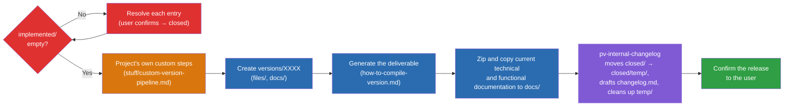

# How `/pv-version` works

General diagram of the release-preparation process, with no script or parameter-name detail — meant to be shown as-is if the user asks "how does `/pv-version` work?" during invocation, or as a reference in the project's documentation.

Legend: red = `implemented/` guardrail (blocks until resolved); orange = the project's own extension point (`stuff/custom-version-pipeline.md`, optional steps `pv-version` runs at three fixed points of the flow); blue = `pv-version`'s mechanical steps; purple = delegated to `pv-internal-changelog`; green = end of the process.
