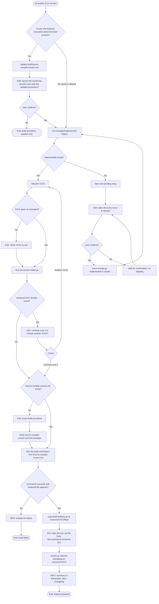

Legend:
- `[Text]` — internal step, the skill acts without talking to the user.
- `[INFO: Text]` — the skill informs the user; doesn't block, continues without waiting for a reply.
- `[ASK: Text]` — the skill informs and asks for confirmation/input; blocking, doesn't proceed without the user's answer.
- `{Text}` — decision branch; each outgoing edge carries its own label.
