```mermaid
flowchart TD
    Start([Invocation of pv-version])

    Start --> S02Intent

    S02Intent{Purely informational invocation about the build process?}
    S02Intent -->|Yes| S02Update[Update stuff/how-to-compile.md]
    S02Update --> S02Ask[ASK: launch the versioning process now with this updated procedure?]
    S02Ask --> S02Dec{User confirms?}
    S02Dec -->|No| End02([End: build procedure updated only])
    S02Dec -->|Yes| S04Load
    S02Intent -->|No, wants a release| S04Load

    S04Load[List stuff/hooks/version/NN-slug.md files, match by NN id, parse each file's Step blocks] --> S04Hook{05-before-guardrail.md defines steps?}
    S04Hook -->|Yes| S04Run[Run 05-before-guardrail steps in order, workFolder only; a failure stops the release before the guardrail]
    S04Run --> S05Guard
    S04Hook -->|No| S05Guard

    S05Guard[List changes/implemented/ folders] --> S05Empty{implemented/ empty?}
    S05Empty -->|Yes| S07Hook{10-before-version.md defines steps?}
    S07Hook -->|Yes| S07Run[Run 10-before-version steps in order, workFolder only; a failure stops the release]
    S07Run --> S1Resolve
    S07Hook -->|No| S1Resolve
    S05Empty -->|No| S05Loop[Take next pending entry]
    S05Loop --> S05AskEntry[ASK: does this entry move to closed?]
    S05AskEntry --> S05EntryDec{User confirms?}
    S05EntryDec -->|Yes| S05Move[move-change.py implemented to closed]
    S05Move --> S05Guard
    S05EntryDec -->|No| S05Wait[Wait for confirmation, no skipping]
    S05Wait --> S05AskEntry

    S1Resolve[Resolve XXXX] --> S1Given{XXXX given at invocation?}
    S1Given -->|No| S1Ask[ASK: which XXXX to use]
    S1Ask --> S2Folder
    S1Given -->|Yes| S2Folder

    S2Folder[Run init-version-folder.py] --> S2Exists{versions/XXXX already exists?}
    S2Exists -->|No| S3Check
    S2Exists -->|Yes| S2AskConflict[ASK: continue over it or choose another XXXX?]
    S2AskConflict --> S2ConflictDec{Choice}
    S2ConflictDec -->|Another XXXX| S1Resolve
    S2ConflictDec -->|Continue over it| S3Check

    S3Check{how-to-compile.md exists?} -->|No| S3Ask[ASK: exact build procedure]
    S3Ask --> S3Write[Write how-to-compile.md from template]
    S3Write --> S4Run
    S3Check -->|Yes| S4Run

    S4Run[Run the build command s from how-to-compile.md] --> S4Ok{Command succeeds and expected file appears?}
    S4Ok -->|No| S4Stop[INFO: explain the failure]
    S4Stop --> End4([End: build failed])
    S4Ok -->|Yes| S4Copy[copy-build-artifacts.py to versions/XXXX/files/]

    S4Copy --> S41Hook{20-after-build.md defines steps?}
    S41Hook -->|Yes| S41Run[Run 20-after-build steps in order, XXXX and versions/XXXX/ paths available; a failure stops the release]
    S41Run --> S5Docs
    S41Hook -->|No| S5Docs

    S5Docs[Run copy-docs.py: zip the three docs.tech/docs.functional dirs] --> S6Changelog[Invoke pv-internal-changelog on versions/XXXX/]
    S6Changelog --> S61Hook{30-after-changelog.md defines steps?}
    S61Hook -->|Yes| S61Run[Run 30-after-changelog steps in order, XXXX and versions/XXXX/ paths available; a failure stops the release]
    S61Run --> S7Summary
    S61Hook -->|No| S7Summary
    S7Summary[INFO: summary of deliverable, docs, changelog, plus any hooks that ran] --> EndOK([End: release prepared])

    classDef hook fill:#d9770e,color:#fff
    class S04Hook,S04Run,S07Hook,S07Run,S41Hook,S41Run,S61Hook,S61Run hook
```

Legend:
- `[Text]` — internal step, the skill acts without talking to the user.
- `[INFO: Text]` — the skill informs the user; doesn't block, continues without waiting for a reply.
- `[ASK: Text]` — the skill informs and asks for confirmation/input; blocking, doesn't proceed without the user's answer.
- `{Text}` — decision branch; each outgoing edge carries its own label.
- Orange nodes — the project's own hook insertion points (`stuff/hooks/version/*.md`): the check for defined steps and the run of those steps. Optional; a hook with no steps is skipped silently.
