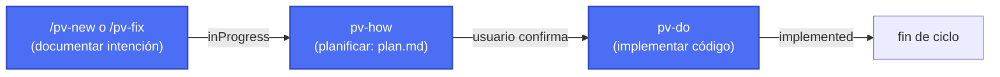

# **Previo**

*Read this in [English](README.md).*

****Previo**** es un framework de desarrollo creado y dirigido por IA para [Claude Code](https://claude.com/claude-code): define cambios, valida el diseño sobre maquetas y diagramas, gestiona el estado de cada cambio y prepara entregas — todo de forma conversacional, sin plantillas rígidas ni herramientas adicionales.

Aporta el control y la trazabilidad del *spec-driven development* sin la sobrecarga de proceso que ese enfoque suele exigir en proyectos grandes. Pensado para proyectos de cualquier tamaño y gestionados por una sola persona.

## Índice

- 🔑[Puntos fuertes](#puntos-fuertes)
- 🛠️[Configurable y extensible](#configurable-y-extensible)
- ⚠️[Puntos menos fuertes y lo que está por llegar](#puntos-menos-fuertes-y-lo-que-está-por-llegar)
- 🛜[Instalación](#instalación)
  - [Estructura completa de carpetas](#estructura-completa-de-carpetas)
- 💻[Flujo de trabajo](#flujo-de-trabajo)
  - [Flujo mínimo](#flujo-mínimo)
  - [Flujo extendido](#flujo-extendido)
- ⭐[La experiencia completa](#la-experiencia-completa)
- 📐[Cómo está hecho, al detalle](#cómo-está-hecho-al-detalle)
- ⚖️[Licencia](#licencia)

## 🔑Puntos fuertes

| Característica | Descripción |
|---|---|
|<u>**Rápido y sin complicaciones**</u>|Prioriza la velocidad y el trabajo secuencial frente al trabajo en paralelo, evitando la complejidad de coordinar varios cambios a la vez, resolver conflictos entre PRs o gestionar ramas simultáneas.|
|<u>**Especificación completa, formato libre**</u>|Cada entrada exige la estructura mínima necesaria para ser útil (intención, plan, estado), sin formatos de *spec* complejos que haya que aprender o mantener a mano.|
|<u>**Valida siempre sobre diseños**</u>|Visualiza y valida los cambios visuales y los flujos de trabajo con maquetas estáticas (HTML/CSS o personalizado) antes implementar nada, evitando el ciclo de "implementar → ver que no convence → rehacer".|
|<u>**Análisis detallados, riesgos claros**</u>|Cada cambio es analizado y escrito en un plan al detalle para asegurar el éxito y anticipar el riesgo que conlleva.|
|<u>**Documentación siempre al día**</u>|**Previo** mantiene siempre actualizada la documentación técnica y funcional del proyecto, así como los cambios entre versiones. Puedes empezar el proyecto con un diseño técnico inicial o dejar que **Previo** la vaya generando por su cuenta.|
|<u>**Trazabilidad**</u>| Qué, cuándo y cómo de todo. Siempre. |
|<u>**Adaptable y versátil**</u> | Ideal para proyectos de cualquier tamaño y se adapta al stack de cada uno.|
|<u>**Sin herramientas adicionales**</u> |No requiere más que Claude Code y Python en la máquina de desarrollo — sin instalaciones en tu máquina, servicios externos, bases de datos ni otros quebraderos de cabeza.|
|<u>**100% construido con IA y para IA**</u> |Todo el ciclo (desde la idea hasta su realización) es un proceso 100% guiado por IA, para cualquier tipo de perfil. Unos pocos tokens más, mucha complejidad menos.|
|<u>**Soporte multi-idioma**</u>| Habla en español, escribe la documentación técnica en inglés y redacta el changelog en francés (por ejemplo). El soporte multi-idioma es configurable hasta en 5 puntos. |
|<u>**Y muchas cosas más**</u>| Gestión y trazabilidad de cada cambio, generación de versiones (incluida documentación), histórico de prompts relacionados con cada cambio, cambios rápidos, evaluaciones de seguridad, sistema autónomo de actualizaciones, etc.|


## 🛠️Configurable y extensible

| Qué puedes personalizar | Cómo |
|---|---|
|<u>**Idioma**</u>|Habla con **Previo** en tu idioma mientras cada tipo de documento (changes, changelog, documentación funcional y técnica) se escribe en el suyo propio — configurable punto por punto en `.claude/pv-context.json`.|
|<u>**Piezas a tu medida**</u>|Sustituye la generación de maquetas o diagramas por una skill propia de tu proyecto, sin tocar el resto del framework.|
|<u>**Estructura de carpetas y documentación**</u>|Define dónde vive cada cosa — carpeta de cambios, código fuente, documentación de arquitectura, estilo y funcionalidades — para encajar **Previo** en la estructura que ya tiene tu proyecto.|
|<u>**Modelo por skill**</u>|Asigna el modelo y el nivel de esfuerzo que prefieras a cada skill (por ejemplo, uno más ligero para tareas de consulta y uno más potente para el análisis técnico).|

Consulta la [`Guía de usuario`](.claude/pv-doc/pv-guide.es.md#más-formas-de-personalizar-**Previo**) para el detalle de cada opción.

## ⚠️Puntos menos fuertes y lo que está por llegar
- <u>**Contextos grandes.**</u> A medida que el proyecto crezca, el contexto necesario para que **Previo** haga su trabajo también crecerá (y el consumo de tokens). Hemos priorizado la calidad de los resultados frente al supuesto ahorro de tokens (aunque no los hemos olvidado) porque nuestra experiencia nos dice que el retrabajo siempre sale más caro que un buen análisis **Previo**.
- <u>**Mejor con mejores modelos.**</u> **Previo** puede funcionar con cualquier modelo, aunque los resultados irán en consonancia, claro. Esto es como decidir qué perfil quieres contratar para hacer un trabajo: un junior (ej: Haiku) irá más rápido y te costará menos, pero el riesgo de errores y retrabajo es grande. Incluso puedes tener varios en paralelo si quieres, pero entonces ya no te sale tan barato. Un senior (ej: Sonnet) te costará un poco más, pero se lo pensará mejor y el riesgo será mucho menor. Hemos probado **Previo** con ambos enfoques (Sonnet ya es lo bastante senior) y siempre nos ha compensado el uso de un senior (porcentaje de retrabajo en el último proyecto: 5%) para todo, en lugar de intentar ahorrar con juniors (retrabajo en el mismo proyecto: 40%). Son solo nuestros números, lo sabemos, así que pruébalo tú mismo.
- <u>**Riesgo vs. pruebas.**</u> Como hemos priorizado la calidad del trabajo y la reducción de riesgos, hemos dejado de lado de momento la implementación de herramientas de pruebas más específicas. Estamos pensando cómo incorporarlo de manera que no afecte a la agilidad del framework. Obviamente solo tienes que indicar en un cambio qué tipos de tests quieres que se hagan de ahora en adelante y el framework se asegurará de hacerlo, pero creemos que puede haber una manera mejor en el futuro cercano.

## 🛜Instalación

Desde la raíz del proyecto donde quieras usar el framework, ejecuta:

**macOS / Linux / Git Bash / WSL:**

Última versión disponible:
```
curl -fsSL https://raw.githubusercontent.com/yeyopepe/**Previo**-sdd/main/install.sh | sh
```

Versión específica:
```
curl -fsSL https://raw.githubusercontent.com/yeyopepe/**Previo**-sdd/main/install.sh | sh -s -- 0.9.5b6
```

**Windows (PowerShell):**

Última versión disponible:
```
irm https://raw.githubusercontent.com/yeyopepe/**Previo**-sdd/main/install.ps1 | iex
```

Versión específica:
```
$env:**Previo**_VERSION = "0.9.5b6"; irm https://raw.githubusercontent.com/yeyopepe/**Previo**-sdd/main/install.ps1 | iex
```

> ❗**RECUERDA**:
> Puedes consultar el changelog en `.claude/pv-changelong.es.md`

Esto instala (o actualiza) `.claude/skills` y la documentación (`pv-guide.md` y su versión `.en.md`) con el contenido del framework, sin tocar tu configuración (`pv-context.json`, `settings.json`) ni ninguna skill propia que no empiece por `pv-`. Volver a ejecutarlo en cualquier momento actualiza el framework a la última versión: añade skills nuevas, actualiza las existentes y elimina las que ya no formen parte de **Previo**.

Después, desde la raíz de ese proyecto, ejecuta según tu caso ```/pv-init``` si es primera instalación o ```/pv-update``` si estás actualizando desde una versión anterior.

> ❗**IMPORTANTE:**
> A partir de aquí el framework te guiará en el proceso de configuración comprobando las herramientas necesarias (Git, Python 3 y las condicionales según el stack del proyecto) y genera el fichero de configuración del que dependen el resto de skills `.claude/pv-context.json`, preguntándote qué idioma/s quieres usar para cada cosa, dónde se guardarán los cambios, dónde está o estará tú código fuente, si quieres aportar ya información de tu proyecto para que empiece a documentarlo, etc.
>
> Cuando ejecutes `/pv-update` el framework se encargará de revisar y actualizar todo lo necesario para que puedas seguir trabajando.

### Estructura completa de carpetas

Así es cómo quedará tu repo tras la instalación, listo para empezar a trabajar con **Previo**:

```
{raíz del repo}/
├── src/                         # el código fuente de tu app (carpeta por defecto)
├── .claude/
│   └── skills/                  # aquí está el framework de **Previo**
│
└── **Previo**-sdd/                  # carpeta de trabajo principal del framework
    ├── changes/                 # todo tu trabajo de documentación e implementación pasa por aquí, según su estado actual
    │   ├── inProgress/          
    │   ├── implemented/         
    │   ├── todo/                
    │   └── closed/              
    │
    ├── versions/                # aquí aparece cada entrega que prepares 
    │   └── {XXXX}/              
    │
    ├── stuff/                   # aquí hay material diverso que usa **Previo**
    │
    └── docs/                    # la documentación de tu proyecto que **Previo** mantiene actualizada
        ├── architecture/        
        ├── style/               
        └── features/            
```


## 💻Flujo de trabajo

Cada cambio vive en una carpeta numerada dentro de `changes/` que va viajando entre subcarpetas según su estado: `inProgress/` → `implemented/` → `closed/`.

### Flujo mínimo

El ciclo obligatorio: documentar la intención y, si el usuario confirma, planificar e implementar.



- **`/pv-new <descripción>`** — documenta funcionalidad nueva o un cambio de comportamiento intencionado (`description.md`), generando maquetas visuales si aplica.
- **`/pv-fix <descripción>`** — corrige un bug de punta a punta, o aplica al vuelo un cambio tan trivial (typo, texto, un valor puntual) que no merece pasar por `plan.md`.
- **`pv-how` + `pv-do`** — planifican la solución técnica (`plan.md`) e implementan el código, actualizando la documentación de arquitectura/estilo/funcionalidades configurada.

### Flujo extendido

Skills opcionales que complementan el ciclo mínimo: anotar ideas antes de comprometerte, consultar el estado y empaquetar entregas.


- **`/pv-todo <idea>`** — apunta una idea suelta para más adelante sin comprometerte todavía a documentarla ni implementarla.
- **`/pv-status`** — consulta el estado de los cambios en curso, implementados o pendientes de versionar.
- **`/pv-version <código>`** — empaqueta una entrega: genera el entregable, comprime la documentación vigente y redacta el changelog funcional a partir de lo cerrado.


## ⭐La experiencia completa
Consulta el [changelog](.claude/pv-changelog.es.md) de la vesión actual.
Consulta en la [guía de usuario](.claude/pv-doc/pv-guide.es.md) todo lo que puedes hacer con **Previo**.


## 📐Cómo está hecho, al detalle
Si lo quieres es ver cómo está hecho (el mapa de skills del framework, cómo se invocan entre sí, las decisiones detrás de su arquitectura, etc), aquí tienes el [documento de diseño](.claude/pv-doc/pv-design/pv-design.es.md).

## ⚖️Licencia

[MIT](LICENSE)
