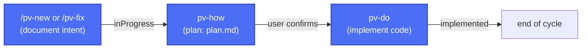

# **Previo**

*Read this in [Spanish](README.es.md).*

****Previo**** is a development framework created and driven by AI for [Claude Code](https://claude.com/claude-code): it defines changes, validates design through mockups and diagrams, tracks the state of each change, and prepares releases — all conversationally, without rigid templates or extra tooling.

It brings the control and traceability of *spec-driven development* without the process overhead that approach usually demands in large projects. Built for projects of any size run by a single person.

## Table of contents

- 🔑[Key features](#key-features)
- 🛠️[Configurable and extensible](#configurable-and-extensible)
- ⚠️[Weaknesses and what's coming next](#weaknesses-and-whats-coming-next)
- 🛜[Installation](#installation)
  - [Full folder structure](#full-folder-structure)
- 💻[Workflow](#workflow)
  - [Minimal flow](#minimal-flow)
  - [Extended flow](#extended-flow)
- ⭐[The Full Experience](#the-full-experience)
- 📐[How it's built, in detail](#how-its-built-in-detail)
- ⚖️[License](#license)

## 🔑Key features

| Feature | Description |
|---|---|
|<u>**Fast and no fuss**</u>|Prioritizes speed and sequential work over parallel work, avoiding the complexity of coordinating multiple changes at once, resolving PR conflicts, or managing simultaneous branches.|
|<u>**Complete spec, free-form**</u>|Every entry requires just enough structure to be useful (intent, plan, state), without complex *spec* formats to learn or maintain by hand.|
|<u>**Design is always validated**</u>|Visualizes and validates visual changes and workflows with static mockups (HTML/CSS or a custom format) before implementing anything — avoiding the "implement → doesn't land right → redo" cycle.|
|<u>**Detailed analysis, clear risks**</u>|Every change is analyzed and written up in a detailed plan to set it up for success and anticipate the risk it carries.|
|<u>**Documentation always up to date**</u>|**Previo** keeps the project's technical and functional documentation up to date at all times, along with the changelog between versions. You can start the project with an initial technical design or let **Previo** build it up on its own.|
|<u>**Traceability**</u>| What, when, and how, for everything. Always. |
|<u>**Adaptable and versatile**</u>| Great for projects of any size, and adapts to each project's stack.|
|<u>**No extra tooling**</u> |Requires nothing beyond Claude Code and Python on the development machine — no installs on your machine, external services, databases, or other headaches.|
|<u>**100% built by AI, for AI**</u> |The whole cycle (from idea to delivery) is a 100% AI-guided process, for any kind of profile. A few more tokens, much less complexity.|
|<u>**Multi-language support**</u>| Speak in English, write the technical documentation in Spanish, and draft the changelog in French (for example). Multi-language support is configurable across up to 5 points. |
|<u>**And plenty more**</u>| Tracking and traceability for every change, release generation (documentation included), a prompt history tied to each change, fast changes, security reviews, an autonomous update-checking system, and more.|


## 🛠️Configurable and extensible

| What you can customize | How |
|---|---|
|<u>**Language**</u>|Talk to **Previo** in your language while each type of document (changes, changelog, functional and technical documentation) is written in its own — configurable point by point in `.claude/pv-context.json`.|
|<u>**Custom pieces**</u>|Swap out mockup or diagram generation for a skill of your own project, without touching the rest of the framework.|
|<u>**Folder structure and documentation**</u>|Define where everything lives — the changes folder, source code, architecture documentation, style, and features — to fit **Previo** into the structure your project already has.|
|<u>**Model per skill**</u>|Assign whichever model and effort level you prefer to each skill (for example, a lighter one for lookup tasks and a more capable one for technical analysis).|

See the [user guide](.claude/pv-doc/pv-guide.en.md#more-ways-to-customize-**Previo**) for the detail on each option.

## ⚠️Weaknesses and what's coming next

- <u>**Large contexts.**</u> As the project grows, the context **Previo** needs to do its job grows too (and token usage along with it). We've prioritized the quality of results over the assumed token savings (though we haven't forgotten about those either), because our experience tells us that rework always costs more than good upfront analysis.
- <u>**Better with better models.**</u> **Previo** can run on any model, though results will vary accordingly, of course. Think of it like deciding what profile to hire for a job: a junior (e.g. Haiku) will go faster and cost you less, but the risk of mistakes and rework is high. You could even run several in parallel if you want, but then it's no longer that cheap. A senior (e.g. Sonnet) will cost you a bit more, but will think things through better and the risk will be much lower. We've tested **Previo** with both approaches (Sonnet is already senior enough) and using a senior for everything has always paid off for us (rework rate on our last project: 5%) over trying to save with juniors (rework on the same project: 40%). These are just our numbers, we know, so try it yourself.
- <u>**Risk vs. testing.**</u> Since we've prioritized quality of work and risk reduction, we've set aside implementing more specific testing tooling for now. We're figuring out how to add it without hurting the framework's agility. You can simply state in a change which kinds of tests you want done from then on and the framework will make sure it happens, but we think there may be a better way to do this in the near future.

## 🛜Installation

From the root of the project where you want to use the framework, run:

**macOS / Linux / Git Bash / WSL:**

Latest version available:
```
curl -fsSL https://raw.githubusercontent.com/yeyopepe/**Previo**-sdd/main/install.sh | sh
```
Specific version:
```
curl -fsSL https://raw.githubusercontent.com/yeyopepe/**Previo**-sdd/main/install.sh | sh -s -- 0.9.5b6
```

**Windows (PowerShell):**

Latest version available:
```
irm https://raw.githubusercontent.com/yeyopepe/**Previo**-sdd/main/install.ps1 | iex
```

Specific version:
```
$env:**Previo**_VERSION = "0.9.5b6"; irm https://raw.githubusercontent.com/yeyopepe/**Previo**-sdd/main/install.ps1 | iex
```

> ❗**REMEMBER**:
> You can check the changelog at `.claude/pv-changelog.en.md`

This installs (or updates) `.claude/skills` and the documentation (`pv-guide.md` and its `.en.md` version) with the framework's content, without touching your configuration (`pv-context.json`, `settings.json`) or any custom skill that doesn't start with `pv-`. Running it again at any time updates the framework to the latest version: it adds new skills, updates existing ones, and removes any that are no longer part of **Previo**.

Then, from that project's root, run `/pv-init` for a first install, or `/pv-update` if you're updating from an earlier version.

> ❗**IMPORTANT:**
> From here, the framework guides you through the setup process: it checks the required tools (Git, Python 3, and any conditional ones depending on the project's stack) and generates `.claude/pv-context.json` — the configuration file the rest of the skills depend on — asking which language(s) you want to use for each area, where changes will be stored, where your source code is or will be, whether you want to provide project information up front so it can start documenting it, and more.
>
> If you run `/pv-update`, the framework reviews and updates everything needed so you can keep working.

### Full folder structure

Here's what your repo will look like after installation, ready to start working with **Previo**:

```
{repo root}/
├── src/                         # your app's source code (default folder)
├── .claude/
│   └── skills/                  # the **Previo** framework lives here
│
└── **Previo**-sdd/                  # the framework's main working folder
    ├── changes/                 # all your documentation and implementation work passes through here, based on its current state
    │   ├── inProgress/          
    │   ├── implemented/         
    │   ├── todo/                
    │   └── closed/              
    │
    ├── versions/                # each release you prepare shows up here
    │   └── {XXXX}/              
    │
    ├── stuff/                   # miscellaneous material **Previo** uses
    │
    └── docs/                    # your project's documentation, kept up to date by **Previo**
        ├── architecture/        
        ├── style/               
        └── features/            
```


## 💻Workflow

Each change lives in a numbered folder inside `changes/` that travels between subfolders as its state progresses: `inProgress/` → `implemented/` → `closed/`.

### Minimal flow

The mandatory cycle: document the intent and, once the user confirms, plan and implement.



- **`/pv-new <description>`** — documents new functionality or an intentional behavior change (`description.md`), generating visual mockups if applicable.
- **`/pv-fix <description>`** — fixes a bug end to end, or applies a change trivial enough (typo, text, a single value) on the spot that it doesn't warrant a `plan.md`.
- **`pv-how` + `pv-do`** — plan the technical solution (`plan.md`) and implement the code, updating the configured architecture/style/features documentation.

### Extended flow

Optional skills that complement the minimal cycle: jotting down ideas before committing, checking status, and packaging releases.


- **`/pv-todo <idea>`** — jots down a loose idea for later without committing to documenting or implementing it yet.
- **`/pv-status`** — checks the status of changes in progress, implemented, or pending release.
- **`/pv-version <code>`** — packages a release: generates the deliverable, archives the current documentation, and writes the functional changelog from what's been closed.


## ⭐The Full Experience
See the [changelog](.claude/pv-changelog.en.md) for the current version.
See the [user guide](.claude/pv-doc/pv-guide.en.md) for everything you can do with **Previo**.

## 📐How it's built, in detail
If you want to see how it's built (the framework's skill map, how they invoke each other, the reasoning behind its architecture, etc), here's the [design document](.claude/pv-doc/pv-design/pv-design.en.md).

## ⚖️License

[MIT](LICENSE)
