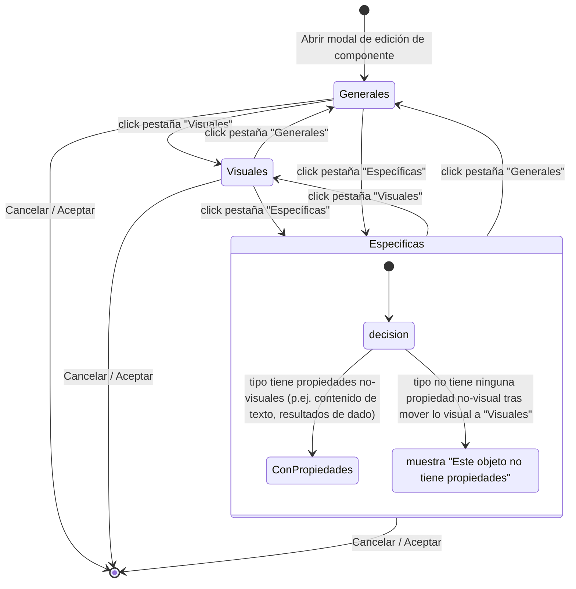

# Navegación — pestañas de la modal de edición de componente (cambio 00210)

Caso de uso: cómo cambia el usuario entre las pestañas de la modal de edición de un componente, ahora que pasa de 2 a 3 pestañas ("Generales" / "Visuales" / "Específicas"), y qué ve en "Específicas" según si el tipo tiene o no propiedades no-visuales que configurar.

Notas:

- El contenido de cada pestaña no se pierde al cambiar de pestaña dentro de la misma apertura de la modal — los tres paneles comparten el mismo `workingComponent` en memoria, igual que hoy con "Generales"/"Específicas".
- La pestaña activa al abrir la modal es siempre "Generales" (sin cambios respecto al comportamiento actual).
- "Visuales" nunca muestra el estado "sin propiedades": Tamaño y Profundidad/Color de extrusión están presentes en los 8 tipos de componente.
- El estado `ConPropiedades`/`SinPropiedades` de "Específicas" se recalcula cada vez que se entra en esa pestaña (depende del `type` del componente, fijo durante la edición) — no cambia dentro de una misma sesión de edición.
