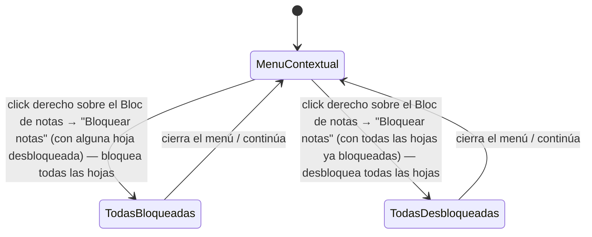

# Navegación — Bloquear/desbloquear todas las notas a la vez

Caso de uso: qué hace la opción "Bloquear notas" del menú contextual del "Bloc de notas".

Notas:
- "Bloquear notas" es una fila del menú contextual del propio Bloc de notas (el panel de 2 botones), no de cada hoja.
- Es un interruptor global: si todas las hojas ya están bloqueadas, la acción las desbloquea todas; en cualquier otro caso (ninguna o solo algunas bloqueadas), las bloquea todas. El texto de la fila del menú refleja qué va a pasar ("Bloquear notas" / "Desbloquear notas") según el estado actual.
- Actúa sobre el mismo campo `Bloqueado` que el botón individual de cada hoja (ver `design_navigation_bloc_notas_bloqueo_individual.md`): fija `Ninguno` o `Todos` en bloque.
- El `bloqueado` del propio Bloc de notas (el panel de 2 botones) es independiente de esta acción: bloquear/desbloquear el Bloc de notas en sí solo afecta a si se puede mover ese panel, nunca a sus hojas.
