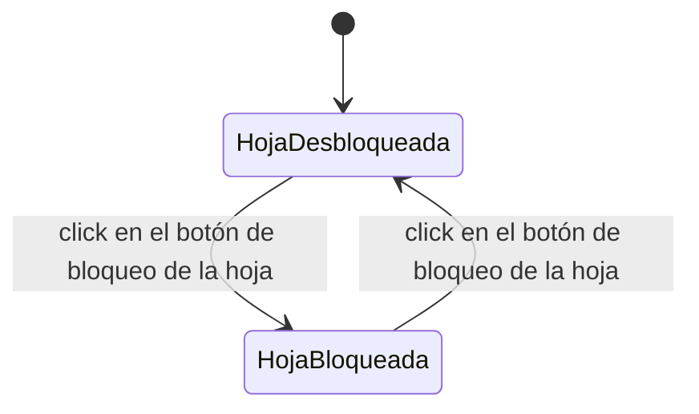

# Navegación — Bloquear/desbloquear una hoja individual

Caso de uso: qué dispara el botón de bloqueo/desbloqueo de una hoja concreta.

Notas:
- El botón alterna el campo `Bloqueado` de la hoja entre `Ninguno` y `Todos` (los dos valores más habituales); la opción intermedia "Solo modo juego" sigue disponible solo desde "Propiedades generales" de la hoja, no desde este botón rápido.
- Con la hoja en `HojaBloqueada`: no se puede mover, ni editar título/cuerpo/color de cabecera, ni borrar con el botón de borrado — mismo criterio ya documentado para el resto de ediciones de la hoja.
- El icono de copiar contenido y el propio botón de bloqueo siguen activos con la hoja bloqueada (acciones no afectadas por el bloqueo, igual que copiar).
- Este botón individual convive con "Bloquear notas" del menú contextual del Bloc de notas (ver `design_navigation_bloc_notas_bloqueo_global.md`), que actúa sobre todas las hojas a la vez.
