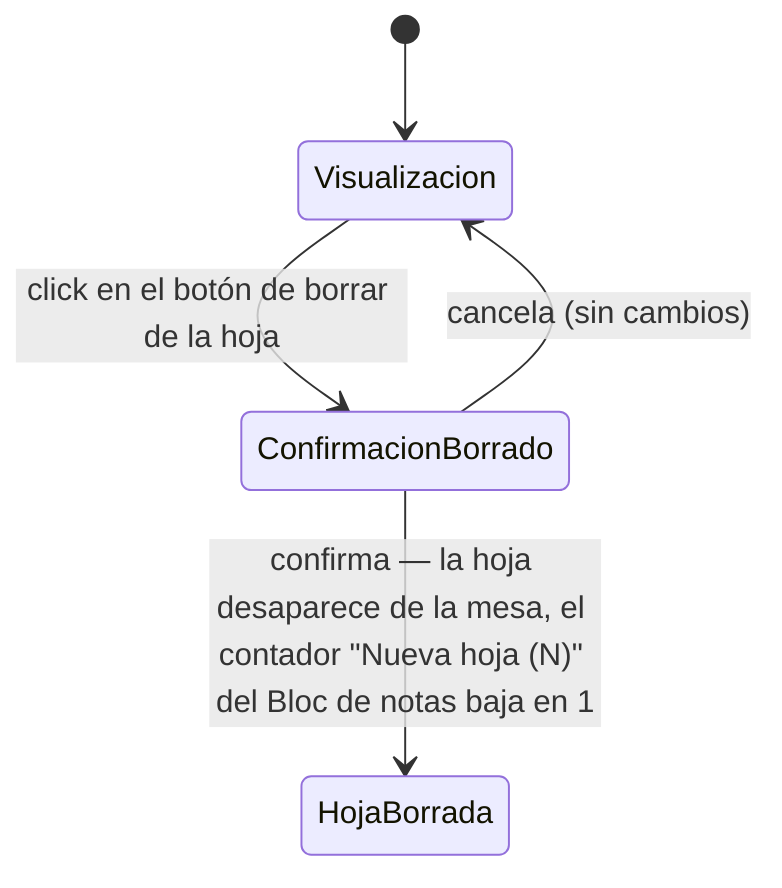

# Navegación — Borrar una hoja del "Bloc de notas"

Caso de uso: qué dispara el botón de borrado de una hoja concreta.

Notas:
- El botón de borrado está en la propia hoja (no requiere abrir el panel general de Componentes), igual de accesible en ambos modos salvo que la hoja esté bloqueada (ver `design_navigation_bloc_notas_bloqueo_individual.md`).
- Pide confirmación previa, mismo criterio que el resto de borrados del proyecto.
- Borrar una hoja no afecta a las demás hojas del mismo Bloc de notas, ni al propio Bloc de notas.
