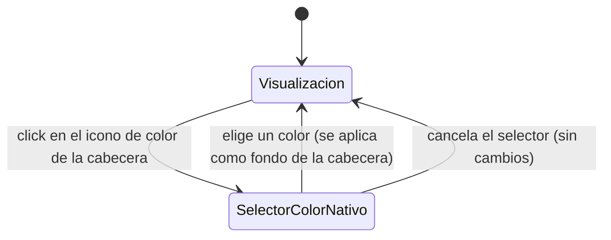

# Navegación — Color de fondo de la cabecera del "Bloc de notas"

Caso de uso: qué dispara el icono de color integrado en la cabecera, y cómo cambia el estado visual del componente al usarlo.

Notas:
- El icono está siempre visible en la cabecera, en cualquier modo (edición o juego) y en cualquier momento — no depende de que el título o el cuerpo estén en edición, ni del estado `bloqueado` del componente.
- El selector de color es el nativo del navegador (`<input type="color">`), no una paleta propia de la app.
