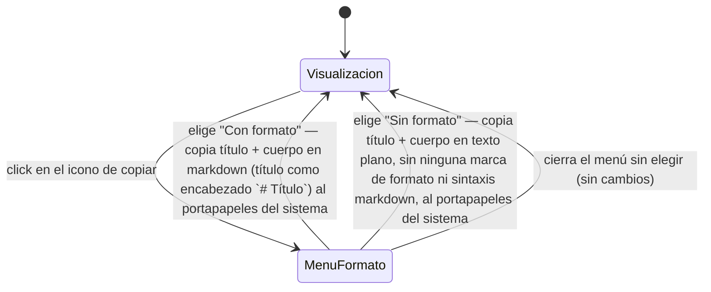

# Navegación — Copiar contenido de una hoja al portapapeles

Caso de uso: qué dispara el icono de copiar integrado en la cabecera de una hoja, y qué opciones ofrece.

Notas:
- El icono está siempre visible en el extremo derecho de la cabecera de la hoja, en cualquier modo y en cualquier momento, sin verse afectado por el estado `Bloqueado` de la hoja (acción de solo lectura, no una edición).
- El menú de elección ("Con formato" / "Sin formato") aparece junto al propio icono, no es una ventana/modal aparte.
- "Con formato": el markdown copiado es equivalente al formato aplicado visualmente en ese momento (negrita, cursiva, subrayado, colores).
- "Sin formato": el texto copiado no lleva ninguna marca visible ni sintaxis markdown, aunque el cuerpo tenga formato aplicado en ese momento — mismo comportamiento que ya estaba documentado antes de esta ampliación.
