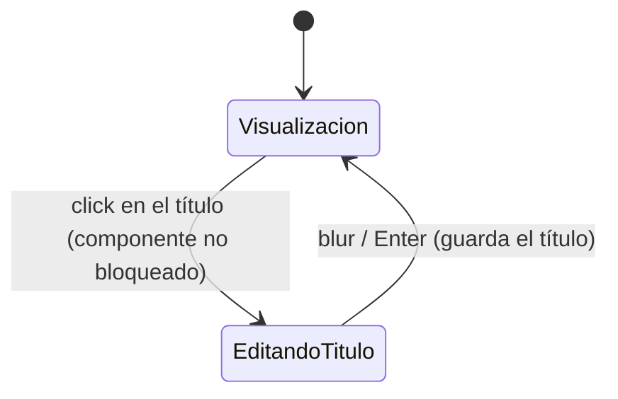

# Navegación — Edición del título del "Bloc de notas"

Caso de uso: cómo se activa/desactiva la edición del título, directamente sobre el componente en la mesa.

Notas:
- Con el componente bloqueado, el click en el título no produce ninguna transición: permanece en `Visualización`.
- El título se edita siempre como texto plano de una sola línea, sin ningún formato ni barra de herramientas asociada (a diferencia del cuerpo — ver diagrama funcional de edición del cuerpo en `description.md`).
