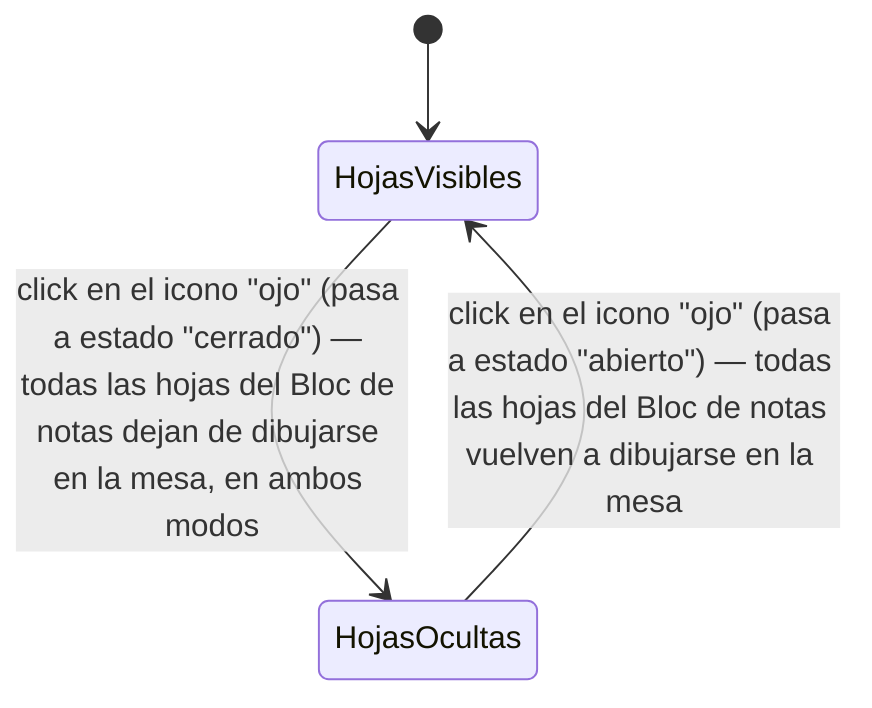

# Navegación — Mostrar/ocultar todas las hojas del "Bloc de notas"

Caso de uso: qué dispara el icono "ojo" del "Bloc de notas", y cómo cambia el estado visual de todas sus hojas al usarlo.

Notas:
- El icono está siempre visible y activo en el "Bloc de notas", en cualquier modo y en cualquier momento — no depende del `bloqueado` del Bloc de notas ni de las hojas.
- El estado (mostrando/ocultando) se guarda con la partida, igual que el resto de campos del componente.
- Es un ocultamiento adicional al campo `Oculto` propio de cada hoja: una hoja se dibuja solo si el "ojo" está en "abierto" Y ella misma no está oculta individualmente (en modo juego).
- Mientras está en "cerrado", el botón "Nueva hoja (N)" queda deshabilitado — ver `design_navigation_bloc_notas_nueva_hoja.md`.
