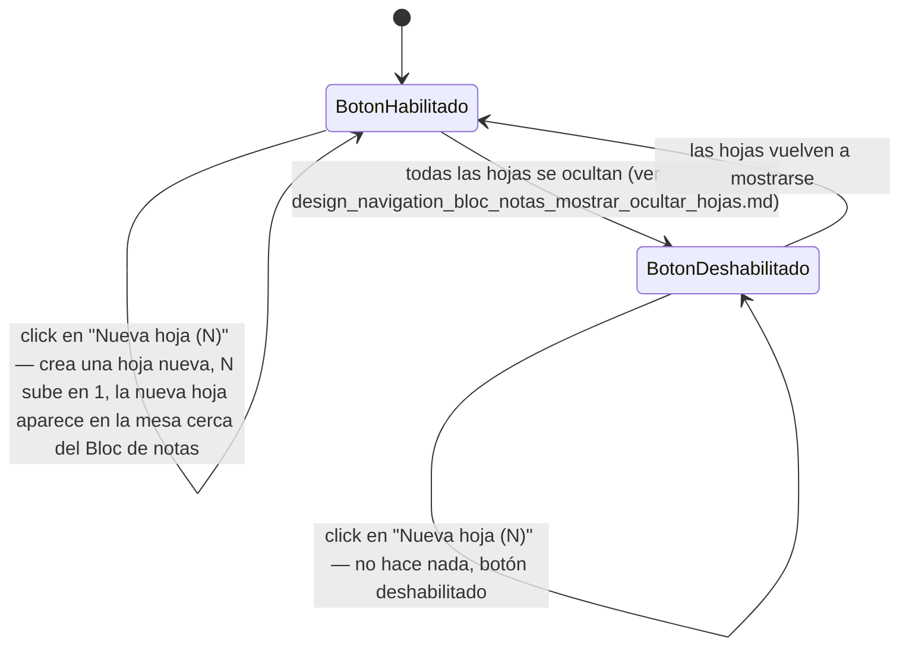

# Navegación — Añadir una hoja nueva desde el "Bloc de notas"

Caso de uso: qué dispara el botón "Nueva hoja (N)" del "Bloc de notas", y cómo cambia el estado del componente al usarlo.

Notas:
- N es el número de hojas que existen ahora mismo (sube al crear, baja al borrar una hoja — ver `design_navigation_bloc_notas_borrar_hoja.md`).
- El botón se deshabilita por completo mientras el icono "ojo" está en estado "ocultar" (ver `design_navigation_bloc_notas_mostrar_ocultar_hojas.md`) — no se pueden añadir hojas nuevas mientras las existentes están ocultas.
- Que el "Bloc de notas" esté bloqueado (`bloqueado`) no afecta a este botón: se pueden añadir hojas nuevas aunque el propio Bloc de notas esté bloqueado (el bloqueo del Bloc de notas solo afecta a moverlo a él mismo).
- La hoja nueva nace vacía (título y cuerpo en blanco), visible, sin bloquear, y no abre ninguna ventana/modal — aparece lista para editar directamente sobre la mesa.
