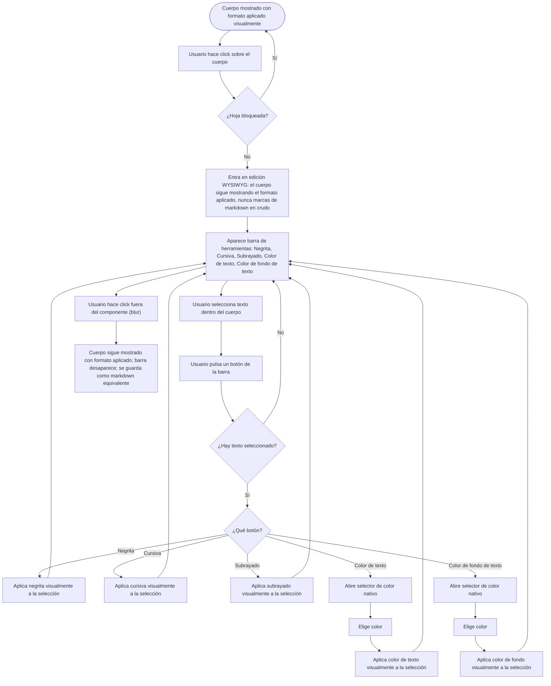

- **Name**: Bloc de notas — nuevo tipo de componente
- **Code**: 00197
- **Type**: change
- **Creation date**: 2026-08-09

## Full description

Nuevo tipo de componente independiente, "Bloc de notas", para el board game virtual. No sustituye al componente "Texto" (etiqueta simple sin título) ni al "Visor de documentos" (visor de markdown/HTML/URL sin título ni edición directa) — convive con ambos.

### Estructura general

El "Bloc de notas" es en sí mismo un componente de la mesa (con su propia posición, tamaño, bloqueo, etc.), pero no es una tarjeta de notas: es un panel lanzador con **2 botones uno al lado del otro**:

- **Botón cuadrado amarillo**, etiqueta "Nueva hoja (N)" — crea una **hoja** nueva.
- **Botón redondo con icono de ojo** — muestra/oculta **todas** las hojas de este Bloc de notas a la vez.

Una **hoja** es la tarjeta de notas (cabecera + cuerpo con formato) descrita más abajo. Cada hoja creada es un componente de la mesa **totalmente independiente** del panel lanzador y de las demás hojas: tiene su propia posición, es movible y redimensionable por separado, y se puede bloquear/ocultar/borrar por separado — pero todas las hojas creadas desde un mismo "Bloc de notas" quedan internamente vinculadas a él (pertenecen al mismo componente lógico).

El panel lanzador (los 2 botones) también es libremente movible y redimensionable, igual que el resto de componentes.

**Id interno de cada hoja**: formado por el nombre del "Bloc de notas" que la creó más un sufijo numerado que nunca se reutiliza (aunque se borren hojas intermedias, el siguiente sufijo siempre es mayor que cualquiera usado antes por ese Bloc de notas). Es un identificador puramente interno — el usuario no lo ve en ningún momento.

### Añadir y eliminar hojas

- Al pulsar "Nueva hoja (N)": se crea una hoja nueva, vacía (título y cuerpo en blanco), visible, sin bloquear, posicionada en la mesa cerca del panel lanzador (en cascada respecto a la hoja anterior, para no amontonarse) — sin abrir ninguna ventana/modal, lista para editar directamente. El contador N sube en 1.
- El botón "Nueva hoja (N)" funciona en ambos modos (edición y juego). Que el propio "Bloc de notas" esté bloqueado **no** impide añadir hojas nuevas — el bloqueo del panel lanzador solo afecta a si se puede mover ese panel, nada más.
- El botón "Nueva hoja (N)" se **deshabilita por completo** mientras las hojas están ocultas (ver siguiente sección) — no se pueden crear hojas nuevas mientras las existentes están ocultas.
- Cada hoja tiene su propio botón de borrado, directamente sobre la hoja (no hace falta abrir el panel general de Componentes). Pide confirmación previa, igual que el resto de borrados del proyecto. Borrar una hoja no afecta a las demás ni al panel lanzador, y hace bajar en 1 el contador N.
- Borrar el "Bloc de notas" (el panel lanzador) borra en cascada todas sus hojas.

### Mostrar/ocultar todas las hojas

El botón redondo con el icono de ojo alterna un único estado guardado en el propio "Bloc de notas": "mostrando" / "ocultando". El icono cambia de aspecto según el estado. Al ocultar, todas las hojas de este Bloc de notas dejan de dibujarse en la mesa, en ambos modos; al volver a mostrar, reaparecen tal cual estaban. Es un ocultamiento adicional al campo "Oculto" propio de cada hoja (que sigue existiendo y aplicándose solo en modo juego, igual que en el resto de tipos): una hoja se ve solo si el ojo está en "mostrando" **y** ella misma no está oculta individualmente. Este estado se guarda con la partida, igual que el resto.

### Bloqueo de hojas (individual y en bloque)

Cada hoja tiene, además del criterio estándar de bloqueo del proyecto (editable con el desplegable de 3 opciones de "Propiedades generales": Ninguno / Solo modo juego / Todos), un **botón de bloqueo/desbloqueo directo sobre la propia hoja** que alterna rápidamente entre Ninguno y Todos (sin pasar por la opción intermedia, que sigue disponible solo desde "Propiedades generales").

El "Bloc de notas" (panel lanzador) incorpora además, en su menú contextual, la opción **"Bloquear notas"**: bloquea o desbloquea todas las hojas de golpe (si todas están ya bloqueadas, las desbloquea; en cualquier otro caso, las bloquea todas). El texto de esta fila refleja qué acción va a realizar. El bloqueo del propio panel lanzador es independiente de esto: bloquear/desbloquear el panel lanzador solo afecta a si se puede mover ese panel.

Con una hoja bloqueada: no se puede mover, ni editar título/cuerpo/color de cabecera, ni borrar con su botón de borrado — el icono de copiar contenido y el propio botón de bloqueo de la hoja siguen activos (no son ediciones).

### Estructura visual de una hoja

Tarjeta rectangular con sombra de contacto (sin bisel), redimensionable libremente en ambos ejes, sin restricción de proporción. Tamaño inicial 220×180px. Dos zonas:

- **Cabecera**: título de una sola línea, sin formato ni markdown (el texto del título siempre se muestra en negro). El fondo de la cabecera tiene un color configurable mediante un pequeño icono/muestra de color integrado en la propia cabecera, visible siempre — en cualquier modo (edición o juego) y en cualquier momento, no solo mientras se está editando el resto del contenido. Al pulsarlo se abre el selector de color nativo del navegador. La cabecera incluye también, siempre visibles: un icono para copiar el contenido de la hoja al portapapeles (ver sección de copiado más abajo), un botón para bloquear/desbloquear la hoja, y un botón para borrarla (con confirmación).
- **Cuerpo**: texto con formato (negrita, cursiva, subrayado, color de texto, color de fondo de texto), guardado internamente como markdown, editado con un editor **WYSIWYG**: el formato aplicado se ve siempre visualmente, tanto fuera de edición como durante la edición — en ningún momento se muestran las marcas de markdown en crudo.

### Edición de contenido (título y cuerpo)

El título y el cuerpo se editan directamente sobre la propia hoja, en el tablero, sin necesidad de abrir ninguna ventana aparte — en ambos modos (edición y juego), salvo que la hoja esté bloqueada (mismo criterio que el resto de tipos de componente). La ventana estándar de "Propiedades generales" de la hoja (bloqueado, oculto, etiquetas, etc., disponible en modo edición igual que en el resto de tipos) se sigue abriendo con normalidad — esa ventana no contiene el título ni el cuerpo, que se editan siempre directamente sobre la hoja.

### Comportamiento del cuerpo (edición WYSIWYG)

El editor del cuerpo es WYSIWYG: el resultado formateado (negrita/cursiva/subrayado/colores aplicados visualmente) se muestra igual fuera de edición y durante la edición — nunca se ven las marcas de markdown en crudo, ni siquiera mientras se edita. Al hacer click sobre el cuerpo (con la hoja no bloqueada) se entra en edición y aparece una pequeña barra de herramientas con 5 botones, solo mientras dura la edición: Negrita, Cursiva, Subrayado, Color de texto, Color de fondo de texto.

- Cada botón actúa sobre el texto que el usuario tenga seleccionado en ese momento dentro del cuerpo (no es un interruptor que afecte a todo el cuerpo de golpe). Sin ningún texto seleccionado, pulsar el botón no hace nada.
- Negrita, Cursiva y Subrayado aplican el estilo correspondiente, visualmente, al texto seleccionado.
- Color de texto y Color de fondo de texto abren el selector de color nativo del navegador; al elegir un color, se aplica visualmente como color de letra o como resaltado de fondo, respectivamente, sobre el texto seleccionado.
- Al salir de la edición (dejar de tener el foco / hacer click fuera del componente), el cuerpo sigue mostrándose formateado igual que durante la edición, y la barra de herramientas desaparece. Por debajo, el resultado se serializa y guarda como markdown equivalente al formato aplicado.

### Copiar contenido al portapapeles

Al pulsar el icono de copiar de la cabecera de una hoja, aparece un pequeño menú con dos opciones:

- **Con formato**: copia título + cuerpo en markdown (título como encabezado `# Título`) al portapapeles del sistema.
- **Sin formato**: copia título + cuerpo en texto plano, sin ninguna marca de formato ni sintaxis markdown, al portapapeles del sistema — aunque el cuerpo tenga formato aplicado visualmente en ese momento.

El icono y su menú están siempre visibles y activos, en cualquier modo y en cualquier momento, sin verse afectados por el estado "Bloqueado" de la hoja (acción de solo lectura, no una edición).

### Casos límite y estados

- Título y cuerpo de una hoja vacíos están permitidos, sin aviso de error.
- Redimensionar una hoja (o el panel lanzador) por debajo de un tamaño mínimo recorta el contenido visible (el contenido que no cabe queda oculto), mismo criterio que otros componentes redimensionables del proyecto.
- Sin límite propio de longitud de texto ni de número de hojas por Bloc de notas.
- "Bloc de notas" recién creado (sin ninguna hoja todavía): muestra "Nueva hoja (0)", sin ninguna hoja en la mesa.
- El id interno de cada hoja nunca se muestra al usuario; no necesita formato legible ni corto.

### Convivencia con lo existente

Tipo de componente nuevo e independiente, se añade a la lista de tipos disponibles al dar de alta un componente nuevo (el "Bloc de notas", panel lanzador). No sustituye a "Texto" ni a "Visor de documentos". Las hojas no aparecen como tipo elegible en el alta — nacen siempre desde el botón "Nueva hoja" de un "Bloc de notas" ya existente.

### Alcance de los datos

Igual que el resto de componentes del tablero: el "Bloc de notas" y todas sus hojas se guardan con el resto de la partida (autoguardado del navegador, "Guardar a fichero", "Exportar"), sin distinción de usuario o sesión — el proyecto no tiene ese concepto. El estado de "mostrando/ocultando" del ojo también se guarda con la partida.

### Quién puede usarlo

Sin restricción de roles (el proyecto no tiene sistema de roles). Cualquiera en modo edición puede crear el componente "Bloc de notas". En ambos modos, cualquiera puede: añadir hojas nuevas, mostrar/ocultar todas las hojas, editar título/cuerpo/color de cabecera de una hoja (salvo que esté bloqueada), copiar su contenido, bloquear/desbloquear una hoja o todas a la vez, y borrar una hoja (con confirmación, salvo que esté bloqueada). El icono de copiar al portapapeles no se ve afectado por el bloqueo (es una acción de solo lectura, no una edición).

## Technical notes

Reunidos por `pv-internal-tech-analysis`; sin incongruencias detectadas entre la documentación técnica y el código real.

- El tipo `'documento'` (`design/docs/architecture/02-component-types.md`) ya resuelve el mismo problema de renderizar markdown sanitizado (`core/markdown.js` → `markdownToHtml` + `core/sanitizeHtml.js` → `sanitizeHtml`) — reutilizable tal cual para el cuerpo de una hoja. `sanitizeHtml` no elimina atributos `style` ni etiquetas como `<u>`/``, solo `<script>`, atributos `on...` y `href`/`src` con `javascript:` — confirma que el subrayado (`<u>`) y los colores (``/``) embebidos en el markdown guardado sobreviven a la sanitización sin cambios en esa función.
- El checklist de "Al añadir un tipo/colección nuevo" (`design/docs/architecture/INDEX.md` §8) aplica íntegro: previsiblemente hacen falta **dos tipos de componente** (panel lanzador "Bloc de notas" + hoja), cada uno con su alta en `ui/componentTypeModal.js` + `DEFAULT_*_PROPERTIES`/`createDefaultComponent` de `ui/componentModal.js` (solo el lanzador aparece en el selector de alta — las hojas nacen solo desde su botón), rama de dibujo propia en `ui/componentRenderer.js` (`renderComponentsOnTable`) para cada uno, redimensionado libre sin `clamp` en `ui/resizeHandle.js` para la hoja, revisión de `getComponentsBounds`, ficheros de prueba en `src/test/*.json`, persistencia/guardado a fichero/autoguardado (`core/persistence.js`/`core/fileExport.js`) si se introduce alguna colección/campo nuevo a nivel de `state.js`.
- El precedente más cercano para "un componente que referencia otros componentes independientes por id" es `'mazo'` (`cartaIds: string[]`, ver `02-component-types.md`) — pero con relación inversa a la que necesita este cambio: mientras una carta está en `cartaIds` de un mazo, esa carta deja de dibujarse como componente independiente en la mesa. Aquí es al revés: las hojas de un "Bloc de notas" deben seguir dibujándose siempre de forma independiente en la mesa; el vínculo (`hojaIds` en el lanzador, o `blocNotasId` en cada hoja, a decidir en `pv-how`) es solo organizativo/de cascada de borrado, sin ocultar nada por sí mismo.
- **Id de hoja sin reutilizar sufijo**: a diferencia de `nextCopyId`/`nextCloneId` (`core/component.js`, `01-component-model.md`), que reutilizan el primer entero libre tras un borrado, aquí el usuario ha pedido explícitamente que el sufijo de una hoja borrada nunca se reutilice (simple contador creciente por Bloc de notas, sin relación con el contador visible "Nueva hoja (N)", que sí refleja el nº de hojas existentes en cada momento) — comportamiento nuevo, no reutiliza `nextCopyId`/`nextCloneId` tal cual.
- **Borrado en cascada**: mismo patrón que `removeComponent` ya aplica a copias vinculadas (`copyOf`, ver `01-component-model.md`) — borrar el "Bloc de notas" debe borrar en cascada todas sus hojas vinculadas.
- **Ocultamiento colectivo "ojo"**: no existe hoy en el proyecto ningún precedente de ocultar/mostrar un conjunto de componentes de una sola acción — el único ocultamiento existente es `oculto` por componente individual (feature 016), filtrado solo en modo juego (`04-modes.md`). El "ojo" de este cambio es un campo nuevo en el lanzador, de efecto adicional a `oculto` y aplicado en ambos modos (a diferencia de `oculto`, que solo filtra en modo juego) — no tiene precedente que reutilizar tal cual.
- **Bloqueo rápido individual + en bloque**: el campo `bloqueado` ya admite 3 valores (`'ninguno'|'juego'|'todos'`, ver `01-component-model.md`), editable hoy solo desde el desplegable de "Propiedades generales". Los botones/menú nuevos de este cambio (bloqueo rápido por hoja, "Bloquear notas" en bloque desde el lanzador) son una vía de acceso directo nueva que alterna solo entre `'ninguno'`/`'todos'`, sin tocar la vía existente (desplegable de 3 opciones, que sigue disponible sin cambios). "Bloquear notas" en bloque necesita lógica de agregación (bloquear todas si no todas ya están bloqueadas; desbloquear todas si ya lo están todas) sin precedente directo en el proyecto — el menú contextual de otros tipos no tiene ninguna acción que actúe sobre "todos los elementos de un conjunto" a la vez.
- **Borrado con confirmación desde un botón propio del componente**: hoy el borrado siempre pasa por el panel de Componentes (`confirm()` nativo para un elemento, `ui/bulkDeleteConfirmModal.js` para selección múltiple, ver `04-modes.md`) — un botón de borrado directo sobre el propio componente en la mesa es un patrón de acceso nuevo, aunque puede reutilizar el mismo `confirm()` nativo ya usado para un borrado individual.
- La edición de título/cuerpo directamente sobre el componente en la mesa (sin modal) sigue siendo un patrón de interacción nuevo en el proyecto: el único precedente de edición "in-place" es el `<h1>` de cabecera de la app (`ui/appTitle.js`, click → `<input>`, confirmado con blur/Enter) — mismo patrón de referencia, aplicado por primera vez a un componente de la mesa en vez de a un elemento de layout único.
- No existe hoy en el proyecto ningún control de color "siempre visible en cualquier modo" sobre un componente de la mesa — los controles de color existentes (`bordeColor`, `colorFondo` de otros tipos) se editan siempre desde la modal de propiedades, nunca con un control directo sobre el componente. Es una excepción de interacción nueva a documentar en el checklist de estilo si `pv-how` decide un patrón reutilizable.
- **Editor WYSIWYG sobre selección parcial**: no existe hoy en el proyecto ningún editor WYSIWYG real (que aplique el formato visualmente mientras se edita, sin mostrar marcas en crudo) ni ningún mecanismo de formato sobre una selección parcial de texto. El `TextBox` usado dentro de `'carta'`/`'tableroPersonalizado'` (`design/docs/architecture/01-component-model.md`) aplica `negrita`/`cursiva`/`subrayado` como interruptores booleanos a todo el contenido, sin guardar markdown ni operar sobre selección — mecanismo distinto, no reutilizable para este cuerpo con formato mixto. Esto probablemente implique usar `contenteditable` o una librería de edición WYSIWYG embebible (ver restricción de `INDEX.md` §7: solo si su bundle puede incrustarse íntegro en el HTML final) con serialización propia a/desde markdown — a resolver en `pv-how`.
