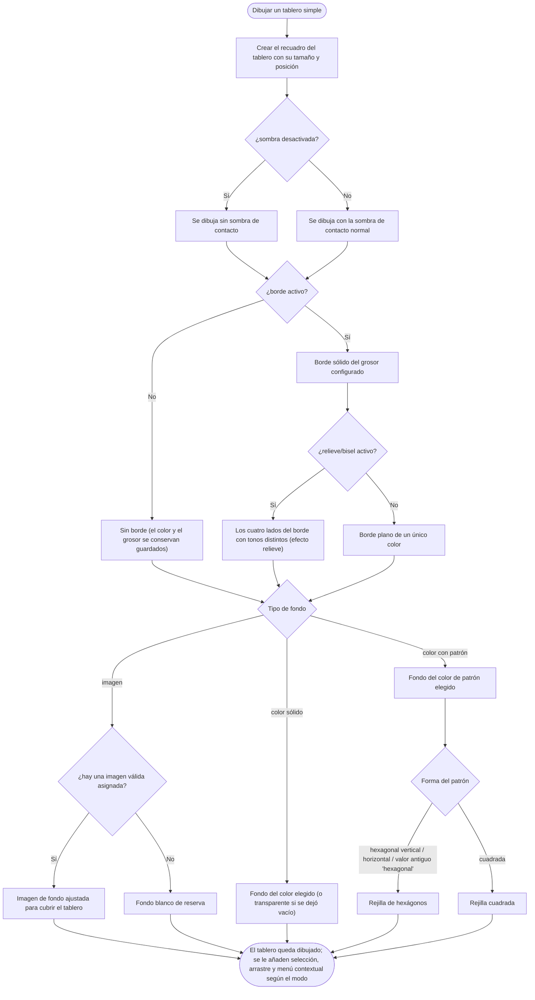

# 018 — Componente "tablero simple"
**Area**: Tipos de componente

Segundo tipo de componente: un elemento cuadrado (redimensionable a cualquier proporción, ver [Posición independiente, arrastre y redimensionado de componentes](015-posicion-independiente-arrastre-y-redimensionado-de-componentes.md)) con borde y fondo configurables, pensado para representar el tablero físico de la partida. Nace a 200×200. Se llama "tablero simple" (renombrado en el cambio 00136 desde "tablero" a secas) para distinguirlo de "tablero personalizado" (cambio 00143), con mayores capacidades visuales.

El borde tiene color y grosor configurables (1–20px); si se escribe un valor fuera de ese rango en la ventana de configuración queda ajustado a los límites (mayor que 20 → 20; 0 o menos → 1), y un texto que no sea un número deja el grosor por defecto (2). El borde se dibuja con un ligero efecto de bisel/relieve —los cuatro lados con tonos distintos, más claros arriba/izquierda y más oscuros abajo/derecha, derivados del color elegido—, además de una sombra de contacto suave que lo asienta sobre la mesa: el mismo lenguaje visual de "pieza física" que comparten el resto de piezas de juego (Dado, Carta/Ficha, y desde el cambio 00143 también Tablero personalizado). Desde el cambio 00153, el borde se puede desactivar por completo con un checkbox "Activar borde"; con el borde desactivado no se dibuja ningún borde, pero su color y grosor se conservan por si se vuelve a activar. Un tablero nuevo nace con el borde activado.

Desde el cambio 00154, una sección "Visual" (la primera de las propiedades específicas) incluye el checkbox "Biselado en el borde", marcado por defecto: mientras el borde esté activo, decide si se dibuja con el efecto de bisel/relieve de siempre o totalmente plano de un único color (el color de borde configurado, igual en los cuatro lados). Desde el cambio 00158, esa misma sección incluye un segundo checkbox, "Sombra", también marcado por defecto: decide si el tablero proyecta la sombra de contacto o se dibuja totalmente plano, sin sombra. En ambos casos, un tablero nuevo nace con el checkbox marcado.

El fondo se elige entre tres opciones (la tercera añadida en el cambio 00156), configurables desde una modal propia ("Configurar fondo"); al alternar entre ellas no se pierde la configuración de las opciones que quedan inactivas —el color del patrón, el color sólido, la imagen asignada y demás ajustes siguen guardados y disponibles—:

- **Color con patrón**: un color de fondo con una rejilla superpuesta. La rejilla puede ser cuadrada o de hexágonos (con orientación vertical u horizontal), con color, grosor de línea y número de filas y columnas configurables. Un valor de forma de patrón "hexagonal" (sin orientación, terminología anterior) se dibuja como rejilla hexagonal horizontal, igual que la opción hexagonal actual.
- **Imagen**: una imagen de recurso que cubre el tablero. Si no hay una imagen válida asignada, el tablero queda con un fondo blanco de reserva.
- **Color sólido**: un único color de fondo, o transparente si se deja vacío.

En modo juego el tablero se pinta con normalidad pero no añade ninguna acción propia al hacer clic sobre él: a diferencia de la carta o el dado, el tablero no reacciona al clic. En modo edición sí es seleccionable como cualquier otro componente.

### Diagrama del dibujo de un tablero simple

Árbol de decisión de cómo se dibuja un "tablero simple" según su configuración:

- **Available in**: renderizado sobre la mesa en modo juego y modo edición; alta eligiendo "Tablero simple" en la modal previa de tipo al pulsar "+ Añadir componente" (ver [Alta/edición/borrado de componentes con modal de tabs](002-alta-edicion-borrado-de-componentes-con-modal-de-tabs.md)).
- **Code**: 00019, 00063, 00068, 00089, 00136, 00153, 00154, 00156, 00158, 00251, 00250.
- **Since**: 2026-07-18
- **Last modified**: 2026-09-09
