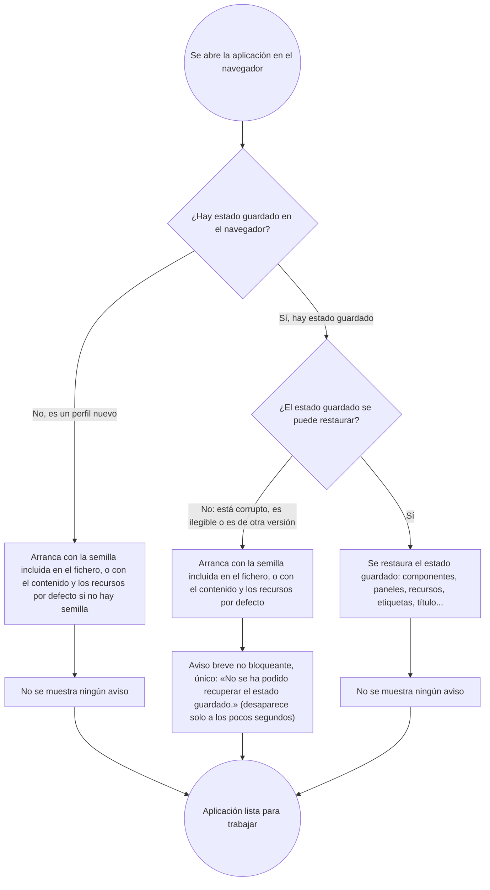

# 029 — Autoguardado en el navegador

**Area**: Persistencia y guardado

Cada alta, edición, movimiento, redimensionado o borrado de un componente se guarda automáticamente en `localStorage`, sin ninguna acción del usuario. Al reabrir la aplicación en el mismo navegador se recupera tal cual el último estado guardado; si nunca se ha guardado nada, arranca con la semilla embebida en el propio fichero (ver más abajo) o, en su defecto, con el contenido y los recursos por defecto.

Al abrir la aplicación se dan tres situaciones posibles, y en ninguna de ellas aparece un aviso que haya que cerrar:

- **No hay nada guardado** (navegador o perfil nuevo): arranque limpio y silencioso con la semilla embebida o el contenido por defecto.
- **Hay un estado guardado que no se puede restaurar** (está corrupto, ilegible, o es de otra versión de la aplicación): la aplicación arranca igualmente con la semilla embebida o el contenido por defecto y muestra un único aviso breve no bloqueante (desaparece solo a los pocos segundos): "No se ha podido recuperar el estado guardado.". No interrumpe el trabajo ni obliga a hacer clic en nada. No se distingue entre "guardado corrupto" y "guardado de otra versión": ambos producen el mismo arranque de respaldo y el mismo aviso.
- **Hay un estado guardado válido**: se restaura tal cual (componentes, paneles, recursos, etiquetas, título...), sin ningún aviso.

Además de los componentes, se guarda igual de automático el estado de los tres paneles flotantes del modo edición (Componentes, Recursos y Etiquetas: posición, ancho y colapsado/expandido; el ancho de cada columna de su tabla, solo en Componentes y Recursos — el panel de Etiquetas no tiene columnas redimensionables, ver [Panel flotante de componentes](003-panel-flotante-de-componentes-con-seleccion-resaltado-arrastre-y-redimensionado.md) y [Etiquetas, organización de elementos por nombre](008-grupos-organizacion-de-elementos-por-nombre.md)), cada vez que cambia. Si un guardado no incluye algún dato de un panel, ese aspecto arranca con sus valores por defecto (expandido, posición, ancho y ancho de columna por defecto), igual que si nunca se hubiera guardado nada; lo mismo con las etiquetas (un guardado sin etiquetas arranca sin ninguna).

El guardado es un único slot por navegador/perfil (no aislado por fichero): si se abren varias copias descargadas distintas en el mismo navegador, prevalece el último estado autoguardado sobre el contenido propio de la copia que se abra, salvo que sea la primera vez que se abre cualquier copia en ese navegador.

- **Available in**: automático, en cualquier modo (el estado de los paneles, solo en modo edición, que es donde existen).
- **Code**: 00011, 00014, 00053, 00064, 00079, 00190, 00230, 00250.
- **Since**: 2026-07-17
- **Last modified**: 2026-09-09
