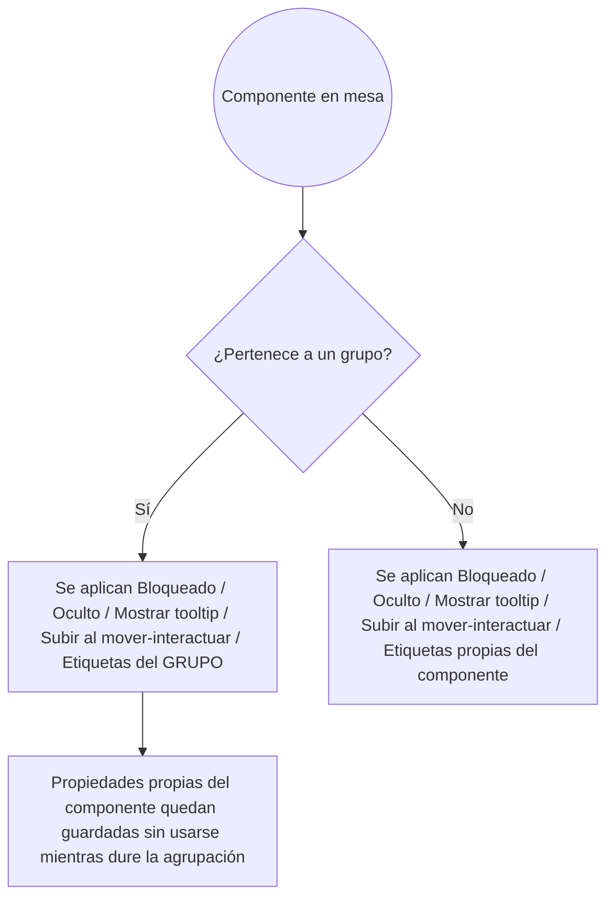
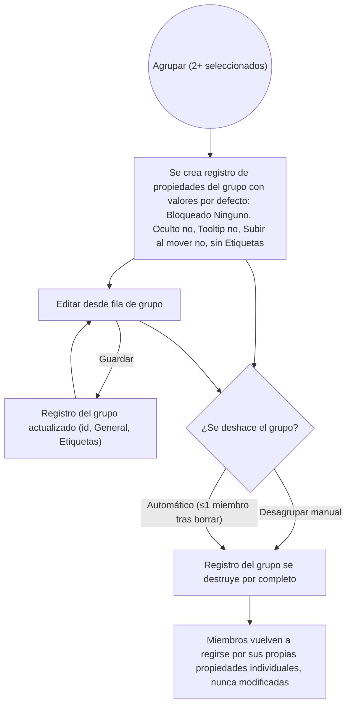
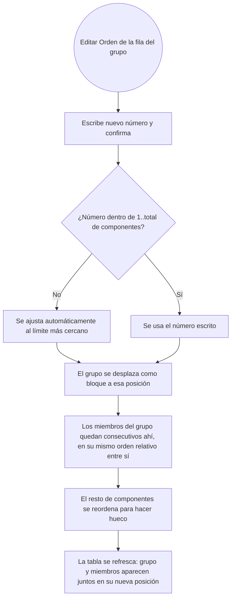
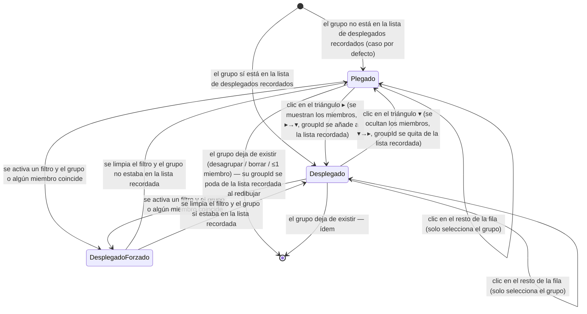

# 034 — Agrupación de elementos: agrupar y desagrupar

**Area**: Grupos y etiquetas

En modo edición, dos o más componentes de cualquier tipo (cuadro de texto, tablero simple/personalizado, dado, visor de documentos, carta, mazo) pueden agruparse en una unidad persistente y plana (sin grupos dentro de grupos): una vez agrupados, un solo click sobre cualquiera de sus miembros selecciona el grupo entero de golpe, sin tener que rehacer la [selección múltiple con Ctrl](003-panel-flotante-de-componentes-con-seleccion-resaltado-arrastre-y-redimensionado.md) manualmente cada vez, y arrastrar cualquier miembro mueve a todos en bloque manteniendo sus posiciones relativas — igual que ya hacía la selección múltiple manual, pero sin necesidad de reseleccionar. Un grupo ya formado cuenta como "1 elemento" a todos los efectos de selección: Ctrl+click sobre un miembro añade o quita el grupo entero de la selección, nunca uno solo de sus miembros por separado.

Los grupos **no se pueden redimensionar de ninguna forma**, ni como unidad ni miembro a miembro mientras pertenezcan a uno — solo moverse. El doble click sobre un miembro en la mesa sigue sin abrir su modal de edición individual. En su fila del panel de Componentes, en cambio, el botón "Editar" (de cada miembro) sí está habilitado y abre su modal de edición con normalidad, igual que "Eliminar" (incluida la disolución automática del grupo si queda con ≤1 miembro tras el borrado); "Clonar" y "Copiar" de esa misma fila aparecen deshabilitados mientras el componente esté agrupado.

**Propiedades propias del grupo, no de sus miembros**: un grupo tiene su propio Bloqueado/Oculto/Mostrar tooltip/Subir al mover-interactuar/Etiquetas — independientes de los de cada miembro, editables desde el botón "Editar" de la fila del propio grupo (ver más abajo). Mientras el grupo existe, estas propiedades del grupo son las que gobiernan de verdad el comportamiento en mesa de todos sus miembros (bloqueo de movimiento en ambos modos, ocultación en Modo Juego, tooltip, subir al interactuar), sustituyendo por completo a las propiedades individuales de cada uno — que nunca se tocan ni se pierden, solo dejan de leerse mientras dura la agrupación. Un miembro con "Bloqueado" activo antes de agruparse, por ejemplo, se mueve con normalidad si el grupo no está bloqueado; y un grupo bloqueado impide moverse a todos sus miembros aunque individualmente no lo estuvieran. Al desagruparse, cada miembro recupera de inmediato sus propias propiedades tal cual estaban.

Las Etiquetas del grupo son también una lista propia e independiente de las de sus miembros: el grupo aparece como una entidad más con sus propias etiquetas en el panel "Etiquetas" (recuento, filtrado, selección de todos sus miembros al elegir la etiqueta) y en el menú contextual ("Añadir a etiqueta" sobre un grupo completo seleccionado añade la etiqueta al grupo, no a cada miembro).

**Formar y deshacer un grupo**: el [menú contextual de modo edición](027-menu-contextual-de-elemento-en-modo-edicion.md) añade dos entradas, "Agrupar" y "Desagrupar", habilitadas según la selección activa en el momento de abrirlo — "Agrupar" con 2 o más elementos seleccionados sin ningún grupo entre ellos, "Desagrupar" con un único grupo completo seleccionado. Si la selección mezcla un grupo ya formado con algún otro elemento (suelto o de otro grupo), no se muestra ningún menú contextual en absoluto; cuando sí se muestra sobre un grupo completo, "Clonar"/"Copiar" del menú operan sobre todos sus miembros sin restricción (a diferencia de esos mismos botones en el panel de Componentes, ver más abajo), y "Ocultar"/"Mostrar" pasa a afectar a las propiedades del propio grupo (ver arriba), no a cada miembro. "Agrupar" crea también las propiedades del grupo con sus valores por defecto (Bloqueado "Ninguno", Oculto/Tooltip/Subir al mover desmarcados, sin etiquetas). "Desagrupar" deshace la agrupación de inmediato: cada miembro vuelve a poder seleccionarse, moverse y editarse por separado, recuperando sus propias propiedades; las propiedades del grupo se descartan sin dejar rastro. Si al eliminar un componente un grupo queda con un único miembro (o ninguno), se deshace automáticamente con el mismo criterio — un grupo de 1 elemento no tiene sentido como unidad.

Mientras dura cualquiera de estas dos acciones (tanto desde el menú contextual como desde el botón "Desagrupar" de la fila de grupo del panel de Componentes), la app muestra la ventana de "operación en curso" habitual (spinner con un texto breve, sin ningún botón ni forma de cerrarla a mano): dice "Agrupando N elemento(s)…" al agrupar y "Desagrupando N elemento(s)…" al desagrupar, con N el número de elementos afectados (en singular, "1 elemento…", cuando solo hay uno), y desaparece sola en cuanto la operación termina. Es solo un aviso visual para que la pantalla no parezca congelada cuando la selección es grande; el resultado de agrupar o desagrupar es idéntico con o sin esa ventana.

**Fila propia en el panel de Componentes**: cada grupo obtiene una fila propia con id autogenerado y reconocible (`grupo-1`, `grupo-2`...), tipo "Grupo" y dos acciones: "Editar" y "Desagrupar", ambas siempre habilitadas. El identificador del grupo se muestra en negrita en esa fila, para distinguir de un vistazo la fila de grupo de las filas de componente suelto y de miembro. "Editar" abre una ventana de propiedades del grupo, con una única pestaña "General": el id del grupo (editable — renombra el `groupId` de todos sus miembros a la vez; no puede quedar vacío ni coincidir con el id de otro grupo ya existente) y las secciones "General" y "Etiquetas" habituales, mismos campos que la pestaña "Generales" del modal de un componente normal, pero aplicados aquí a las propiedades propias del grupo (ver arriba), no a ningún miembro. Esa fila es seleccionable igual que cualquier otra (selecciona el grupo entero) y participa en el filtro de texto y en el filtro/orden de la cabecera de columna "Tipo" igual que cualquier otro valor, sin tratamiento especial.

**Orden del grupo, plegado y anidación visual de sus miembros**: la fila de grupo tiene también su propio campo "Orden" editable (el del bloque completo — se muestra el menor de sus miembros). Al escribir un nuevo número y confirmar, todo el grupo se desplaza como bloque a esa posición: sus miembros quedan consecutivos ahí, conservando el orden relativo que ya tenían entre sí, y el resto de componentes se reordena para hacer hueco (un número fuera de rango se ajusta automáticamente al límite más cercano que permite que el bloque completo quepa) — ver diagrama más abajo. Al formar un grupo nuevo, sus miembros se renumeran automáticamente a consecutivos en ese mismo momento, aunque estuvieran dispersos por la lista.

Cada grupo se puede **plegar y desplegar de forma individual** para compactar la lista: al principio de la celda del identificador de la fila de grupo, delante del nombre, hay un triángulo — `▸` cuando el grupo está plegado (sus miembros no se ven) y `▾` cuando está desplegado (sus miembros aparecen anidados justo debajo, indentados y con fondo distinto, con su campo "Orden" individual no editable — solo se edita en bloque desde el del grupo). Al hacer click en el triángulo se alterna entre plegado y desplegado; ese click **no** selecciona el grupo. Hacer click en el resto de la fila sigue seleccionando el grupo entero y **no** cambia su estado de plegado: seleccionar un grupo plegado no lo despliega. Cuando los miembros se muestran, van **siempre** anidados bajo su fila de grupo, nunca intercalados con el resto de filas ni bajo otro bloque, sea cual sea la columna por la que esté ordenada la tabla. No hay una acción de "plegar todos" ni "desplegar todos": el plegado es individual por grupo. El plegado no afecta al lienzo, y el contador del título "Componentes (N)" sigue contando componentes reales, se vean o no las filas de sus miembros.

Los grupos aparecen **plegados por defecto**: cuando se forma un grupo nuevo, o al abrir un proyecto sin ninguna preferencia guardada, sus miembros no se ven hasta que el usuario despliega cada grupo. La app recuerda qué grupos ha desplegado el usuario explícitamente, junto con las demás preferencias del panel de Componentes (posición, tamaño, estado colapsado); al reabrir el proyecto, los grupos que estaban desplegados vuelven a aparecer desplegados y el resto, plegados. Este dato es una preferencia local de visualización: **no** se incluye al [exportar el juego a un fichero](032-exportar-importar-componentes-en-json-con-seleccion.md) ni se aplica al importar uno, igual que las demás preferencias del panel. Si un grupo deja de existir (se desagrupa, se borra, o queda con un solo miembro), su rastro entre los grupos desplegados recordados se limpia automáticamente la próxima vez que se dibuja el panel, para que un identificador de grupo reutilizado más adelante no aparezca desplegado por sorpresa.

Con un filtro de texto o de columna activo, el grupo se sigue mostrando si él o alguno de sus miembros coincide, y en ese caso se muestra **desplegado de forma forzada**, enseñando solo los miembros que coinciden individualmente, aunque estuviera plegado. Esto es temporal y no cambia lo que se recuerda: al limpiar el filtro, el grupo vuelve a su estado recordado (plegado, salvo que el usuario lo hubiera desplegado antes).

Desagrupar no cambia el `order` de ningún miembro: cada uno conserva el que tenía dentro del bloque, deja de aparecer anidado y su "Orden" vuelve a ser editable.

**Contorno diferenciado al seleccionar un grupo**: al hacer click sobre un miembro de un grupo y seleccionarse el grupo entero, la mesa distingue visualmente el elemento clicado directamente (contorno de selección habitual, azul, o rojo si además es una Copia) del resto de miembros arrastrados a la selección junto con él (contorno gris oscuro). Con varios elementos/grupos seleccionados a la vez, cada uno mantiene su propio contorno habitual y solo sus compañeros de grupo no clicados se ven en gris. Al seleccionar de golpe todos los miembros de una Etiqueta (sin un click individual sobre ninguno), ningún miembro de un grupo capturado así lleva el contorno habitual: todos se ven en gris. Esta distinción aplica solo en la mesa — en el panel de Componentes todas las filas del grupo se siguen resaltando por igual.

La pertenencia a un grupo es exclusiva de modo edición (no existe agrupación en modo juego) y no se sincroniza entre un [elemento tipo Copia](005-elementos-tipo-copia-vinculados-y-sincronizados-con-un-original.md) y su original — se trata igual que la posición en la mesa, siempre independiente por copia. Un clon o una copia de un componente agrupado nace siempre fuera de cualquier grupo.

Estados visuales de la fila de un grupo en el panel de Componentes según el clic en el triángulo y el filtro activo:

- **Available in**: modo edición.
- **Code**: 00193, 00201, 00202, 00204, 00224, 00239.
- **Since**: 2026-08-13
- **Last modified**: 2026-09-03
