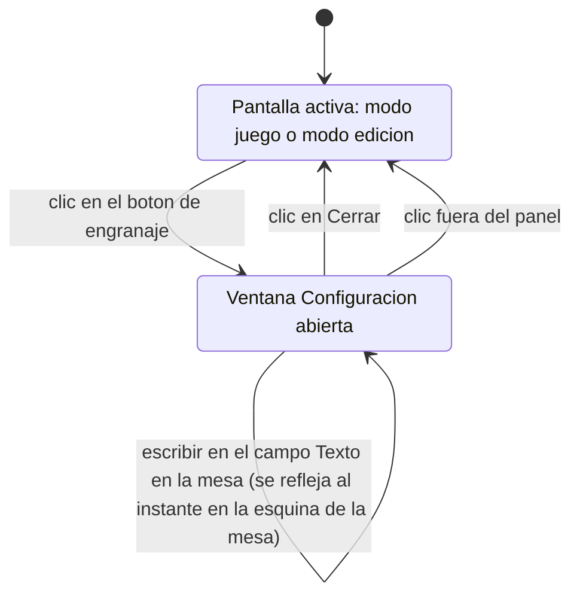
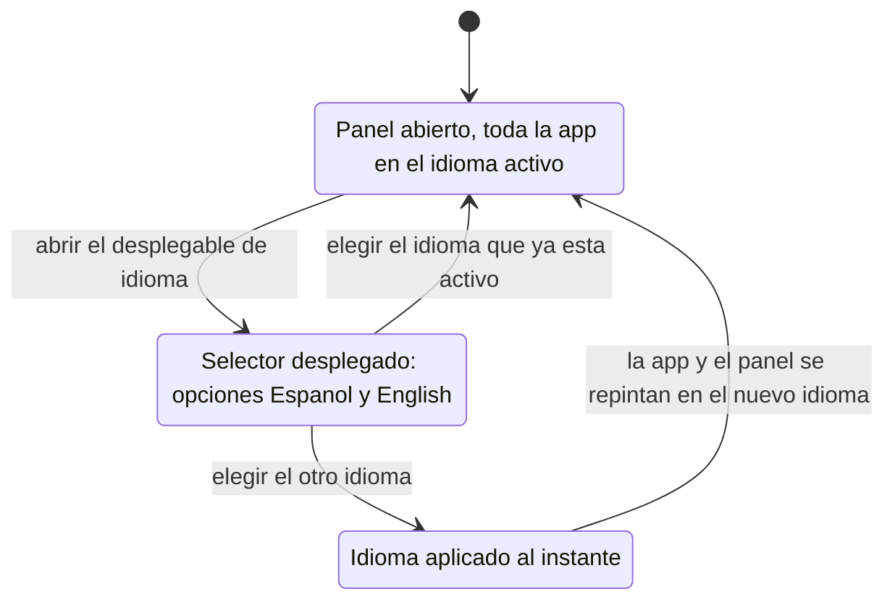

# 038 — Aplicación multi-idioma y panel de configuración

**Area**: Mesa de juego

La interfaz de la aplicación puede mostrarse en **español** o en **inglés**. Todos los textos que no ha escrito el usuario —etiquetas de botón, títulos y campos de las ventanas, menús contextuales, textos de ayuda, mensajes de aviso, textos de los iconos al pasar el ratón, textos de los campos vacíos, etiquetas de tipo de componente, el título de la pestaña del navegador y el enlace al repositorio— se muestran en el idioma activo. Los textos que introduce el usuario (el título libre de la aplicación, el texto libre de la mesa, los identificadores de los componentes, el contenido de los componentes de texto, los nombres de recursos y etiquetas, y los textos de ayuda configurables de cada componente) no se traducen. El nombre «BG Factory» y el número de versión tampoco.

En la esquina superior derecha, junto al botón «Ajustar zoom», hay un **botón de configuración** (un icono de engranaje sin texto) siempre visible, tanto en modo juego como en modo edición. Al pulsarlo se abre la ventana «Configuración», con el mismo aspecto que el resto de ventanas de la aplicación. Esa ventana contiene, de arriba a abajo:

- Un **selector de idioma** con las opciones «Español» y «English», cada una escrita en su propio idioma, con la actual marcada. Bajo el selector, una nota indica que el cambio se aplica al instante.
- Un campo **«Texto en la mesa»**, donde el usuario puede escribir un texto libre de una o varias líneas. Ese texto aparece en la esquina inferior derecha de la mesa, encima del nombre y la versión (ver [Indicador de versión y enlace al repositorio](037-indicador-de-version-y-enlace-al-repositorio.md)). Se muestra como texto plano, sin interpretar HTML ni ningún otro código, y se actualiza en la esquina de la mesa al instante mientras se escribe o se borra, con la ventana abierta. Mientras el campo está vacío, la esquina de la mesa no muestra nada añadido. Bajo el campo, una nota recuerda dónde aparece el texto y que solo admite texto plano. Este texto es una preferencia local del navegador: se conserva al recargar, pero no se incluye al exportar una partida ni cambia al importar una.
- La **versión actual** de la aplicación, como texto de solo lectura. Siempre muestra el nombre «BG Factory» seguido de la versión (por ejemplo, «BG Factory v.00252» en las versiones de prueba, o «BG Factory v.0.9.0» en las oficiales), con independencia del título que el usuario le haya puesto a su partida. Debajo, un enlace al repositorio en GitHub, el mismo que aparece en la esquina de la mesa: al pulsarlo abre `https://github.com/yeyopepe/bgfactory` en una pestaña nueva, y su texto sigue el idioma activo («Ver en Github» / «View on GitHub»).

Al elegir otro idioma en el selector, el cambio se aplica **inmediatamente y sin recargar la página**: se actualiza toda la interfaz y también las ventanas que estuvieran abiertas en ese momento, incluida la propia ventana «Configuración», que se queda abierta y pasa a mostrarse en el nuevo idioma. La ventana se cierra con el botón «Cerrar» o pulsando fuera del panel, volviendo a la pantalla desde la que se abrió.

La primera vez que se abre la aplicación, cuando el usuario todavía no ha elegido ningún idioma, este se detecta automáticamente a partir del idioma del navegador: si el navegador está en español, la aplicación arranca en español; en cualquier otro caso, arranca en inglés. Una vez que el usuario elige un idioma, esa elección se recuerda y se respeta en las siguientes visitas, por encima de la detección automática. La preferencia de idioma se guarda de forma independiente del resto de la partida, de modo que se conserva aunque cambie la versión de la aplicación. El fichero que se genera al exportar una partida no incluye el idioma, e importar una partida no cambia el idioma de la aplicación.

- **Available in**: Modo juego y modo edición, botón de configuración en la esquina superior derecha de la cabecera
- **Code**: 00244, 00250, 00258
- **Since**: 2026-09-03
- **Last modified**: 2026-09-09
