# 040 — Catálogo de propiedades de componentes, grupos y etiquetas

**Area**: Mesa de juego

Este catálogo es un inventario ordenado de todas las pestañas, secciones y opciones de configuración que ve el usuario en las **tres ventanas de propiedades** de la aplicación: la ventana de propiedades del componente (8 tipos + 9 sub-modales), la ventana "Propiedades del grupo" y la ventana de alta/edición de etiqueta. Las tres van juntas en esta misma ficha porque comparten propósito —editar las propiedades de una entidad— y buena parte de sus controles (el modal de grupo reutiliza casi todos los campos y textos de la pestaña "Generales" del componente).

El catálogo se lee con dos tablas y, para el modal de componente, un diagrama:

- **Tabla A — Catálogo de elementos**: una fila por cada elemento (pestaña, sección, campo, separador o botón que abre un sub-modal) de cada ventana, en el orden en que aparece en pantalla.
- **Tabla B — Posición por componente** (solo aplica al modal de componente): para los elementos cuya presencia o posición depende del tipo de componente, la posición vertical exacta dentro de su pestaña para cada uno de los 7 tipos. Los modales de grupo y de etiqueta no varían por tipo, así que se documentan solo con su bloque de Tabla A.
- **Diagrama de árbol** (solo del modal de componente): la organización de pestañas → secciones → campos y qué sub-modal abre cada botón, de un vistazo. Los modales de grupo y de etiqueta son demasiado simples para necesitar diagrama propio.

Esta es la primera de una familia de "fichas de catálogo de pantalla": otras pantallas configurables de la aplicación (paneles flotantes de Componentes/Recursos, barra superior, panel de Configuración general, flujos de importar/exportar, menús contextuales, modales de error/éxito) podrán tener, si lo necesitan, su propia ficha de catálogo hermana — ver "Cómo crear la ficha de catálogo de otra pantalla" al final.

Se relaciona con [Alta/edición/borrado de componentes con modal de tabs](002-alta-edicion-borrado-de-componentes-con-modal-de-tabs.md), [Agrupación de elementos: agrupar y desagrupar](034-agrupacion-de-elementos-agrupar-y-desagrupar.md) y [Etiquetas, organización de elementos por nombre](008-grupos-organizacion-de-elementos-por-nombre.md), que describen los flujos de uso de estas ventanas; este catálogo documenta en detalle su contenido.

Las flechas continuas del diagrama representan **contención** (qué pestaña o sección contiene qué campo); las flechas punteadas "abre" indican qué campo lanza cada sub-modal (que no forma parte del árbol del modal principal).

```mermaid
flowchart TD
    ROOT(["Modal de componente"])

    ROOT --> T1[["Pestaña: Generales"]]
    ROOT --> T2[["Pestaña: Apariencia"]]
    ROOT --> T3[["Pestaña: Específicas"]]
    ROOT --> T3B[["Pestaña: Interacciones"]]
    ROOT --> T4[["Pestaña: Copias"]]
    ROOT --> FOOT[["Footer (común)"]]

    subgraph SG_GEN [Generales]
        T1 --> G_ID["Identificador (id)"]
        T1 --> G_S1{{"Sección: General"}}
        T1 --> G_S2{{"Sección: Ayuda al jugador"}}
        T1 --> G_S3{{"Sección: Etiquetas"}}

        G_S1 --> G_S1a["Bloqueado"]
        G_S1 --> G_S1b["Oculto en modo juego"]
        G_S1 --> G_S1c["Subir al mover/interactuar"]

        G_S2 --> G_S2a["Mostrar título + Editar título…"]
        G_S2 --> G_S2b["Mostrar tooltip + Texto del tooltip"]

        G_S3 --> G_S3a["Casillas de etiquetas"]
        G_S3 --> G_S3b["Crear nueva etiqueta…"]
    end

    subgraph SG_INT [Interacciones]
        T3B --> I_S1{{"Sección: Interacciones programadas"}}
        I_S1 --> I_S1a["Al hacer clic (dado/carta/mazo)"]
        I_S1 --> I_S1b["Clic derecho"]
    end

    subgraph SG_VIS [Apariencia]
        T2 --> V_S1{{"Sección: Tamaño"}}
        T2 --> V_S2{{"Sección: Estilo (solo dado)"}}
        T2 --> V_SF{{"Sección: Forma (solo mazo)"}}
        T2 --> V_S5{{"Sección: Borde (tableros)"}}
        T2 --> V_S4{{"Sección: Extrusión"}}
        T2 --> V_S3{{"Sección: Efecto (texto / tableroSimple / tableroPersonalizado)"}}

        V_S1 --> V_S1a["Alto"]
        V_S1 --> V_S1b["Ancho"]
        V_S1 --> V_S1c["Mantener proporción"]

        V_S2 --> V_S2a["Color del cuerpo"]
        V_S2 --> V_S2b["Color de los números"]

        V_SF --> V_SFa["Forma"]
        V_SF --> V_SFb["Orientación"]

        V_S5 --> V_S5a["Color del borde"]
        V_S5 --> V_S5b["Grosor del borde"]

        V_S4 --> V_S4a["Profundidad"]
        V_S4 --> V_S4b["Color de extrusión"]

        V_S3 --> V_S3a["Biselado (tableros)"]
        V_S3 --> V_S3b["Sombra (tableros)"]
        V_S3 --> V_S3c["Tamaño de fuente, Color del texto, Color de fondo (texto)"]
    end

    subgraph SG_ESP [Específicas — contenido según tipo]
        T3 --> E_TX["texto: Contenido"]
        T3 --> E_TS["tableroSimple: Fondo → Configurar fondo…"]
        T3 --> E_TP["tableroPersonalizado: Editar diseño del tablero"]
        T3 --> E_DA["dado: Config. de caras, Nº máx. de caras, Lista de valores, Tipografía del resultado"]
        T3 --> E_DO["documento: Tipo de contenido, Contenido, Formato, URL de la página"]
        T3 --> E_CA["carta: Proporción, Editar diseño de la carta, Estilo (Copiar/Pegar estilo)"]
        T3 --> E_MA["mazo: Cartas reveladas, Imagen, Ver contenido del mazo"]

        E_MA --> E_MA2["Cartas reveladas: Disposición, Texto, Cara revelada"]
        E_MA --> E_MA3["Imagen"]
    end

    subgraph SG_COP [Copias]
        T4 --> C_1["Lista de copias vinculadas"]
        T4 --> C_2["Sincronizar todas"]
        T4 --> C_3["Desincronizar (Oculto)"]
    end

    FOOT --> F_1["Eliminar"]
    FOOT --> F_2["Cancelar"]
    FOOT --> F_3["Aceptar"]

    subgraph SG_SUB [Sub-modales]
        M_TITLE(["Editar título de componente"])
        M_EDITOR(["Editor visual"])
        M_SHAPE(["Editar figura"])
        M_TEXTBOX(["Editar cuadro de texto"])
        M_BOARDIMG(["Elegir imagen"])
        M_IMGADJ(["Ajustar imagen"])
        M_PATTERN(["Color y patrón de tablero"])
        M_FONT(["Elegir tipografía"])
        M_STYLECLIP(["Copiar estilo — selección"])
    end

    G_S2a -.abre.-> M_TITLE
    E_TS -.abre.-> M_PATTERN
    E_TS -.abre.-> M_BOARDIMG
    E_TP -.abre.-> M_EDITOR
    E_CA -.abre.-> M_EDITOR
    E_CA -.abre.-> M_STYLECLIP
    E_DA -.abre.-> M_FONT
    E_MA3 -.abre.-> M_BOARDIMG
    E_MA3 -.abre.-> M_IMGADJ

    M_EDITOR -.abre.-> M_SHAPE
    M_EDITOR -.abre.-> M_TEXTBOX
    M_EDITOR -.abre.-> M_BOARDIMG
    M_EDITOR -.abre.-> M_IMGADJ
```

**Columnas:**

- **(icono)** — pista visual del tipo de fila: 🗂️ pestaña · 🔽 sección (o sub-sección) · ➖ separador. El resto de filas (campos) van sin icono.
- **Pos.** — posición vertical del elemento dentro de su pestaña (o dentro de su sub-modal), de arriba abajo. `1` = lo más arriba. Cuenta también las líneas que ocupan secciones y separadores, por eso la numeración tiene huecos.
- **Nombre** — rótulo tal y como se ve en pantalla (español). Los valores de un desplegable/opción o el rango de un número van entre paréntesis aquí mismo cuando aportan.
- **Tipo** — `pestaña` · `sección` · `texto` · `número` · `casilla` · `desplegable` · `opción` (radio) · `deslizador` · `color` · `área de texto` · `botón` (abre sub-modal) · `separador` · `lista de casillas`.
- **Dentro de…** — pestaña o sección contenedora. Para elementos de sub-modales, la ruta completa.
- **Aparece en** — tipos de componente en los que se muestra, o `Todos`.
- **Ayuda (?)** — `Sí` si el campo lleva un icono de ayuda "?" al lado.
- **Visible cuando…** — condición para que se muestre. Vacío = siempre visible.
- **Notas técnicas** — clave i18n del rótulo, propiedad del modelo, sub-modal enlazado, o matiz técnico. No duplica la documentación técnica (tipos de dato, defaults, migraciones), que vive en las fichas enlazadas.

Tipos de componente (abreviaturas en "Aparece en"): **Texto** (Cuadro de texto), **T. simple** (Tablero simple), **T. pers.** (Tablero personalizado), **Dado**, **Doc.** (Visor de documentos), **Carta** (Carta/Ficha), **Mazo**.

Fichas técnicas de referencia: modelo de datos del componente (`architecture/002-component-model.md`), tipos de componente (`architecture/003-component-types.md`), capa de interfaz y sub-modales (`architecture/006-ui-layer.md`), modos y propiedades efectivas de grupo (`architecture/005-modes.md`), etiquetas y recursos (`architecture/004-groups-resources.md`).

---

# Ventana: Propiedades del componente

Modal de edición de un componente. 5 pestañas ("Generales", "Apariencia", "Específicas", "Interacciones", "Copias") + footer común + 9 sub-modales. Se abre en modo edición desde el panel flotante de componentes o con doble clic sobre el componente en la mesa. La pestaña activa al abrir es siempre "Generales".

## Pestaña "Generales"

| | Pos. | Nombre | Tipo | Dentro de… | Aparece en | Ayuda (?) | Visible cuando… | Notas técnicas |
|:-:|---:|---|---|---|---|:---:|---|---|
| 🗂️ | — | **Generales** | pestaña | (modal de componente) | Todos | No | | i18n `componentModal.tab.general` |
| | 1 | Identificador | texto | Generales | Todos | No | | i18n `componentModal.idLabel`; propiedad `id`; validación no-vacío + unicidad en la capa de interfaz |
| 🔽 | 2 | **General** | sección | Generales | Todos | No | | i18n `common.general` |
| | 3 | Bloqueado | desplegable (Ninguno / Solo modo juego / Todos los modos) | Generales › General | Todos | Sí | | i18n `componentModal.locked` · opciones `option.bloqueado.*` · ayuda `help.lockedField`; propiedad `bloqueado` (`ninguno`/`juego`/`todos`) |
| | 4 | Oculto en modo juego | casilla | Generales › General | Todos | Sí | | i18n `componentModal.hidden` · ayuda `help.hiddenField`; propiedad `oculto` |
| | 5 | Subir al mover/interactuar | casilla | Generales › General | Todos | Sí | | i18n `componentModal.raiseOnMove` · ayuda `help.raiseOnMove`; propiedad `subirAlMoverInteractuar` |
| 🔽 | 6 | **Ayuda al jugador** | sección | Generales | Todos | No | | i18n `componentModal.playerHelp` |
| | 7 | Mostrar título de componente | casilla | Generales › Ayuda al jugador | Todos | Sí | | i18n `componentModal.showTitle` · ayuda `help.showTitle`; propiedad `mostrarTitulo` |
| | 8 | Editar título de componente… | botón → *Editar título de componente* | Generales › Ayuda al jugador | Todos | No | | i18n `componentModal.editTitle`; abre el sub-modal de título (propiedades `tituloTexto`, `tituloColorTexto`, `tituloColorFondo`, `tituloFondoTransparencia`) |
| ➖ | 9 | *(separador)* | separador | Generales › Ayuda al jugador | Todos | No | | — |
| | 10 | Mostrar tooltip | casilla | Generales › Ayuda al jugador | Todos | Sí | | i18n `componentModal.showTooltip` · ayuda `help.showTooltip`; propiedad `mostrarTooltip` |
| | 11 | Texto del tooltip | área de texto | Generales › Ayuda al jugador | Todos | Sí | siempre presente; editable solo si "Mostrar tooltip" está marcado | i18n `componentModal.tooltipText` · ayuda `help.playerHelpText`; propiedad `tooltipTexto` |
| 🔽 | 12 | **Etiquetas** | sección | Generales | Todos | No | | i18n `componentModal.tagsLegend` |
| | 13 | *(una casilla por etiqueta existente)* | lista de casillas | Generales › Etiquetas | Todos | No | existe ≥1 etiqueta | propiedad `etiquetaIds`; zona con scroll propio (tope de 3 visibles) |
| | 14 | + Crear nueva etiqueta… | botón (despliega fila) | Generales › Etiquetas | Todos | No | | i18n `componentModal.createNewTag` |
| | 15 | Nombre de la nueva etiqueta | texto | Generales › Etiquetas | Todos | No | tras pulsar "+ Crear nueva etiqueta…" | i18n placeholder `componentModal.tagNamePlaceholder`; errores `componentModal.tagNameEmpty` / `componentModal.tagNameTaken` |
| | 16 | Crear | botón | Generales › Etiquetas | Todos | No | tras pulsar "+ Crear nueva etiqueta…" | i18n `common.create` |

---

## Pestaña "Apariencia"

Orden de secciones de la pestaña (grupo ordenado por el bloque de reordenación del modal, ver Notas técnicas): **Tamaño** (siempre la primera, fuera del grupo) → **Estilo** → **Forma** → **Borde** → **Extrusión** → **Efecto**. Las posiciones de la columna `Pos.` reflejan ese orden si todas las secciones estuvieran presentes; ningún tipo las tiene todas (ver Tabla B para la posición real por tipo).

| | Pos. | Nombre | Tipo | Dentro de… | Aparece en | Ayuda (?) | Visible cuando… | Notas técnicas |
|:-:|---:|---|---|---|---|:---:|---|---|
| 🗂️ | — | **Apariencia** | pestaña | (modal de componente) | Todos | No | | i18n `componentModal.tab.visual` |
| 🔽 | 1 | **Tamaño** | sección | Apariencia | Todos | No | | i18n `componentModal.sizeLegend` |
| | 2 | Alto | número (px, mín. 1) | Apariencia › Tamaño | Todos | No | | i18n `componentModal.heightLabel`; propiedad `height` |
| | 3 | Ancho | número (px, mín. 1) | Apariencia › Tamaño | Todos | No | | i18n `componentModal.widthLabel`; propiedad `width` |
| | 4 | Mantener proporción | casilla | Apariencia › Tamaño | Todos | No | | i18n `componentModal.keepRatio`; solo UI (no persiste); al desmarcar en Carta, su proporción pasa a "libre" |
| 🔽 | 5 | **Estilo** | sección | Apariencia | Dado | No | tipo = Dado | i18n `componentModal.styleLegend` |
| | 6 | Color del cuerpo | color | Apariencia › Estilo | Dado | No | tipo = Dado | i18n `componentModal.bodyColor`; propiedad `properties.colorCuerpo` |
| | 7 | Color de los números | color | Apariencia › Estilo | Dado | No | tipo = Dado | i18n `componentModal.numbersColor`; propiedad `properties.colorNumeros` |
| 🔽 | 8 | **Forma** | sección | Apariencia | Mazo | No | tipo = Mazo | i18n `componentModal.shapeLegend` |
| | 9 | Forma | desplegable (Rectangular / Circular) | Apariencia › Forma | Mazo | No | tipo = Mazo | i18n `componentModal.shapeLabel`; propiedad `properties.forma`; al pasar a "Circular" iguala ancho y alto |
| | 10 | Orientación | desplegable (Vertical / Horizontal) | Apariencia › Forma | Mazo | No | tipo = Mazo y forma = "Rectangular" | i18n `componentModal.orientationLabel`; propiedad `properties.orientacion`; al cambiar transpone ancho/alto; oculta si la forma es circular |
| 🔽 | 11 | **Borde** | sección (con activación en el título) | Apariencia | T. simple, T. pers. | No | tipo = T. simple o T. pers. | i18n `common.border`; título con patrón toggle |
| | 12 | Color del borde | color | Apariencia › Borde | T. simple, T. pers. | No | tipo = T. simple o T. pers. | i18n `componentModal.borderColor`; propiedad `properties.bordeColor` |
| | 13 | Grosor del borde | número (px, 1–20) | Apariencia › Borde | T. simple, T. pers. | No | tipo = T. simple o T. pers. | i18n `componentModal.borderWidth`; propiedad `properties.bordeGrosor` |
| 🔽 | 14 | **Extrusión** *(rótulo "Borde y extrusión" en Texto)* | sección | Apariencia | Todos | No | | i18n `componentModal.extrusionLegend` / `componentModal.borderLegend.extrusion` |
| | 15 | Profundidad | número (px, 0–40) | Apariencia › Extrusión | Todos | Solo en Texto | siempre presente; sin efecto visual en Texto | i18n `componentModal.depthLabel` · ayuda `help.extrusionNoEffectOnText`; propiedad `profundidad` (clamp 0–40) |
| | 16 | Color de extrusión | color | Apariencia › Extrusión | Todos | No | | i18n `componentModal.extrusionColor`; propiedad `colorExtrusion` (`null` = automático; sin control de vuelta a automático) |
| 🔽 | 17 | **Efecto** | sección | Apariencia | Texto, T. simple, T. pers. | No | tipo = Texto, T. simple o T. pers. | i18n `common.visual` |
| | 18 | Tamaño de fuente | número (px) | Apariencia › Efecto | Texto | No | tipo = Texto | i18n `componentModal.fontSizeLabel`; propiedad `properties.tamañoFuente` |
| | 19 | Color del texto | color | Apariencia › Efecto | Texto | No | tipo = Texto | i18n `componentModal.textColor`; propiedad `properties.colorTexto` |
| | 20 | Color de fondo | color | Apariencia › Efecto | Texto | No | tipo = Texto | i18n `componentModal.bgColor`; propiedad `properties.colorFondo` |
| | 21 | Transparente | casilla | Apariencia › Efecto | Texto | No | tipo = Texto | i18n `common.transparent`; fuerza `colorFondo` vacío |
| | 22 | Biselado | casilla | Apariencia › Efecto | T. simple, T. pers. | No | tipo = T. simple o T. pers. | i18n `componentModal.bevel`; propiedad `properties.biselado` |
| | 23 | Sombra | casilla | Apariencia › Efecto | T. simple, T. pers. | No | tipo = T. simple o T. pers. | i18n `componentModal.shadow`; propiedad `properties.sombra` |

> Nota: las secciones "Estilo" (dado), "Forma" (mazo), "Borde" (tableros) y "Efecto" (texto y tableros) solo se pintan para los tipos indicados. El bloque de reordenación del modal las coloca siempre, cuando están presentes, en el orden **Estilo → Forma → Borde → Extrusión → Efecto**, justo detrás de "Tamaño" (que va siempre la primera y no forma parte del grupo). Un tipo que no tenga alguna de esas secciones simplemente no la muestra y las demás suben; para los tipos sin "Estilo"/"Forma"/"Borde"/"Efecto", "Extrusión" queda inmediatamente después de "Tamaño". Las posiciones de la columna reflejan el orden si todas las secciones estuvieran presentes; la Tabla B fija la posición real por tipo.

---

## Pestaña "Específicas"

El contenido cambia por completo según el tipo de componente. Cada bloque son las filas de esa pestaña **para ese tipo**; la posición es dentro de la pestaña "Específicas". i18n de la pestaña: `componentModal.tab.specific`.

### Texto (Cuadro de texto)

| | Pos. | Nombre | Tipo | Dentro de… | Aparece en | Ayuda (?) | Visible cuando… | Notas técnicas |
|:-:|---:|---|---|---|---|:---:|---|---|
| | 1 | Contenido | área de texto | Específicas | Texto | No | | i18n `common.content`; propiedad `properties.contenido` |

> Los campos de fuente, color de texto y color de fondo del tipo Texto **no** están en "Específicas": forman la sección "Efecto" de la pestaña "Apariencia" (ver Tabla A, pestaña "Apariencia", posiciones 9–12).

### T. simple (Tablero simple)

| | Pos. | Nombre | Tipo | Dentro de… | Aparece en | Ayuda (?) | Visible cuando… | Notas técnicas |
|:-:|---:|---|---|---|---|:---:|---|---|
| 🔽 | 1 | **Fondo** | sección | Específicas | T. simple | No | | i18n `common.background` |
| | 2 | Tipo de fondo | (control de selección de fondo) | Específicas › Fondo | T. simple | No | | propiedad `properties.fondoTipo` (`colorPatron`/`imagen`); los dos bloques coexisten |
| | 3 | Configurar fondo… | botón → *Color y patrón de tablero* / *Elegir imagen* | Específicas › Fondo | T. simple | No | | i18n `componentModal.configureBackground` |

### T. pers. (Tablero personalizado)

| | Pos. | Nombre | Tipo | Dentro de… | Aparece en | Ayuda (?) | Visible cuando… | Notas técnicas |
|:-:|---:|---|---|---|---|:---:|---|---|
| | 1 | Editar diseño del tablero | botón → *Editor visual* (1 cara) | Específicas | T. pers. | No | | i18n `componentModal.editBoardDesign`; edita `properties.cara` |

### Dado

| | Pos. | Nombre | Tipo | Dentro de… | Aparece en | Ayuda (?) | Visible cuando… | Notas técnicas |
|:-:|---:|---|---|---|---|:---:|---|---|
| | 1 | Configuración de caras | opción (Número máximo / Lista de valores) | Específicas | Dado | No | | i18n `componentModal.facesConfig`; propiedad `properties.modoCaras` (`numeroMaximo`/`lista`); los dos modos coexisten |
| | 2 | Número máximo de caras | número (2–100) | Específicas | Dado | No | configuración de caras = "Número máximo" | i18n `componentModal.maxNumber`; propiedad `properties.numeroMaximoCaras` |
| | 3 | Lista de valores | texto (valores separados por comas) | Específicas | Dado | No | configuración de caras = "Lista de valores" | i18n `componentModal.valueList` · error `componentModal.valueListError`; propiedad `properties.listaValores`; requiere ≥2 valores no vacíos |
| | 4 | Tipografía del resultado | botón → *Elegir tipografía* | Específicas | Dado | No | | i18n `componentModal.fontTypeLabel` / `componentModal.chooseFont`; propiedad `properties.fuenteResourceId` |

### Doc. (Visor de documentos)

| | Pos. | Nombre | Tipo | Dentro de… | Aparece en | Ayuda (?) | Visible cuando… | Notas técnicas |
|:-:|---:|---|---|---|---|:---:|---|---|
| | 1 | Tipo de contenido | opción (Texto / URL) | Específicas | Doc. | No | | i18n `componentModal.contentTypeLabel`; propiedad `properties.tipoContenido` (`texto`/`url`); los dos coexisten |
| | 2 | Contenido | área de texto | Específicas | Doc. | No | tipo de contenido = "Texto" | i18n `common.content`; propiedad `properties.contenido` |
| | 3 | Formato | desplegable (Markdown / HTML) | Específicas | Doc. | No | tipo de contenido = "Texto" | i18n `componentModal.formatLabel`; propiedad `properties.formato` |
| | 4 | URL de la página | texto | Específicas | Doc. | No | tipo de contenido = "URL" | i18n `componentModal.pageUrlLabel`; propiedad `properties.url` |

### Carta (Carta/Ficha)

| | Pos. | Nombre | Tipo | Dentro de… | Aparece en | Ayuda (?) | Visible cuando… | Notas técnicas |
|:-:|---:|---|---|---|---|:---:|---|---|
| | 1 | Proporción | desplegable (10 opciones: 5:7 Poker vertical, 7:5 Poker horizontal, Tarot vertical, Tarot horizontal, Cuadrada, Circular, Hexagonal vertical, Hexagonal horizontal, Triángulo, Triángulo invertido) | Específicas | Carta | No | | i18n `componentModal.proportionLabel`; propiedad `properties.proporcion`; catálogo de proporciones en la ficha técnica de tipos |
| | 2 | Editar diseño de la carta | botón → *Editor visual* (2 caras) | Específicas | Carta | No | | i18n `componentModal.editCardDesign`; edita `properties.caraFrontal` / `properties.caraTrasera` |
| 🔽 | 3 | **Estilo** | sección | Específicas | Carta | No | | i18n `componentModal.cardStyleLegend` |
| | 4 | Copiar estilo | botón → *Copiar estilo — selección* | Específicas › Estilo | Carta | No | | i18n `componentModal.copyStyle` |
| | 5 | Pegar estilo | botón | Específicas › Estilo | Carta | No | | i18n `componentModal.pasteStyle`; pegado todo-o-nada, con modal de error propio si hay incompatibilidades |
| | 6 | *(texto de ayuda del bloque Estilo)* | texto informativo | Específicas › Estilo | Carta | No | | i18n `componentModal.styleHint` |

### Mazo

> La sección "Forma" del Mazo (campos Forma y Orientación) **no** está en esta pestaña: se pinta en la pestaña "Apariencia" (ver Tabla A, pestaña "Apariencia", posiciones 8–10).

| | Pos. | Nombre | Tipo | Dentro de… | Aparece en | Ayuda (?) | Visible cuando… | Notas técnicas |
|:-:|---:|---|---|---|---|:---:|---|---|
| 🔽 | 1 | **Cartas reveladas** | sección | Específicas | Mazo | No | | i18n `componentModal.revealedCardsLegend` |
| | 2 | Disposición carta revelada | desplegable (Arriba / Abajo / Derecha / Izquierda) | Específicas › Cartas reveladas | Mazo | No | | i18n `componentModal.revealDisposition`; propiedad `properties.disposicion` |
| | 3 | *(nota sobre la disposición)* | texto informativo | Específicas › Cartas reveladas | Mazo | No | | i18n `componentModal.revealDispositionNote` |
| | 4 | Texto carta revelada | texto | Específicas › Cartas reveladas | Mazo | No | | i18n `componentModal.revealedCardText`; propiedad `properties.textoCartaRevelada` (cadena vacía válida) |
| | 5 | Cara de la carta revelada | desplegable (Frontal / Trasera) | Específicas › Cartas reveladas | Mazo | No | | i18n `componentModal.revealCard`; propiedad `properties.caraCartaRevelada` |
| 🔽 | 6 | **Imagen** | sección | Específicas | Mazo | No | | i18n `componentModal.imageLegend` |
| | 7 | *(previsualización de la imagen del mazo)* | previsualización | Específicas › Imagen | Mazo | No | | propiedad `properties.imagenResourceId` |
| | 8 | Elegir imagen… | botón → *Elegir imagen* | Específicas › Imagen | Mazo | No | | i18n `componentModal.chooseImage` |
| | 9 | Ajustar imagen… | botón → *Ajustar imagen* | Específicas › Imagen | Mazo | No | hay imagen elegida | i18n `componentModal.adjustImage`; propiedad `properties.ajusteImagen` / `properties.transparenciaImagen` |
| | 10 | Quitar imagen | botón | Específicas › Imagen | Mazo | No | hay imagen elegida | i18n `componentModal.removeImage` |
| | 11 | Ver contenido del mazo | botón → *Ver contenido del mazo* | Específicas | Mazo | No | | i18n `componentModal.viewMazoContent`; abre `mazoContentModal` (lista de cartas de `properties.cartaIds`) |

---

## Pestaña "Interacciones"

i18n de la pestaña: `componentModal.tab.interacciones` ("Interacciones" / "Interactions"). Situada entre "Específicas" y "Copias". Su único contenido es la sección "Interacciones programadas". Se muestra siempre, para todos los tipos: la fila fija "Clic derecho" hace que nunca quede vacía.

| | Pos. | Nombre | Tipo | Dentro de… | Aparece en | Ayuda (?) | Visible cuando… | Notas técnicas |
|:-:|---:|---|---|---|---|:---:|---|---|
| 🗂️ | — | **Interacciones** | pestaña | (modal de componente) | Todos | No | | i18n `componentModal.tab.interacciones` |
| 🔽 | 1 | **Interacciones programadas** | sección | Interacciones | Todos | No | | i18n `componentModal.programmedInteractions` |
| | 2 | Al hacer clic *(o el nombre de la interacción del tipo)* | desplegable (activa / Ninguna) | Interacciones › Interacciones programadas | Dado, Carta, Mazo | Sí | el tipo tiene ≥1 interacción de clic izquierdo registrada | i18n `componentModal.onClickLabel` / `common.none.f` · ayuda `componentModal.interactionHelp`; propiedad `interaccionesDesactivadas`; interacciones definidas por tipo |
| | 3 | Clic derecho | desplegable (Ninguno / Abrir menú contextual) | Interacciones › Interacciones programadas | Todos | Sí | | i18n `componentModal.rightClickLabel` / `componentModal.rightClick.openContextMenu` / `common.none.m` · ayuda `help.rightClickNone`; propiedad `accionClickDerecho` (`ninguno`/`menuContextual`) |

---

## Pestaña "Copias"

i18n de la pestaña: `componentModal.tab.copias`.

| | Pos. | Nombre | Tipo | Dentro de… | Aparece en | Ayuda (?) | Visible cuando… | Notas técnicas |
|:-:|---:|---|---|---|---|:---:|---|---|
| 🗂️ | — | **Copias** | pestaña | (modal de componente) | Todos | No | | |
| | 1 | *(mensaje "Sin copias")* | texto informativo | Copias | Todos | No | el componente no tiene copias vinculadas | i18n `componentModal.noCopies` |
| | 2 | *(contador "N copias")* | texto informativo | Copias | Todos | No | el componente tiene ≥1 copia vinculada | i18n `componentModal.copiesCount` |
| | 3 | Ver copias vinculadas | botón | Copias | Todos | No | el componente tiene ≥1 copia vinculada | i18n `componentModal.viewLinkedCopies` |
| | 4 | Sincronizar todas las copias | botón | Copias | Todos | No | el componente tiene ≥1 copia vinculada | i18n `componentModal.syncAllCopies` |
| 🔽 | 5 | **Desincronizar todas las copias** | sección | Copias | Todos | No | el componente tiene ≥1 copia vinculada | i18n `componentModal.desyncAllCopies` |
| | 6 | Oculto | casilla | Copias › Desincronizar todas las copias | Todos | No | el componente tiene ≥1 copia vinculada | i18n `componentModal.hidden`; ligado a `sincronizado` de cada copia |

---

## Footer (común a todas las pestañas)

| | Pos. | Nombre | Tipo | Dentro de… | Aparece en | Ayuda (?) | Visible cuando… | Notas técnicas |
|:-:|---:|---|---|---|---|:---:|---|---|
| | 1 | Eliminar | botón | Footer del modal | Todos | No | | i18n `common.delete`; siempre presente |
| | 2 | Cancelar | botón | Footer del modal | Todos | No | | i18n `common.cancel` |
| | 3 | Aceptar | botón | Footer del modal | Todos | No | siempre presente; deshabilitado si el identificador no es válido o la configuración de caras del dado no es válida | i18n `common.accept` |

---

## Sub-modales del componente

Bloques que se abren desde un botón del modal de componente (o desde otro sub-modal). La posición es dentro de cada sub-modal.

### Editar título de componente

Se abre desde: Generales › Ayuda al jugador › "Editar título de componente…".

| | Pos. | Nombre | Tipo | Dentro de… | Ayuda (?) | Visible cuando… | Notas técnicas |
|:-:|---:|---|---|---|:---:|---|---|
| | 1 | Contenido | área de texto | Editar título de componente | No | | propiedad `tituloTexto` |
| | 2 | Color del texto | color | Editar título de componente | No | | propiedad `tituloColorTexto` |
| | 3 | Color de fondo | color | Editar título de componente | No | | propiedad `tituloColorFondo` |
| | 4 | Transparencia del fondo | deslizador (0–100) + campo numérico sincronizado | Editar título de componente | No | | propiedad `tituloFondoTransparencia` |
| | 5 | Cancelar | botón | Editar título de componente › footer | No | | |
| | 6 | Aceptar | botón | Editar título de componente › footer | No | | |

### Editor visual

Se abre desde: Específicas › "Editar diseño de la carta" (2 caras: frontal y trasera) o "Editar diseño del tablero" (1 cara).

| | Pos. | Nombre | Tipo | Dentro de… | Ayuda (?) | Visible cuando… | Notas técnicas |
|:-:|---:|---|---|---|:---:|---|---|
| | 1 | Proporción | desplegable | Editor visual › barra superior | No | el componente es Carta (no aparece para T. pers.) | propiedad `properties.proporcion` |
| | 2 | Esquinas redondeadas | casilla | Editor visual › barra superior | No | el componente es Carta y la proporción es rectangular/cuadrada | propiedad `properties.esquinasRedondeadas` |
| | 3 | *(lienzo de la cara)* | lienzo de diseño | Editor visual › cara *(frontal / trasera / única)* | No | una entrada por cara | |
| | 4 | Elegir imagen… | botón → *Elegir imagen* | Editor visual › cara | No | | fija `<cara>.imagenResourceId` |
| | 5 | + Cuadro de texto | botón | Editor visual › cara | No | | añade a `<cara>.textBoxes` |
| | 6 | Añadir elemento | menú (Elegir imagen… / + Texto / Figura geométrica / Color de fondo…) | Editor visual › cara | No | | "Figura geométrica" añade a `<cara>.formas`; "Color de fondo…" fija `<cara>.fondoTipo = 'color'` |
| | 7 | Ajustar imagen… | botón → *Ajustar imagen* | Editor visual | No | siempre presente; deshabilitado si ninguna cara tiene imagen | edita `<cara>.ajusteImagen` / `<cara>.transparenciaImagen` |
| | 8 | Cancelar | botón | Editor visual › footer | No | | descarta la copia de trabajo |
| | 9 | Aceptar | botón | Editor visual › footer | No | | |
| | — | Menú contextual del lienzo (clic derecho): Copiar / Pegar / Eliminar / Colocar arriba / Colocar abajo | menú contextual | Editor visual › cara | No | Copiar/Eliminar/Colocar solo con un elemento seleccionado; Pegar solo si hay algo copiado | copiar/pegar sobre variable de módulo, no persiste |

### Editar figura

Se abre con doble clic sobre una figura dentro del *Editor visual*.

| | Pos. | Nombre | Tipo | Dentro de… | Ayuda (?) | Visible cuando… | Notas técnicas |
|:-:|---:|---|---|---|:---:|---|---|
| | 1 | Tipo de figura | opción (circular / cuadrada / redondeada) | Editar figura | No | | propiedad `Forma.tipo` |
| | 2 | Color de fondo | color | Editar figura | No | | propiedad `Forma.colorFondo` |
| | 3 | Transparencia del color de fondo | deslizador (0–100) | Editar figura | No | el color de fondo no está vacío | propiedad `Forma.colorFondoTransparencia` |
| 🔽 | 4 | **Fondo** | sección | Editar figura | No | | |
| | 5 | Tipo de fondo | opción (color / imagen) | Editar figura › Fondo | No | | propiedad `Forma.fondoTipo` |
| | 6 | Elegir imagen… | botón → *Elegir imagen* | Editar figura › Fondo | No | tipo de fondo = "imagen" | propiedad `Forma.imagenResourceId` |
| | 7 | Ajustar imagen… | botón → *Ajustar imagen* | Editar figura › Fondo | No | tipo de fondo = "imagen" y hay imagen elegida | propiedad `Forma.ajusteImagen` / `Forma.imagenTransparencia` |
| | 8 | Rotación | deslizador (con marcas cada 90°) + campo numérico | Editar figura | No | | propiedad `Forma.rotation` (−360–360) |
| 🔽 | 9 | **Borde** | sección (con activación en el título) | Editar figura | No | | propiedad `Forma.bordeActivo` |
| | 10 | Color del borde | color | Editar figura › Borde | No | | propiedad `Forma.bordeColor` |
| | 11 | Grosor del borde | número (1–20) | Editar figura › Borde | No | | propiedad `Forma.bordeGrosor` |
| | 12 | Cancelar | botón | Editar figura › footer | No | | |
| | 13 | Aceptar | botón | Editar figura › footer | No | | |

### Editar cuadro de texto

Se abre con doble clic sobre un cuadro de texto dentro del *Editor visual*.

| | Pos. | Nombre | Tipo | Dentro de… | Ayuda (?) | Visible cuando… | Notas técnicas |
|:-:|---:|---|---|---|:---:|---|---|
| | 1 | Contenido | área de texto | Editar cuadro de texto | No | | propiedad `TextBox.contenido` |
| | 2 | Tipografía | botón → *Elegir tipografía* | Editar cuadro de texto | No | | propiedad `TextBox.fuenteResourceId` |
| 🔽 | 3 | **Posición del texto en el cuadro** | sección | Editar cuadro de texto | No | | |
| | 4 | Alineación horizontal | opción (izquierda / centro / derecha) | Editar cuadro de texto › Posición del texto en el cuadro | No | | propiedad `TextBox.alineacionHorizontal` |
| | 5 | Alineación vertical | opción (arriba / centro / abajo) | Editar cuadro de texto › Posición del texto en el cuadro | No | | propiedad `TextBox.alineacionVertical` |
| | 6 | Margen superior | número (px, ≥0) | Editar cuadro de texto › Posición del texto en el cuadro | No | | propiedad `TextBox.margenSuperior` |
| | 7 | Margen derecho | número (px, ≥0) | Editar cuadro de texto › Posición del texto en el cuadro | No | | propiedad `TextBox.margenDerecha` |
| | 8 | Margen inferior | número (px, ≥0) | Editar cuadro de texto › Posición del texto en el cuadro | No | | propiedad `TextBox.margenInferior` |
| | 9 | Margen izquierdo | número (px, ≥0) | Editar cuadro de texto › Posición del texto en el cuadro | No | | propiedad `TextBox.margenIzquierda` |
| | 10 | Tamaño | número (unidades de diseño) | Editar cuadro de texto | No | | propiedad `TextBox.tamañoFuente` |
| | 11 | Color | color | Editar cuadro de texto | No | | propiedad `TextBox.color` |
| | 12 | Rotación | deslizador | Editar cuadro de texto | No | | propiedad `TextBox.rotation` |
| | 13 | Eliminar | botón | Editar cuadro de texto › footer | No | | elimina el cuadro y cierra |
| | 14 | Cancelar | botón | Editar cuadro de texto › footer | No | | |
| | 15 | Aceptar | botón | Editar cuadro de texto › footer | No | | |

### Color y patrón de tablero

Se abre desde: Específicas › Fondo › "Configurar fondo…" (opción color/patrón) para el Tablero simple.

| | Pos. | Nombre | Tipo | Dentro de… | Ayuda (?) | Visible cuando… | Notas técnicas |
|:-:|---:|---|---|---|:---:|---|---|
| | 1 | Color | color | Color y patrón de tablero | No | | propiedad `properties.patronColor` |
| | 2 | Forma de celda | desplegable (cuadrada / hexagonal) | Color y patrón de tablero | No | | propiedad `properties.patronForma` |
| | 3 | Filas | número (1–50) | Color y patrón de tablero | No | | propiedad `properties.patronFilas` |
| | 4 | Columnas | número (1–50) | Color y patrón de tablero | No | | propiedad `properties.patronColumnas` |
| | 5 | Cancelar | botón | Color y patrón de tablero › footer | No | | opera sobre copia; aplica al aceptar |
| | 6 | Aceptar | botón | Color y patrón de tablero › footer | No | | |

### Elegir imagen

Se abre desde: "Configurar fondo…" (opción imagen), Específicas › Imagen › "Elegir imagen…" del Mazo, y desde el *Editor visual* / *Editar figura* ("Elegir imagen…").

| | Pos. | Nombre | Tipo | Dentro de… | Ayuda (?) | Visible cuando… | Notas técnicas |
|:-:|---:|---|---|---|:---:|---|---|
| | 1 | *(galería en cuadrícula: miniatura + nombre, selección única con clic; doble clic = seleccionar y confirmar)* | galería de recursos de imagen | Elegir imagen | No | hay ≥1 recurso de imagen | recursos `type === 'imagen'` |
| | 2 | *(mensaje "No hay imágenes disponibles")* | texto informativo | Elegir imagen | No | no hay recursos de imagen | |
| | 3 | Cancelar | botón | Elegir imagen › footer | No | | |
| | 4 | Aceptar | botón | Elegir imagen › footer | No | deshabilitado si no hay imagen seleccionada | título del modal configurable por quien lo abre |

### Elegir tipografía

Se abre desde: Específicas › "Tipografía del resultado" del Dado, y desde *Editar cuadro de texto* › "Tipografía".

| | Pos. | Nombre | Tipo | Dentro de… | Ayuda (?) | Visible cuando… | Notas técnicas |
|:-:|---:|---|---|---|:---:|---|---|
| | 1 | *(lista: nombre + texto de muestra en esa tipografía, selección única con clic)* | lista de recursos de tipografía | Elegir tipografía | No | hay ≥1 recurso de tipografía | recursos `type === 'tipografia'` |
| | 2 | *(mensaje "No hay tipografías disponibles")* | texto informativo | Elegir tipografía | No | no hay recursos de tipografía | |
| | 3 | Cancelar | botón | Elegir tipografía › footer | No | | |
| | 4 | Aceptar | botón | Elegir tipografía › footer | No | deshabilitado si no hay tipografía seleccionada | |

### Ajustar imagen

Se abre desde: Específicas › Imagen › "Ajustar imagen…" del Mazo, y desde el *Editor visual* / *Editar figura* ("Ajustar imagen…").

| | Pos. | Nombre | Tipo | Dentro de… | Ayuda (?) | Visible cuando… | Notas técnicas |
|:-:|---:|---|---|---|:---:|---|---|
| | 1 | *(una o varias "etapas"/caras con la imagen recortada por una máscara con la forma del elemento)* | previsualización con máscara | Ajustar imagen | No | una entrada por cara/etapa | |
| | 2 | Zoom | deslizador (100–300) + campo de texto sincronizado | Ajustar imagen › etapa | No | la etapa tiene imagen | `ajusteImagen.zoom` |
| | 3 | Rotación | deslizador (con marcas cada 90°) | Ajustar imagen › etapa | No | la etapa tiene imagen | `ajusteImagen.rotation` |
| | 4 | Transparencia | deslizador (0–100) + campo de texto sincronizado | Ajustar imagen › etapa | No | el contexto de llamada usa transparencia | solo si quien abre pasa transparencia |
| | 5 | Cancelar | botón | Ajustar imagen › footer | No | | |
| | 6 | Aceptar | botón | Ajustar imagen › footer | No | | |

### Copiar estilo — selección

Se abre desde: Específicas › Estilo › "Copiar estilo" de la Carta.

| | Pos. | Nombre | Tipo | Dentro de… | Ayuda (?) | Visible cuando… | Notas técnicas |
|:-:|---:|---|---|---|:---:|---|---|
| | 1 | Generales | casilla (marcada por defecto) | Copiar estilo — selección | No | | |
| | 2 | Proporción | casilla (marcada por defecto) | Copiar estilo — selección | No | | |
| | 3 | Cara frontal | casilla (marcada por defecto) | Copiar estilo — selección | No | | |
| | 4 | Cara trasera | casilla (marcada por defecto) | Copiar estilo — selección | No | | |
| | 5 | Cancelar | botón | Copiar estilo — selección › footer | No | | |
| | 6 | Copiar | botón | Copiar estilo — selección › footer | No | deshabilitado si no queda ninguna casilla marcada | |

---

# Ventana: Propiedades del grupo

Modal "Propiedades del grupo" (i18n `groupModal.title`). Una sola pestaña ("General"), mismo patrón visual que el modal de componente pero sin pestañas de tamaño ni específicas de tipo. Se abre en modo edición desde el menú contextual de un grupo o su fila en el panel de componentes. Los campos de la sección "General" son las **propiedades efectivas que el grupo impone a sus miembros** mientras dure la agrupación.

## Pestaña "General"

| | Pos. | Nombre | Tipo | Dentro de… | Ayuda (?) | Visible cuando… | Notas técnicas |
|:-:|---:|---|---|---|:---:|---|---|
| 🗂️ | — | **General** | pestaña | (modal de grupo) | No | | pestaña única; i18n `common.general` |
| | 1 | Id del grupo | texto | General | No | | i18n `groupModal.idLabel`; propiedad `id`; validación no-vacío (`groupModal.idEmpty`) + único (`groupModal.idTaken`, `isGroupIdTaken`) |
| 🔽 | 2 | **General** | sección | General | No | | i18n `common.general` |
| | 3 | Bloqueado | desplegable (Ninguno / Solo modo juego / Todos los modos) | General › General | Sí | | i18n `componentModal.locked` · opciones `option.bloqueado.*` · ayuda `help.group.lockedField`; propiedad `bloqueado` |
| | 4 | Oculto | casilla | General › General | Sí | | i18n `componentModal.hidden` · ayuda `help.group.hiddenField`; propiedad `oculto` |
| | 5 | Mostrar tooltip | casilla | General › General | Sí | | i18n `groupModal.showTooltip` · ayuda `help.group.showTooltip`; propiedad `mostrarTooltip` |
| | 6 | Mostrar título de componente | casilla | General › General | Sí | | i18n `componentModal.showTitle` · ayuda `help.group.showTitle`; propiedad `mostrarTitulo` |
| | 7 | Subir al mover/interactuar | casilla | General › General | Sí | | i18n `componentModal.raiseOnMove` · ayuda `help.group.raiseOnMove`; propiedad `subirAlMoverInteractuar` |
| 🔽 | 8 | **Etiquetas** | sección | General | No | | i18n `componentModal.tagsLegend` |
| | 9 | *(una casilla por etiqueta existente)* | lista de casillas | General › Etiquetas | No | existe ≥1 etiqueta | propiedad `etiquetaIds` (lista propia del grupo, independiente de las de sus miembros); zona con scroll propio |
| | 10 | + Crear nueva etiqueta… | botón (despliega fila) | General › Etiquetas | No | | i18n `componentModal.createNewTag` |
| | 11 | Nombre de la nueva etiqueta | texto | General › Etiquetas | No | tras pulsar "+ Crear nueva etiqueta…" | i18n placeholder `componentModal.tagNamePlaceholder`; errores `componentModal.tagNameEmpty` / `componentModal.tagNameTaken` |
| | 12 | Crear | botón | General › Etiquetas | No | tras pulsar "+ Crear nueva etiqueta…" | i18n `common.create` |

### Footer (modal de grupo)

| | Pos. | Nombre | Tipo | Dentro de… | Ayuda (?) | Visible cuando… | Notas técnicas |
|:-:|---:|---|---|---|:---:|---|---|
| | 1 | Cancelar | botón | Footer del modal de grupo | No | | i18n `common.cancel` |
| | 2 | Guardar | botón | Footer del modal de grupo | No | siempre presente; deshabilitado si el id no es válido | i18n `common.save` (no `common.accept`, a diferencia del componente y la etiqueta) |

> El modal de grupo **no** tiene botón "Eliminar" (desagrupar se hace desde el menú contextual o el panel, no desde aquí), ni pestañas "Apariencia"/"Específicas"/"Copias", ni campos de tamaño. Los textos de ayuda son propios del grupo (`help.group.*`), redactados en términos de "los miembros de este grupo".

---

# Ventana: Propiedades de la etiqueta

Modal de alta/edición de una etiqueta. Sin pestañas ni secciones. Título "Nueva etiqueta" (`tagModal.newTitle`) al crear, "Etiqueta: {nombre}" (`tagModal.editTitle`) al editar. Se abre desde el panel de etiquetas ("+ Nueva etiqueta" o al pulsar una etiqueta existente) y desde el menú contextual.

## Contenido (sin pestañas)

| | Pos. | Nombre | Tipo | Dentro de… | Ayuda (?) | Visible cuando… | Notas técnicas |
|:-:|---:|---|---|---|:---:|---|---|
| | 1 | Nombre | texto | Modal de etiqueta | No | | i18n `tagModal.nameLabel`; propiedad `name`; validación no-vacío (`tagModal.nameEmpty`) + único (`tagModal.nameTaken`, `isTagNameTaken`) |
| | 2 | Elementos de la etiqueta (N) | lista | Modal de etiqueta | No | solo al editar una etiqueta existente (no al crear) | i18n etiqueta `tagModal.elementsLabel`; lista de componentes (prefijo = tipo del componente) y grupos (prefijo "Grupo:", `tagModal.groupLabel`) que pertenecen a la etiqueta; si no hay ninguno, "No hay elementos en esta etiqueta." (`tagModal.empty`) |
| | 3 | Sacar *(uno por cada elemento de la lista)* | botón | Modal de etiqueta › Elementos de la etiqueta | No | solo al editar; una fila por elemento | i18n `tagModal.remove`; quita ese componente/grupo de la etiqueta (`onRemoveFromTag` / `onRemoveGroupFromTag`) y refresca la lista in situ |

### Footer (modal de etiqueta)

| | Pos. | Nombre | Tipo | Dentro de… | Ayuda (?) | Visible cuando… | Notas técnicas |
|:-:|---:|---|---|---|:---:|---|---|
| | 1 | Eliminar | botón | Footer del modal de etiqueta | No | solo al editar una etiqueta existente | i18n `common.delete`; borra la etiqueta (`onDelete`, con su propia confirmación) |
| | 2 | Cancelar | botón | Footer del modal de etiqueta | No | | i18n `common.cancel` |
| | 3 | Aceptar | botón | Footer del modal de etiqueta | No | siempre presente; deshabilitado si el nombre no es válido | i18n `common.accept` |

> La única propiedad editable de la etiqueta es su **Nombre**. La pertenencia de elementos no es un campo de la etiqueta: se gestiona por referencia desde cada componente/grupo (sección "Etiquetas" de sus respectivos modales); esta lista solo permite **quitar** elementos, no añadirlos.

---

## Leyenda de iconos

| Icono | Significado |
|:-:|---|
| 🗂️ | Pestaña del modal |
| 🔽 | Sección (o sub-sección) dentro de una pestaña o sub-modal |
| ➖ | Separador visual |
| *(sin icono)* | Campo, botón, previsualización o texto informativo |

---

## Cómo mantener este catálogo

Al añadir, quitar o reordenar cualquier pestaña, sección o campo de **cualquiera de las tres ventanas de propiedades** (modal de componente y sus sub-modales, modal de grupo, modal de etiqueta):

1. Actualizar la Tabla A en el bloque de la ventana correspondiente (fila, icono, tipo, contenedor, "Aparece en" si es del componente, ayuda, condición de visibilidad, notas técnicas).
2. Si el cambio toca un rótulo, revisar la clave i18n de la columna "Notas técnicas".
3. Actualizar la Tabla B **solo** si el elemento afectado es del modal de componente y depende del tipo.
4. Revisar que las posiciones (`Pos.`) siguen reflejando el orden real de pantalla, incluidos los huecos por secciones y separadores.
5. Comprobar que el modal de grupo sigue reutilizando las mismas claves i18n que la pestaña "Generales" del componente donde aplique (p. ej. `componentModal.hidden`, `componentModal.showTitle`, `componentModal.raiseOnMove`, `componentModal.tagsLegend`): si el componente cambia uno de esos rótulos, el grupo cambia con él salvo que se desacoplen a propósito.

## Cómo crear la ficha de catálogo de otra pantalla

Esta ficha cubre las tres ventanas de propiedades (componente, grupo, etiqueta), que van juntas por compartir propósito y controles. Si otra pantalla configurable de la aplicación (panel de Componentes, panel de Recursos, barra superior, panel de Configuración general, flujos de importar/exportar, menús contextuales…) necesita este mismo nivel de detalle, se crea **una ficha de catálogo propia** con el mismo formato (Tabla A + Tabla B si procede + diagrama de árbol si aporta), situada **junto a la ficha funcional que documenta esa pantalla**. No se fusionan todas en un único documento.

# Tabla B — Posición por componente

**Ventana:** Modal de edición de **componente** únicamente. Las otras dos ventanas de propiedades catalogadas en esta ficha (modal de grupo, modal de etiqueta) no tienen variación por tipo, así que no tienen Tabla B — se documentan solo con su bloque en la Tabla A. (Ver Tabla A más arriba.)

Filas = **solo los elementos cuya presencia o posición depende del tipo de componente**. Los elementos comunes a todos los tipos (identificador, secciones "General" / "Ayuda al jugador" / "Etiquetas", pestaña "Interacciones" y su sección "Interacciones programadas", "Tamaño", "Extrusión", pestaña "Copias", footer) están en la Tabla A con "Aparece en = Todos" y **no se repiten aquí**.

Columnas = los 7 tipos de componente.

Cada celda = **posición vertical del elemento dentro de su pestaña para ese tipo** (1 = lo más arriba de la pestaña). Vacío = el elemento no aparece para ese tipo.

Las filas se agrupan por pestaña y sección, en el orden en que aparecen en pantalla. Primera columna: 🔽 marca las filas que son una sección; el resto son campos.

Abreviaturas de tipo: **Texto** = Cuadro de texto · **T.simp** = Tablero simple · **T.pers** = Tablero personalizado · **Dado** · **Doc** = Visor de documentos · **Carta** = Carta/Ficha · **Mazo**.

---

## Pestaña "Interacciones"

| | Elemento | Texto | T.simp | T.pers | Dado | Doc | Carta | Mazo |
|:-:|---|:---:|:---:|:---:|:---:|:---:|:---:|:---:|
| 🔽 | Interacciones programadas *(sección)* | | | | | | | |
| | Al hacer clic *(interacción del tipo)* | — | — | — | 2 | — | 2 | 2 |

> "Al hacer clic" es el único elemento de la pestaña "Interacciones" que depende del tipo: solo aparece para los tipos con una interacción de clic izquierdo registrada (Dado = tirar, Carta = voltear, Mazo = robar). "Clic derecho" está justo debajo y sí aparece para todos (ver Tabla A, pestaña "Interacciones", posición 3).

---

## Pestaña "Apariencia"

Posición dentro de la pestaña "Apariencia". "Tamaño" (posiciones 1–4) y sus 3 campos son comunes a todos y no se listan aquí. El bloque de reordenación del modal coloca las secciones presentes en el orden **Estilo → Forma → Borde → Extrusión → Efecto**, detrás de "Tamaño". La sección "Extrusión" y sus 2 campos son comunes a todos los tipos, pero **su posición cambia según cuántas secciones del grupo la precedan** ("Estilo" del dado, "Forma" del mazo, "Borde" de los tableros), así que se incluye para dejar claro el desplazamiento. "Efecto" queda siempre **detrás** de "Extrusión".

| | Elemento | Texto | T.simp | T.pers | Dado | Doc | Carta | Mazo |
|:-:|---|:---:|:---:|:---:|:---:|:---:|:---:|:---:|
| 🔽 | Estilo *(sección — dado)* | — | — | — | 5 | — | — | — |
| | Color del cuerpo | — | — | — | 6 | — | — | — |
| | Color de los números | — | — | — | 7 | — | — | — |
| 🔽 | Forma *(sección — mazo)* | — | — | — | — | — | — | 5 |
| | Forma | — | — | — | — | — | — | 6 |
| | Orientación | — | — | — | — | — | — | 7 |
| 🔽 | Borde *(sección — tableros)* | — | 5 | 5 | — | — | — | — |
| | Color del borde | — | 6 | 6 | — | — | — | — |
| | Grosor del borde | — | 7 | 7 | — | — | — | — |
| 🔽 | Extrusión *(sección común, posición variable; rótulo "Borde y extrusión" en Texto)* | 5 | 8 | 8 | 8 | 5 | 5 | 8 |
| | Profundidad | 6 | 9 | 9 | 9 | 6 | 6 | 9 |
| | Color de extrusión | 7 | 10 | 10 | 10 | 7 | 7 | 10 |
| 🔽 | Efecto *(sección — texto y tableros; detrás de "Extrusión")* | 8 | 11 | 11 | — | — | — | — |
| | Tamaño de fuente | 9 | — | — | — | — | — | — |
| | Color del texto | 10 | — | — | — | — | — | — |
| | Color de fondo | 11 | — | — | — | — | — | — |
| | Transparente | 12 | — | — | — | — | — | — |
| | Biselado | — | 12 | 12 | — | — | — | — |
| | Sombra | — | 13 | 13 | — | — | — | — |

> Lectura: en Doc / Carta no hay ninguna sección del grupo antes de "Extrusión", así que arranca en la posición 5 (justo tras "Tamaño"). En Texto tampoco (solo tiene "Extrusión" y "Efecto"), así que "Extrusión" es la 5 y "Efecto" (8–12) va detrás. En el Dado, "Estilo" (5–7) empuja "Extrusión" a la 8. En el Mazo, "Forma" (5–7) la empuja a la 8. En los tableros, "Borde" (5–7) la empuja a la 8 y "Efecto" (11–13, biselado y sombra) queda detrás.

---

## Pestaña "Específicas"

Aquí **todo** depende del tipo (cada tipo tiene su propio contenido). Posición dentro de la pestaña "Específicas".

| | Elemento | Texto | T.simp | T.pers | Dado | Doc | Carta | Mazo |
|:-:|---|:---:|:---:|:---:|:---:|:---:|:---:|:---:|
| | **— Texto —** | | | | | | | |
| | Contenido | 1 | — | — | — | — | — | — |
| | **— Tablero simple —** | | | | | | | |
| 🔽 | Fondo *(sección)* | — | 1 | — | — | — | — | — |
| | Tipo de fondo | — | 2 | — | — | — | — | — |
| | Configurar fondo… | — | 3 | — | — | — | — | — |
| | **— Tablero personalizado —** | | | | | | | |
| | Editar diseño del tablero | — | — | 1 | — | — | — | — |
| | **— Dado —** | | | | | | | |
| | Configuración de caras | — | — | — | 1 | — | — | — |
| | Número máximo de caras | — | — | — | 2 | — | — | — |
| | Lista de valores | — | — | — | 3 | — | — | — |
| | Tipografía del resultado | — | — | — | 4 | — | — | — |
| | **— Visor de documentos —** | | | | | | | |
| | Tipo de contenido | — | — | — | — | 1 | — | — |
| | Contenido | — | — | — | — | 2 | — | — |
| | Formato | — | — | — | — | 3 | — | — |
| | URL de la página | — | — | — | — | 4 | — | — |
| | **— Carta/Ficha —** | | | | | | | |
| | Proporción | — | — | — | — | — | 1 | — |
| | Editar diseño de la carta | — | — | — | — | — | 2 | — |
| 🔽 | Estilo *(sección)* | — | — | — | — | — | 3 | — |
| | Copiar estilo | — | — | — | — | — | 4 | — |
| | Pegar estilo | — | — | — | — | — | 5 | — |
| | **— Mazo —** | | | | | | | |
| 🔽 | Cartas reveladas *(sección)* | — | — | — | — | — | — | 1 |
| | Disposición carta revelada | — | — | — | — | — | — | 2 |
| | Texto carta revelada | — | — | — | — | — | — | 4 |
| | Cara de la carta revelada | — | — | — | — | — | — | 5 |
| 🔽 | Imagen *(sección)* | — | — | — | — | — | — | 6 |
| | Elegir imagen… | — | — | — | — | — | — | 8 |
| | Ajustar imagen… | — | — | — | — | — | — | 9 |
| | Quitar imagen | — | — | — | — | — | — | 10 |
| | Ver contenido del mazo | — | — | — | — | — | — | 11 |

> La sección "Forma" del Mazo (Forma, Orientación) no está en "Específicas": vive en la pestaña "Apariencia" (ver la subsección "Pestaña "Apariencia"" de esta Tabla B). En el bloque de "Específicas" del Mazo, las posiciones 3 y 7 las ocupan una nota informativa (bajo "Disposición carta revelada") y la previsualización de la imagen, respectivamente (ver Tabla A). Por eso "Texto carta revelada" es 4 y "Elegir imagen…" es 8.

---

## Leyenda de iconos

| Icono | Significado |
|:-:|---|
| 🔽 | La fila es una sección (o sub-sección) |
| *(sin icono)* | La fila es un campo, botón o texto informativo |

---

## Notas de lectura

- **Pestaña "Copias"**: no aparece en esta tabla porque su contenido es idéntico para los 7 tipos (lo que varía es si el componente tiene o no copias vinculadas, no el tipo). Ver Tabla A.
- **Footer**: idéntico para los 7 tipos. Ver Tabla A.
- Cuando un tipo no tiene ninguna fila específica en una sección, esa sección simplemente no se pinta y las siguientes suben.

- **Available in**: modo edición — modal de propiedades del componente (panel flotante de componentes o doble clic sobre el componente en la mesa) y sus sub-modales; modal "Propiedades del grupo" (menú contextual o panel de componentes); modal de alta/edición de etiqueta (panel de etiquetas o menú contextual).
- **Code**: 00249, 00252, 00255.
- **Since**: 2026-09-03
- **Last modified**: 2026-09-04
