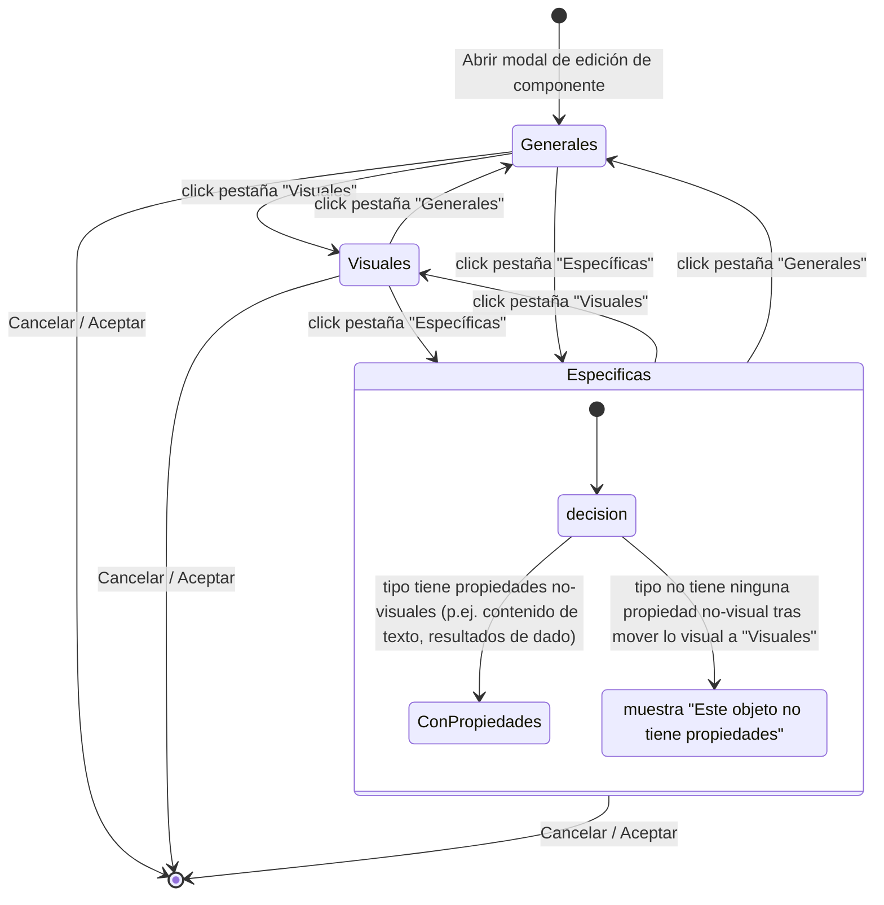

# 002 — Alta/edición/borrado de componentes con modal de tabs

**Area**: Mesa de juego

Modal con tres pestañas ("Generales" con el `id` editable, "Visuales" con todo lo que afecta al aspecto del componente y "Específicas" según el tipo, con el resto de configuración propia de cada tipo) para crear o editar un componente, con validación de `id` no vacío y único. Al editar un componente ya existente (no al crear uno nuevo), la modal incluye además un botón "Eliminar" en el extremo izquierdo de la zona de botones, con el mismo estilo destructivo (rojo) que el resto de acciones de borrado de la app; pide confirmación igual que el borrado desde el panel flotante y, si se confirma, borra el componente y cierra la modal (limpiando también la selección en el editor si el componente eliminado era el seleccionado). Es un camino alternativo al borrado desde el panel flotante, no lo sustituye.

Al pulsar "+ Añadir componente" se muestra antes una modal previa con la lista de tipos disponibles ("Cuadro de texto", "Tablero simple", "Dado", "Visor de documentos", "Carta/Ficha" o "Mazo", cada uno en una fila seleccionable) y botones "Cancelar"/"Aceptar". Al aceptar, el componente se crea y se añade de inmediato con los valores por defecto de ese tipo, y a continuación se abre esta misma modal de configuración ya sobre ese componente para ajustar sus propiedades — el tipo, una vez elegido, no se puede cambiar.

La pestaña "Generales" incluye también, en este orden: un desplegable "Bloqueado" (cambio 00138, antes checkbox; "Ninguno" por defecto para cualquier tipo — ver [Posición independiente, arrastre y redimensionado de componentes](015-posicion-independiente-arrastre-y-redimensionado-de-componentes.md)); tres checkboxes — "Oculto" (ver [Componente oculto en modo juego](016-componente-oculto-en-modo-juego.md)), "Mostrar tooltip" (ver [Identificación de componentes al pasar el ratón](025-identificacion-de-componentes-al-pasar-el-raton.md)) y "Subir al mover/interactuar" (ver [Subir al mover/interactuar](013-subir-al-mover-interactuar.md)) —; y, tras ellos, una sección "Etiquetas" (ver [Etiquetas, organización de elementos por nombre](008-grupos-organizacion-de-elementos-por-nombre.md)). Junto a la etiqueta de cada uno de estos campos hay un icono de ayuda "?" que muestra, al pasar el ratón por encima, una breve explicación de qué hace — patrón de ayuda contextual reutilizable en toda la app (tooltip para textos cortos, ventana modal para textos largos o con formato).

Tras la sección "Etiquetas", se muestra además una sección "Interacciones programadas" (ver [Interacciones programadas de un componente](014-interacciones-programadas-de-un-componente.md)) con un desplegable por cada interacción de click izquierdo que tenga programada el tipo que se está editando, más una fila fija para configurar el click derecho, disponible por igual para cualquier tipo.

**Pestaña "Visuales"** (cambio 00210): agrupa todo lo que afecta al aspecto del componente, sea transversal a los 8 tipos o específico de uno de ellos.

- **Tamaño**: campos "Alto"/"Ancho" y checkbox "Mantener proporción", igual para los 8 tipos.
- **Extrusión**: una fila con dos campos — "Profundidad" (número en píxeles, de 0 a 40, 0 por defecto salvo en "Dado") y "Color de extrusión" (selector de color; mientras no se toque, se usa un cálculo automático de un tono más oscuro del color propio del componente). Da al componente una apariencia de cuerpo sólido con grosor real — un bloque con un lateral visible — en vez de plano, convive sin conflicto con el bisel o la sombra de contacto que ya tuviera. Sin efecto visible en "Cuadro de texto" (icono de ayuda junto al título de la sección lo indica), tenga o no tenga fondo de color configurado. El componente "Dado" ya no simula profundidad con un mecanismo propio y fijo — usa esta misma propiedad general, con un valor inicial que mantiene una sensación de grosor similar a la que tenía antes.
- **Controles visuales específicos por tipo**, trasladados desde "Específicas": "Biselado en el borde"/"Sombra"/color y grosor del borde/selector de fondo de "Tablero simple" (ver [Componente "tablero simple"](018-componente-tablero-simple.md)); "Biselado en el borde"/"Sombra" de "Tablero personalizado" (ver [Componente "tablero personalizado"](019-componente-tablero-personalizado.md)); color del cuerpo/color de los números/tipografía de "Dado" (ver [Componente "dado"](020-componente-dado.md)); tamaño de letra/color de texto/color de fondo de "Cuadro de texto" (ver [Componente "cuadro de texto"](017-componente-cuadro-de-texto.md)); forma y orientación de "Mazo" (ver [Componente "mazo"](023-componente-mazo.md)).

**Pestaña "Específicas"**: tras el traslado anterior, contiene solo lo que no es puramente visual de cada tipo (contenido de texto, resultados de dado, contenido/imagen de mazo, tipo/contenido/URL de documento, proporción y botón "Editar diseño de la carta" de "Carta", botón "Editar diseño del tablero" de "Tablero personalizado"). Si para un tipo no queda ninguna propiedad no-visual que mostrar (caso de "Tablero simple" tras este cambio), la pestaña muestra el mensaje "Este objeto no tiene propiedades" en vez de quedar en blanco.

- **Available in**: modo edición — desde el panel flotante de componentes o haciendo doble click directamente sobre la representación del componente en la mesa.
- **Code**: 00002, 00003, 00004, 00013, 00015, 00018, 00019, 00020, 00029, 00053, 00061, 00087, 00100, 00105, 00106, 00115, 00138, 00142, 00210.
- **Since**: 2026-07-17
- **Last modified**: 2026-08-19
